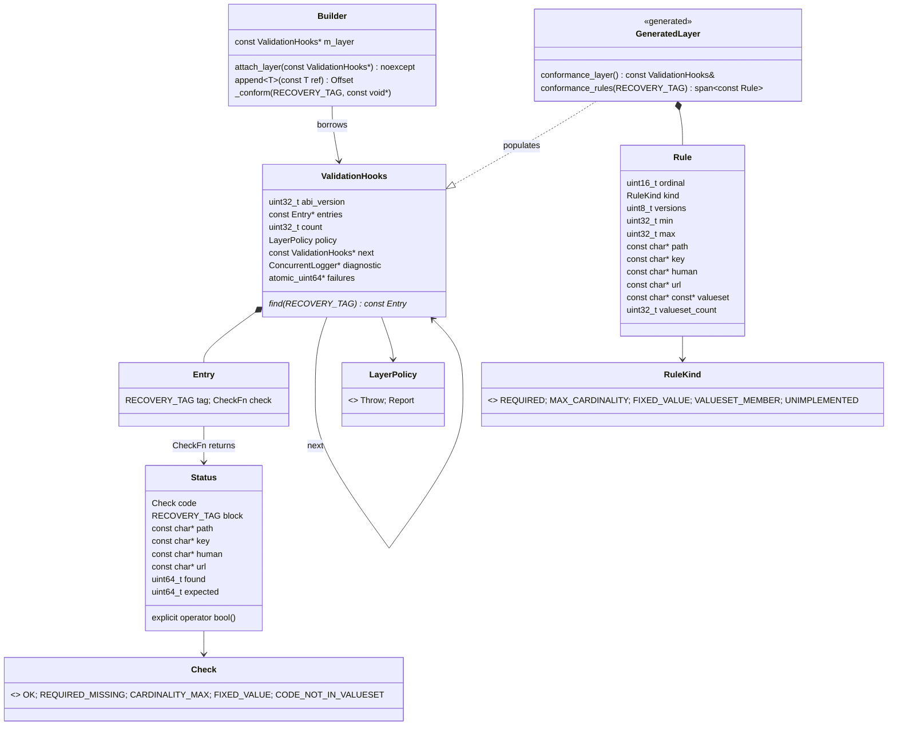

# FastFHIR — Consolidated Task Backlog

> **This file is the single source of truth for pending work.** Read `CLAUDE.md` first —
> it defines the invariants you must not break. Completed work is **deleted** from this
> file, not archived in it; git history is the record (`git log -S'<task id>' -- TASKS.md`).
> The short ledger at the bottom exists only so a finished item is not re-opened, and is
> one line per item.

## ▶ START HERE — how to work this file

1. **Pick ONE task ID** from the [Priority Index](#-priority-index) below (e.g. `A20`,
   `DT-3`, `REC-12`). One task = one commit. Do not batch unless a task says
   "do together with".
2. **Run the task's `Locate` command before editing anything.** Line numbers in this file
   drift as the tree changes. If the output does not match the *Current state* the task
   shows, **STOP** — do not improvise. Leave the box unchecked and add
   `> STALE (date): <what you found instead>` under the task.
3. **Do not start a task marked `Blocked on Q#`** unless that question in
   [Questions for Ryan](#questions-for-ryan) has text after `> Answer:`.
4. **Every acceptance criterion is mandatory**, and the `Verify` command must exit 0.
5. **Check the box in the same commit** as the code, appending the short hash:
   `- [x] ... (abc1234)`.

The full rules, including the ones about wire constants and generated files, are in the
[Execution contract](#execution-contract-read-before-claiming-anything). Read it once.

### Notation — what a path in this file means

A flash model stalls when it cannot tell "go read this" from "go write this". So:

| Written as | Means | What to do |
|---|---|---|
| `src/FF_Parser.cpp:1826` | Exists **now**, at roughly that line | Re-grep for the quoted code; the line number is a hint, the quoted text is the anchor |
| `FF_Parser.hpp` (bare name) | A header in `include/` **or** `generated_src/` | Both are on the compiler path, so includes are bare. `ls include/X generated_src/X` to find it |
| ⛏ `tests/cpp/test_builder.cpp` | **Does not exist — the task creates it** | Not a stale reference. Create it |
| ↗ `bench/harness.hpp` | Lives in **another repository** | `../FastFHIR-benchmark` or `../Iris-File-Extension`. Do not look for it here, and do not create it |
| ~~`ffc.py`~~ | **Deleted or renamed.** Historical context only | Do not go looking. `git log --diff-filter=D` if you truly need it |
| A task ID with **no `### ` section** (e.g. `A24`) | **Finished and closed.** Prose elsewhere still cites it as history | Look it up in the [Completed ledger](#-completed--one-line-each-do-not-re-open). Do **not** re-open it, and do not treat the citation as a live task |

**When a task's prose predates a rename**, the rename is recorded in the
[Completed ledger](#-completed--one-line-each-do-not-re-open) at the bottom. Two that
recur: `generated_src/FF_Recovery.hpp` → `generated_src/FF_RecoveryTags.hpp` (2026-08-27),
and the legacy `tools/generator/ffc.py` → the `generator/` package (`model/`, `emit/`,
`bindings/`).

### Two standing policies, no exceptions

- **P0-2 — a gate that returns zero results must not pass.** Assert a non-zero floor
  before asserting any equality. An empty walk satisfies every assertion you can write
  about its contents. See the section below.
- **Prefer a test through the real pipeline over a hand-built buffer.** A synthetic
  fixture proves the reader agrees with *your idea* of the format, not with the writer.
  This is COV-1, and it is how three defects shipped under a green suite.

---

# ▶ PRIORITY INDEX

Everything currently open, most urgent first. Deep detail lives in the sections named; the
**Find** column is a `grep -n` pattern for this file, because line numbers drift.

**Self-contained** means: one file or two, no blocked question, and a `Verify` command that
proves it. Those are the ones to take if you are picking without other context.

## The correctness backlog — Block A (start here for self-contained work)

> **RECONCILED 2026-09-10 against the built tree.** Every row below was re-measured, not
> re-read. **Nine of the thirteen rows this table used to carry described defects that no
> longer reproduce** — the round-trip corruption cluster (A12/A23/A24/A25/A26) and the four
> build faults (A4/A14/A19/A20/A22) are fixed, and `py_roundtrip` is green on 342 fixtures.
> Those are now in the [Completed ledger](#-completed--one-line-each-do-not-re-open) with
> the command that proves each one.
>
> **What that means for you:** the *residual* subtasks below are hardening and follow-up —
> a test the fix never got, a comment the invariant never got. They are real work, but the
> parent defect is gone, so **do not expect the "Current state" of a fixed parent to
> reproduce.** Each row states the residual only. The one row that is still a live
> data-correctness defect is **A8**.

| ID | Residual work — the parent defect is fixed unless marked LIVE | Self-contained | Find |
|---|---|---|---|
| **A8** | **LIVE DEFECT.** CodeableConcept system discriminator never set — `external_system` is emitted **0 times** in `generated_src/`, so every external code encodes as `UNKNOWN`. **A8.2 MUST land before A8.1** (populating the map arms every divergent SIZE/STORE branch at once). Gates Block J | no — sequenced | `^### A8\.` |
| **A17** | Pin the R4-prefix invariant: ⛏ `tests/generator/test_version_prefix.py` does not exist and `generator/pipeline.py:43` still carries a bare `versions = ["R4", "R5"]` with nothing marking it load-bearing | **yes** | `^### A17\.` |
| **A18** | Fail loudly when R4 and R5 disagree: `merge.py:133` still falls through on a repeat sighting with no comparison and no `raise` | **yes** | `^### A18\.` |
| **A9.2** | `array_entries_are_offsets` is a dead second source of truth — still threaded through 9 call sites in `FF_Parser.{hpp,cpp}`, `FF_Compactor.cpp` and `emit/views.py`; nothing consumes it | **yes** | `A9\.2` |
| **A13.3** | `build_bundle_entry_chunks` (`src/FF_Ingestor.cpp:670`) still copies every bundle entry into its own `padded_string`. A14 is fixed, so the reason to defer this is gone | **yes** | `A13\.3` |
| **A15.6** | `_OFFSET_FIELD` (`wire_witness.py:58`) drops any vtable line carrying a trailing comment, and the gate would still pass on the shorter list | **yes** | `A15\.6` |
| **A4.3** | ⛏ `tests/generator/test_compiles.py` does not exist — the witness reads constants by regex and cannot see an emitter that produces non-compiling C++ | **yes** | `A4\.3` |
| **A29** | Orphaned `tests/test_ff_dictionary.py` still present and still broken. **The overlap question A29.1 asks is now answered** — see the note under A29 | **yes** | `^### A29\.` |
| **A19.2 / A19.3** | 15 generator modules still lack `from __future__ import annotations`, so the 3.11 floor stays an accident of the interpreter rather than a property of the code | **yes** | `A19\.2` |
| **A14.2 / A14.4** | The arena floor fixed the symptom; a `claim_space()` failure on the worker path still has no clean diagnostic, and the tiny-bundle reproducer is not checked in | **yes** | `A14\.2` |
| **A22.2 / A20.2** | Both error paths that were broken are fixed but still unexercised — no test points the harness at a missing binary or a timeout | **yes** | `A22\.2` |
| **A23.9** | The adversarial fixtures the Synthea corpus cannot provide (empty string in a `string[]`, empty `dateTime`, id-only resource, `Quantity` with no `comparator`). The corpus has **zero** empty strings, which is why A23.6/A24/A25 all survived it | **yes** | `A23\.9` |
| **A3** | Narrowed by measurement: the write-path examples in `include/FastFHIR.hpp` are already on the `FF_*` API. Two **read** lines are stale (`FieldKeys::Observation::STATUS`, `.value().as_string()`), and `auto status` is declared twice in one scope | **yes** | `^### A3\.` |
| **A27.6 / A27.7** | Passthrough itself is done (`RECOVER_FF_OPAQUE_JSON` is live). What remains is the module-registry hook and deriving the profile groupings from the published IG packages instead of a transcribed list | no — design | `A27\.6` |
| **A23.8** | ⚠ A *decision*, not a claimable task — redzone canary around `append_obj`. Read it before claiming | — | `A23\.8` |

## Everything else, by priority

| Priority | Item | What it is | Find |
|---|---|---|---|
| **P0** | **P0-3 / REC-10…17** | Recovery: stream map, bit-similarity edge restoration, `src/FF_Recovery.cpp`. Has its own work order written for a flash model | `^# ▶ P0-3` |
| **P0** | **REC-20** | Recovery: cross-reference the two producers' holes, match 10-byte tuples by Hamming | `^# ▶ REC-20` |
| **P0** | **AMEND/APPEND** | Amend + append must take the abstraction types, not only JSON (CAPI-12) | `^# ▶ P0 — AMEND` |
| **P1** | **REC-21** | Recovery: arrays in holes — bound the count by geometry, propose then confirm | `^# ▶ REC-21` |
| **P1** | CAPI-1, 2, 3, 8, **16** | Consumer-API gaps: inline-block array writes, validator/deserializer disagreement, `ChoiceEntry` across arenas, allocating `entries()`. **CAPI-16 is new (2026-09-10)**: a `code` field cannot be assigned through a mutable handle at all — it throws, and four README blocks documented it working. Read A8.2 before starting it | `^## CAPI-` |
| **P1** | Block C | Archive recovery subsystem — **governed by P0-3; do not start before REC-10** | `^## Block C` |
| **P1** | DT-1 remainder, DT-3, DT-4 | Packed date/time: array-typed fields, ingest/export, wire baseline | `^## DT-` |
| **P1** | RT-1, AR-1, AR-4, COV-1, **COV-2**, **COV-3** | Round-trip identity, array dispatch, queue lifetime, writer-vs-reader coverage. **COV-2 is new (2026-09-10)** and self-contained: `py_roundtrip` still passes when it finds zero fixtures, which is the 2026-08-13 vacuous pass waiting to happen again. It is filed under A23 because that is where the incident is recorded. **COV-3** records a single unreproduced flake in `cpp_ff_test_recovery`, which takes no `--seed` and so cannot be replayed | `COV-[23]` |
| **P2** | AR-2, **AR-6** | The schema tables disagree with the wire (6 array fields) and with each other (70 of 85 choice slots) | `^## AR-[26]` |
| **P2** | CAPI-4, 5, 7, 9, 10, 11, 14 | Consumer-API ergonomics and doc gaps | `^## CAPI-` |
| **P2** | Block B | Test coverage: builder, parser, pipeline, byte fixtures. **B7 is the "assert against bytes" one** | `^## Block B` |
| **P2–P3** | Blocks D, E, F, G, H, I | WASM, hygiene (35 items, mostly small), benchmarks, security, packaging, spec | `^## Block ` |
| **planned** | Block J | External code systems. **J4/J5/J6 gated on A8.** J1's layer boundary is now Block K's `ValidationHooks`, so J needs a LOADER, not a mechanism — see J1's "Reconciliation OUTCOME". J3/J7/J8 need neither | `^## Block J` |
| ✅ done | Block K | Conformance validation layer — **implemented 2026-09-09**, ctest 46/46 (54/54 on 2026-09-15 with the README gates; real-pipeline + TSan coverage added that day). K1.2's sink is **decided (2026-09-15): the parallel logger, reserving by CAS — LOG-1**. One decision still open for Ryan: whether J4.1 attaches here (J1) | `^## Block K` |

**Standing policy, applies to every item above:** a gate that returns zero results must not
pass (P0-2). Assert a non-zero floor before asserting any equality.

---

# ▶ SESSION BRIEF — 2026-08-26, filed from FastFHIR-benchmark

**Read this before starting root-repo work.** Everything below was found by driving
FastFHIR's *public* API as an outside consumer (the four-arm benchmark), not by reading
this tree. None of it is visible from inside: every existing gate passes, and passed
throughout.

**Evidence base.** `../FastFHIR-benchmark`, commit `1f625e9` plus working tree.
Reproduce anything here with:

```bash
cd ../FastFHIR-benchmark
bazel build -c opt //bench:bench_harness
BENCH_CODE_CENSUS=1 ./bazel-bin/bench/bench_harness --runs 1 --bundle-targets-mb 1
```

P0-1 (`deserialize` dropped every singular block field) is **fixed** — 2026-08-26, see the
ledger at the bottom. P0-2 and P0-3 follow, then an index of the 13 consumer-API findings.
**P0-3 was filed separately by Ryan** and is not from the benchmark: it is the
structural-redundancy principle the recovery process has to be built on, and as of
2026-08-27 it carries the `src/FF_Recovery.cpp` work order.

---

# ▶ P0-2 — A GATE THAT RETURNS ZERO RESULTS MUST NOT PASS (TESTING POLICY)

P0-1 survived because **the thing that would have caught it reported success while
finding nothing.**

The benchmark searches Observations for LOINC 2085-9. It reported **0 matches over 24,583
observations**, while the Synthea corpus carries ~3.75 instances of that code per file.
All four arms agreed on 0 — so the cross-arm parity check **passed**, because every arm
hydrates from the same POCO and was therefore equally wrong. Zero was never asserted
against.

The same shape applies to this repo's suites. A conformance or round-trip test that
exercises a path zero times is not evidence the path works, and a suite that scores such a
run as PASS is reporting the wrong thing.

**Asks:**

1. **Assert a non-zero lower bound wherever a test counts anything** — matches, nodes,
   fields, resources, bytes. `EXPECT_GT(n, 0)` *before* `EXPECT_EQ(a, b)`. A comparison of
   two empty sets is not a passing test.
2. **Fixtures must declare what they are expected to contain**, so a fixture that stops
   containing it fails loudly instead of quietly passing.
3. **Agreement is not correctness.** Four independent readers agreeing on zero is exactly
   what a shared upstream defect looks like. Every agreement gate needs an absolute floor
   beside it.

Precedent from the same repo, same class: a traversal that visited **1 node instead of
8,000** reported a 300x speedup and passed every check it had
(`../FastFHIR-benchmark/notes.md` §2).

---

# ▶ P0-3 — RECOVERY MUST RECONCILE **BOTH** WITNESSES OF EVERY EDGE

> ↗ **Every `bench/…` path in this section is in the COMPANION REPO**
> `../FastFHIR-benchmark`, not in this tree — `bench/bench_test_5.hpp`,
> `bench/corruption_probe.cpp`, `bench/harness.hpp`, and the `handoff.md` quoted below.
> There is no `bench/` here and you must not create one. Work that changes the corruption
> probe or the recovery measurement happens in that repo; work on `src/FF_Recovery.cpp`
> happens here.

**Filed 2026-08-26 (Ryan). HIGH priority — this is the governing principle for Block C
and for the shipped `FastFHIR::Recovery` class, both of which currently implement half
of it.**

## The property: every edge is recorded twice

A FastFHIR stream is not a chain of single-witness pointers. For one logical edge
**A → B** (parent block A holds an offset to child block B) the format stores the *same
fact* in two places that a single corruption cannot both reach:

| # | Witness | Where it lives | What it asserts | On the wire? |
|---|---|---|---|---|
| 1a | **parent, position** | A's V-Table slot at a fixed offset within A | *which field of A* this edge is | no — the slot's offset is compile-time |
| 1b | **parent, target** | the 8 bytes in that slot | *where B is* (absolute arena offset) | **yes** |
| 1c | **parent, expectation** | `FF_FieldInfo::child_recovery`, `generated_src/FF_Reflection.cpp` | *what type B must be* | **no — compiled in** |
| 2a | **child, self-offset** | B's `DATA_BLOCK::VALIDATION` (+0, 8 bytes) | *where B thinks it is* | **yes** |
| 2b | **child, identity** | B's `DATA_BLOCK::RECOVERY` (+8, 2 bytes) | *what B is* | **yes** |

`DATA_BLOCK::validate_offset()` (`src/FF_Primitives.cpp:25`) **already reads all of these
and cross-checks them** — `LOAD_U64(__base + __offset + VALIDATION) != __offset`, then
`actual_recovery != recovery_tag`. It uses the comparison **only to reject**. At the moment
it returns `FF_VALIDATION_FAILURE` it is holding everything needed to repair the edge, and
it throws that away. That is the whole of this task: stop discarding it.

Note **1c** especially. The expected child type does not live in the stream at all — it is
projected from the StructureDefinitions into the compiled reflection table. **Stream damage
cannot corrupt it.** Whatever else is lost, the reader always knows what each slot of each
block type is *supposed* to point at.

## The two damage cases, and what survives each

### Case 1 — A's offset is corrupt, B is intact

- **Symptom.** A's field reads absent or aims at nonsense; the chain breaks at A.
- **What survives.** B is still in the arena and is *self-consistent*: its `VALIDATION`
  word equals its own position and its `RECOVERY` tag names its type. A forward sweep finds
  it. It is now **orphaned** — no intact slot in the stream points at it.
- **What the parent still knows, uncorrupted.** Which of A's fields broke (slot position,
  1a) and what type that field's child must be (1c).
- **Therefore.** *An unclaimed orphan carrying tag T, plus an unsatisfied slot declaring
  child type T, is the edge.* Repair = write the orphan's offset back into A's slot.
  Ryan's example: A's result slot declares `RECOVER_FF_OBSERVATION`; the orphan found by
  the sweep carries `RECOVER_FF_OBSERVATION`; the two reconstruct the pointer that was
  destroyed.

### Case 2 — A's offset is correct, B's header is corrupt

- **Symptom.** `validate_offset` fails *at B* — "failed absolute offset validation"
  (2a damaged) or "recovery tag mismatch" (2b damaged).
- **What survives.** **Everything needed, on the parent side.** A's offset (1b) gives B's
  position; A's slot's `child_recovery` (1c) gives B's type. **No search is required** —
  both damaged header fields are directly rewritable from the parent, and the repair is
  *exact*, not inferred.
- **`VALIDATION` is self-describing, which is what makes this free.** Its correct value is
  a pure function of the block's own position, so it can always be recomputed from the
  address you arrived at. The flip side is that it carries no information *beyond* "this is
  a block and it is where you thought it was" — so on its own it can never tell you whether
  the parent or the child was the corrupt one. That question is answered by 2b vs 1c.

**The general statement: two independent records per edge, one corruption.** Any
single-site damage leaves the other witness intact, so the edge is reconstructible in both
directions. The recovery process must be a **two-sided reconciliation**, not a one-sided
forward scan.

### The strongest case: resource and choice slots duplicate the tag **on the wire**

For a polymorphic slot the parent does not merely *expect* a type — it **stores the child's
`RECOVERY_TAG` a second time, beside the offset**. A resource slot is a 10-byte tuple
`{ offset(8) | tag(2) }`, and the tag lives at `slot + DATA_BLOCK::RECOVERY`
(`generator/emit/store.py`, the `fhir_type == "Resource"` branch, and the array form at
`__entries_start + i*TYPE_SIZE_RESOURCE + DATA_BLOCK::RECOVERY`). Choice (`[x]`) slots use
the same 10-byte shape.

So for these edges the same 2-byte value exists at **two distinct addresses** — `slot + 8`
in the parent and `child_offset + 8` in the child — and the offset that links them is a
third. `Bundle.entry.resource` is exactly this shape, which is why it is the first place to
apply the reconciliation:

- **Tag in parent ≠ tag in child** → one of them is damaged, and the *disagreement itself*
  is the detector. Which side is wrong is then decided by the compiled table (1c) for typed
  slots, or by whichever value is a legal assigned tag in the ledger.
- **Tag in parent is intact, offset is corrupt** → Case 1 with the search already closed:
  sweep for an unclaimed orphan whose `RECOVERY` equals *the parent's stored tag*. No
  inference from locality is needed, and the "≥2 candidates" ambiguity only survives when
  two orphans of the same type are both unclaimed.
- **Offset is intact, child's `RECOVERY` is corrupt** → Case 2, exact: rewrite the child's
  tag from the parent's copy. This needs no reflection table at all.

**This is the concrete form of Ryan's framing:** *two sets of correct information for each
one set of mistakes.* An `Observation` pointing at a result block records that edge as
(a) the parent's offset, (b) the parent's copy of the result's tag, and (c) the result
block's own header — three facts describing one link, any one of which can be rebuilt from
the other two.

### The same redundancy in arrays, with a third witness

An `FF_ARRAY` header adds `ENTRY_COUNT` (+12) and `KIND_AND_STEP` (+10) to the two
`DATA_BLOCK` fields, and the array's own `RECOVERY` tag names the element type
(`GetTypeFromTag`, bit 15 = `RECOVER_ARRAY_BIT`). So for an array edge the count says *how
many* children there must be, the tag says *what* each is, and the step says *where the next
one starts* — a damaged entry is bounded on three sides. Honour the array invariant while
repairing: only `FF_STRING` arrays hold an offset table; every other element type is inline
and has no per-entry pointer to corrupt (architecture.md §5, CLAUDE.md).

## Disambiguation — the two cases are not equally determined

> **Superseded in part by "fewest-flips-explains-it" below (2026-08-27).** The ladder here
> still ranks *which evidence is admissible*; what it could not do was decide between two
> admissible readings, and it punted that to "report both, repair neither". Bit-similarity
> scoring closes most of that gap and is now the primary discriminator. Where the two
> disagree, the Hamming rule wins — but its **flip budget and tie rule still fall back to
> exactly this section's "report, never guess"**.

Case 2 is deterministic. **Case 1 is a search**, and `child_recovery` alone does not close
it when the sweep turns up more than one unclaimed orphan of type T. Evidence, strongest
first:

1. **Claim uniqueness.** A block reachable from an *intact* slot is not an orphan. Sweep
   the whole stream first, mark everything reachable, and only unreached self-consistent
   blocks are candidates. This alone resolves most real cases.
2. **Type.** `child_recovery` from the compiled table (1c); for arrays, the array header's
   element tag.
3. **Allocation locality.** `claim_space()` is an atomic bump, so a child is written *after*
   its parent and usually near it. Nearest-forward-orphan is a strong prior — **it is not a
   proof**, and it must never be used without (2). This is precisely what the shipped
   `recover_bundle_entries()` is already doing implicitly, without saying so and without
   checking the type.
4. **Cardinality.** A singular slot takes exactly one child; an array's `ENTRY_COUNT` says
   how many its entry table must hold. A repair that leaves the count unsatisfied is
   incomplete and must say so.

**Which case am I in?** When the block at the parent's offset fails validation *and* an
unclaimed orphan of the declared type exists elsewhere, both readings are live. Rule:
repair **in place** (Case 2) only when the bytes at the parent's target are otherwise
coherent as the declared type; **re-point** (Case 1) only when an unclaimed orphan of the
declared type exists. **When both are live, report both candidates and repair neither.**

## Honesty requirement — non-negotiable

A recovered stream is not the same object as an intact one.

- Every repair is **reported**: which edge, which witness supplied the fix, which case, and
  the confidence (deterministic vs. inferred-from-locality).
- A repaired stream must be **distinguishable by the caller** from one that needed nothing.
- **Silent repair is worse than failure**: it converts a detectable corruption into an
  undetectable one. Same rule as the fail-loud write path in CLAUDE.md §5, and the same
  reason P0-2 exists — a recovery pass that reports success while having repaired the wrong
  edge is exactly the shape of defect this backlog keeps paying for.

## Where there is NO second witness — the honest boundary

State this in the API docs; do not let the redundancy above be read as a guarantee.

- **Inline scalar slots.** A `bool` / `uint32` / `double` / packed date-time slot with bit 63
  clear is bytes with no tag and no self-offset. Nothing cross-checks it, and a flipped bit
  reads back as a plausible value. (CLAUDE.md's "residue that remains genuinely
  unchecked".) A **flagged** slot — `FF_CODEABLE_CONCEPT_FLAG`, or bit 63 set on a
  date/time — *is* an offset and *is* covered by everything above.
- **Both witnesses damaged on the same edge.** Two independent records defeat one
  corruption, not two.
- **`FF_STRING` payload bytes.** The block header is witnessed; the characters are not.
- The checksum footer proves *something* changed. It localizes nothing.

## What the shipped `FastFHIR::Recovery` does today — and why it is still half

`include/FF_Parser.hpp` / `src/FF_Parser.cpp`, uncommitted working tree. **Re-verify with
`grep -n` before claiming any subtask** — this description was already stale once.

**What works** (REC-1 / REC-5, 2026-08-26):

- `next_valid_resource()` / `valid_resources()` sweep for self-consistent blocks — the
  Case 1 sweep.
- `known_resource_tag()` asks `FF_IsResourceTag()` over the whole resource band, so every
  resource type is visible to the sweep, not the five that used to be hardcoded.
- `recover_bundle_entries()` requires the two witnesses to **agree**: a target that
  validates structurally but whose `RECOVERY` differs from the parent's stored tag is
  counted in `tag_conflicts`, not accepted as an intact edge. Resync is constrained by the
  parent's tag through `next_valid_resource_of(from, expect)`.
- `Stats` carries `tag_conflicts`, `unrecovered`, and a populated `units` list.

**What is still missing — this is what REC-10…17 build:**

- **No stream map.** Every damaged slot rescans the arena from its own start point:
  `next_valid_resource_of()` is O(damaged × arena) (**F6**). One shared map replaces it.
- **No reachability pass, so "orphan" is not a decidable predicate.** Nothing distinguishes
  a block nothing points at from one reached by an edge the walk never visited, which makes
  the uniqueness test underneath every Case 1 repair meaningless.
- **Nothing reconciles orphans against unsatisfied slots.** Case 1 repair does not exist;
  the forward resync is a proximity heuristic wearing its clothes.
- **Case 2 is not implemented at all** — no `VALIDATION` or `RECOVERY` rewrite from the
  parent, even though both are deterministic and need no search.
- **No bit-similarity ranking**, so two orphans of the same type are indistinguishable and
  the code cannot tell a flipped parent offset from a flipped child validation word.
- **Bundle entries only.** It walks `Bundle.entry[].resource` and nothing else; every other
  offset-bearing slot in the document is outside its reach.
- **No report, no apply/report split.** It returns counts, so a caller cannot see which
  edge was repaired on what evidence, and repairs cannot be reviewed before being taken.

## Review findings — verified 2026-08-27, do not re-derive

A flash-model review of this block was checked line by line against the tree. **All four
of its findings hold.** Two need correcting, and there is a fifth hole it did not name.
Everything below is `grep`-verified; the file:line references were current on 2026-08-27.

### F1 — The compiled type expectation is WRONG for choice slots, not merely absent

```
generated_src/FF_Observation.cpp:741  {"value",     FF_FIELD_CHOICE, …, RECOVER_FF_QUANTITY, true}
generated_src/FF_Observation.cpp:738  {"effective", FF_FIELD_CHOICE, …, RECOVER_FF_DATETIME, false}
generated_src/FF_FieldKeys.hpp:3029   VALUE{…, FF_FIELD_CHOICE, 164, FF_RECOVER_UNDEFINED, true, "value"}
```

The per-block `FIELDS` reflection table stores the StructureDefinition's **first-listed**
choice variant as `child_recovery`. That is not the runtime type: the moment `value[x]`
holds a `Period` or a `CodeableConcept`, the compiled value is affirmatively wrong. **All
85 choice slots** in the emitted `FIELDS` tables carry such a value — verified with the
FIELDS-only pattern (`grep '^\s*{"[^"]*", FF_FIELD_CHOICE' generated_src/FF_*.cpp` → 85;
the unanchored `grep FF_FIELD_CHOICE` returns 438 because 353 of those lines are
deserializer `case FF_FIELD_CHOICE:` labels, not FIELDS rows).

And the two schema-side tables disagree on **70 of the 85**: `FF_FieldKeys.hpp` correctly
declines (`FF_RECOVER_UNDEFINED`) there, and on the remaining 15 — all primitive-first
variants, 11 × `RECOVER_FF_BOOL` + 4 × `RECOVER_FF_STRING` (`deceased[x]`, `asNeeded[x]`,
the three `value[x]`, `instantiates[x]`, …) — it emits the first-variant tag, *agreeing*
with FIELDS. Those 15 are emitter branch order, not a semantic decision:
`_child_recovery_key_expr` hits its `boolean`/`string` branches before the
`cpp_type == "Offset"` guard, so primitive-first choices get a tag and complex-first ones
fall through to `FF_RECOVER_UNDEFINED`. All 85 are decoys as runtime expectations no
matter which table. This is a second — and ~14× larger — instance of the hazard CLAUDE.md
already records for 6 `code` array fields. Filed separately as **AR-6**; recovery must
not wait on it (REC-13 resolves choice/resource slots from the stored tag half, never the
table).

> **Rule for the recovery code.** Resolve a slot's declared child type by KIND:
> - `FF_FIELD_BLOCK` / `FF_FIELD_STRING` / array → compiled `child_recovery` (trustworthy).
> - `FF_FIELD_CHOICE` / `FF_FIELD_RESOURCE` → **the slot's own stored tag half** (the
>   10-byte tuple's `+8`), never the compiled table. The compiled value is a decoy here.
> - Both halves of a choice slot corrupt → **undecidable. Report, never guess.**

### F2 — The corruption probe cannot generate parent-side damage at all

`bench/bench_test_5.hpp:184-189` **and** `bench/corruption_probe.cpp:95-114` (identical
shape) build their flip-position set as: the 54-byte `FF_HEADER`, plus `target + 0..9` for
each bundle entry — the **child's** `VALIDATION` + `RECOVERY`. `slot` is read only to
*find* `target`; the parent tuple is never added to `positions`.

So **failure mode 1 (parent offset corrupt → orphan sweep) is unreachable in the probe**,
and no published number measures it. This is not probabilistic — no seed can reach it — so
the review's suggested "instrument across seeds 0–99" confirmation is unnecessary.

### F3 — The `--check` is one-sided, so misattachment is structurally invisible

`bench/bench_test_5.hpp:16` — the contract is `recovered ⊆ baseline` on `(offset, tag)`
units, and `calc_stream_hash` (`:85-111`) records units as `{child_offset, tag}` with **no
parent identity**. Consequences:

- A subset test can fail only on **fabrication** (a unit not in the baseline). It cannot
  fail on under-recovery or on misattribution — `{} ⊆ baseline` passes.
- Flip entry *i*'s child header → resync lands on entry *i+1*'s child → that unit **is** in
  the baseline → integrity reports clean while edge *i* now points at the wrong child.

**This is why the unit must become the edge.** `(parent_slot_off, child_off, tag)` makes
the misattachment fail the subset test, because `(slot_i, child_{i+1})` is not a baseline
edge. The edge metric is not a preference; it is the only unit the check can audit.

### F4 — `FF_ARRAY::ENTRY_COUNT` has no second witness (but extent is often derivable)

Written exactly once, `src/FF_Primitives.cpp:275`, via `STORE_FF_ARRAY_HEADER`. No copy
anywhere. **Correction to the review:** "count the extent as lost" is too pessimistic.
Extent is *derivable* for three of the four array shapes, and the **element tag** — the
second witness (the array header's own `ToArrayTag`; the parent slot's compiled
`child_recovery` is the F1 decoy on choice arrays) — discriminates which walk applies:

- `INLINE_BLOCK` + **block** element tag → stride-walk element `VALIDATION` words from
  `entries_start` (= array base + `FF_ARRAY::HEADER_SIZE`, 16) until one fails;
- resource **tuples** (stride 10) or `OFFSET` kind (string/code pointers, stride 8) →
  stride-walk entries validating each **target** — a stride-walk of the entry bytes
  themselves reads offsets, not blocks, and reports extent 0 for every string/code/resource
  array, which is the naive rule's failure;
- `INLINE_BLOCK` + **scalar** element tag → raw values, no headers, not derivable.

`EntryKind` cannot tell you which case you are in — `INLINE_BLOCK` is stamped on scalars,
block headers and resource tuples alike (CLAUDE.md) — which is why the element tag, not
the kind, is the discriminator. So this is a fourth repair class, **extent-derived**, not
a write-off.

### F5 — The hole the review missed: the FFHR fingerprint has never carried data

`bench/bench_test_5.hpp:283-289` builds `fp.units` **exclusively** from `stats.units`. And
`Recovery::Stats::units` was declared, documented as "the atoms a driver verifies against a
clean stream's fingerprint", and **never written** by any version of `FF_Parser.cpp`
(`git show HEAD:src/FF_Parser.cpp | grep -c units` → 0; the whole `Recovery` class is
uncommitted working-tree code). So on the FFHR arm: `fp.units = {}` → `{} ⊆ baseline` →
integrity clean, content-verified 0 %. **The units-based check was vacuous on the one arm
it exists for.** Populated 2026-08-26; that is why it is visible now. Same P0-2 shape, one
level up.

### F6 — Attribution correction, and one flaw in the current code

The **91.6 % / 70.3 %** medians (quoted in the benchmark's `handoff.md`, since
removed -- both handoff docs were untracked on 2026-09-08) come from
`bench/corruption_probe.cpp:213` → `rec.recover_bundle_entries().recovered` — a **count**,
not the units fingerprint. The review attributed them to `bench_test_5.hpp`. Both critiques
stand, but **fix the attribution before touching files**, or the work lands in the wrong
one. Those medians must not be cited before or after this work: per F2 they measure
child-header survival plus the whole-stream fallback, not edge restoration.

`Recovery::next_valid_resource_of()` (added 2026-08-26) scans byte-by-byte from `from` to
end of arena, once per damaged entry — **O(damaged × arena)**. The single-sweep bucketing
in REC-11 replaces it.

---

## The discriminator this block was missing: fewest-flips-explains-it

**Ryan, 2026-08-27.** The two-witness principle says an edge is reconstructible. It does
not say *which* witness was damaged, and P0-3 previously punted that to "report both
candidates and repair neither". Bit-similarity closes most of that gap.

**Bit flips are local.** A corrupted value stays close, in Hamming distance, to what it
should have been. So each competing explanation of a broken edge can be scored by the
number of bit flips it requires, and the cheapest explanation wins. This is
minimum-description-length, and it works because every quantity involved has a *known
expected value*.

For a damaged edge at parent slot `S_addr`, with `S = LOAD_U64(base + S_addr)`:

| Hypothesis | What it claims | Cost (bit flips) | Repair |
|---|---|---|---|
| `H_val` | the offset is right; the **child's `VALIDATION`** was flipped | `popcount(LOAD_U64(base+S+0) ^ S)` | write `S` into the child's validation word |
| `H_tag` | the offset is right; the **child's `RECOVERY`** was flipped | `popcount(LOAD_U16(base+S+8) ^ E)` | write `E` into the child's tag |
| `H_off(P)` | the **parent's offset** was flipped; the true child is the block at `P` | `popcount(S ^ P)` | write `P` into the parent slot |

where `E` is the declared child type resolved per **F1**, and `P` ranges over unclaimed
orphans in the stream map whose tag equals `E`.

**The costs are directly comparable** — every one is "bits of damage required to explain
what we observe". That is exactly Ryan's framing: *if the validation word is ALMOST its own
value, the validation word was wrong, not the parent's offset.* `H_val` is cheap precisely
when `V` is a near-miss of `S`.

Three properties that make this unusually strong here:

1. **`VALIDATION` is a 64-bit self-referential check.** Its expected value is known
   *exactly* — its own offset — with no lookup and no second party. It is the single
   strongest witness in the format, and `H_val`'s cost is therefore exact rather than
   estimated.
2. **Valid offsets occupy a tiny slice of the 64-bit space.** A 2 GiB arena uses the low
   ~31 bits, so the top ~33 bits of every real `Offset` are zero. A flip up there yields an
   astronomically out-of-range offset — detectable instantly, and repairable at very high
   confidence because only a handful of bit positions could have produced it. **Handle this
   case first: it is free and nearly unambiguous.**
3. **It ranks candidates that type alone cannot separate.** Ryan's case: node A points at
   node B; orphans B and C both carry `RECOVER_x`. Type filtering leaves two. Ranking
   `popcount(S ^ B_off)` against `popcount(S ^ C_off)` usually leaves one.

### Rules — these are safety rails, not suggestions

- **Threat model.** Hamming ranking is valid for **bit-flip** corruption only (the probe's
  model, and the realistic media/transport failure). It is **invalid** for truncation,
  memmove/shift, and wholesale overwrite, which move bytes en masse and produce large
  distances. State this in the header. When no hypothesis lands under budget, fall back to
  type + reachability ranking alone and label the result as such.
- **Flip budget.** Refuse any hypothesis whose cost exceeds `FF_RECOVERY_MAX_FLIPS` (start
  at 8; make it a named constant, not a literal). At high corruption density a coincidental
  low-Hamming match becomes likely, and an unbudgeted search will confidently invent edges.
- **Ties are ambiguity.** Equal minimum cost between two hypotheses, or between two
  candidates `P`, is **`ambiguous`** — report every candidate with its cost, repair
  nothing. Never break a tie by document order or by proximity.
- **Report the cost.** Every repair record carries the winning hypothesis *and its bit
  cost*, so a caller can second-guess a 7-flip "win" that a 1-flip result would deserve
  more trust than. A repair at cost 0 is not a repair — it means nothing was wrong.
- **Read-only by default.** Repairs are computed and reported; applying them is a separate,
  explicit call. P0-3's honesty requirement, unchanged.

---

## The stream map — the structure everything else reads

Modelled on the Iris File Extension's deep-validate walk
(`../Iris-File-Extension/src/IFE_Runtime.cpp:222` — `VisitedBlocks =
std::unordered_set<Offset>` plus `VisitPath`, which bound cycles and depth during
`validate_deep`). Iris has no type named `StreamMap`; what is being borrowed is the idea of
**materialising the set of blocks once, up front**, instead of re-deriving reachability at
every question. FastFHIR needs it as a first-class object because recovery asks the same
questions thousands of times, and because `next_valid_resource_of()`'s per-slot rescan is
O(damaged × arena) (**F6**).

**One linear pass over the arena builds it. Everything else is a lookup.**

```cpp
struct BlockRef {
    Offset       offset;        // where the block starts
    RECOVERY_TAG tag;           // its own RECOVERY word (may be damaged)
    bool         self_consistent;  // LOAD_U64(base+offset) == offset
    bool         reachable;     // reached from an intact edge (filled in pass 2)
};

struct StreamMap {
    std::vector<BlockRef>                 blocks;      // ascending by offset
    std::unordered_map<Offset, uint32_t>  by_offset;   // offset -> index
    std::unordered_map<RECOVERY_TAG,
                       std::vector<uint32_t>> by_tag;  // tag -> candidate indices
};
```

`by_tag` is the bucketing that kills F6's complexity: orphans are grouped by tag **once**,
and each damaged slot consults its own bucket instead of resweeping the arena.

**Scanning rule.** A block header is `{ VALIDATION(8) | RECOVERY(2) }`. Step **byte by
byte**, not by 8 — the arena is not aligned to block boundaries and a block can start
anywhere the bump allocator left it. At each offset `o`, `LOAD_U64(base+o) == o` is a
64-bit self-check; false positives are ~2⁻⁶⁴ per position, so this alone is a reliable
block detector. Record the tag beside it without judging it: a block whose validation word
is intact but whose tag is corrupt is exactly the F-case REC-13 repairs, and discarding it
here would hide it.

**Cost.** One pass, `size` iterations, one 8-byte load each. On the 50.8 MiB fixture that
is ~53 M loads — the same order as `validate_FFHR_stream()`, which runs in 10.4 ms at `-O3`
(CLAUDE.md). Budget it as tens of milliseconds, not seconds, and **measure it in Release**
— every preset is Debug and will read ~10× slower (CLAUDE.md, "Performance measurements").

---

## Edge enumeration — the denominator, defined once

**F3** requires the unit to be the edge; a ratio needs a denominator that both sides
compute identically. Define an edge as:

> An **edge** is a `(parent_block_offset, field_offset, child_offset)` triple where the
> parent slot's kind is one of `FF_FIELD_BLOCK`, `FF_FIELD_STRING`, `FF_FIELD_RESOURCE`,
> `FF_FIELD_CHOICE` (offset-bearing variants only), `FF_FIELD_ARRAY`, or an array element
> that is an offset or a resource tuple.

Explicitly **excluded**, because they are not edges and counting them inflates both
numerator and denominator:

- inline scalars (`bool`, `uint32`, `double`);
- packed date/time with bit 63 **clear**, and `FF_FIELD_CODE` with the MSB **clear** — no
  offset, therefore no edge. With the MSB **set** both are flagged offsets and **are**
  edges (CLAUDE.md: "a flagged offset is an offset, whatever slot it lives in");
- `FF_FIELD_URL` — a 4-byte index into the URL directory, not an arena offset.

Two properties to state in the report, because they surprise people:

- **Edges ≠ blocks.** Fan-in is real: two slots may point at one interned block, giving
  2 edges over 1 block.
- **An edge can be restored while its child is still wrong.** Repairing a parent's offset
  (mode 1) restores the edge; the child's own tag may still need REC-13. Count them
  separately or the percentage means two things at once.

The same enumerator must be used by the baseline and by the recovery. Put it in ONE
function and call it from both.

---

## Repair classes — five, reported separately

Folding these into one "recovered" number blends a search-based inference with three
deterministic rewrites and makes the "content-verified" claim false for `position-repaired`.

| Class | Damage | Evidence used | Determinism |
|---|---|---|---|
| `corroborated` | parent offset flipped (mode 1) | unique unclaimed orphan, tag == declared, min Hamming | inferred — carries a bit cost |
| `tag_repaired` | child's `RECOVERY` flipped | parent's stored tag half, or compiled `child_recovery` | exact |
| `position_repaired` | child's `VALIDATION` flipped | recomputed from the parent-named address | exact — but **position-verified, content UNVERIFIED**; label it |
| `extent_derived` | `FF_ARRAY::ENTRY_COUNT` flipped (**F4**) | element tag discriminates: `INLINE_BLOCK` + block → stride-walk entry `VALIDATION` words; resource tuples / `OFFSET` → stride-walk entries validating each **target**; `INLINE_BLOCK` + scalar → not derivable | inferred; impossible for inline-scalar arrays |
| `ambiguous` / `unrecovered` | ≥2 candidates at equal cost, or nothing under budget | — | never repaired |

`position_repaired` deserves the loudest caveat: rewriting a validation word proves the
block is *where the parent said*, and nothing whatever about its payload.

---

## Review round 3 — four fixes applied 2026-08-27

Verified by probe against real Synthea streams, not by reading.

- **Shape dispatch (the big one).** `RECOVER_FF_RESOURCE` is the GENERIC polymorphic
  marker and lives in the **primitive** band (`0x0003`), so `FF_IsResourceTag()` — a
  `0x1000..0x1FFF` range test — never matched it. `element_shape_of()` fell through to
  `InlineBlock`, and `walk_array_extent` then asked a **pointer** whether it equalled its
  own position. It never does, so the walk bailed at element 0.
  `src/FF_Recovery.cpp` now tests `element_tag == RECOVER_FF_RESOURCE ||
  FF_IsResourceTag(...)`.

  > **This is not an offset-array question.** Resource arrays are `INLINE_BLOCK` —
  > contiguous, fixed stride, no offset table — exactly as designed. Census of a real
  > bundle: **693 `OFFSET` arrays, every one `RECOVER_FF_STRING`**; everything else
  > inline. `store.py:245` is the only branch that emits `FF_ARRAY::OFFSET`. What is
  > inline here is the *storage*; each inline element is still a 10-byte
  > `{target_offset, target_tag}` tuple whose `+0` points **away**. The
  > `ElementShape` enum's `InlineBlock` name means "this element is a self-describing
  > block header", NOT "this array is inline" — three of its four values are inline
  > arrays. That naming cost a full review round; the enum is now commented, and
  > renaming it (`SelfDescribing` / `InlineTuple` / `OffsetTable`) is still worth doing.

- **Baseline/recovery divergence: same root cause, no separate fix.** The 736-reference
  gap between `reachable_blocks()` and `recover()` was NOT the raw-vs-normalized tag
  compare at the `walk_chain` descent filter, which is what the review guessed. It was the
  shape misclassification above: `enumerate_block_refs`'s array case feeds
  `element_shape_of`, so misread resource arrays emitted unusable element references and
  `walk_chain` never descended into `contained[]`. Fixing the shape closed the gap to **0**.
- **`ff_test_recovery` registered in all four sites.** It was in `tests.cmake` only;
  `_BUILD_ALL` and both IDE lists missed it, which is the A20 "Not Run" shape.
- **The recovery suite counted zero tests.** `TEST(name)` was defined and never called, so
  `0 test(s), 0 failure(s)` exited 0 and ctest scored it green — deleting all four `run()`
  lines would have been indistinguishable. The count now moves in `run()`, and **a
  zero-test run fails** rather than passing on no coverage (P0-2).
- **The fixture claimed coverage it did not have.** Its comment said `entry[]` gave
  resource-tuple coverage; `Bundle.entry` is a BackboneElement, so it is an inline array of
  `FF_BUNDLE_ENTRY` **blocks**. The real tuple array is `contained[]`, which the fixture
  lacked — which is why its (correct) clean-stream assertions passed while every Synthea
  bundle reported 46 bogus `ExtentDerived`. Two `contained` resources added; red/green
  confirmed (reverting the shape fix ⇒ `expected 21 got 22`, 2 failures, exit 1).

**Measured after, four real fixtures:** every reference `Intact`, **zero** of every repair
class, and `recover()` ⊆ `reachable_blocks()` exactly — 60639/60639, 67032/67032,
65389/65389, 19274/19274, 0 divergent. ctest **43/43**, `pytest tests/generator` **48/48**.

**Still open:** REC-15 `apply()`, AR-6's emitter fix, the probe smoke run, and the
both-halves boundary (a wrong-but-under-budget repoint when the true child's VALIDATION is
also broken) — the two-corruption limit P0-3 names, noted in the test.

## Work order — `src/FF_Recovery.cpp` (flash model executes this)

> **Naming decision (Ryan, 2026-08-27).** The public recovery header is
> `include/FF_Recovery.hpp`; the generated tags header is renamed
> `generated_src/FF_Recovery.hpp` → `generated_src/FF_RecoveryTags.hpp` so the two never
> collide (the `.cpp` may `#include "FF_RecoveryTags.hpp"` for the tag table).
> `FastFHIR.hpp` includes `FF_Recovery.hpp` — the recovery surface ships with the core
> surface; the class does no work at construction (the scan is explicit), so there is no
> accidental cost.

**Ground rules.** Match the surrounding hand-tuned C++ style (CLAUDE.md's two-regime rule;
the Python tooling does not apply here). Follow `../Arbiter/directives/style_guide.md`:
early return over nested guards, **no nesting beyond 3 levels — extract a helper**, RAII,
`noexcept` on leaf helpers that cannot fail, specific exceptions carrying the offending
value. Every read is on untrusted bytes: **bounds-check before every dereference**, and
never dereference a header field at construction (that is CAPI-15, already paid for once).

- [ ] **REC-10. `StreamMap` + the scan.** New `src/FF_Recovery.cpp`, new
  `include/FF_Recovery.hpp`. **Step 0 is the rename:** `generator/emit/recovery_tags.py`
  writes `FF_RecoveryTags.hpp`; `include/FF_Primitives.hpp:625` includes it;
  `CMakeLists.txt:326`, `generator/utilities.py` (`parse_recovery_tags` default),
  `generator/library.py` (validator), and the generator tests (`test_recovery_tags.py`,
  `test_wire_format.py`, `wire_witness.py`) follow; `mv` the current generated file; docs
  naming `generated_src/FF_Recovery.hpp` (architecture.md ×5, README.md:213,
  terminology_layer_architecture.md:807) update in the same change. `StreamMap` mirrors the
  Iris File Extension's `FileMap` (`../Iris-File-Extension/include/IrisFileExtension.hpp:393`):
  one map type, two producers, `std::map<Offset, StreamMapEntry>` + `file_size`.
  `StreamMapEntry { type, offset, size }` with `size` everywhere it is knowable — strings =
  `FF_STRING::STRING_DATA` + stamped `LENGTH` (+10); arrays =
  `FF_ARRAY::HEADER_SIZE` + `ENTRY_COUNT` × stride; plain blocks = 0 (caller asks the
  block). Producers: `reachable_blocks_map()` walks intact parents through the
  block-reference enumerator — the baseline/clean producer, mirroring
  `generate_file_map`; `scan()` is the byte-wise signature walk, mirroring
  `recover_file_structure`, and finds the header by
  MAGIC (`FF_HEADER` has no VALIDATION — byte 0 is the magic word, `RECOVERY` at +4), not
  by the VALIDATION check. The clean-stream baseline calls the block enumerator over the
  one offset-chain walk (`Recovery::reachable_blocks()`) — no scan, no classification;
  `recover()` is damaged-streams-only, so a baseline never runs the byte census; it
  dispatches the census and the chain walk on two threads and joins before the orphan
  test. Expose the `upper_bound(offset)` query for `apply()` and Block C's
  in-place repair — "what lives after this write offset". `by_tag` buckets only blocks
  that are self-consistent. **Verify:** on a clean Synthea stream the map's block count is
  ≥ the bundle's entry count and every entry's child offset is present in the map; assert
  a **non-zero** block count before any comparison (P0-2).
- [ ] **REC-11. Reachability, then orphans** (supersedes REC-2). Walk from the root through
  **intact** edges only, setting `reachable`. Orphans = self-consistent ∧ ¬reachable.
  Reuse the edge enumerator. Depth- and cycle-bounded exactly as XP-1 requires —
  `MAX_VALIDATION_DEPTH` is 64 and must not drift from the compactor's `MAX_NODE_DEPTH`.
  **Verify:** on a clean stream the orphan set is **empty**; print the count either way.
- [ ] **REC-12. `hamming_cost()` + the hypothesis ranker.** `popcount`-based, `constexpr`
  where it can be, `noexcept`. Implement `H_val` / `H_tag` / `H_off(P)` exactly as tabled
  above; enforce `FF_RECOVERY_MAX_FLIPS`; return every candidate with its cost, sorted.
  **Handle the out-of-range-offset case first** (property 2) — it is the cheapest and most
  certain. **Verify:** unit test with hand-built streams (this is the one place synthetic
  fixtures are right — `ff_test_graph_bounds`'s style): flip exactly 1 bit in a validation
  word and assert `H_val` wins at cost 1; flip 1 bit in a parent offset and assert
  `H_off` wins at cost 1; flip both and assert `ambiguous`.
  **Fixed 2026-08-27 (external review round 2):** the ranker now also covers the
  child-validates-tag-mismatch path (D1 — the orphan hypothesis is computed, not
  skipped) and the flip budget applies on every repair path (D2). The Intact
  branch regained its `valid_validation` guard (a broken VALIDATION with an intact
  tag must not read as Intact). Orphan buckets strip the array bit so an orphaned
  array matches its slot's declared element type. `tests/cpp/test_recovery.cpp`
  covers the REC-12 cases + a clean-stream zero-false-positives regression
  (D3/D4/D5).
- [ ] **REC-13. The five repair classes.** Apply the ranker per damaged edge; classify per
  the table. **Read-only**: produce records, mutate nothing. Resolve declared type by slot
  kind per **F1** — stored tag half for choice/resource, compiled table otherwise.
- [ ] **REC-14. `FF_RecoveryReport`** (supersedes REC-6). Per-repair records:
  `(parent_offset, field_offset, child_offset, class, hypothesis, bit_cost)`, plus the
  candidate list for every ambiguity, plus totals per class. This is the type Block C's C1
  orchestrator returns. Define it **once**, here.
- [x] **REC-15. `apply()` — the only mutating entry point.** Takes a report, applies only
  records the caller selected, re-verifies each edge afterwards, and refuses silently-failed
  writes. Never called implicitly by a constructor or by `recover()`. Writes into a **copy**;
  the arena it read is never touched, so the damaged original stays available for a
  before/after comparison and a trial can be repeated. A write that does not verify is
  reverted and counted in `failed`. **`TagRepaired` is applied only when the tag on the wire
  is already implausible** — the class is decided on `self_ok && !tag_ok`, which is equally
  "the child's tag was flipped" and "the parent's offset landed on an innocent valid block",
  and relabelling an innocent block erases the only record of what it was. Measured on a
  512-flip artifact: applying all 61 tag rewrites bought +10 intact edges and created 59
  unrecovered ones plus 7 holes; gated, the full apply is +322 intact, unrecovered 4 → 2,
  no new holes. `ff_test_recovery::apply_repairs_a_copy_and_improves_it` pins the copy
  semantics and the aggregate improvement.
- [ ] **REC-16. Retire the half-implementation.** `Recovery::next_valid_resource_of()` and
  the whole-stream `scan_all_resources()` fallback in `src/FF_Parser.cpp` are superseded by
  REC-10/REC-11. Delete them — do not leave two mechanisms (style guide: "consolidate
  redundant pipelines … and delete code to do so"). Keep `Recovery`'s public shape working
  or update the two call sites in `../FastFHIR-benchmark` in the same change (execution
  contract rule 9).
- [ ] **REC-17. Document the boundary** (supersedes REC-7). The "no second witness" list
  and the **bit-flip-only threat model** go in `include/FF_Recovery.hpp` beside the class, so
  no consumer reads the redundancy as a guarantee of total recoverability.

**Verify (block).** A corruption harness that damages **exactly one witness** of a known
edge in a real writer-produced Synthea stream, for each of the five classes, and asserts
the edge is restored **and reported with the expected class and bit cost**. Assert a
**non-zero lower bound on edges damaged** before asserting any recovery rate (P0-2) — a
harness that corrupts nothing recovers everything. Synthetic hand-built streams are correct
for REC-12's unit cases; the end-to-end cases must use writer output, for the reason COV-1
gives.

**Benchmark-side, same change set** (`../FastFHIR-benchmark`, execution contract rule 9):
`corrupt_stream` in **both** `bench/bench_test_5.hpp` and `bench/corruption_probe.cpp` must
add parent-slot tuples — offset half and tag half **separately seeded** — plus typed 8-byte
slots and array headers, or mode 1 stays untestable (**F2**). `StreamFingerprint` becomes
edge-level for the FFHR arm (**F3**). The other three arms keep entry-extraction semantics;
the figure must say so, because the redundancy is FastFHIR-only and that asymmetry is the
finding, not an embarrassment.

---

# ▶ REC-19 — REBUILD THE RECOVERY ROUTINE: TWO PRODUCERS, TOP→BOTTOM FILE

**Filed 2026-08-31** (handoff §5, next-session plan). `recover()` grew into a ~1,300-line
file whose entrance sits at the bottom; admission/classification logic lives in lambdas
inside `recover()`. REC-19 restructures `src/FF_Recovery.cpp` so the call stack reads
top→bottom — inline helpers predeclared at the top, the entrance `recover()` at the top of
the call stack, each callee below its caller, leaf helpers last — and makes the two
producers (hierarchical walk, parallel scan) first-class, each returning the
`<offset, entry>` map plus its holes and typed failures.

**Ground rules — the handoff's measured lessons are the acceptance test (do not regress):**
- One-surviving-witness descent (defect 1); enumeration driven by parent attestation +
  corroborated type, never the scan census alone (defects 2, 5); array elements survive a
  damaged array header (defect 3); orphan buckets built AFTER holes close, hole candidates
  sized via `derived_block_size` (defect 4, REC-18.6).
- Never trust the wire tag over the slot's declared type (wrong turn 1). The ranker's
  preference is evidence, not proof — the reapply's child corroboration is the acceptance
  test (wrong turn 2). Tie → `Ambiguous`, never guessed (P0-3).
- Clean-stream behavior is invariant: `clean_stream_zero_false_positives`,
  `clean_stream_tiles_with_no_gaps`, `same_version_stream_never_reports_skew`, and the
  reachable-blocks baseline (`60639/67032/65389/19274` refs) must not move.

- [x] **REC-19.1 — File structure, top→bottom.** Inline helpers defined at the top
  (`IsArrayTagged`, `IsTupleKind`, `IsTypedOffsetKind`, `element_shape_of`, the leaf reads
  `tag_at` / `valid_validation` / `header_is_readable` as free functions,
  `corroborated_tag`, `recover_follow_ref_chain`), then the entrance `recover()`, then
  each callee below its caller (`reachable_blocks_map` → `scan` → `walk_chain` →
  `enumerate_block_refs` → `classify_block` → `walk_array_extent` → `find_gaps`), leaf
  helpers last. **Verify:** reading the file top→bottom traces `recover()`'s execution with
  no forward reference below the inline block.
- [x] **REC-19.2 — Producer payloads.** `StreamMapEntry` gains the wire `recovery` tag;
  `StreamMap` gains `failures`; new `ProducerFailure { kind, at, expected, actual, why }`
  with kinds `ScanTagInvalid` (scan: self-offset consistent but the recovery tag is not a
  known type), `VTableRecoveryMismatch` (vtable/1c or tuple-tag-half expectation vs the
  wire tag disagree), `InvalidSelfRef` (slot names a block that does not self-validate).
  Both producers fill the same payload; the report carries the merged failure list.
- [x] **REC-19.3 — `recover_follow_ref_chain` inline routine.** The one routine a
  reference is judged by: child self-validation, then expected recovery (1c for
  typed-offset kinds; the tuple's stored tag half for choice/resource — F1). Damaged →
  failure recorded + caller queues the repair; coherent → caller walks deeper. Callable
  from the initial walk (hierarchical audit) and the reapply loop.
- [x] **REC-19.4 — `reachable_blocks_map()` as the hierarchical producer.** The walk with
  the corroborated type carried down, sized per visited block via `classify_block` (the
  walk alone returns bare offsets — sizes are the delta), failures recorded via
  REC-19.3, gaps computed over the walk's own coverage.
- [x] **REC-19.5 — `scan()` as the scanned producer.** Chunked parallel census (arena
  split across hardware-concurrency threads, per-chunk candidate vectors merged after
  join; sequential below 1 MiB); per-entry tag audit → `ScanTagInvalid`. The offered tag
  is a single witness: recorded, never trusted to decide a type (defect 5).
- [x] **REC-19.6 — Two-word hamming rank.** The ranker costs both words: the self-offset
  word AND the recovery word (wire tag at the child vs expected). Per-word budget stays
  `FF_RECOVERY_MAX_FLIPS` (D1/D2 discipline is per flip site); the sum orders hypotheses;
  tie → `Ambiguous`. Typed-kind behavior is unchanged (a coherent target has tag cost 0);
  choice/resource tuples now pay the tag distance too. Repoint cost unchanged: orphan
  candidates are bucketed BY the declared type, so their tag distance is 0 by
  construction; sized holes remain the REC-18.6 evidence.
- [x] **REC-19.7 — Reapply loop (the report-side half of REC-15).** After classification,
  every `Corroborated` / `TagRepaired` / `PositionRepaired` block is re-enumerated under
  the corrected type; each ref is judged by `recover_follow_ref_chain` — damaged ones are
  classified immediately, coherent ones descend. Visited-set + `FF_RECOVERY_MAX_DEPTH`
  bound. Doubles as wrong-turn-2's self-verification: a wrong repair yields children with
  no surviving witness and they classify `Unrecovered` instead of being believed. The gap
  sweep re-runs on the augmented map (holes shrink when a repoint claims bytes).
- [x] **REC-19.8 — `find_gaps` semantics unchanged.** `Hole` vs `VersionSkew` vs
  `Trailing`; a decoder older than the builder yields per-tag systematic trailing runs —
  counted apart from damage ("small bytes at the end as allowed holes"); compact archives
  still refused.
- [ ] **REC-19.9 — Test + benchmark audit.** All 11 `test_recovery.cpp` tests stay green;
  clean-stream numbers unchanged; benchmark `--mode report` over ≥200 single-bit seeds
  (`../FastFHIR-benchmark`, execution contract rule 9): `blocks_total` vs baseline,
  invention = 0 (handoff §5.3).

**Verify (block).** `cmake --build build --target build_all -j` clean, `ctest --preset
ninja` 43/43, `pytest tests/generator -q` 48 passed, then the probe per REC-19.9.

---

# ▶ CONSUMER-API FINDINGS — INDEX (CAPI-1…13)

Filed 2026-08-26 from FastFHIR-benchmark, the first code outside this repo to drive the
public API hard. Full detail for each is in the work order further down
(`grep -n "^## CAPI-" TASKS.md`). Ordered by what to fix first.

| ID | Finding | P | Consumer impact |
|---|---|---|---|
| ~~**CAPI-13**~~ | ~~`deserialize` emits nothing for singular block fields~~ | **P0** | ✅ **FIXED 2026-08-26** — see P0-1 above |
| **CAPI-12** | Cannot append one element to an existing sealed array | P1 | Enrichment requires rebuilding the array |
| **CAPI-1** | No public API for writing an inline-block array | P1 | Field-by-field assembly writes a corrupt stream, no compile error |
| **CAPI-2** | `validate_FFHR_stream()` accepts streams the deserializer segfaults on | P1 | "It validates" is not evidence the stream is readable |
| **CAPI-3** | Block-typed `ChoiceEntry` cannot round-trip across arenas | P1 | `deserialize`→`store` is not an identity; 95 % of real `value[x]` |
| **CAPI-8** | `entries()` allocates per array; no non-allocating iterator | P1 | ~19 % of a generic walk; contradicts the zero-allocation claim |
| **CAPI-7** | `FF_FieldInfo` has no `name_len`, so reflection pays a `strlen` per field | P2 | ~22 % of a generic walk, for a value the lookup discards |
| **CAPI-4** | No zero-copy reader for packed date/time | P2 | `print_json` is the only public path; distorts any query benchmark |
| **CAPI-9** | `as<std::string_view>()` throws on kinds the docs don't enumerate | P2 | The published README example threw until 2026-08-26 |
| **CAPI-10** | `Compactor::archive()` output is write-once and the doc doesn't say so | P2 | Enrich-on-compact is impossible; discovered by trying it |
| **CAPI-11** | Hydrated `ChoiceEntry` exposes the raw packed datetime slot | P2 | Consumers emit a 63-bit integer where a date belongs |
| **CAPI-5** | `TypeTraits<std::string>` undefined while POCO fields are `std::string` | P2 | Assigning a POCO field back does not compile |
| **CAPI-6** | Stale `SourceType::FHIR_JSON` in `FF_Ingestor.hpp:69` | P3 | Wrong name in the first example a consumer copies |
| **CAPI-17** | The conformance layer cannot be attached from Python (filed 2026-09-15) | P2 | Python ingest gets no conformance checking at all |

**Two claims-alignment items** are filed against README.md as **I3.6** (the `orjson` ratio
cites a benchmark result that does not exist — no orjson arm has ever existed, and the
stage named is the wrong one) and **I3.7** (the −66 % compact figure predates the
compaction data-loss fix by four months and no test pins it; the first honest measurement
on a real Synthea bundle is **−49 %**).

---

# ▶ P0 — AMEND/APPEND MUST ACCEPT THE ABSTRACTION TYPES DIRECTLY (HIGH PRIORITY)

**Filed 2026-08-26** from FastFHIR-benchmark (evidence trail: CAPI-12). The
amendment/append surface accepts JSON but not the abstraction types (generated
POCOs) — yet every JSON payload is parsed into the abstraction **before** it is
written, as part of the write-datablock workflow (`createXXInfo` →
`SIZE_FF_*` → `STORE_FF_*`). Requiring JSON as the amendment carrier forces a
serialize/parse round-trip of data that is already an abstraction in memory.

**The ask, concretely:**

- `Ingest::Ingestor::insert_at_field` gains an abstraction-typed overload —
  `insert_at_field(parent_object, key, const T_Data&)` — mirroring the existing
  JSON overload. A caller holding an in-memory observation (e.g. a laboratory
  system handing FastFHIR a POCO) appends the abstraction directly; JSON
  support stays for wire/text callers.
- Appending one element to an **existing sealed array** must work (CAPI-12):
  extend the array block at the write head and bump the count, or an explicit
  "open array" build mode. Today `MutableEntry[n]` throws `out_of_range` past
  the array end and `insert_at_field` refuses already-assigned slots
  ("Patching an assigned slot risks orphaning elements of the stream").
- The field-level primitives that already exist for abstractions —
  `MutableEntry::operator=(const T_Data&)`, `Builder::append_obj`,
  `amend_*` — extend to array elements and to carrying existing
  `ObjectHandle`s into amendments.

**Why this matters** (FastFHIR-benchmark PA-10): "append one Observation to a
Bundle and re-seal" is the §4.1 claim. With JSON-only amendments the only
working path re-serializes the whole bundle root (delta O(entry-array), ~1.2 MB
median at the 1024 MB target). With abstraction-typed append, the entry array
gains one element and the claim becomes demonstrable.

---

# ▶ OPEN TOPIC — READ-PATH TRAVERSAL THROUGHPUT — INVESTIGATION COMPLETE 2026-08-19

Written 2026-08-19 out of XP-2.3. The investigation is done; what remains is
the §C fix and the §D.1/3/4/5 decisions (two of them Ryan's call).

**The claim under threat (resolved).** README:56 states *"Reading a FastFHIR
stream requires 0 heap allocations... enabling nanosecond read times..."* The
claim holds for optimized builds: at `-O3` the whole-document walk is 10.4 ms
over ~18.3M slots (~0.6 ns/slot) and `entries()` materializes 31k entries in
36 µs (~1.2 ns each). The 107 ms walk that motivated this topic was a Debug
(`-O0`) build artifact — the `ninja` preset configures `CMAKE_BUILD_TYPE=Debug`
— not a read-path defect. §C's `reflected_fields()` allocation is still a real
(if Debug-inflated) defect; see the correction below.

> **Correction (2026-08-19) — the §A numbers are Debug-build measurements.**
> The `ninja` preset configures `CMAKE_BUILD_TYPE=Debug`, so `libfastfhir.dylib`
> in `build/` is `-O0`; the report's "-O2" label does not match the build the
> numbers came from. Re-measured on a Release (`-O3 -DNDEBUG`, `build-opt/`)
> build of the same tree and fixture (min of 7):
>
> | Measurement | Debug `-O0` | Release `-O3` |
> |---|---|---|
> | `validate_FFHR_stream()` | 107.5 ms (0.46 GiB/s) — reproduces the original report | **10.4 ms (4.9 GiB/s)** |
> | `Bundle.entry.entries()` (31,042 elements) | 856 µs (`push_back`) | **36 µs** |
> | reflective walk (public API, 975k visits) | 116 ms | 25.6 ms |
> | `print_json()` → null sink | 734 ms | 197 ms |
> | `Compactor::archive()` | 908 ms | 159–191 ms |
> | `root().size()` (§C) | 0.16 µs | 17.5 ns |
>
> Consequences: (1) the "~30× gap" between the walk and shuffled header access
> (§A) is **2.8× at `-O3`** — per-slot cost is ~0.6 ns (~2 cycles), near the
> floor, and README:56's "nanosecond read times" is defensible for optimized
> builds. (2) A one-shot-fill `standard_node_entries()` (`vector(count)` +
> `out[i] = Node(...)`) was tried: at `-O0` it wins 856→525 µs, but at `-O3`
> it **regresses 36→58 µs** (the value-init + assign double-write loses once
> libc++'s container-annotation chain inlines to nothing). Reverted — the
> per-element `push_back` is correct. (3) §B's relative wins (memoise,
> visited-set bitmap, `FF_Result`→`bool`) were all measured at `-O0`; re-derive
> at `-O3` before acting on them. §C's defect is real but Debug-inflated.

---

## §A — Fixture facts (timings superseded — see the correction above)

The measurements that opened this topic were Debug (`-O0`) numbers and are
superseded by the correction above; the fixture facts still stand:

- Fixture: largest Synthea bundle → 50.8 MB `.ffhr`; **913,809 blocks** reachable
  from the root, 46 block types, **~18.3M declared slots** (blocks × ~20 fields).
- Header touch (Debug-era; re-derive at `-O3` if needed): 0.8 ms sequential /
  3.7 ms shuffled — even at `-O0` the walk was not memory-latency-bound.

**Slot-kind distribution** (from `generated_src/FF_FieldKeys.hpp`, 1,611 declared
slots across all blocks): 641 ARRAY, 454 BLOCK, 298 STRING, 102 CODE, 52 CHOICE,
3 RESOURCE = **1,550 offset-bearing (96.2%)**; 23 BOOL, 19 FLOAT64, 19 UINT32 =
61 inline scalar (3.8%). Consequence: **you cannot speed this up by skipping
slot kinds.** Almost every slot must be followed.

---

## §B — What was already tried, and what it bought

Do not repeat these. Two of three plausible hypotheses were **wrong**, which is
the main lesson: measure, do not reason.

| Change | Result | Verdict |
|---|---|---|
| Memoise the per-block field table | 551 → 477 ms | 13% — the `std::vector` copy was **not** the main cost, contrary to expectation |
| `reserve()` the visited set | 477 → 379 ms | rehashing was 20% |
| Visited set → bit-per-offset | 379 → 192 ms | node-based `unordered_set` was ~half the remaining time |
| Hoist per-field bounds check out of the loop | 192 → 186 ms | **noise — not a factor** |
| Recursion returns `bool`, not `FF_Result` | 186 → **108 ms** | **largest single win** |
| `FF_Result` threaded by reference vs. parked on the struct | 105–107 ms both | **identical** — pick on clarity |
| Skip inline-scalar slots in the structural pass | no change | only 3.8% of slots are skippable (§A) |
| **Locality hypothesis** (cache misses are the floor) | **refuted** | shuffled access is 3.7 ms vs the walk's 107 ms |

**Why `FF_Result`-by-value was so expensive:** it carries a `std::string`.
Returning one from every level of a recursion that visits ~18.3M slots meant
millions of string constructions to report *success*. This pattern is worth
grepping for elsewhere in the read path.

---

## §C — A known, live defect (start here; it is concrete)

`reflected_fields(uint16_t recovery)` in `generated_src/FF_Reflection.cpp`
returns **`std::vector<FF_FieldInfo>` by value**:

```cpp
template <typename T_Block>
std::vector<FF_FieldInfo> fields_for_block() {
    return std::vector<FF_FieldInfo>(T_Block::FIELDS, T_Block::FIELDS + T_Block::FIELD_COUNT);
}
```

`T_Block::FIELDS` is already a `static const FF_FieldInfo[FIELD_COUNT]`. Every
call therefore heap-allocates and copies `FIELD_COUNT × 16` bytes to hand back
data that is already sitting in static storage.

**A zero-copy replacement already exists and is generated:**
`reflected_fields_view(uint16_t) -> std::span<const FF_FieldInfo>`, emitted by
`generator/emit/views.py`. **Only `validate_FFHR_stream()` uses it.** These
callers still use the allocating version:

| Caller | Why it matters |
|---|---|
| `src/FF_Parser.cpp` — `Node::fields()` | the documented public read API |
| `src/FF_Parser.cpp` — `node_size()` | **builds an entire vector just to call `.size()`** — `FIELD_COUNT` is a compile-time constant |
| `src/FF_Parser.cpp` (~line 91) | reflection dispatch |
| `python/FF_PythonBindings.cpp` ×3 (lines 289, 406, 431) | the entire Python read path |

`node_size()` is the most clearly wrong and the cheapest to fix. **Fixing these
is not the same as fixing §A** — the memoisation experiment showed the field
table was only ~13% — but it is a real allocation on a path documented as
allocation-free, and it must be measured, not assumed.

> **Measured (2026-08-19):** at `-O3` the defect is Debug-inflated —
> `root().size()` is 17.5 ns/call, `root().fields()` ~17 ns/call on the
> 31,042-entry bundle. Still the right zero-cost fix; no longer a headline.

> **DONE (2026-08-19, uncommitted).** All six `reflected_fields()` callers
> migrated to `reflected_fields_view()` (span): `standard_node_size`,
> `compact_node_lookup_field`, `Node::fields()`, and the three Python binding
> sites. `Node::fields()` / `ObjectHandle::fields()` /
> `MutableEntry::fields()` now return `std::span<const FF_FieldInfo>` (public
> API change — benchmark-parity note required; `read_path_bench` in the
> companion repo compiles unchanged). The allocating `reflected_fields()` and
> `fields_for_block()` are deleted from the emitter (`generator/emit/views.py`)
> and regenerated out of `generated_src/FF_Reflection.*`. Verified: build
> green, `ctest --preset ninja` 33/34, `pytest tests/generator` 46/46.
>
> **Wire-gate fix in the same change set (see A4):** the gate was red because
> `generator/emit/code_names.py` wrote `FF_Codes.hpp` to the repo
> `generated_src/` regardless of `--output-dir`, so the tmp-tree witness found
> an empty codes section. All three hardcoded-path emitters (`code_names`,
> `code_ids` dictionary tables, `recovery_tags`) now take `output_dir`, and the
> witness reads `FF_Recovery.hpp` from the witnessed tree like it already did
> for `FF_Codes.hpp`. Gate is green and honest for both families.

---

## §D — Directions to investigate (nothing here is decided)

1. **Migrate every `reflected_fields()` caller to `reflected_fields_view()`**,
   starting with `node_size()`. **Measured 2026-08-19** (see §C): at `-O3` the
   allocation is ~17 ns/call — the migration is a zero-cost alloc/cleanliness
   fix, not a throughput lever. Then decide whether `reflected_fields()` should
   exist at all, or stay for binding code that genuinely needs an owning copy.
2. **Measure the other whole-document paths the same way** — `print_json()`
   export, `ff_export`, the Python iteration path, and `Compactor::archive()`.
   **DONE 2026-08-19** (min of 7, 50.8 MB fixture, `-O3`): reflective walk
   25.6 ms, `print_json()` 197 ms, `Compactor::archive()` 159–191 ms, deep
   validate ≈ shallow validate. Numbers live in the correction above; the
   canonical instrument is `read_path_bench` in the companion benchmark repo.
3. **Does `Node`/`Entry` construction allocate or touch memory it need not?**
   architecture.md §8.1 claims a `Node` is built "in CPU registers". Verify that
   is still true — count instructions or check for spills.
4. **Parallelism.** The walk splits cleanly across `Bundle.entry` subtrees, and
   a Synthea bundle is ~913k blocks under one entry array. This is the only
   identified route to a large multiple, rather than a percentage. Requires
   deciding whether the read path may use threads at all (it currently does not)
   — ⚠ that is Ryan's call, not an implementation detail.
5. **Reduce blocks, not per-block cost.** 913,809 blocks for a 50.8 MB stream is
   ~58 bytes/block. Ask whether the encoding is over-fragmenting — e.g. small
   strings each getting a 14-byte-header block. This is a wire-format question
   and therefore DT-adjacent; do not act on it without Ryan.

---

## §E — How to reproduce (exact, so no time is lost re-inventing it)

```bash
cmake --build --preset ninja
F=$(ls -S build/synthea_fhir_r4/*.json | head -1)
./build/ff_ingest "$F" -o /tmp/big.ffhr        # ~50.8 MB
```

Then a small `-O2` program linked against a **Release** `libfastfhir`
(`-Iinclude -Igenerated_src -Lbuild-opt -lfastfhir`, run with
`DYLD_LIBRARY_PATH=build-opt`; `build-opt` = `-DCMAKE_BUILD_TYPE=Release` —
`build/` from the `ninja` preset is **Debug `-O0`** and reproduces the old
numbers, see the correction above) that constructs a `Parser` over the bytes
and times the call under test. **Take the minimum of ≥5 runs**, not the mean —
run-to-run spread is ~5 ms and has already produced one false conclusion.

Sampling profiler that worked (macOS):

```bash
./yourbench /tmp/big.ffhr & PID=$!; sleep 2; sample $PID 3 -f /tmp/prof.txt; wait $PID
```

Canonical instrument: `//bench:read_path_bench` in the companion benchmark repo
(Bazel, opt) — same measurements, per-Bundle-entry averages, 50 µs/entry gate.

---

## §F — Rules for whoever takes this

1. **Every claim needs a number.** Two of three intuitions were wrong here.
   State before/after and the fixture.
2. **Do not make validation automatic.** XP-2.4 settled this: construction is
   ~1.7 µs and the walk 107 ms on the Debug build — 0.125 µs / 10.4 ms at
   `-O3` (see the correction above). `Builder::query()` constructs a `Parser`
   over a *build in progress* and must stay free.
3. **Bounds-check before indexing anything by an offset.** A guard ordered after
   an offset-indexed lookup was a live out-of-bounds read in
   `validate_FFHR_stream()` for one build, and it presented as a
   *non-deterministic* test failure. See the comment in `DeepValidator::walk`.
4. **Do not change the wire format for speed** without Ryan. Direction 5 above
   is the only one that would, and it is flagged ⚠ for that reason.
5. Keep `ctest --preset ninja` at its current state (33/34; `py_roundtrip` is a
   known red from A23–A27, unrelated to this topic).

---

# ▶ WIRE WORK ORDER — DT: pack date/time; RT: stop the diff cascade

Written 2026-08-19. Two related orders. **RT-1 first** — it is the measuring
instrument for everything else and has no wire impact. **DT-* is a breaking
wire change** and is deliberate: Q13 says the format is NOT frozen, and this is
the class of change that is free during alpha and impossible after the freeze.

**Sequencing against the P0s below.** XP-1.2 and XP-2 remain P0 and are not
displaced by this block. RT-1 is independent of both and can be taken at any
time. DT-* should not start until XP-2 lands, because DT changes how a slot is
interpreted and XP-2 is what bounds-checks the graph a bad slot would reach.

**Rules: the same ones as the cross-pollination orders below** — one task ID per
session, run *Locate* first and STOP on a mismatch, do not commit, never
hand-edit anything under `generated_src/` (which now includes `FF_Recovery.hpp`), and ⚠ marks a decision
a flash model must not take alone.

## Priority summary

**XP-2 is closed (2026-08-19), so there is no open P0.** DT is unblocked and
**all three of its ⚠ decisions are now answered** (tag breakdown and DT-1.2 /
DT-4.4, 2026-08-20 — see each task). Nothing gates DT-1.

| ID | Priority | Task | Why | Status |
|---|---|---|---|---|
| RT-1 | P1 | Align round-trip entries by identity before diffing | 79% of reported diffs are cascade from one dropped resource | **DONE 2026-08-19** (eb008e2) |
| DT-0 | P1 | Band correction + header relocation (prerequisites) | `FF_CODE` was misbanded, silently disabling a compactor path | **DONE 2026-08-19** (eb008e2) |
| DT-1 | P1 | `FF_DateTime` packed representation + primitives | 4 tags sit reserved and unused; dateTime is a string today | open |
| DT-2 | P1 | Generator: route date/dateTime/instant/time off STRING_TYPES | 306 elements across 120 types | **scalar slots + choice variants DONE** (working tree); **DT-2.4 arrays open** |
| DT-3 | P1 | Ingest + export paths | where the encode/decode actually happens | open |
| DT-4 | P1 | Tests, then re-baseline the wire witness | the gate must move deliberately, in the same commit | open |
| RT-1c | P1 | Integer choice variants tagged `RECOVER_FF_UINT32` | `valueInteger` exported as `valueUnsignedInt`; 8,812 diffs | **DONE 2026-08-23** (working tree) |
| AR-1 | P1 | Array readers dispatch on the header tag, not the kind bits | every scalar array exports as `[]` — 136,006 of the 195,708 remaining round-trip diffs | **DONE 2026-08-22** (working tree) |
| OPQ-1 | **P1** | Retain out-of-profile resources as opaque JSON instead of dropping them | closed the last 30,064 round-trip diffs; `py_roundtrip` is **342/342 clean, 0 diffs** | **DONE 2026-08-23** (working tree) |
| AR-2 | P2 | `FF_FieldKeys.hpp` disagrees with the wire on 6 `code` array fields | a consumer navigating by the public constant mis-reads those arrays | open |
| AR-3 | **P1** | Ingest is load-sensitive: same fixture, different resources kept | silent, nondeterministic data loss; blocks any exact round-trip number | **DONE 2026-08-22** (working tree) |
| AR-4 | **P1** | `FIFO::Queue` deletes nodes still holding PENDING tasks | **resolved by design decision**: collapse-by-design + debug-only canary that RECORDS via `debug_violations()` (throws could not propagate and corrupted the refcount); AR-4.4 `ff_test_queue` asserts it | **DONE 2026-08-22** (working tree) |
| AR-5 | P2 | `positiveInt` choice variants export as `unsignedInt` | no scalar-band tag exists for it; the reserved 0x0230 is datatype-band and would be read as a block | open |
| DBG-1 | P2 | `Node::to_debug_json()` — round-trip JSON annotated with wire metadata | JSON diffing cannot see a right value under a wrong tag | **DONE 2026-08-22** (working tree) |
| GEN-1 | **P1** | ~~Generator occasionally emits an incomplete tree~~ — **it was `pytest tests/generator` rewriting `generated_src/` at the `us-core` default** | `FF_CodeSystems.hpp` short 8 enums, build broke on `FF_Use`/`FF_NoteType`; never a flake, fully deterministic | **DIAGNOSED + FIXED 2026-08-24** (working tree). Caught by the GEN-1.1 guard on its first run |
| COV-1 | **P1** | No test feeds writer output to the reader/validator | 3 defects in one day inside "covered" code; validator rejected all 342 bundles while its own test passed | **1.1 + 1.5 DONE**; 1.2-1.4 open |
| CMP-1 | **P1** | Compaction lost scalar arrays, the URL table and `Attachment.data` | found by COV-1.5 on its first run; compaction had never been fed a real document | **DONE 2026-08-23** (459e8d8) |
| REV-1 | **P1** | PR #6 review fixes: Release build broken, corpus gate pinned to 1 worker, 9 more | Release+tests did not compile at all; the 342-fixture gate could not see the AR-3 class | **DONE 2026-08-23** |
| REV-2 | **P1** | PR #6 second review: 11 findings, all correct — incl. a null-View crash and **68 V-Tables outside the wire gate** | the "ONE hard gate" was witnessing a `us-core` tree while the presets ship four groupings | **DONE 2026-08-24** (working tree) |
| CONC-0 | **P1** | Worker pools default to the PERFORMANCE-core count, not `hardware_concurrency()` | E-core spillover made wall time worse and CPU ~2× on an M5 Pro; benchmark Test 1 vs JSON went 3.24× → 6.11× | **DONE 2026-09-05** (working tree) |
| CONC-1 | — | ~~`claim_space` CAS retry loop → `fetch_add`~~ | **REJECTED on measurement**: 4,498 claims per 64 MB build, 318 retries at 18 threads | closed |
| CONC-2 | — | ~~Per-thread claim batching (slab)~~ | **REJECTED on measurement**: there is nothing to batch — `append<T>` already claims a whole subtree per call | closed |

---

## RT-1 — Align round-trip entries by identity (P1)

**Why.** `tests/python/test_roundtrip.py` compares Bundle entries **positionally**.
Out-of-profile resources are dropped at ingest, so the entry list shifts and every
comparison past the first drop is between two unrelated resources.

Measured 2026-08-19 over 12 Synthea fixtures: **28,002 positional diffs → 5,890
when entries are paired by identity. 79% is cascade.** On one fixture: 47 entries
in, 43 out; the four missing are exactly `Claim`×2 and `ExplanationOfBenefit`×2,
and the first divergence is at index 28 where the first `Claim` sat.

The harness is right to fail — resources really are dropped. The *attribution* is
wrong, and it buries A27's real signal under millions of lines.

### Locate

```bash
cd /Users/ryanlandvater/GitHub/FastFHIR
grep -n "def diff_doms" -A 12 tests/python/roundtrip_diff.py
grep -n "class DiffKind" -A 8 tests/python/roundtrip_diff.py
```

**Expect:** `diff_doms` recursing arrays by index, and a `DiffKind` enum with no
member for a dropped or added resource.

### RT-1.1 — Pair entries before diffing
In `roundtrip_diff.py`, special-case `Bundle.entry`: build an index of output
entries keyed by `(resourceType, id)`, and diff each input entry against its
matched counterpart rather than against the same index.

> **Correction (2026-08-19, during implementation).** This step originally said
> to key on `fullUrl` first and fall back to `(resourceType, id)`. That is
> backwards and would have matched **nothing**: the exporter emits no `fullUrl`
> at all (A26), so every input entry would key on `fullUrl` and every output
> entry on `(resourceType, id)`, reporting the whole bundle as dropped AND
> added. `(resourceType, id)` is the primary key precisely because it is
> intrinsic to the resource and therefore derivable on both sides; `fullUrl` is
> the fallback for an entry whose resource carries no `id`.

### RT-1.2 — Two new diff kinds
Add `DROPPED_RESOURCE` and `ADDED_RESOURCE`. An input entry with no counterpart
is one finding naming the type and id — **not** a subtree walk. Same in reverse.

### RT-1.3 — Report the drop summary first
`format_diff_report` leads with the dropped/added counts by resourceType, then
the field diffs. The current report makes a 4-resource drop look like 20,000
field defects.

**Done when:** the 12-fixture sample reports ~9,328 field diffs plus an explicit
`DROPPED_RESOURCE` line per missing resource, and deleting one entry from a
fixture's output produces exactly one new `DROPPED_RESOURCE`, not a cascade.

> **The 9,328 figure supersedes the ~5,890 first written here.** 5,890 was
> measured by diffing `entry[i].resource` subtrees only. The harness correctly
> also diffs the entry *wrapper*, which adds `fullUrl` + `request` once per
> matched entry — 1,719 matched entries x 2 = 3,438, and 5,890 + 3,438 = 9,328
> exactly. Both numbers are right about different things; the harness's is the
> one to assert against.

> **DONE (2026-08-19).** `_entry_identity` / `_is_entry_array` /
> `_diff_entry_array` in `tests/python/roundtrip_diff.py`; `DROPPED_RESOURCE`
> and `ADDED_RESOURCE` added to `DiffKind`; `format_diff_report` leads with the
> structural summary. Unmatched entries are reported as one finding and never
> walked as a subtree — that walk *is* the cascade.
>
> Corpus-wide (342 fixtures): field diffs **6,453,617 -> 1,844,523 (-71%)**, and
> the log went from 12,909,302 lines to 3,692,122. `VALUE_MISMATCH` collapsed
> **2,125,763 -> 7,123** and `ARRAY_LENGTH` **139,925 -> 0**, which is the
> signature of the cascade: those two kinds were almost entirely the artefact of
> comparing unrelated resources. 88,260 dropped resources are now stated once
> each instead of being inferred from the wreckage — `Claim` 36,614,
> `ExplanationOfBenefit` 36,614, `SupplyDelivery` 8,117,
> `MedicationAdministration` 5,471, `ImagingStudy` 1,444. Every one is
> out-of-profile for `us-core`, which is A27's signal, previously invisible.
>
> Red-green: removing one matched entry from the middle of a fixture's output
> yields exactly **1** new `DROPPED_RESOURCE` (net diff delta -3). With
> `_is_entry_array` forced to False the same edit yields **2,405 diffs instead
> of 833 — 1,572 spurious**. `py_roundtrip` stays red, correctly: the remaining
> 1.84M diffs are real defects (A24/A25/A26/A27), not measurement error.

---

## DT-1 — `FF_DateTime`: the packed representation (P1)

**Why.** `date`, `dateTime`, `instant` and `time` are in `STRING_TYPES`
(`generator/model/type_map.py:276`), so each is an 8-byte slot pointing at an
`FF_STRING` block: 8 + 14 + ~25 = **47 bytes and a pointer chase** per value.
Measured on one 2.7 MB Synthea bundle: 2,467 date/time values, 118 KB, of which
**~93 KB (79%) is recoverable**. Comparison also becomes an integer compare
instead of a string compare.

`generated_src/FF_Recovery.hpp` already reserves `RECOVER_FF_DATE = 0x0107`,
`RECOVER_FF_DATETIME = 0x0108`, `RECOVER_FF_TIME = 0x0109`,
`RECOVER_FF_INSTANT = 0x010A` in the scalar band, annotated **"Reserved for
bit-packing"**, referenced by nothing. The numbering is already done and
permanent; this order spends it.

### A time_point is the wrong model — do not use one

From the R4 StructureDefinitions, all four constraints are load-bearing:

| Constraint | Consequence |
|---|---|
| `dateTime` is a union of gYear, gYearMonth, date, dateTime | `"2024"` ≠ `"2024-01-01T00:00:00Z"`. Precision must round-trip. "Born in 1970" is not "born 1 Jan 1970". |
| `date` has no timezone, ever | It is a civil date. Encoding as epoch-UTC invents an offset. |
| `time` has no date | Duration since midnight; there is no instant to hold. |
| seconds may be `60` | Leap seconds are legal FHIR. `chrono` normalises to the next second — a silent value change. |

So: **packed civil time + precision + offset**, not an instant.

### The layout — 8 bytes, keeping `TYPE_SIZE_OFFSET`

Staying at 8 bytes is the point: **no vtable offset arithmetic changes**, so the
R4/R5 field-offset stability property of architecture.md §4.2 is untouched and
the diff is confined to a field's *kind* and *interpretation*.

```
bit  63      discriminator  0 = packed inline, 1 = offset to FF_STRING fallback
bits 62..41  civil days from 0001-01-01, UNSIGNED (22) — spans years 0001..9999
bits 40..36  hour   (5)
bits 35..30  minute (6)
bits 29..24  second (6)   — 60 is representable, so leap seconds survive
bits 23..14  millisecond (10)
bits 13..3   UTC offset, signed minutes (11)
bits  2..0   precision (3)
```

Exactly 64 bits. Days-from-epoch rather than separate y/m/d is what buys the
discriminator bit back (22 bits vs 23 for y/m/d).

**The epoch is 0001-01-01 and the field is unsigned — this is not a free choice.**
A signed count from the usual 1970 epoch does not fit: 1970→9999 is 2,932,896
days and signed 22 bits reach only 2,097,151, so the representable ceiling would
be year 7711 while FHIR permits 9999. Measured from 0001-01-01 the full span is
3,652,058 days against an unsigned 22-bit capacity of 4,194,303. Anything
outside 0001..9999 is not legal FHIR and takes the fallback.

**Byte-exact round-trip is achievable in this budget.** Two results that make it
fit, both worth stating because they are not obvious:

1. **`Z` vs `+00:00`.** The offset field needs 1,681 distinct values (−840..+840)
   and 11 bits give 2,048 — so 367 codes are spare. One spare code means
   "offset 0, written as `Z`". No extra bit.
2. **Fractional digits.** `.5`, `.500` and `.500000` are one instant and three
   texts. The precision enum does **not** need to encode which FHIR type this is
   — the recovery tag already does — so it only expresses within-type variation:
   `YEAR, YEAR_MONTH, DATE, SECOND, FRAC1, FRAC2, FRAC3` = 7 values, 3 bits.
   FHIR's own regex makes seconds mandatory when `T` is present, so there is no
   MINUTE precision to store.

Anything that still does not fit — more than 3 fractional digits, a year outside
0001..9999 — sets bit 63 and stores the original text in an `FF_STRING` block at
a **signed relative offset**, exactly as a non-dictionary code does.

### `FF_DATETIME` is `FF_CODE`, widened — say so everywhere

This is not merely "a similar idea". It is the same slot contract at 8 bytes
instead of 4, and every document that describes one must describe the other in
the same terms, so a reader who has understood code slots already understands
date/time slots:

|  | `FF_CODE` (4 bytes) | `FF_DATETIME` (8 bytes) |
|---|---|---|
| Discriminator | bit 31 (`FF_CODEABLE_CONCEPT_FLAG`) | bit 63 |
| Flag **clear** | 31-bit dictionary ID | 63-bit packed civil date/time |
| Flag **set** | 31-bit **signed relative** offset to an `FF_CODEABLE_CONCEPT` block | 63-bit **signed relative** offset to an `FF_STRING` block |
| Offset is relative to | the containing block | the containing block (identical rule) |
| Sign-extension helper | `FF_ResolveCodeableConceptOffset` | `FF_ResolveDateTimeOffset` (to write) |
| Null sentinel | `FF_CODE_NULL` = `0xFFFFFFFF` | `FF_NULL_OFFSET` = `0xFFFF'FFFF'FFFF'FFFF` |

Two properties are worth stating explicitly because they are what make the
parity exact rather than approximate:

1. **Relative, not absolute.** The fallback offset is signed and relative to the
   containing block, the same convention `ENCODE_FF_CODE` already uses. Absolute
   offsets would have worked and would have been wrong here: a second convention
   for the same job is the thing a reader has to memorise instead of transfer.
2. **The null sentinel lives inside the flag-set space and is reserved out of
   it.** `FF_CODE_NULL` has bit 31 set, so it would otherwise read as a relative
   offset of `0x7FFFFFFF`; it is reserved instead. All-ones does the same for
   `FF_DATETIME` — an impossible relative offset, so it is free to mean "absent".
   Same trick, same reasoning, and both need the same sentence in the docs.

**Documentation this must land in (DT-1.4):** `architecture.md` (a subsection
beside the code-slot description, not a separate chapter), `README.md`'s "Code
Assignment Semantics" — which gains a sibling "Date/Time Assignment Semantics"
written to the same shape — and the `FF_Primitives.hpp` comment block, which
should cross-reference the code slot by name. `terminology_layer_architecture.md`
§3's VTable-slot bit-layout table gets the 8-byte row alongside the 4-byte one.

### The tag value — already assigned; do not move it

`RECOVER_FF_DATETIME` is **`0x0108`**, in the **scalar** band, and stays there.
It has been assigned since the 2026-08-14 band re-cut, together with its
siblings `RECOVER_FF_DATE` `0x0107`, `RECOVER_FF_TIME` `0x0109` and
`RECOVER_FF_INSTANT` `0x010A`, all four sitting directly after
`RECOVER_FF_FLOAT64`. No ledger renumbering is required by this work order, and
none should be attempted.

> **DECIDED (2026-08-19, Ryan):** keep the current breakdown in
> `dictionaries/master_tags.json` lines 114–133 exactly as assigned — the four
> 8-byte inline scalar tags DATE `0x0107`, DATETIME `0x0108`, TIME `0x0109`,
> INSTANT `0x010A` in the scalar band, notes unchanged. DT-1 is implementable
> on this layout. **Reconfirmed 2026-08-20.** (DT-1.2 and DT-4.4, the other two
> ⚠ items, were both answered 2026-08-20 — see each task. No ⚠ remains in DT.)

**The band is functional, not decorative.** `Recovery_to_Kind` routes on
`(base & 0xFF00) == RECOVER_FF_SCALAR_BLOCK` — that test *is* the "this is an
inline scalar" decision, and a packed date/time is an inline scalar of exactly
the same class as `FF_FLOAT64`. `0x0108` is where it must live for dispatch to
work; anywhere in the primitive band and it falls out of that branch.

⚠ **Rejected alternative, recorded so it is not re-proposed:** relocating
`FF_DATETIME` to `0x0004` so it sits beside `RECOVER_FF_CODE` in the emitted
enum. It fails on three counts, in increasing order of importance:

1. `0x0004` is `RECOVER_FF_RESOURCE`, so the insert shifts **seven** assigned
   tags (`RESOURCE`, `CHECKSUM`, `URL_DIRECTORY`, `MODULE_REGISTRY`,
   `OPAQUE_JSON`, `WASM_PAYLOAD`, `CODEABLE_CONCEPT`).
2. It splits the date/time family across two bands, leaving `DATE`, `TIME` and
   `INSTANT` behind in the scalar band.
3. **It moves a scalar out of the scalar band**, which is the one that actually
   matters. `FF_CODE` at `0x0003` is the anomaly here, not the model: it behaves
   like a value type while being banded with the structural blocks. That
   confusion had already produced a bug — an unreachable `case RECOVER_FF_CODE:`
   inside the scalar-band switch, dead because `0x0003 & 0xFF00 == 0x0000`.
   Copying `FF_CODE`'s banding would propagate the mistake rather than the
   pattern.

> **Note (2026-08-19):** the dead case is now deleted, and the branch carries a
> comment explaining why `FF_CODE` must not be named there and why packed
> date/time must. Verified behaviour-preserving: `FF_CODE` still resolves to
> `FF_FIELD_CODE` through the second switch, and all nine scalar/structural tags
> dispatch unchanged.

The FF_CODE parity that motivated the proposal is delivered instead by the table
above, by DT-1.4's documentation pass, and by the ledger `note` fields — which
now state the shared contract at the point of definition, so `FF_Recovery.hpp`
explains itself:

```
RECOVER_FF_DATETIME = 0x0108,  // 8-byte inline scalar, same slot contract as
                               // RECOVER_FF_CODE: MSB clear = packed civil
                               // date/time, MSB set = signed relative offset to
                               // an FF_STRING. Precision field says how much of
                               // the value is populated.
```

### One layout, four tags

There is a **single packed representation**, not four. The recovery tag says
which FHIR type a slot holds; the 3-bit precision field says how much of the
value is populated (year / year-month / date / second / fractional). That split
is what keeps the precision enum inside 3 bits, and it is why `date`, `time`,
`dateTime` and `instant` can share one encoder, one decoder and one set of
pack/unpack helpers while still validating against their own FHIR rules —
`date` rejecting a timezone, `time` rejecting a date, `instant` requiring both.

⚠ **Do not fold the four tags into one.** In a choice (`[x]`) slot the 2-byte
recovery tag is the ONLY thing identifying the active variant, and **20 choice
fields mix two or more date/time variants** — 7 of them carry all four
(`ElementDefinition.defaultValue[x]`, `.fixed[x]`, `.pattern[x]`, `.minValue[x]`,
`.maxValue[x]`, `.example.value[x]`, `Parameters.parameter.value[x]`), plus
`QuestionnaireResponse.item.answer.value[x]` and
`Questionnaire.item.enableWhen.answer[x]` at three each. With one shared tag the
exporter cannot choose between `valueDate`, `valueDateTime`, `valueInstant` and
`valueTime` — which is the `effectiveDateTime -> effectiveString` defect DT
exists to remove, reproduced at finer grain. Precision cannot substitute: it is
ambiguous in both directions, since `precision = DATE` is equally a `date` or a
`dateTime` at date precision (FHIR permits `2024-01-15` for `dateTime`), and
`precision = SECOND` with an offset is equally a `dateTime` or an `instant`.

### DT-1.1 — Constants and helpers in `FF_Primitives.hpp`
Field widths/shifts as symbolic sums (never literal offsets), a `precision` enum,
the `Z` sentinel code, `FF_PACK_DATETIME` / `FF_UNPACK_DATETIME`, and the
discriminator predicate. Civil-days conversion is the standard days-from-civil
algorithm; keep it branch-free and `constexpr`.

Name and site these against their code-slot counterparts so the parity is visible
in the source, not only in prose: put the block adjacent to the `FF_CODE`
helpers, mirror their naming, and have `ENCODE_FF_DATETIME` take the same
`(base, block_offset, child_offset, ...)` shape as `ENCODE_FF_CODE` so the
relative-offset arithmetic is written once in each and reads identically.

> **DONE (2026-08-20, `d9fc00a`).** `FF_Primitives.hpp` gained
> the slot-contract table against `FF_CODE`, `FF_DATETIME_FALLBACK_FLAG` /
> `_PAYLOAD_MASK` / `_NULL`, the `FF_DateTimeBits` symbolic-sum enum
> (`static_assert(FF_DT_FLAG == 63)`), `FF_DateTimePrecision`, the
> `FF_DATETIME_OFFSET_Z` sentinel, `FF_DateTimeParts`, `constexpr`
> `ff_days_from_civil` / `ff_civil_from_days` (Hinnant) with the epoch shift
> isolated in `ff_datetime_days_from_civil` / `ff_datetime_civil_from_days`,
> `FF_PACK_DATETIME` / `FF_UNPACK_DATETIME`, `ff_datetime_fits`, and
> `FF_DATETIME_IS_FALLBACK`. `FF_Utilities.hpp` gained `FF_ResolveDateTimeOffset`
> beside its 31-bit counterpart. `FF_Primitives.cpp` gained the parser, the
> formatter, and the `SIZE_`/`STORE_`/`ENCODE_FF_DATETIME` triple mirroring the
> code emitters. **Nothing calls them yet — DT-2 wires the generator up.**
>
> Verified (Debug build): every DT-1.3 case round-trips text-in == text-out —
> all seven precision levels, `Z` vs `+00:00`, ±offsets to the ±14:00 limit,
> leap second `23:59:60`, pre-1970, year 0001 and 9999, leap day, time-only,
> 1–3 fractional digits. Fallback (not an exception) for: 4- and 6-digit
> fractions, a `date` carrying a time, an `instant` without one, `T` without a
> timezone, `2024-02-31`, `2023-02-29`, unpadded `2024-1-5`, month 13, hour 25,
> offset `+15:00`, and garbage. The arena path was checked separately: packable
> text leaves `child_off` untouched, unfittable text writes an `FF_STRING` whose
> bytes match the input exactly and whose flagged relative offset resolves back
> through `FF_ResolveDateTimeOffset` in both directions. The civil conversion was
> checked against an independent day-by-day calendar walk: **3,652,059 days,
> 0 mismatches.** `ctest --preset ninja` 33/34 (`py_roundtrip` red as before,
> on `fullUrl`/`request` — A26, unrelated), `pytest tests/generator` 46/46, wire
> witness unmoved (correct: nothing generated changed).
>
> Two decisions taken inside the task, both recorded in the source comments:
> (1) a parse failure takes the **fallback**, not an exception, matching the code
> slot — preserving the bytes that arrived is always defensible, and judging FHIR
> legality belongs to ingest (DT-3); (2) `_pack_datetime_offset` **rejects a
> relative offset of −1**, which would encode to all-ones and collide with
> `FF_DATETIME_NULL`. It cannot occur (the smallest block is larger than one
> byte), but the sentinel's claim to that bit pattern is that no real offset
> produces it. `FF_CODE` has the identical latent case at 31 bits and no such
> guard.

### DT-1.2 — `FF_FieldKind`
> **DECIDED (2026-08-20, Ryan): one value, `FF_FIELD_DATETIME = 13`,** appended
> after `FF_FIELD_CHOICE` in `include/FF_Primitives.hpp:304`. **One kind for all
> four tags** — the recovery tag says which FHIR type the slot holds, the kind
> says only "inline 8-byte packed date/time", exactly as "One layout, four tags"
> above requires. `Recovery_to_Kind` maps `RECOVER_FF_DATE` / `DATETIME` / `TIME`
> / `INSTANT` all to this single value inside the existing scalar-band branch,
> and `ff_slot_width` gains one `case` returning `TYPE_SIZE_UINT64`. Do not add
> per-type kinds; a later split would be additive and is not needed.
>
> This value is **not a wire constant**: `FF_FieldKind` is never serialized — it
> is derived from the recovery tag by `Recovery_to_Kind` and otherwise lives only
> in the static `FF_FieldInfo` tables, `FF_FieldKey`, and `ff_slot_width`. It is
> an ABI/source choice, so it appends rather than renumbers for ABI stability,
> not for wire permanence.

> **DONE (2026-08-20, `dc72669`).** `FF_FIELD_DATETIME` appended to
> `FF_FieldKind` — value 13 by append position, not written as an explicit
> initialiser; the `[Layout]` test asserts the 13 so the ABI value is pinned
> somewhere that fails loudly. Plus the five places that decide *what a kind is*
> — leaving any of them inconsistent is what turns a new enumerator into a
> silent hole:
> - `ff_slot_width` → `TYPE_SIZE_UINT64`. The compact slot tables and the
>   generated V-Table `static_assert`s are emitted as calls to this function, so
>   the compactor inherits the width with no second edit.
> - `Recovery_to_Kind` — all four tags collapse to the one kind, inside the
>   existing scalar-band branch (the band test is a range check, so `0x0107`–
>   `0x010A` already reach it).
> - `RecoveryTraits<>` — four specializations, the compile-time twin of the
>   above. Two independent mappings over the same facts is the shape that
>   drifts, so a `static_assert` now pins them equal, and a second pins the
>   width at 8 bytes.
> - `FF_IsFieldEmpty` — joins the `FF_FIELD_FLOAT64` arm (8 inline bytes,
>   all-ones null). **This one was load-bearing**: that switch's `default`
>   returns `true`, so an omitted case would have reported every date/time field
>   as absent and dropped it on export — no crash, no warning.
> - `Node::is_scalar()` — a packed date/time is an inline value like
>   `FF_FIELD_CODE`; that a flagged one can point at an `FF_STRING` no more
>   makes it a string than a fallback CodeableConcept makes a code a block.
>
> **`Kind_to_Recovery` deliberately gets NO case**, and the omission is pinned by
> a test so nobody "completes" the table later. One kind names four tags, so any
> single answer is wrong three times in four, and the wrong answer surfaces as a
> `date` exported as `valueDateTime` — the exact defect class DT exists to
> remove. All three call sites use it only as a fallback when
> `FF_FieldKey::child_recovery` is `UNDEFINED`, and a generated date/time key
> always carries its specific tag, so the fallback must not fire; `UNDEFINED`
> keeps "I do not know" honest rather than laundering it into a plausible guess.
>
> **Deliberately NOT touched**: value rendering (`print_json`, `Entry::as<T>`,
> the Python bindings) is DT-3, and `slot_carries_offset` / `walk_fields` is
> DT-1.5 — **now unblocked**. Both are safe to defer because nothing emits the
> kind yet: the generator still routes these types through `STRING_TYPES`, so
> `FF_FIELD_DATETIME` is unreachable at runtime until DT-2.
>
> Verified: `ff_test_datetime` 32 tests / 0 failures (a `[Layout]` group now
> covers the value, both widths, the four-to-one collapse, the `Kind_to_Recovery`
> omission, and `FF_IsFieldEmpty` on null / a packed value / `0001-01-01`, whose
> mostly-zero bits must still read present). `ctest --preset ninja` 34/35
> (`py_roundtrip` the same known red), `pytest tests/generator` 46/46, wire
> witness unmoved, and no new compiler warnings — every warning in a clean build
> comes from simdjson. Red-green on both new `static_assert`s: making the
> compile-time trait disagree, and setting the width to 4 bytes, each fails the
> build with its stated message.

### DT-1.3 — Round-trip unit tests before any generator change
`tests/cpp/test_datetime.cpp`: every precision level; `Z` vs `+00:00`; a leap
second; a negative (pre-1970) date; year 0001 and 9999; 1–3 fractional digits;
a 6-digit fraction taking the fallback. Assert **text in == text out**.

**Done when:** the pack/unpack pair is byte-exact for every case above, and the
fallback triggers only for the cases listed.

> **DONE (2026-08-20, `d9fc00a`).** `tests/cpp/test_datetime.cpp`,
> registered as `cpp_ff_test_datetime` in all four `CMakeLists.txt` lists (the
> `add_ff_cpp_test` call, the ctest `foreach`, `_BUILD_ALL`, and the two IDE
> folder/scheme lists — omitting `_BUILD_ALL` is what produced A20's silent
> "Not Run"). 28 tests, 0 failures, 0.05 s in ctest; suite now 34/35 with
> `py_roundtrip` the same known red.
>
> **Every case runs through an arena slot**, not parse-then-format: `ENCODE_
> FF_DATETIME` into a slot, then decode that slot the way a reader must (null,
> then discriminator, then packed value or the `FF_STRING` the relative offset
> names). A parse/format pair would exercise neither the discriminator, the
> relative offset, nor the fallback block. `decode_slot()` in the test is the
> reference DT-3's export path should match.
>
> **Dates are sampled, precisions are enumerated** (Ryan, 2026-08-20): 1,500
> random dates per bucket either side of 1970 × every precision each tag admits
> (YEAR→FRAC3 for `dateTime`, YEAR→DATE for `date`, SECOND→FRAC3 for `instant`
> and `time`) = 18 legal tag×precision cells, plus 12 named boundary days
> (0001-01-01, first leap year, the 100/400 century rules, 1900-02-28,
> 1969-12-31, 1970-01-01, 2000-02-29, 9999-12-31) at every precision. The
> sampler asserts its own coverage — every legal cell must be reached and no
> illegal one — so a hole cannot hide behind a green run. Seed is fixed and
> printed (`--seed` to vary); green on seeds 1, 42, 99999, 20260820,
> 4294967295. Time-of-day and UTC offset stay exhaustive because those spaces
> are small: all 24×60×61 = 87,840 times including leap seconds, all 1,000
> millisecond values, all 1,681 legal offsets.
>
> **Red-green, and it corrected a wrong belief.** The first mutation tried —
> deleting the negative-`era` branch of Hinnant's `civil_from_days` — changed
> **nothing**: that function adds 719,468 before dividing, so within years
> 0001..9999 its internal `z` is always positive and the branch is unreachable.
> The epoch straddle is a **signedness** boundary, not a branch. The mutation
> that does bite is computing the epoch shift in unsigned arithmetic
> (`days - (uint32_t)FF_DATETIME_CIVIL_EPOCH`), which wraps for every pre-1970
> date and turns 0001-01-01 into 9222-01-21: **119 failures, all pre-1970,
> every post-1970 case still green.** Both findings are now recorded in the
> test's header comment and beside `ff_civil_from_days`.

### DT-1.4 — The documentation pass
Land the parity table and the two properties above in `architecture.md`,
`README.md`, `FF_Primitives.hpp` and `terminology_layer_architecture.md` per the
list in this section. This is not a follow-up: a reader meeting an 8-byte slot
with a high-bit discriminator and no stated relationship to the 4-byte one will
assume they are unrelated, which is the confusion this whole framing exists to
prevent.

**Done when:** each of the four documents describes the date/time slot in the
same terms it uses for the code slot, and names the other.

> **DONE (2026-08-20, `dc72669`).** All four, each written to
> the shape that document already uses for the code slot and naming it:
> - **`architecture.md` §6.3** — new subsection *"MSB-discriminated value slots
>   — `FF_CODE` and `FF_DATETIME`"*, placed beside the other primitives (§6.1
>   `FF_STRING`, §6.2 the 10-byte wrappers) rather than as its own chapter. The
>   parity table, the two properties, the bit layout, the FHIR constraints that
>   force civil-time-plus-precision, and a **Mermaid flowchart** of the shared
>   encode/decode decision (style guide requires a diagram where prose would
>   describe a shape). §3.1's slot-width table gained a pointer to it.
> - **`README.md`** — *"Date/Time Assignment Semantics"* as a sibling of *"Code
>   Assignment Semantics"*, same 1/2/3 + read-path structure, plus a TOC entry.
> - **`terminology_layer_architecture.md` §3.1** — the 8-byte row beside the
>   4-byte one, with the read-path branch written the same way, and an explicit
>   statement that a date/time shares the *slot contract* and nothing else: it
>   never consults the dictionary, so none of that document's CodeSystem
>   machinery applies to it.
> - **`FF_Primitives.hpp`** — the parity table landed with DT-1.1 and
>   cross-references `FF_CODE` by name.
>
> Also documented, since DT-1.3 produced rules that outlive it: `CLAUDE.md`
> gained a **Date/time** bullet beside **Codes**, the four-places C++ test
> registration rule (the A20 trap), and the seeded-randomised-suite convention.
>
> **Every document carries a status banner** naming exactly what does and does
> not exist yet, so README cannot advertise a working feature. The banners were
> **refreshed when DT-1.2 landed** (2026-08-20): they had said `FF_FieldKind` has
> no `FF_FIELD_DATETIME`, which stopped being true the moment the kind shipped.
> They now say the slot, the kind and the tests exist, the generator still routes
> these types through `STRING_TYPES`, and no stream contains a packed date/time.
> **A status banner is a dated claim about the tree, so it goes stale silently —
> re-read all four whenever a DT task lands.**
> The README examples were corrected during review: they originally named
> `OBSERVATION::EFFECTIVE_DATE_TIME`, which **does not exist** (the real key is
> `OBSERVATION::EFFECTIVE`, an `FF_FIELD_CHOICE`). They now use
> `PATIENT::BIRTH_DATE` and `OBSERVATION::ISSUED`, both verified present in
> `generated_src/FF_FieldKeys.hpp` and both `FF_FIELD_STRING` today, which makes
> the status banner concrete. Verified: no test parses `README.md` at runtime
> (`tests/cpp/test_readme.cpp` is a hand-written mirror), all fences balanced,
> the Mermaid block parses, and the TOC anchor matches the heading.

### DT-1.5 — The fallback offset must be validated like a code's

**Rule (Ryan, 2026-08-20): a slot whose MSB flags an offset is validated as an
offset.** `validate_FFHR_stream()` skips inline scalars because they cannot aim
the reader at memory it does not own — but a date/time slot with bit 63 set is
not inline data, it is an edge, and the walk must follow it. This is the same
variant the code slot already gets: `FF_FIELD_CODE` with
`FF_CODEABLE_CONCEPT_FLAG` set is sign-extended, resolved relative to the
containing block, and walked against `RECOVER_FF_CODEABLE_CONCEPT`
(`src/FF_Parser.cpp:573–590`). Parity here is not decoration; a kind that can
point somewhere and is missing from `slot_carries_offset` is a hole in the
validator.

- **DT-1.5.1** Add `FF_FIELD_DATETIME` to `slot_carries_offset`
  (`src/FF_Parser.cpp:343`), with the same "only when the flag is set" comment
  the `FF_FIELD_CODE` line carries.
- **DT-1.5.2** Add a `case FF_FIELD_DATETIME:` to `DeepValidator::walk_fields`
  mirroring `case FF_FIELD_CODE:` exactly: read the 8 bytes, `break` on
  `FF_DATETIME_NULL`, `break` when bit 63 is clear (packed value — structurally
  inert; the `_deep()` pass may range-check the fields), otherwise sign-extend
  the 63-bit relative offset and `walk(..., RECOVER_FF_STRING, ...)`.
- **DT-1.5.3** Extend `tests/cpp/ff_test_graph_bounds.cpp` with a date/time slot
  whose fallback offset points out of bounds, and one pointing at a block whose
  tag is not `RECOVER_FF_STRING`. Both must fail validation naming the field.

> **DONE (2026-08-20, working tree, uncommitted).** DT-1.5.1 and DT-1.5.2 as
> written: `FF_FIELD_DATETIME` added to `slot_carries_offset`, and a
> `case FF_FIELD_DATETIME:` in `walk_fields` mirroring `case FF_FIELD_CODE:`
> line for line — null first, then the flag; a packed value breaks out (the
> `_deep()` pass range-checks it with `ff_datetime_fits`), a flagged one
> sign-extends through `FF_ResolveDateTimeOffset` and walks against
> `RECOVER_FF_STRING`.
>
> **DT-1.5.3 could not be written as specified, and the reason is worth
> keeping.** The branch is unreachable from any stream, corrupt or not: a scan
> of all 141 generated block field tables finds **1,611 slots, 0 of kind
> `FF_FIELD_DATETIME`** (102 are `FF_FIELD_CODE`), because the generator still
> routes these types through `STRING_TYPES`. There is no byte you can corrupt to
> reach it until DT-2. What landed instead:
> - **The same two corruption cases against `FF_FIELD_CODE`**, which is the
>   reachable half of the identical mechanism: a flagged offset pointing past
>   the end of the stream, and one pointing at a real block that is not an
>   `FF_CODEABLE_CONCEPT`. Plus a **control** — the same slot with the flag
>   clear must still validate — which is what proves the discriminator rather
>   than the slot kind is what makes it an edge. **This path had no regression
>   test at all before now**, for codes either.
> - **A tripwire** that scans every field table and fails the moment any block
>   declares an `FF_FIELD_DATETIME` slot, with a message naming the two cases to
>   write and instructing that the tripwire be deleted in the same commit. It
>   converts "we forgot" into a red build at exactly the right moment.
>
> ### A pre-existing validator defect, found by the code test and fixed here
>
> Case (b) failed on first run, and not because the test was wrong:
> `if (seen(off)) return true;` sat **above** the recovery-tag check, so a block
> already validated under one expected tag was accepted under **any** tag on
> every later edge. Only the first edge to each block was ever type-checked.
> `include/FF_Parser.hpp` claimed the opposite in its contract.
>
> Impact: **type confusion, not memory unsafety** — bounds are checked before
> the memo, so nothing reads out of the stream, but a crafted file could aim a
> code slot at any already-visited block and have the reader decode an
> `Identifier` as an `FF_CODEABLE_CONCEPT`. Fix: hoist the self-offset and tag
> checks above the memo. The memo is a claim about a **block's subtree**; the
> expected tag is a claim about the **edge**, and a block has many edges.
>
> Cost, measured because this is the hot loop (A/B on the 50.8 MiB Synthea
> fixture, Release `-O3`, each figure a min of 7): **pre-fix 10.30 ms, post-fix
> 10.24 / 10.35 / 10.36 / 10.40 / 10.51 ms across five runs.** The pre-fix
> number sits inside the post-fix build's own spread, so the correction is free
> at the resolution this fixture can measure.
>
> Verified: `ff_test_graph_bounds` all pass (was 2 failures before the fix),
> `ctest --preset ninja` 34/35 with `py_roundtrip` the same known red, no new
> warnings. The `Parser` docstring now states the per-edge property and the
> flagged-slot rule explicitly.
**Done when:** a corrupted date/time fallback offset is rejected by
`validate_FFHR_stream()` with the offending offset and field named, exactly as a
corrupted CodeableConcept offset already is.

### DT-1.6 — The same rule inside a choice (`[x]`) slot — ✅ DONE 2026-08-20

**Found while writing DT-1.5's tests.** A choice slot is 8 raw bytes plus a
2-byte tag naming the active variant. `walk_fields` decided inertness by band
membership alone — `if (tgt == FF_RECOVER_UNDEFINED || FF_IsScalarBlockTag(tgt))
break;` — but band membership does not imply inline: `RECOVER_FF_CODE` is in the
scalar band (`0x010B`) and carries the same MSB discriminator as a dedicated
code slot, so those 8 bytes may be a **fallback offset**. Every such variant was
skipped by the validator while `Node::print_json` still dereferenced it.

Fixed: the choice case now routes a `RECOVER_FF_CODE` variant and any
date/time-tagged variant through the same checks the dedicated slots use.
Because each of those types is now reachable through **two** slot shapes, the
bodies were extracted to `DeepValidator::check_code_value` /
`check_datetime_value` and both shapes call them — writing the check twice is
how the choice path came to be unvalidated in the first place.

Tests (`ff_test_graph_bounds` section 6b): a flagged code variant with an
out-of-bounds offset is rejected, plus **two controls** — an unflagged
(dictionary-id) code variant must still validate, and a genuinely inert
`RECOVER_FF_FLOAT64` variant must still be skipped — so the first case cannot
pass merely because the validator started rejecting all code variants.
Red-green: reverting the one-line band test fails exactly the two new
assertions and leaves both controls passing.

Cost: none measurable. `validate_FFHR_stream()` on the 50.8 MiB fixture at
`-O3` reads 10.46 ms, inside the 10.24–10.51 ms spread of the DT-1.5 build.

### DT-1.7 — `Node::as<string_view>()` resolved a code against the wrong base — ✅ DONE 2026-08-20

**Four sites spell the fallback-offset arithmetic; one disagreed.**

| Site | Base used | |
|---|---|---|
| `ENCODE_FF_CODE` (writer) | containing block | ✅ |
| `write_choice_slot` (compactor) | containing block (`entry.parent_offset`) | ✅ |
| `Entry::operator std::string_view()` | containing block (`parent_offset`) | ✅ |
| `Entry::print_scalar_json()` | containing block (`parent_offset`) | ✅ |
| **`Node::as<std::string_view>()`** | **`m_node_offset`** | ❌ |

For an ordinary code field the two coincided, which is why it never showed. For
a **choice** variant they do not: `resolve_choice` sets `m_node_offset` to the
*slot*, so the read landed one V-Table width away from the real block. Worse,
**both** `resolve_choice` call sites passed `slot_offset` as the `parent_offset`
argument, so that parameter had never once carried the containing block.

**Observed pre-fix**, not inferred: a choice slot holding a genuine
`ENCODE_FF_CODE`-written fallback for `"org-local-code-91827"` decoded to
**`''`** — silent data loss, no crash, no warning. `print_json` omitted the code
entirely. Post-fix both return the code.

**Fix — resolve where the operand still exists.** A `Node` carries only its own
offset, so any arithmetic deferred past construction has already lost the block.
`ParserOps::code_node()` now performs it at the one point where the block is
known, and returns a node already pointing at the `FF_CODEABLE_CONCEPT` (tagged
`RECOVER_FF_CODEABLE_CONCEPT`, kind still `FF_FIELD_CODE` so `print_json` treats
it as a coded leaf). All three producers route through it — both
`entry_as_node` implementations and `resolve_choice` — and both call sites now
pass `e.parent_offset`. `Node::as<string_view>()` gains a branch for the
already-resolved case and **throws** on the old one, which is now unreachable:
the parent is genuinely unknown there, so any answer would be a guess, and a
wrong address reads plausible garbage rather than failing.

This is the same shape as DT-1.6's lesson: the check (or here, the arithmetic)
belongs in **one** place that every path calls, because a value type reachable
through several slot shapes will otherwise be handled correctly in some and not
others.

**Note for DT-3:** a date/time variant in a choice slot needs exactly this
treatment — `Observation.effective[x]` admits `effectiveDateTime`, and an
unfittable value takes an `FF_STRING` fallback with the same block-relative
convention. `code_node` is the pattern to copy.

Tests: `ff_test_graph_bounds` section 6c builds the fallback with the real
`ENCODE_FF_CODE` (not a hand-packed offset, so the convention under test is the
writer's own), then asserts both the `Node` path and `print_json` return the
code. Red-green: reverting the reader branch *and* the eager resolution makes
both assertions fail with `got ''`.

Cost: `print_json` over the 50.8 MiB fixture is **190.8 ms** against the 197 ms
recorded baseline — no regression on the path this touches. (`validate_FFHR_
stream()` read 11.02–11.18 ms in the same session versus 10.24–10.51 ms earlier;
DT-1.7 changes no code that walk executes, so that shift is code layout or
machine drift and was **not** isolated.)

---

## AR-1 — Array readers must dispatch on the header tag (P1)

**Biggest single item left in `py_roundtrip`: 136,006 of 195,708 diffs**, all
`ARRAY_LENGTH` on `Claim.item.{information,procedure,diagnosis}Sequence`. Source
`"diagnosisSequence": [1]` exports as `[]`. Bytes on disk are correct; the read
path loses the elements.

### Locate
```bash
grep -n "FAST PATH: INLINE ARRAY" src/FF_Parser.cpp          # standard_node_entries fallback
grep -rn "FF_ARRAY::SCALAR" generator/ src/ include/ generated_src/ tools/
```
**Expect:** the fallback hardcodes `FF_FIELD_BLOCK`, and `FF_ARRAY::SCALAR`
appears exactly once in the whole tree — the `case` label in
`standard_node_lookup_index`. If either has changed, STOP.

### Mechanism (verified 2026-08-22)
`print_json` walks arrays through `entries()` -> `standard_node_entries`, which
has three branches: polymorphic tuple (`child_recovery == RECOVER_FF_RESOURCE`),
pointer array (`m_array_entries_are_offsets`), and an unconditional fallback
labelled *"FAST PATH: INLINE ARRAY (Structs)"* that hardcodes `FF_FIELD_BLOCK`.
A `uint32` array matches neither of the first two, so every element becomes a
Node claiming to be a struct. `is_empty()` then takes its `FF_FIELD_BLOCK`
branch, calls `fields()` -> `reflected_fields_view(RECOVER_FF_UINT32)` -> `{}`
(that switch only has cases for block types), reads the empty field list as "no
members present," and returns `true`. The array loop skips every element.

⚠ **The 2026-08-22 handoff blamed the wrong line.** It named
`standard_node_lookup_index`'s `case FF_ARRAY::SCALAR` (the `n.m_kind`
argument). That branch is real but is **not** this bug: `print_json` never calls
`operator[](size_t)`, and no emitter has ever written `FF_ARRAY::SCALAR`, so the
branch is dead. The one-line fix it proposed changes nothing. Do not re-apply it.

> **DONE 2026-08-22 (working tree, uncommitted).** One shared
> `ParserOps::array_element` now decides element identity for both readers;
> `standard_node_lookup_index` is four lines. **A third reader was found during
> the work and is fixed in the same change:** `DeepValidator::walk_array` walked
> every inline entry as a block, so `validate_FFHR_stream()` **rejected every
> valid stream containing a populated scalar or resource array** — "the offset
> chain is broken", because a `uint32` has no self-offset at +0 and a resource
> tuple's +0 is the *target's* offset. Verified: 342/342 fixtures now validate
> OK (previously 0). Round-trip: all 136,006 `ARRAY_LENGTH` diffs gone, 14/342
> fixtures fully clean (was 0/342), ctest 36/37 with only `py_roundtrip` red.
>
> ⚠ **The aggregate total is not yet a stable number.** Re-running it on
> unchanged binaries gives 52,232 / 55,302 / 63,272 — the variance is entirely
> in `DROPPED_RESOURCE`, and it is **not** in the differ (deterministic on fixed
> input, across processes) nor in `ff_roundtrip` run serially or with 8 parallel
> copies of one fixture (byte-identical every time). Under full aggregate load,
> 13–17 fixtures report a different discarded-entry count run to run — e.g.
> `Angel97_Mraz590` reports 50 discarded serially, every time, but 12 under load.
> Separate processes, so this is load-sensitive behaviour inside a single
> ingest. **Cause not yet found — tracked as AR-3.** `ARRAY_LENGTH` is stably 0
> across every run, so AR-1's result is unaffected.

- **AR-1.1** `standard_node_entries`: replace the hardcoded `FF_FIELD_BLOCK`
  with a dispatch on `GetTypeFromTag(array header RECOVERY)` — scalar band ->
  `Recovery_to_Kind(tag)` over the inline value, `RECOVER_FF_RESOURCE` -> the
  10-byte tuple, `RECOVER_FF_STRING` -> the pointer table, any block tag ->
  inline block header. Read the tag from the header, **not** from
  `m_child_recovery` (see AR-2 for why the schema copy is unsafe).
- **AR-1.2** `standard_node_lookup_index`: same dispatch, so `node[i]` and
  `entries()` cannot disagree. This also fixes a live over-read — the
  `INLINE_BLOCK` branch does `LOAD_U16(base + item_off + DATA_BLOCK::RECOVERY)`,
  8 bytes into a 4-byte element.
- **AR-1.3** Delete `case FF_ARRAY::SCALAR`. Keep `SCALAR = 0x0000` reserved in
  the enum (it is a wire value no stream uses) or collapse `EntryKind` to
  `INLINE`/`OFFSET`; ⚠ that collapse is a wire decision — Ryan's alone.
- **AR-1.4** Test: a scalar array round-trips its elements, and a `code` array
  (`AllergyIntolerance.category`) still round-trips as strings.

**Done when:** the 342-fixture aggregate drops from 195,708 to ~59,700 with no
new bucket appearing, and no new diffs on `/entry/N/resource/category`.

---

## COV-1 — Nothing tests the writer against the reader (P1)

**36/37 green while three defects shipped in one day.** The suite does not cover
the path the defects live on, and its greenness actively misled triage.

| Defect (2026-08-22) | Test that should have caught it | Why it did not |
|---|---|---|
| `validate_FFHR_stream()` rejected **all 342** Synthea bundles | `ff_test_graph_bounds` | builds streams by hand; never validates writer output |
| Every scalar array exported `[]` (136,006 diffs) | `py_roundtrip` | the signal was there; nobody ran the aggregate |
| `node[i]` read 8 bytes into a 4-byte element | none | no test indexes a scalar array |

**The structural hole: no test feeds writer output to the reader and asserts on
the bytes.** `ff_roundtrip` ingests and re-parses but never validates; the C++
unit tests validate but never ingest. The writer -> validator -> reader path is
covered by nothing, and a hand-built fixture only proves the reader agrees with
the *test author's* idea of the format, not with the writer.

- **COV-1.1** **DONE 2026-08-22** (working tree). `tests/cpp/ff_test_roundtrip_validate.cpp`:
  ingests 8 real Synthea bundles, seals, calls `validate_FFHR_stream()`, re-parses.
  All four CMake registrations done; it also needs `OpenSSL::Crypto` (checksum
  hasher) and `FASTFHIR_SYNTHEA_DIR`, which `add_ff_cpp_test` does not supply.
  Without fixtures it prints **SKIP** rather than passing on zero coverage.

  **Verified to catch the defect it was written for**: with the `walk_array` fix
  reverted, all 8 fixtures fail with
  `[FATAL] ... (via inline array entry) has self-offset ...; the offset chain is
  broken`. Restored, all 8 pass. ctest is now 37/38 — this is the first test in
  the suite that would have gone red on day one of the validator bug.
- **COV-1.2** Extend it to `validate_FFHR_stream_deep()` (inline scalar slots),
  which nothing exercises against writer output at all.
- **COV-1.3** Add a scalar-array case to the reader tests: `node[i]` on a
  `Claim.item.diagnosisSequence` and the element's value, so the O(1) index path
  is covered independently of `entries()`.
- **COV-1.4** Audit the rest of `tests/cpp/` for the same shape — tests that
  hand-build a buffer where they could round-trip one. Convert where cheap; the
  synthetic ones keep value for hostile/corrupt input, which a writer cannot
  produce.
- **COV-1.5** **DONE 2026-08-23** (working tree). `tests/cpp/ff_test_compact_roundtrip.cpp`:
  ingest 8 real Synthea bundles, compact each, and require the compact
  `print_json` to be **byte-identical** to the standard one. All four CMake
  registrations done; same `OpenSSL::Crypto` + `FASTFHIR_SYNTHEA_DIR` needs and
  same SKIP behaviour as COV-1.1. Runs in ~0.5 s.

  **It found three defects on its first run**, none of them the one it was
  written for. Nothing had ever handed the compactor a real document:

  | Defect | Symptom | Cause |
  |---|---|---|
  | Scalar arrays | throw: `unsupported node kind in archive_node(): 7` | `archive_array` turned EVERY array into an `FF_ARRAY::OFFSET` table and enqueued each element as a NodePointer; `archive_node` handles only BLOCK/ARRAY/STRING. Pre-AR-1 the reader mislabelled scalar elements `FF_FIELD_BLOCK`, so this silently archived an **empty object** where the values were; AR-1 turned a silent wrong answer into a loud one. Fixed: an inline-scalar array holds no offsets, so it is copied **verbatim** (self-offset rewritten) — which also stops the compactor violating the array invariant. |
  | URL directory | every `Extension.url` and `Bundle.entry.fullUrl` exported as `null` | `Compactor::archive` sealed with `FF_NULL_OFFSET` for the URL table and a comment calling it "not preserved". Every `FF_FIELD_URL` slot is an INDEX into that table, so dropping it anonymises every extension in the document. Fixed: `archive_url_directory` copies the header + entry table and rewrites each `SEG_OFFSET` (the `PRIOR_IDX` is an index and survives). |
  | `Attachment.data` | dropped from every DiagnosticReport | `compact_entry_as_node`'s `default:` kept `schema_kind` instead of re-deriving from the actual tag. `Attachment.data` declares kind `FF_FIELD_BLOCK` with `child_recovery RECOVER_FF_STRING`, so the compact reader built a BLOCK node over an `FF_STRING`, `reflected_fields_view` returned `{}`, and print_json read the empty field list as "no members present". **The standard path fixed exactly this in A23.3 ("Bug C"); the compact path was never given the same correction.** |

  The third is the recurring shape yet again, and the second time a `default:`
  branch that keeps the schema kind has cost a whole field class. **The MODULE
  registry is still dropped by compaction** — it only exists under
  `FASTFHIR_ENABLE_EXTENSIONS` and nothing has compacted such a stream, which is
  precisely what was true of the URL table until this test looked.

  Both fixture-picking helpers were also **sorted**: `directory_iterator` yields
  in filesystem order, so truncating it to `limit` chose an arbitrary subset that
  differed between machines — a red that would not reproduce from the same
  command. Same rule as `ff_test_datetime`'s pinned seed.

**Done when:** a test fails if the validator rejects a stream this project's own
writer produced.

---

## AR-4 — `FIFO::Queue` deletes nodes that still hold un-consumed tasks (P1)

**This is the real defect. AR-3's call-site fix only stops the ingestor from
triggering it.** Raised by Ryan: a node should be impossible to drop with
unfinished work, because the chain is pinned from both ends — consumers hold the
head, each node holds its successor, the queue holds the tail. That invariant does
not hold in code.

### Proven, not inferred (2026-08-22)

Instrumenting `decrement_node` to count entry flags on the node it is about to
`delete`, 24 concurrent ingests of a 2,836-entry bundle:

```
16 runs, output 2836 entries | RETIRE idx=0 uses_before=1 PENDING=0    complete=2000
 8 runs, output  836 entries | RETIRE idx=0 uses_before=1 PENDING=2000 complete=0
```

The losing runs **`delete` a node holding 2,000 `ENTRY_PENDING` tasks.** Not a
visibility or ordering subtlety — the node and its work are freed outright, then
`_weak_head` advances past it (`FF_Queue.hpp:191-199`) so a consumer created
afterwards latches the *second* node and starts mid-stream. No error, no
`FF_SUCCESS` change, no way for the caller to notice.

### Why the pin fails

`decrement_node` retires on **reference count alone** and never consults whether
the node's entries were consumed. Reference count tracks *who is looking at the
node*, not *whether its work is done*, so a node with a full complement of
PENDING entries and no live handle is indistinguishable from a drained one.

The `Queue` constructor does establish what looks like a permanent head
reference — node 0 starts at `make_state(gen 1, …, uses 1)` (`FF_Queue.hpp:348`)
— but the observed `uses_before=1` proves that reference is gone by retirement
time: something drives node 0 from 1 to 0 before any consumer latches it. **Where
that decrement comes from is not yet identified** and is the first thing to find.
`NodeRef` is strict RAII (`~NodeRef` decrements, `advance()` increments-then-
decrements), and the `Injector` holds node 1 by the time it is destroyed, so the
extra release is elsewhere — a candidate is the FREE-slot claim path setting
`uses = 2` (`FF_Queue.hpp:145`) against a different number of releases.

### Work

- **AR-4.1** ~~Find the unbalanced decrement on node 0~~ **ANSWERED (2026-08-22)** —
  there is none. Node 0's ledger is exactly balanced for the holders that exist
  (ctor 1 [tail], injector +1, `advance_tail` −1, injector's `_ref.advance` −1 →
  0); the retirement observed at `uses_before=1` is the injector's own
  advance-off. What is absent is a *front* pin — and its absence is the design
  decision below, not a bug.
- **AR-4.2** ~~Make retirement conditional on completion~~ **REJECTED (AR-4.3)** —
  completion-gated retirement would pin un-consumed nodes indefinitely,
  resurrecting the leak the collapse exists to avoid. Replaced by the debug-only
  canary: `Node::~Node()` (`#if FASTFHIR_DEBUG`, `FF_Queue.hpp`) records a
  violation on `debug_violations()` if any entry is
  `ENTRY_PENDING`/`ENTRY_WRITING`/`ENTRY_READING` at deletion; release builds
  compile the scan out. **It records, it does not throw** — see AR-4.4.
- **AR-4.3** **DECIDED (2026-08-22, Ryan): the chain collapses by design.**
  The queue never pins `_weak_head` on purpose — "no consumers, no reason to
  live". The queue is lockless and safe for any number of concurrent consumer
  threads (single-delivery per-entry CAS); consumers keep the front alive, and
  **at least one consumer must exist for the queue's whole lifetime** — a
  zero-consumer window lets the chain collapse (CLAUDE.md §6, contractually
  created before the first push and moved into their workers). The queue keeps
  the tail; each node pins its successor. Safety half of the trade: the DEBUG
  canary. Memory-bounds half: un-consumed nodes are freed, nothing leaks, no
  completion bookkeeping on the retire path.
- **AR-4.4** **DONE (2026-08-22)** — `tests/cpp/ff_test_queue.cpp` (registered in
  ctest): push > `NODE_ENTRIES` items with consumers latched before pushing
  (1 and 4 consumers, all 5000 delivered), plus the late-consumer misuse case
  asserted via `debug_violations() > 0`. Two findings surfaced while writing it,
  both fixed in the same commit: (a) the throwing canary corrupted the refcount
  mid-advance — the push-2001 retire runs inside `_ref.advance` AFTER the slot
  was exchanged, so a throw strands the injector's `NodeRef` on a dead slot and
  the teardown trips the "Double-free detected" guard — an artifact of the
  throwing canary, **not** a pre-existing imbalance: AR-4.1's ledger balances,
  and with the recording canary the same case now returns cleanly
  (`late consumer saw 3000 of 5000 items, debug_violations=1`); (b) every destructor route to the
  guard runs inside `~NodeRef`, which is implicitly noexcept, so the throw could
  only `std::terminate` — never propagate. The canary therefore **records** the
  violation on `debug_violations()` instead of throwing; the test asserts it and
  runs by default (no abort).

**Done when:** a `DEBUG` build records a violation (`debug_violations() > 0`,
asserted by `ff_test_queue`) when a node is freed with un-consumed entries —
without aborting, since a throw cannot propagate through the noexcept
`~NodeRef` and corrupts the refcount mid-advance — release builds compile the
canary out (no scan, no counter writes), and `ff_test_queue` proves both.

---

## API-1 — A resource slot's concrete type is on the wire but unreachable (P1)

**The format writes the answer twice and the read API exposes neither cheaply.**
A resource reference is a 10-byte tuple `{offset(8), tag(2)}`, so the concrete
type is recorded beside the offset AND in the target block's header — the
redundancy CLAUDE.md's polymorphic-slot table describes, and the same one the
recovery adjudicator relies on. But `Entry::target_recovery` carries the STATIC
`key.child_recovery` for an `FF_FIELD_RESOURCE` slot (i.e.
`RECOVER_FF_RESOURCE`, the polymorphic base). Only `FF_FIELD_CHOICE` reads the
runtime tag (`standard_node_lookup_field`, `src/FF_Parser.cpp:1826`).

**Consequence:** a consumer cannot ask "is this entry an Observation?" without
`as_node()` — following the offset and touching the target block. On a
type-filtered scan that is one dereference, and one potential cache miss, per
record, to learn something already sitting in the slot it just read.

Measured in FastFHIR-benchmark's new `test_3_selective` (2026-09-08), a
selective "find the LOINC 2085-9 results" query over a 64 MB corpus: 0.589 ms,
where JSON is 2.406 ms. Every one of the 1,473 entries is dereferenced purely
to read a type that never required it.

### Fix — additive, not a change of meaning

Add an accessor that reads the tuple's tag half on demand:

```cpp
/// The concrete RECOVERY_TAG recorded BESIDE the offset in a 10-byte
/// {offset, tag} tuple (FF_FIELD_RESOURCE / FF_FIELD_CHOICE). Reads the
/// slot only -- it does NOT follow the offset. FF_RECOVER_UNDEFINED for
/// slot kinds that are not tuples.
RECOVERY_TAG concrete_recovery() const;
```

⚠ **Do NOT repurpose `target_recovery` instead.** `print_json` and the debug
metadata path compare `GetTypeFromTag(f.child_recovery)` against
`GetTypeFromTag(e.target_recovery)` (`src/FF_Parser.cpp:1195`) and derive the
choice suffix from it (`:1034`, `:1199`, `:1251`). Changing what that field
means for resource slots would alter export behaviour to buy a read-path
optimisation, which is the wrong trade. Additive costs nothing.

**It is a read of bytes the reader already has**, so it cannot disagree with the
target header without the stream being damaged — and when it does disagree,
that is precisely the two-copies-disagree case `Recovery`'s adjudicator exists
to settle. A consumer wanting certainty still calls `as_node()`; a consumer
filtering a scan does not need it.

- [x] **API-1.1** ✅ **DONE 2026-09-08.** `Entry::concrete_recovery()`
      (`include/FF_Parser.hpp`, defined in `src/FF_Parser.cpp` beside
      `Entry::operator std::string_view()`, which is already there because it
      needs `FF_Ops.hpp`). Reads the tuple's tag half at +8 via
      `FF_GET_RECOVERY_TAG`; bounds-checked with `ff_slot_width(kind)` and
      answers `FF_RECOVER_UNDEFINED` on an unreadable slot rather than
      fabricating a tag (invariant 10). Additive — `target_recovery` is
      untouched, so `print_json` and the debug metadata path are unaffected.
      **ctest 44/44.**
- [x] **API-1.2** ✅ **DONE 2026-09-09.** In `tests/cpp/test_api.cpp` (which
      already links the ingestor, so no new target and no four-place
      registration). Ingests a five-entry mixed Bundle through the real
      pipeline, seals it, and for every entry compares the tuple's tag against
      the target block's header tag. `ff_test_api` 44 -> 68 checks, 0 failures.
      ⚠ **THE OBVIOUS TEST IS VACUOUS — do not "simplify" it back.**
      `slot.as_node().recovery()` is NOT a second witness:
      `standard_entry_as_node`'s `FF_FIELD_RESOURCE` branch builds that Node with
      `FF_GET_RECOVERY_TAG(base, slot_offset)`, the exact bytes
      `concrete_recovery()` returns, so comparing them compares a value with
      itself and passes even when both are wrong. Ground truth is the SECOND
      copy: read the tuple's first 8 bytes (the target's absolute offset)
      straight from the sealed buffer, then read the tag in the block header
      there. `Node::offset()` is **protected by design** — a consumer is never
      handed raw arena offsets — so that is not an API gap and must not be filed
      as one. Also asserted: `concrete_recovery()` is never `RECOVER_FF_RESOURCE`
      (the polymorphic base `target_recovery` still carries, unchanged);
      `FF_RECOVER_UNDEFINED` for STRING, BLOCK, CODE and ARRAY slots; the
      out-of-profile `ImagingStudy` reports `RECOVER_FF_OPAQUE_JSON`; and the
      P0-2 floors (all five entries compared, >= 4 distinct tags).
- [x] **API-1.3** ✅ **MEASURED, AND IT IS NOT A PERFORMANCE FIX.**
      `test_3_selective` on a 64 MB corpus: **0.589 ms → 0.574 ms, 1.03×.**
      The hedge written when this was filed was correct — the corpus is ~99%
      Observations, so the type filter rejects ~1% of records and saving one
      dereference on 1% saves nothing. Keep the accessor: it closes a real gap
      between what the wire format records and what the read API can reach, and
      it makes a type-filtered scan honest. **Do not cite it as a speedup.**

### What the selective query actually spends its time on (measured 2026-09-08)

Neither `2085-9` nor `http://loinc.org` is in `dictionaries/master_codes.json`
(5,084 interned strings; LOINC is not among them). `Coding.code` is a
`FF_FIELD_CODE` slot, so with no dictionary ID it takes the
`FF_CODEABLE_CONCEPT_FLAG` fallback: a signed relative offset to a block
holding the text. The hot path per observation is therefore roughly six
dependent dereferences — entry → resource → `code` → `coding` array →
`coding[0]` → the fallback block — ending in a `strcmp`, and at 64 MB each hop
is a probable cache miss.

**This is the case Block J exists for.** With LOINC interned, `Coding.code`
holds a `uint32` dictionary ID inline in the slot; resolving `"2085-9"` to its
ID once before the loop turns the comparison into an integer compare against a
value already loaded, deleting the last two hops and the string compare
entirely. That is the change that would make a selective clinical query
"much faster" — not the type tag, which is what was assumed and is now measured
at 1.03×.

Cross-reference: FastFHIR-benchmark `TASKS.md` and its README record the
selective-query numbers (FastFHIR 0.574 ms vs JSON 2.418 ms at 64 MB, 4.2x) and
the census-vs-selective distinction.

---

## CONC-0 — Worker pools must default to the PERFORMANCE-core count (P1) ✅ DONE 2026-09-05

**Measured** in FastFHIR-benchmark Test 1: 64 MB Synthea corpus, 4,203
resources, `-c opt`, Apple M5 Pro (6 P + 12 E = 18 logical). Stream validated
(`validate_FFHR_stream` code 0, zero null entries) and element-parity exact
against the other three arms, so this is throughput, not correctness.

One fixed bundle, arena pre-faulted, batched tasks:

| workers | wall | user CPU | speedup |
|---|---|---|---|
| 1 | 2.12 ms | 2.07 ms | 1.00× |
| 4 | 1.40 ms | 4.98 ms | 1.52× |
| **6** | **1.10 ms** | 4.41 ms | **1.93×** |
| 8 | 1.53 ms | 7.91 ms | 1.39× |
| 18 | 1.79 ms | 8.05 ms | 1.19× |

The optimum is exactly the P-core count and it regresses past it — user CPU
jumps 4.4 → 7.9 ms the moment work spills onto E-cores. `Ingestor` defaulted to
`std::thread::hardware_concurrency()`, so every consumer was getting the
18-worker row.

Fixed by `FastFHIR::performance_core_count()` in the new
`include/FF_Concurrency.hpp` (macOS `hw.perflevel0.logicalcpu`, Windows
`EfficiencyClass`, everything else falls back to `hardware_concurrency()`).
`Ingestor`'s default now uses it. Benchmark Test 1 paired ratio vs the JSON arm:
**3.24× → 6.11×** on that change alone.

### CONC-1 / CONC-2 — rejected on measurement, do not re-open without new data

Both were filed on 2026-09-05 against an **estimate** of ~10⁵ `claim_space`
calls per build, all contending on one cache line. Instrumented the same day,
the estimate was wrong by ~20× and in the wrong direction:

| workers | claims per 64 MB build | CAS retries |
|---|---|---|
| 1 | 4,498 | 0 |
| 4 | 4,498 | 1,058 |
| 18 | 4,498 | 318 |

`Builder::append<T>` claims a resource's **entire subtree** in one call —
`TypeTraits<T>::size` is recursive — so it is ~1 claim per resource, not one per
block. 318 failed compare-exchanges cannot cost milliseconds.

- **CONC-1 (`fetch_add` for the CAS loop)** would remove retry amplification
  that is not occurring, and it would have required a decision about moving
  `STREAM_LOCK_BIT` out of the word it shares with `FF_HEADER::STREAM_SIZE`.
  Not worth a header-layout question for 318 retries.
- **CONC-2 (per-thread slab)** has nothing to batch at 4,498 claims, and would
  add slab-tail waste to every stream for it.

Per-worker fixed overhead was measured separately (18 workers, one task
between them): ~135 µs each, for thread creation and one park/wake round trip.

What remains after CONC-0 is 1.93× on 6 cores, 32% efficiency. The residual is
that the work is memory-bound — writing several MB of freshly-faulted blocks
with pointer amendments is memcpy-shaped, and that does not scale linearly with
cores. **An allocator change is not the lever**; if this is revisited, the
candidates are reducing bytes written or reducing page-fault cost, not reducing
contention. Full write-up: architecture.md §7.5.

---

## GEN-1 — The generator emitted an incomplete tree once (P1)

**Observed 2026-08-22; reproduced THREE more times on 2026-08-23** — roughly one
configure in four during heavy iteration. No longer a one-off: this is a live
P1 that breaks the build and, once, let a stale binary report a plausible
round-trip number while the build had 31 errors. A `cmake --preset ninja`
produced a `generated_src/FF_CodeSystems.hpp` holding **72** `enum class FF_*`
definitions instead of 77. `FF_NoteType` was among the missing five, while
`FF_ClaimResponse.hpp`, `FF_ExplanationOfBenefit.hpp` and
`FF_PaymentReconciliation.hpp` all still referenced it — so the build failed
with `unknown type name 'FF_NoteType'` in generated code that had not itself
been regenerated (its mtime was an hour older).

The next configure produced 77 enums and a different md5; four further
configures were byte-identical at 77. So the bad tree was a one-off, and the
build recovered on its own — which is the dangerous part: it presents as a
mysterious compile error in generated code, and re-running the configure "fixes"
it without explaining anything.

⚠ **This contradicts CLAUDE.md**, which states the generator is deterministic and
that any diff between two runs is a real change rather than set-iteration noise.
That claim is the basis for "regenerate and diff" being a trustworthy review
step, so it needs to be either restored or amended.

**Not diagnosed.** Nothing was being edited between the two configures. Candidate
causes, none confirmed:
- set/dict iteration order in codesystem discovery, though `PYTHONHASHSEED`
  variance should then have shown up across the four stable runs;
- a partial or interrupted `write_if_changed`, leaving a truncated file;
- profile-dependent enum collection interacting with a cached/stale input.

### ⚠ Two DISTINCT failures, and only one of them is GEN-1

**Read this before acting on either.** A stale-artifact theory was proposed and
then **falsified the same evening**. Both problems below are real; they are not
the same problem, and the first is not the explanation for the second.

#### (a) Stale artifacts after a profile change — real, reproducible, NOT GEN-1

The generator **never deletes output it no longer emits**, and `write_if_changed`
leaves untouched files at their old mtime. Configuring the same `generated_src/`
under a NARROWER profile leaves orphaned `FF_<Resource>.{hpp,cpp}` behind, the
`CONFIGURE_DEPENDS` glob in `CMakeLists.txt` picks them up, and they reference
enums that `FF_CodeSystems.hpp` — which *was* regenerated — no longer contains.

Reproduced today while swapping `supply` out for `imaging`:

```
generated_src/FF_SupplyDelivery.hpp:35:5: error: unknown type name 'FF_SupplyDeliveryStatus'
generated_src/FF_SupplyRequest.cpp:370:27: error: use of undeclared identifier 'parse_SupplyRequestStatus'
```

`rm -rf generated_src && cmake --preset ninja` → 0 errors, every time.

**Fix (GEN-1.2):** have the pipeline remove generated files it did not emit this
run, or have CMake stamp the resolved profile into `generated_src/` and wipe the
tree when it changes. The first is better — it also covers a resource being
dropped from a grouping by hand. Until then, `rm -rf generated_src` after any
profile change.

#### (b) GEN-1 — ✅ **DIAGNOSED AND FIXED 2026-08-24.** It was never nondeterminism.

**`pytest tests/generator` was rewriting the repo's own `generated_src/`.**

`test_regeneration_preserves_every_committed_id` ran `python -m generator` with
**no `--output-dir`** and `cwd=_REPO_ROOT`, so it regenerated the working tree in
place — and with `FASTFHIR_PRODUCTION_PROFILE` unset in the environment it did so
at the `CMakeLists.txt:67` default of **`us-core`**, whatever profile the tree had
actually been built with.

The consequence is mechanical, deterministic, and exactly the reported symptom:

1. Build with `us-core,billing,…` → 80 enums, `FF_Claim.cpp` and friends emitted.
2. Run `pytest tests/generator` → `FF_CodeSystems.hpp` rewritten at `us-core`,
   now **72 enums**. `write_if_changed` leaves every billing/supply source
   untouched **at its older mtime**.
3. Next build → `use of undeclared identifier 'parse_Use'` in generated code
   *that nobody had regenerated*.
4. Next `cmake --preset ninja` → regenerates at the real profile, "fixes" it,
   explains nothing.

Every unexplained detail of the original report falls out of this: the code-system
header newer than the resource sources ("mtime an hour older"); fewer enums than
the headers expect; the next configure curing it; and "roughly one configure in
four during heavy iteration" — it was in fact **once per `pytest tests/generator`
run**. It also never reproduced under five back-to-back configures because
configures were never the trigger.

**Fix:** the test now generates into a `tempfile.TemporaryDirectory`. The ledger
is a repo path and is still exercised and restored exactly as before; only the
emitted C++ goes somewhere disposable.

**Verified:** with the tree at 80 enums and `FF_Claim.cpp` present, a full
`pytest tests/generator` run leaves both unchanged and the next build clean —
where previously the same command left the tree at 72 and the build broken.

**How it was caught:** by the GEN-1.1 guard, on its first run, which is the
strongest argument for having added it.

<details>
<summary>Superseded analysis, kept so it is not re-derived a third time</summary>

#### (b-old) "still real, still undiagnosed, still not reproduced on demand"

**Observed twice in the tree; never yet caught in the act.** Both sightings had
the same signature: `generated_src/FF_CodeSystems.hpp` holding **72**
`enum class` definitions instead of the full set, with `FF_Use`, `FF_NoteType`
and `FF_ClaimStatus` absent while `FF_Claim.cpp` / `FF_ClaimResponse.cpp` still
called `parse_Use` / `parse_NoteType` → `use of undeclared identifier`.

> ⚠ **A "reproduced live, profile unchanged" claim was written here and is
> withdrawn.** The file carrying the 72 enums was dated **2026-08-23 19:13**
> while every other file in `generated_src/` was 10:40 and the observation was
> made on 08-24 — so what was seen was a **stale short header sitting in the
> tree**, not a generator run misbehaving under observation. Every generator run
> actually watched has printed and written the full set, and five consecutive
> configures were byte-identical. Neither the nondeterminism theory nor the
> stale-artifact theory in (a) is confirmed for these sightings; do not treat
> either as diagnosed.

What the timestamps DO say, and it is the one solid clue: `FF_CodeSystems.hpp`
was newer than every other generated file, alone. That is consistent with a
generator run that rewrote the code-system header and, via `write_if_changed`,
left every resource header untouched — which is exactly the shape of the
original 2026-08-22 report ("mtime an hour older"). Whatever produces the short
header, it produces it **without** re-emitting the sources that depend on it.

**The stale-binary hazard showed up alongside it:** `ff_test_roundtrip_validate`
printed 8/8 PASS from a binary that had not been rebuilt while its build was
failing with 10 errors. Never trust a test result from a build you did not
confirm succeeded.

- **GEN-1.1** ✅ **DONE 2026-08-23.** `validate_codesystem_enums()` in
  `generator/utilities.py`, called from `library.py` beside the RECOVERY_TAG
  validators. It cross-checks every `parse_X` / `serialize_X` reference in the
  emitted sources against the `enum class FF_X` definitions actually written,
  and raises at generate time naming the enum and the file that wanted it.
  Keyed on the function names, not the `FF_X` type names, because a bare
  `FF_Something` cannot be told from a block struct without more context — the
  two prefixes are emitted by the code-system emitter and nothing else, so there
  are no false positives. Configure now prints
  `-- Validated 61 code-system enum references against FF_CodeSystems.hpp`.
  **Verified against a reconstruction** of the real failure (strip `FF_Use` /
  `FF_NoteType` / `FF_ClaimStatus` from the header): it raises and names
  `FF_Use (used by FF_Claim.cpp)` and `FF_NoteType (used by FF_ClaimResponse.cpp)`.
  This does not fix GEN-1 — it makes every future occurrence self-reporting at
  the point of origin instead of a wall of C++ errors, possibly against a stale
  binary.
- **GEN-1.4** Diagnose. Candidates: set/dict iteration order in codesystem
  discovery (`PYTHONHASHSEED` variance would be invisible across five stable
  runs); a partial or interrupted `write_if_changed`; discovery interacting with
  the 149 MB `fhir_packages/` cache. **When it next fires, the guard will stop
  the build — capture `FF_CodeSystems.hpp`, its mtime, and the full configure
  output BEFORE regenerating.** That evidence is what every attempt so far has
  lacked.

- **GEN-1.1** Add a determinism check to `pytest tests/generator`: generate twice
  into scratch trees and assert byte-identical output. That converts a rare
  build break into a reproducible test failure.
- **GEN-1.2** If it reproduces, bisect codesystem emission for unordered
  iteration (`set`, `dict.values()`, `glob` without `sorted`).
- **GEN-1.3** Consider making `write_if_changed` atomic (write temp + rename) so
  an interrupted run cannot leave a partial header behind.

</details>

**Done when:** ~~two consecutive generator runs are byte-identical~~ — **DONE.**
`pytest tests/generator` no longer touches the repo's `generated_src/`, and the
`validate_codesystem_enums` guard fails the configure by name if a short
code-system header ever appears again from any other cause.

### GEN-1.5 — ✅ **DONE 2026-08-24.** The property is now asserted

`tests/conftest.py` + `tests/tree_guard.py`: a session-scoped **autouse** fixture
hashes `generated_src/` and `dictionaries/` before and after every pytest
session and raises in teardown if anything changed, listing the files.

- Placed at `tests/` root, not in a suite subdirectory, so it applies to
  `pytest tests/generator`, `pytest tests/python` and a bare `pytest tests/`
  alike — the property is not specific to one suite.
- **Content hashes, not mtimes.** `write_if_changed` deliberately preserves an
  unchanged file's mtime, so mtimes would both miss a same-timestamp rewrite and
  false-positive on a no-op regeneration. ~840 files hash in **0.08 s**, so there
  was no reason to approximate.
- `dictionaries/` is protected as well as `generated_src/`. The ledger is the
  higher-value target: a test that rewrites `master_codes.json` can renumber
  constants that decode stored archives, which has happened once (`118d6ad`).
- Autouse, because a guard that must be opted into is one the next test to
  acquire this bug will not opt into. It raises in TEARDOWN so it can never mask
  a real test failure.

**Verified by reintroducing the bug.** Dropping `--output-dir` from
`test_code_ids.py` again and re-running the suite produces:

```
RuntimeError: the test session MODIFIED the working tree ...
    MODIFIED generated_src/FF_CodeSystems.hpp
    MODIFIED generated_src/FF_AllTypes.hpp
    ...
```
with the tree left at 72 enums. Restoring `--output-dir`: 47 passed, tree at 80.

### GEN-1.6 — ✅ **DONE 2026-08-24.** Audit complete; one finding

Every test that invokes the generator or writes anything:

| Site | Verdict |
|---|---|
| `tests/generator/conftest.py` | ✅ `--output-dir` into `tmp_path_factory` |
| `tests/generator/test_determinism.py` | ✅ `--output-dir` into temp trees |
| `tests/generator/test_code_ids.py` | ✅ fixed (was GEN-1) — temp dir; ledger still snapshotted and restored |
| `tests/python/test_readme.py` | ✅ writes only under `tempfile.gettempdir()` |
| `tests/python/roundtrip_failure_report.py` | ✅ writes `build/` (gitignored); a script, not a test |
| **`tests/test_ff_dictionary.py`** | ⚠ **dead, and shaped like the bug** — see below |

**`tests/test_ff_dictionary.py` is dead code from the pre-ledger architecture.**
2 of its 3 tests cannot run: `test_dictionary_regeneration_no_modifications`
imports `generate_master_dictionary`, which **no longer exists**, and passes
`fhir_specs/R4` / `fhir_specs/R5`, which **do not exist** (the real cache is
`fhir_packages/`); `test_dictionary_files_compile` wants
`src/FF_R4_Dictionary.cpp`, from before the dictionary tables became generator
output. Only `test_known_extensions_includes_code_system_urls` passes. It is also
outside `pyproject.toml`'s `testpaths = ["tests/generator"]`, so **nothing ever
runs it** — a bare `pytest` does not collect it.

Its method is the dangerous part: *regenerate the permanent ledger in place, then
judge the result with `git diff`*. Inert today only because the API it calls is
gone. **Recommendation: delete it** (git has the history; the style guide says so)
or rewrite the one live test into `tests/generator/`. Left in place rather than
deleted unilaterally — but the GEN-1.5 guard now covers `dictionaries/`, so if
anyone repairs the import without also redirecting the output, the suite fails
instead of silently rewriting the ledger.

### GEN-1.7 — still open

The generator honours an unset `FASTFHIR_PRODUCTION_PROFILE` by silently choosing
`us-core`. For a tool that writes a profile-dependent tree into a shared
directory, defaulting quietly is what let this hide for two days. Stamp the
resolved profile into `generated_src/` and refuse to overwrite a tree generated
under a different one — that closes (a) as well as the residue of (b).

---

## AR-6 — The two schema tables disagree on 70 of 85 choice slots (P2)

**Found 2026-08-27** while verifying P0-3's review (finding **F1** there). Same class as
AR-2 below, ~14× the blast radius, and unlike AR-2 one side is affirmatively *wrong*
rather than merely differently-shaped.

```
generated_src/FF_Observation.cpp:741  {"value",     FF_FIELD_CHOICE, …, RECOVER_FF_QUANTITY, true}
generated_src/FF_FieldKeys.hpp:3029   VALUE{…, FF_FIELD_CHOICE, 164, FF_RECOVER_UNDEFINED, true, "value"}
```

The per-block `FIELDS` reflection table stores the StructureDefinition's **first-listed**
choice variant as `child_recovery`; `FF_FieldKeys.hpp` correctly stores
`FF_RECOVER_UNDEFINED`. A choice slot has no compile-time type — that is the entire point
of `[x]` — so `FIELDS` is asserting something it cannot know.

**Scale:** all **85** choice slots in the emitted `FIELDS` tables carry a first-variant
tag; `FF_FieldKeys.hpp` is UNDEFINED on 70 of the same 85 and first-variant on the 15
primitive-first ones (11 × `RECOVER_FF_BOOL` + 4 × `RECOVER_FF_STRING` — emitter branch
order in `_child_recovery_key_expr`, not a semantic decision).

```bash
grep '^\s*{"[^"]*", FF_FIELD_CHOICE' generated_src/FF_*.cpp | grep -c FF_RECOVER_UNDEFINED   # 0 — FIELDS never declines
grep '^\s*{"[^"]*", FF_FIELD_CHOICE' generated_src/FF_*.cpp | wc -l                         # 85
grep "FF_FIELD_CHOICE" generated_src/FF_FieldKeys.hpp | grep -c FF_RECOVER_UNDEFINED         # 70
grep "FF_FIELD_CHOICE" generated_src/FF_FieldKeys.hpp | grep -c -v FF_RECOVER_UNDEFINED      # 15
```

Do not grep `FF_FIELD_CHOICE` across `FF_*.cpp` without anchoring to FIELDS rows: 353
deserializer `case FF_FIELD_CHOICE:` lines inflate the count to 438.

**Why it has not bitten yet.** The read path takes the variant tag from the slot's own
10-byte tuple, never from `FIELDS`, so nothing consults the wrong value today. It becomes
live the moment anything treats `FIELDS[i].child_recovery` as authoritative — which is
precisely what a naive recovery implementation would do. P0-3 REC-13 works around it by
resolving choice/resource slots from the stored tag half.

- [ ] **AR-6.1** Decide which table is right. `FF_RECOVER_UNDEFINED` is the honest value;
  emit it for choice slots in `FIELDS` too, from whichever emitter writes that table.
- [ ] **AR-6.2** If the first-variant value is deliberate (a fallback for something), say so
  in a comment at the emitter **and** document what may consult it. An undocumented decoy
  in a reflection table is how P0-3's recovery design nearly went wrong.
- [ ] **AR-6.3** Add a generator-side check that the two tables agree on every field, or
  that each documented divergence is on an allowlist with a reason. AR-2 and AR-6 are the
  same defect found twice, two months apart, by accident.

**Verify:** `pytest tests/generator` plus the greps above returning 0.

## AR-2 — `FF_FieldKeys.hpp` disagrees with the wire on 6 array fields (P2)

An array's element type is declared in three places. Two agree with the bytes;
one does not.

| Source | `AllergyIntolerance.category` |
|---|---|
| array header `RECOVERY` tag (wire) | `RECOVER_FF_STRING` ✓ |
| `reflected_fields_view` table | `RECOVER_FF_STRING` ✓ |
| `generated_src/FF_FieldKeys.hpp` | `RECOVER_FF_CODE` ✗ |

Six fields, all `code` arrays serialised to `FF_STRING` blocks:
`AllergyIntolerance.category`, `daysOfWeek` on `Availability.availableTime` /
`Location.hoursOfOperation` / `PractitionerRole.availableTime`, and
`Timing.repeat.{dayOfWeek,when}`. Counts reconcile exactly — FieldKeys has 23
`STRING` + 6 `CODE` array fields, the reflection tables have 29 `STRING` and 0
`CODE`.

`print_json` builds its keys from the reflection tables, so the export path is
unaffected. A consumer reaching for the public `FF_ALLERGYINTOLERANCE::CATEGORY`
constant gets `RECOVER_FF_CODE` and would walk the array as codes.

- **AR-2.1** Fix the FieldKeys emitter to record the **stored** element type,
  matching the reflection emitter. One fact, two emitters, one of them stopping
  a step early.
- **AR-2.2** Add a generator test asserting the two emitters agree on
  `child_recovery` for every array field — the divergence class, not the six
  instances.

**Done when:** the two emitters produce identical `child_recovery` for all 934
array fields, and `pytest tests/generator` covers it.

---

## DT-3 — Ingest and export (P1)

- **DT-3.1** Ingest: parse the FHIR text to the packed form; on any parse failure
  take the fallback rather than dropping the field. Never fabricate a value.
- **DT-3.2** Export: unpack to canonical FHIR text. This is also where
  **`effectiveDateTime` stops being `effectiveString`** — that bug exists only
  because dateTime collapses onto `FF_STRING`, so the exporter reads
  `RECOVER_FF_STRING` and names the choice suffix "String". This is **2,808 of
  the 5,890** real diffs measured on 2026-08-19 — 1,404 affected fields, each
  reported twice (a missing key plus an extra key) — across `effective` (1,120),
  `occurrence` (198) and `performed` (86). Nearly half the remaining real diffs
  fall out of DT-2 as a side effect. It does **not** fix `valueQuantity → value`,
  which is the block-with-no-name half and needs its own task.

**Done when:** a fixture containing all four types round-trips byte-identically
through `ff_ingest | ff_export`.

---

## DT-4 — Tests and the wire baseline (P1)

- **DT-4.1** Extend `tests/cpp/test_compactor.cpp`: a packed date/time survives
  compaction inline, with no deferred slot and no `FF_STRING` block emitted.
- **DT-4.2** Re-run the 12-fixture round-trip; the `effective*`/`occurrence*`/
  `performed*` families should be **gone**, not merely reduced. Record the new
  count here.
- **DT-4.3** Refresh the wire witness **in the same commit** as the generator
  change:
  ```bash
  python -m tests.generator.wire_witness generated_src \
      tests/generator/golden/wire_witness.json
  ```
  A golden update without a corresponding source change is a red flag; this one
  has the change, so state it in the commit message.

**DT-4.4 — the compatibility statement. CLOSED (2026-08-20, Ryan): none is
required.** The project is **pre-alpha and has never been used in the wild**, so
there is no historical archive to be compatible with. No README/SPEC caveat, no
engine-version gate, no migration path — do not write one, and do not
re-litigate this at the next breaking wire change while the pre-alpha status
holds. Nothing on disk is at risk either: **no `.ffhr` is tracked in git**, and
the ones under `build/tests/cpp/` are written by the tests themselves on each
run (verified 2026-08-20).

> **The original framing was wrong and is corrected here for the record.** It
> said a pre-DT archive "becomes unreadable". It does not — it reads
> *successfully and wrongly*. After DT-2 a date slot is an **inline** scalar, so
> the 8 bytes that used to hold an offset are decoded as a packed civil
> date/time; an ordinary offset has bit 63 clear, so the discriminator says
> "packed" and a plausible wrong date comes back. `validate_FFHR_stream()` does
> not catch it: the structural pass deliberately skips inline scalars
> (`slot_carries_offset`), because scalars cannot aim the reader at memory it
> does not own. The `Parser` reads `engine_version` but never rejects on it
> (`src/FF_Parser.cpp:257–292`), so nothing else catches it either.
>
> That is harmless under the pre-alpha decision above. It is recorded because it
> generalises past this task: **any future change to how an inline scalar slot
> is interpreted is silent — no validator, no version check, and no exception
> stands between it and a wrong value.** Whether that is worth a gate is a
> question for whoever decides the alpha freeze (Q13/I1), not for DT.

**Verify (whole block):**
```bash
cmake --build --preset ninja && ctest --preset ninja
FASTFHIR_GENERATED_DIR=generated_src python3 -m pytest tests/generator -q
```

---

# ▶ CROSS-POLLINATION WORK ORDERS — start here

Written 2026-08-18 after a joint review of this repository and the Iris File
Extension (`../Iris-File-Extension`), which share an architecture —
offset-addressed blocks in a mapped arena, recovery tags, a Python generator
emitting a gitignored C++ layer, append-only wire ledgers — and have solved
overlapping problems in different orders. **These are the items IFE already
has and this repository does not.** The reciprocal list (what this repository
has and IFE lacks — chiefly the wire witness) is at the top of
`../Iris-File-Extension/MIGRATION.md`.

**These precede the IMMEDIATE WORK ORDERS below.** XP-1 is **done** (2026-08-19);
**XP-2 is now the only open P0** and is what the DT block is gated behind.

## Rules (override anything else in this file)

1. **One task ID per session** (e.g. `XP-1.2`). Do not batch.
2. **Run the *Locate* block first.** If its output does not match *Expect*,
   **STOP** and report what you saw instead. Do not improvise.
3. **Do not commit.** Ryan commits. Leave changes in the working tree.
4. **Never edit generated files** (`generated_src/`, which since 2026-08-19 includes `FF_Recovery.hpp`).
   Fix `generator/emit/` instead.
5. **Never change a wire constant.** None of these tasks needs to; a step that
   seems to is a step written wrong — STOP.
6. Build with `cmake --preset ninja && cmake --build --preset ninja`.
7. ⚠ marks a decision a flash model must not make alone. Produce the analysis
   and STOP.

## Priority summary

| ID | Priority | Task | Why | Status |
|---|---|---|---|---|
| XP-1 | **P0** | Bound and cycle-check the stored-graph traversal | Unbounded recursion over attacker-controlled offsets — stack overflow, not slowness | **DONE** (1.1+1.3 2026-08-18, 1.2 verified 2026-08-19) |
| XP-2 | **P0** | Deep-validate the offset graph on open; fix the Parser's overclaim | `Parser` validates the header only, while its docstring says "file structure" | **DONE 2026-08-19** — XP-2.1/2.2 (87ae434), XP-2.3 `validate_FFHR_stream()`; XP-2.4 answered: explicit call, not automatic |
| XP-3 | P1 | Add `--check` and `--validate` to the generator | No drift or consistency gate exists | open |
| XP-4 | P1 | Port IFE's `portability_lint.py` | Six mechanical checks, each bought with a CI round-trip there | open |
| XP-5 | P1 | Add CI workflows | `.github/` has templates and no workflows; nothing is gated | open |
| XP-6 | P2 | Explicit `<cstring>`; range-check narrowing casts | Two classes IFE hit and fixed this week | open |

---

## XP-1 — Bound and cycle-check the stored-graph traversal (P0)

> STATUS (2026-08-18): **XP-1.1 implemented in the working tree (uncommitted —
> Ryan commits).** The "no depth bound and no visited set" text below describes
> the pre-fix state; `ArchiveContext` now carries `path` + `done` +
> `MAX_NODE_DEPTH` and every recursive entry funnels through the guarded
> `archive_node`. XP-1.2 and XP-1.3 remain open.


**Why first.** `archive_node` → `archive_object` / `archive_array` → back
through `process_pending_write` is mutual recursion over offsets read from the
stored arena, and **there is no depth bound and no visited set anywhere in this
repository** — `grep -rn "MAX_DEPTH\|max_depth\|visited\|cycle" src/ include/`
returns nothing. A `.ffh` whose offset graph contains a cycle recurses until
the stack is gone.

IFE hit the same shape this week in a milder form: it *had* a depth bound, so a
crafted file made validation run forever rather than crash. A 4,921-byte file
of 13 levels each naming 40 offsets into the next took 40^13 visits; the fix
was a visited set recorded on completion, and it brought that file to 0.04 ms.
Here there is no bound at all, so the same file is a segfault.

**Read first**
- `../Iris-File-Extension/src/IFE_Runtime.cpp` — `VisitedBlocks`,
  `validate_nested_attributes`, `note_attributes`, `lift_attributes`. Note the
  comment on why the set is recorded on *completion* and never on entry.
- `../Iris-File-Extension/generated_source/IFE_Blocks.hpp` — `VisitPath`, and
  why ancestry rather than a global set.
- `src/FF_Compactor.cpp:299` and the three functions it recurses through.

### Locate

```bash
cd /Users/ryanlandvater/GitHub/FastFHIR
grep -n "archive_node\|archive_object\|archive_array" src/FF_Compactor.cpp | head
grep -rn "MAX_DEPTH\|max_depth\|visited\|VisitPath" src/ include/ | head
```

**Expect:** `archive_node` at ~299 with a `switch` on `node.kind()`, and the
second grep **empty**.

### XP-1.1 — A path and a visited set


Add to `src/FF_Compactor.cpp`'s `ArchiveContext` (or beside it):

- `std::vector<Offset> path` — the ancestry of the node being archived.
- `std::unordered_set<Offset> done` — nodes fully archived.
- `static constexpr std::size_t MAX_NODE_DEPTH` — pick from the FHIR data
  model, not from a round number, and say in the comment which resource
  justifies it.

Order inside `archive_node`, exactly as IFE learned it:

1. depth over the bound → distinct error
2. offset already on `path` → cycle error
3. offset in `done` → return the recorded offset immediately
4. push, archive, pop, **then** insert into `done`

Step 4's order is the whole correctness argument: marking on entry would let a
node that reaches itself find its own entry and report success.

**Done when:** archiving a document with a shared subtree visits each node
once (assert with a counter in a test), and `ctest --preset ninja` is green.

### XP-1.2 — Distinct errors, not one code

IFE merged "too deep" and "cycle" into one code and paid for it twice: a
too-deep file reported a cycle that did not exist, and a test could not tell
which guard had fired — it passed with **both** guards disabled. Give the two
conditions distinct errors here from the start.

**Done when:** the two failures produce different messages, and each
red-greens **independently** — disable one guard, only its own test fails.

> **DONE (2026-08-19) — satisfied by the XP-1.3 work; verified, not assumed.**
> The two conditions already throw distinct messages:
> `"cycle in the stored graph at node offset N"` and
> `"node nesting exceeds the maximum depth of N"`, and
> `tests/cpp/ff_test_graph_bounds.cpp` asserts each names its own condition.
>
> Independence re-verified by disabling each guard in turn:
> * **depth guard off** -> only the two depth assertions fail; both cycle
>   assertions and the shared-DAG case still pass. Clean isolation.
> * **cycle guard off** -> the cycle case does not fail cleanly, it **hangs**
>   and is killed, so no assertions report at all. That is still unambiguously
>   red, and it is the behaviour XP-1.3 anticipated when it required a ctest
>   `TIMEOUT` ("without the visited set the sharing case does not fail, it
>   hangs; the timeout is what turns that into a reported failure"). The
>   `TIMEOUT 60` on the target is therefore load-bearing, not decorative —
>   do not remove it.

### XP-1.3 — The regression test

Add `tests/cpp/ff_test_graph_bounds.cpp`:

- a cycle → rejected, message names the cycle
- a chain past `MAX_NODE_DEPTH` → rejected, message names the depth
- a legal DAG with heavy sharing → **accepted**, and fast

Register it in `CMakeLists.txt` **and in `_BUILD_ALL`** — WO-1 in this file
exists because tests registered but not built report "Not Run".

Set a ctest `TIMEOUT`. Without the visited set the sharing case does not fail,
it hangs; the timeout is what turns that into a reported failure.

> **DONE (2026-08-18):** `tests/cpp/ff_test_graph_bounds.cpp` ships the three
> cases; registered in all five CMake lists with `TIMEOUT 60`.
>
> Making the cycle case red exposed that the XP-1.1 path check could not fire in
> the queue-based traversal (an ancestor's frame pops before its children
> process) and the `done` memo silently absorbed cycles: a node referenced back
> by one of its own descendants is already in `done`, so an unconditional
> memo-return skipped the very enqueue that closes the loop. Fix:
> `PendingWrite` snapshots the enqueuing node's full ancestry; the cycle guard
> and the archived-once memo both run at **enqueue** time (where the ancestry is
> live); and the process-time memo is conditional — it returns early only when
> no direct child of the re-processed node sits on the restored path
> (`child_touches_path`), so a re-walk that could newly close a cycle always
> reaches the enqueue-time throw. Arrays also route through `archive_node` so an
> array block gets the same guards.
>
> Verified: cycle and depth tests fail red when their guard is removed, pass
> green with it; the 200-parent shared DAG is accepted and fast; `ff_test_
> compactor` (shared subtree) and the full suite stay green except the
> pre-existing `py_roundtrip` red (A23/A24/A25/A26).

**Done when:** all three pass, and with the visited set removed the sharing
case times out rather than passing.

---

## XP-2 — Deep-validate the graph on open (P0)

**Why.** `Parser::Parser` calls `header.validate_full()`, which checks magic,
FHIR revision, layout flag and the checksum footer — and nothing else. It does
not bounds-check `ROOT_OFFSET` before storing it, and never walks the graph.
`FF_Parser.hpp:49` nonetheless tells the reader "`Parser` validates file
structure at creation time," which is the sentence that stops anyone asking.

IFE's `validate_file_structure` is the model: walk every offset edge, confirm
each block's self-offset and recovery tag, bound the depth, detect cycles.

### Locate

```bash
sed -n '45,55p' include/FF_Parser.hpp
sed -n '233,250p' src/FF_Parser.cpp
grep -rn "validate_deep\|validate_graph" src/ include/ | head
```

**Expect:** the docstring claim at ~49, `m_root_offset = header.get_root(...)`
with no bounds check, third grep **empty**.

### XP-2.1 — Bounds-check the root — ✅ DONE 2026-08-19
Reject a root offset that is not within `[HEADER_SIZE, m_size)` before storing
it. One comparison; it is the entry point to every traversal.

> **DONE.** `checked_root_offset()` in `src/FF_Parser.cpp`, applied in **both**
> constructors (the buffer+size one and the `Memory` one — the task text and its
> Locate block only showed the first; they had drifted apart before and a helper
> is what stops that recurring).
>
> Two refinements over the literal spec, both deliberate:
> * `FF_NULL_OFFSET` is **accepted**. It is the "no root" sentinel that
>   `m_root_offset` is default-initialised to, so rejecting everything outside
>   `[HEADER_SIZE, size)` would have broken every rootless stream.
> * The upper bound is `size - DATA_BLOCK::HEADER_SIZE`, not `size`. `off < size`
>   alone admits an offset in the last nine bytes, where the universal 10-byte
>   block header cannot fit — addressable but unreadable.
>
> Regression added to `tests/cpp/ff_test_graph_bounds.cpp` (already registered,
> so no new CMake wiring): valid root accepted, out-of-bounds rejected with a
> message naming `ROOT_OFFSET`, and the no-room-for-a-header case rejected.
> Red-greened — with the guard disabled exactly those three fail and the
> valid-root case still passes.

### XP-2.2 — Correct the docstring first — ✅ DONE 2026-08-19
Change `FF_Parser.hpp:49` to say what the code does today — header and
checksum — before adding anything. A comment that overstates coverage is worse
than no comment, and this one already cost a reviewer a wrong assumption.

> **DONE.** The claim "validates file structure at creation time" is replaced
> with what `FF_HEADER::validate_full` actually does, read out of the source
> rather than assumed: magic bytes, FHIR revision, the stream-layout flag, and
> the checksum block's **structural** integrity when present.
>
> Two things the old wording hid, now stated explicitly: the constructor does
> not walk the offset graph, and **it does not verify the checksum digest** —
> `FF_CHECKSUM::validate_full` only confirms the block is where it says it is
> and is not truncated; `Parser::checksum()` exposes the stored digest for a
> caller that wants to check it. The docstring now says every other offset
> remains untrusted after construction, and points at XP-2.3.

### XP-2.3 — `Parser::validate_FFHR_stream()` — ✅ DONE 2026-08-19

> **DONE.** Named `validate_FFHR_stream()` (Ryan, 2026-08-19 — after
> `validate_deep` and `validate_file_structure` were each tried; the final name
> is the one in the code). Declared in `include/FF_Parser.hpp`, implemented in
> `src/FF_Parser.cpp`.
>
> **Two responsibilities, exactly as specified:**
> 1. **The offset chain, including recovery.** For every reachable non-null
>    offset: the block's `VALIDATION` word must equal its own offset, and its
>    `RECOVERY` must equal the type the *schema* declares for that slot. A
>    `Patient.meta` holding a well-formed block that is not a `Meta` is
>    rejected — `FF_FIELD_BLOCK` carries `child_recovery = RECOVER_FF_META`,
>    and arrays are checked as `ToArrayTag(child_recovery)` so the element type
>    is enforced too.
> 2. **Byte ranges.** Every offset is bounds-checked *before* the bytes at it
>    are addressed, with room for a full block header; strings and arrays are
>    additionally checked against their declared length/stride×count so a
>    truncated payload cannot overrun the buffer.
>
> **It reads raw offsets, never Node/Entry.** The lens assumes the offsets it is
> given are trustworthy — precisely the assumption under test. The per-block
> checks mirror `DATA_BLOCK::validate_offset` but are open-coded so a failure
> names the offset *and the field it was reached through*.
>
> Cycle and depth guards use XP-1's policy, with `MAX_VALIDATION_DEPTH` set to
> the same 64 as the compactor's `MAX_NODE_DEPTH` and a comment saying they must
> not drift. `done` is recorded on completion, never on entry.
>
> **Measured cost — this is why it stays explicit.** On the largest Synthea
> fixture (50.8 MB, 913,809 blocks): `Parser` construction **1.7 µs**, the walk
> **108 ms**. Automatic validation would have made every open, including
> `Builder::query()`, pay ~0.1 s on a 50 MB stream. The XP-2.4 reversal was
> correct.
>
> **Optimised 551 ms -> 108 ms (5.1x) after profiling.** Two of the three
> hypotheses were wrong, which is worth recording so nobody re-derives them:
>
> | Change | Time | Verdict |
> |---|---|---|
> | first working version | 551 ms | — |
> | memoise the per-block field table | 477 ms | 13% — the `std::vector` copy was **not** the main cost |
> | `reserve()` the visited set | 379 ms | rehashing was 20% |
> | visited set -> bit-per-offset | 192 ms | the node-based `unordered_set` was ~half |
> | hoist the per-field bounds check | 186 ms | noise — **not** a factor |
> | recursion returns `bool`, not `FF_Result` | **108 ms** | the single largest win |
>
> The last one is the lesson: `FF_Result` carries a `std::string`, and the walk
> returned one from every level for ~18M field visits. Building millions of
> strings to say "fine" cost more than everything else combined. The message is
> now built once, on the failing path only.
>
> **Locality was measured and ruled out**, against a hypothesis that it was the
> floor: touching all 913,809 block headers sequentially costs **0.8 ms**, and in
> **shuffled** order **3.7 ms**. The walk was 50x slower than worst-case random
> access, so it was never a memory-bandwidth problem — it was our own code.
>
> **Two entry points, split on what an attacker can do (Ryan, 2026-08-19).**
> `validate_FFHR_stream()` is the anti-attack pass: it follows only slots that
> can carry an offset. `validate_FFHR_stream_deep()` additionally inspects
> inline scalar values (a bool outside {0,1,sentinel}; a dictionary code id that
> resolves to nothing). A nonsense scalar is not an attack — the byte sits
> inside a V-Table the structural pass has already bounds-checked — so it does
> not belong in the fast path.
>
> **The split buys correctness of scope, not speed, and the measurement says
> why: 96.2% of declared slots are offset-bearing** (1,550 of 1,611 — 641 ARRAY,
> 454 BLOCK, 298 STRING, 102 CODE, 52 CHOICE, 3 RESOURCE) against just 61 inline
> scalars (23 BOOL, 19 FLOAT64, 19 UINT32). Skipping scalars can therefore
> remove at most 3.8% of visits, and both passes measure ~107 ms on the 50 MB
> fixture. FHIR's shape defeats the optimisation: it is overwhelmingly strings,
> arrays, blocks and codes, every one of which must be followed.
>
> **Throughput measured in bytes understates it.** Work is proportional to field
> slots, not stream size: ~18.3M slots in 108 ms is **~170M field slots/sec**,
> about 6 ns (~20 cycles) each for a switch dispatch, a load and a compare.
> Getting materially below that needs *fewer visits*, not faster ones — a
> generated per-tag table of only the offset-bearing fields would skip the
> scalar slots entirely. Logged as a follow-up, not done.
>
> **`reflected_fields_view()` was added to the generator** (`emit/views.py`) —
> a `std::span` over the static `FIELDS` array, no allocation, no copy. The
> pre-existing `reflected_fields()` still returns by value and is still used by
> `Node::fields()`, `node_size()` (which allocates a whole vector just to read
> `.size()`) and the Python bindings — all on the documented read path, against
> README's "Reading a FastFHIR stream requires 0 heap allocations". Switching
> those over is its own task.
>
> **One bug this shook out, worth remembering:** the visited-bitset lookup was
> ordered *before* the bounds check, so a hostile offset indexed the bitset out
> of range — an out-of-bounds read inside the very function meant to reject it.
> It presented as a *non-deterministic* test failure, which is how heap
> overflows usually present. Bounds are now checked first, with a comment
> saying why the order is load-bearing.
>
> Ten cases in `tests/cpp/ff_test_graph_bounds.cpp` (already registered):
> clean stream passes; broken self-offset, wrong recovery tag, out-of-bounds
> child, and a cycle each rejected with a naming message; plus the
> `Patient.meta` schema-type case in both directions.

<details><summary>Original task text</summary>

#### `Parser::validate_deep()` — explicit, not automatic

**Ryan's decision (2026-08-19), which also answers XP-2.4: validation is an
explicit call the caller makes, NOT something the constructor does.** This was
briefly written up the other way and reversed the same day — the reversal is the
decision, and matches IFE, which this repository's split was modelled on:
`IrisCodec::validate_file_structure(ptr, size)` is a method the caller invokes,
and IFE's README pairs it with a blunt warning that skipping it means "uncaught
runtime exceptions will be thrown". Loud expectation, caller's choice.

**Why opt-in wins here.** Making it automatic would have cost three things that
are cheap to keep:

* `Builder::query()` (`include/FF_Builder.hpp:183`) constructs a `Parser` over a
  **build in progress**. Its docstring promises "nearly zero-cost as it only
  populates CPU registers", and architecture.md §4.3 says readers of it must
  accept transient `FF_NULL_OFFSET`s. Validating a deliberately incomplete graph
  is both expensive and semantically wrong.
* `src/FF_Builder.cpp:54` constructs a `Parser` inside a try/catch to hydrate
  from an existing archive — another internal path that wants no walk.
* Open stays **O(1)**. README's "nanosecond read times from the instant the
  message hits RAM" and architecture.md §8.1 stay true, and no benchmark
  re-sync is triggered (execution-contract rule 9).

None of those need a carve-out mechanism if the walk is never implicit.

**What `validate_deep()` checks** — walk the offset graph from the root and, for
every edge whose offset is not `FF_NULL_OFFSET`:

1. the offset is in bounds, with room for a full block header (the same rule
   XP-2.1 applies to the root);
2. the block's `VALIDATION` word equals **its own offset** — the self-offset
   chain;
3. the block's `RECOVERY` tag equals what the referring slot said it would be.

**Most of this already exists — do not rewrite it.**
`DATA_BLOCK::validate_offset(base, type_name, recovery_tag)` in
`src/FF_Primitives.cpp` already performs checks 2 and 3 exactly, with messages
naming the type and both tags. XP-2.3 is the **traversal** that applies it to
every reachable block, not a new validator. Cycle and depth protection come from
XP-1's `path` / `done` / `MAX_NODE_DEPTH` machinery in `src/FF_Compactor.cpp`,
which is built and tested — lift it somewhere shared rather than writing a
second copy that can drift apart from it.

**The documentation duty is the whole risk of opt-in.** A check nobody knows to
call protects nobody. `FF_Parser.hpp`'s class comment (corrected in XP-2.2)
already states that offsets remain untrusted after construction and points here;
README and architecture.md need the same sentence, in IFE's register: anyone
reading a stream they did not produce should call `validate_deep()` first.

**Done when:** hand-corrupted fixtures — an out-of-bounds child offset, a wrong
self-offset, and a wrong recovery tag — are each rejected with a message naming
the block and the offset; every Synthea fixture passes; `Builder::query()` and
normal `Parser` construction are measurably unchanged; and the docs tell callers
when to invoke it.

</details>

---

## XP-3 — `--check` and `--validate` for the generator (P1)

`generator/__main__.py` takes only `--output-dir` and `--keep-specs`. There is
no way to ask "is `generated_src/` current?" or "is the ledger self-consistent?"
IFE runs both on every build and in CI.

- **XP-3.1** `--validate`: ledger self-consistency — unique tag values, unique
  code IDs, every referenced tag defined, no gaps that would renumber.
- **XP-3.2** `--check`: regenerate in memory, compare against
  `generated_src/`, exit non-zero on drift. Reuse `tests/generator/wire_witness.py`
  for the comparison rather than a text diff — this repository already learned
  that the gate is wire stability, not source text.

**Done when:** both exit 0 on a clean tree; `--check` goes red after touching
an emitter and green after regenerating; `--validate` goes red on a duplicated
tag value.

---

## XP-4 — Port `portability_lint.py` (P1)

Copy `../Iris-File-Extension/tools/portability_lint.py` and retarget it. Each
of its six checks was bought with a CI round-trip there:

| Check | What it catches |
|---|---|
| platform macros | `windows.h` macros (`IN`, `OUT`, `ERROR`, `PLANES`) used as identifiers |
| SAL annotations | `__in`/`__out` as parameter names — `<yvals.h>` defines them in **every** MSVC TU |
| paths in string literals | a filesystem path through a C string literal, where `\a` is a bell |
| ctest without `-C` | multi-config generators find no executables |
| Bazel-declared headers | a public header the sandbox hides because no filegroup names it |
| workflow include paths | hand-compiled CI jobs on a stale `-I` layout |

Two apply immediately: this repository has `windows.h` under `_WIN32` in
`src/FF_Builder.cpp`, and a `BUILD.bazel` with filegroups that can drift the
same way.

**Do not** copy the `generated_source` special case blindly — port the
*lesson*: IFE's SAL check treated a missing generated directory as clean,
so on a fresh clone it reported the generated layer clean without reading it.
Make an absent `generated_src/` a finding here, not a pass.

**Done when:** `python3 tools/portability_lint.py` exits 0 on the tree, and
red-greens on a deliberately introduced `__out` parameter name.

---

## XP-5 — CI (P1)

`.github/` holds issue templates and a PR template. There are **no workflows**.
Nothing gates a push: not the build, not `ctest`, not the wire gate that
already exists in `tests/generator/`.

Port the shape of `../Iris-File-Extension/.github/workflows/ci.yml`:

- **XP-5.1** build + `ctest --preset ninja` on Linux and macOS
- **XP-5.2** the existing `tests/generator/` pytest wire gate — it is the best
  thing in this repository and nothing runs it automatically
- **XP-5.3** sanitizers: `cmake --preset xcode-asan`, or an ASan/UBSan Linux leg
- **XP-5.4** `tools/portability_lint.py` once XP-4 lands
- **XP-5.5** a big-endian leg (s390x under qemu). IFE added one after two
  independent hand-written big-endian packed-width implementations proved
  wrong, neither reachable by any test on any developer machine. This
  repository has `LOAD_U*`/`STORE_U*` primitives with the same exposure.

⚠ **XP-5.6 — network in CI.** First configure downloads FHIR packages, so a CI
job needs either network or a cached bundle. Decide which, and say what happens
when `packages.fhir.org` is down. Produce the analysis and STOP.

---

## XP-6 — Includes and narrowing (P2)

- **XP-6.1** `src/FF_Builder.cpp`, `src/FF_Ingestor.cpp` and
  `src/FF_Primitives.cpp` use `memcpy`/`memset` and get `<cstring>` only
  through `FF_Memory.hpp`/`FF_Ops.hpp`. Include it directly. IFE shipped the
  same defect this week in a test writer.
- **XP-6.2** Range-check narrowing before it reaches the wire.
  `static_cast<uint32_t>(x.size())` appears at six sites in
  `src/FF_Compactor.cpp` and `src/FF_Extensions.cpp`. IFE's parallel case: a
  key over 65535 bytes wrote a truncated length beside untruncated bytes and
  `store()` reported success — every later read then sliced from the wrong
  boundary. Reject at the writer, where the payload is in hand.

**Done when:** the includes are explicit, and an oversized input is rejected
with a message rather than silently truncated. Red-green the truncation case.

---


## Execution contract (read before claiming anything)

1. **Claim exactly one task ID (e.g. A2.3) per session.** Do not batch tasks unless a task
   explicitly says "do together with".
2. **Line numbers drift.** Every task quotes the code it expects to find. Before editing,
   run the task's *Locate* command. If the output does not match the *Current state* shown,
   STOP — do not improvise. Leave the box unchecked and add a note under the task:
   `> STALE (date): <what you found instead>`.
3. **A task marked `Blocked on Q#` must not be started** until that question in
   [Questions for Ryan](#questions-for-ryan) has text after `> Answer:`.
4. **Acceptance criteria are mandatory.** A task is done only when every listed criterion
   is true and the *Verify* command exits 0.
5. **Never renumber wire constants** (RECOVERY_TAG values, dictionary code IDs in
   `dictionaries/master_codes.json`, vtable offsets, `FF_HEADER` layout). If a task seems to
   require it, the task is wrong — stop and flag it.
6. **Never hand-edit generated files** (`generated_src/` — including `FF_Codes.hpp`,
   the dictionary tables, and `FF_Recovery.hpp`, which moved there from `include/` on
   2026-08-19). Fix the emitter in `generator/emit/` instead. `dictionaries/` now holds
   only the JSON ledgers.
7. One task = one commit. Commit message: `TASKS <ID>: <one-line summary>`. Check the box
   in TASKS.md in the same commit and append the short hash: `- [x] ... (abc1234)`.
8. Build prerequisites: first `cmake -S . -B build ...` configure needs network access
   (generator downloads FHIR bundles). If configure fails with a download error, report it
   — do not stub the generator.
9. **Benchmark parity:** if your task changes the public API or the wire format, note the
   change for the companion benchmark repo
   (<https://github.com/ryanlandvater/FastFHIR-benchmark>) in your PR description so its
   Bazel targets can be re-synced and results re-run.

---

# ▶ IMMEDIATE WORK ORDERS — start here

Written 2026-08-12 for an agent picking this up cold. Five work orders, in order. **Do one
per session, in the order given.** Each is self-contained: exact commands, exact edits,
exact expected output.

**Rules that override anything else in this file:**

1. **Run the *Precheck* first.** If its output does not match what is written, **STOP** and
   report what you saw instead. Do not improvise, do not "fix" the mismatch, do not
   continue to the next step. A mismatch means the tree moved and the work order is stale.
2. **Do not commit.** Ryan commits. Leave changes in the working tree and report.
3. **Never edit generated files** (`generated_src/`, which since 2026-08-19 includes `FF_Recovery.hpp`). If a fix
   seems to need one, the fix belongs in `generator/emit/` — stop and say so.
4. **Never change a wire constant** (recovery tag values, dictionary IDs, vtable field
   order, `FF_HEADER` layout). If a step seems to require it, STOP.
5. Build with `cmake --preset ninja && cmake --build --preset ninja` unless told otherwise.
   First configure needs network and takes ~60 s (it downloads FHIR packages).
6. If a command takes more than ~15 minutes, it has hung. Stop and report.

**Status (2026-08-13):**

| WO | Task | Status |
|---|---|---|
| WO-1 | A20 + A22 — trustworthy test signal | DONE — 0 "Not Run" (was 6); A20.1/A22.1 shipped in commit `6f7c9aa`; A20.2, A22.2 open |
| WO-2 | A14 — small-input ingest | DONE — 1 MiB arena floor; A14.1/A14.3 ticked; A14.2, A14.4 open |
| WO-3 | A16 — wire gate prefix rule | DONE — gate delegates to `_check_permanence`; A16.1/A16.2 ticked |
| WO-4 | A21 — runnable Python tests | DONE — readme py_* 11/11; **py_roundtrip red until A23/A24/A25/A26** (was passing vacuously — see A23 finding 4) |
| WO-5 | E13 — lint debt (315 violations) | OPEN — zero *new* violations added by the WO-2/3/4 work |

---

## WO-5 — Clear the lint debt (task E13)

**Why:** the documented lint command **fails today**. It examines all 37 files and reports
**315 ruff violations**. E1's CI recipe runs this exact command, so CI would be red from its
first commit — and a step that is red on day one gets ignored or wrapped in
`continue-on-error`, which is how a gate dies. Land this before CI.

> **Re-measured 2026-08-18** with the same tooling as the original count (ruff 0.15.1 /
> black 26.5.1), so the movement is code drift, not a tool upgrade. Ruff went **307 → 315**
> (`E501` 143 → 150, `I001` 9 → 10; everything else unchanged). **black is now clean** —
> the 2 files it wanted to reformat no longer need it, so step 2 below is a no-op and the
> `black --check` half of the gate already passes. The generator suite is **46** tests, not
> the 40 recorded below.

**Read task E13 in Block E first**, including the `> Unreproduced observation` note at the
end of it. Do **not** rewrite the `pyproject.toml` `include` patterns: an earlier session
recorded the command appearing to check zero files, that has never reproduced, and changing
the config on the strength of it would be acting on evidence nobody can reproduce.

### Precheck

```bash
cd /Users/ryanlandvater/GitHub/FastFHIR
ruff check generator tests/generator 2>&1 | grep -E "Found [0-9]+ error|No Python files"
black --check generator tests/generator 2>&1 | tail -1
```

Expect `Found 315 errors.` and `37 files would be left unchanged.` (black is already
clean — see the re-measurement note above.) If you instead see `No Python files found
under the given path(s)`, **STOP** —
that is the unreproduced condition; capture the full output plus `ruff check --show-files`
and report it, because that evidence is what E13's note is asking for.

### Steps

1. `ruff check --fix generator tests/generator` — clears 89 automatically. Inspect the
   diff before going further; `--fix` touches imports and f-strings.
2. `black generator tests/generator` — **no-op as of 2026-08-18**; black already reports
   all 37 files unchanged. Run it anyway to confirm, but expect no diff.
3. Re-run `FASTFHIR_GENERATED_DIR=generated_src python3 -m pytest tests/generator -q`.
   **Must still be 46 passed.** The autofixes touch generator code; if any test breaks,
   revert that specific fix rather than adapting the test.
4. Fix the remaining ~226 by hand. Breakdown: `E501` (line >100 chars) 150, `F541`
   (f-string with no placeholder) 56, `ANN001/201/202` (missing type hints) 70, `F401`
   (unused import) 21, `I001` (import order) 10, `B007` (unused loop var) 4, `UP015`/`F841`
   4. **No `F821`** — nothing here indicates a live bug; this is style debt against the
   project's own declared standard, not defect triage.
5. Keep the autofixes and the manual fixes as **two separate commits** so review stays
   tractable.

### Verify

```bash
ruff check generator tests/generator && black --check generator tests/generator
echo "exit=$?"
FASTFHIR_GENERATED_DIR=generated_src python3 -m pytest tests/generator -q
```

**Pass condition:** `exit=0`, and 46 generator tests still pass. Confirm the wire witness
did not move: `git diff --stat tests/generator/golden/wire_witness.json` must be empty.

---

**After WO-5:** the suite is green, the gates are real, and the linter works — that is the
point at which CI (task **E1**, unblocked, Q6 answered) is worth standing up, followed by
the sanitizer leg (**G2**) and then Block **K**, the conformance validation layer.

---

## Block A — Build & correctness fixes (all independent)

> **RECONCILED 2026-09-10.** Read the [Block A table in the PRIORITY INDEX](#the-correctness-backlog--block-a-start-here-for-self-contained-work)
> before any section here. The round-trip corruption cluster and the build faults are
> closed; **A8 is the only remaining live data-correctness defect** and everything else in
> this block is hardening — a test a fix never got, a comment an invariant never got. Each
> section states its residual in a `RECONCILED` note directly under the heading; where a
> heading and the prose below it disagree, the note is the current one.


### A3. Stale READ lines in the `include/FastFHIR.hpp` doc comment — NARROWED

> **RECONCILED 2026-09-10 by measurement. The task is real but three quarters smaller than
> it reads.** The write path in both `@code` blocks was migrated to the `FF_*` API at some
> point after this task was written: `FF_BuilderCreateInfo` / `FF_CreateBuilder` /
> `FF_BuilderAppendObject` / `FF_BuilderSetRoot` / `FF_BuilderFinalize` / `FF_Parse` are all
> correct as shown, and `FastFHIR::Parser::create` and `Builder builder;` are gone. So
> A3.2's premise ("`Builder` must be constructed with a `Memory`") no longer applies at all
> — do not "fix" Example 2's construction; it is already right.
>
> **What is actually left is three lines, all in Example 1's step 3:**
>
> ```
> $ grep -n 'Parser::create\|FieldKeys::\|as_string' include/FastFHIR.hpp
> 55: * auto status = parser.root()[FastFHIR::FieldKeys::Observation::STATUS].value().as_string();
> 57: * auto status = parser.root()["status"].value().as_string();
> ```
>
> Three defects in those two lines: the namespace is `FastFHIR::Fields` and resource
> constants are ALL-CAPS (`Fields::OBSERVATION::STATUS`); `.value().as_string()` does not
> exist (use `.as<std::string_view>()`, or the implicit conversion the README uses); and
> **`auto status` is declared twice in the same scope**, so the block as written would not
> compile even with the other two fixed. Give the second one a different name or comment it
> out as the alternative it is meant to show.

- [ ] A3.1 Rewrite **only step 3** of Example 1 (lines 53–57). ⚠ **The pattern quoted below
  is itself stale** — it was written before the `FF_*` migration and uses
  `Builder builder(mem, ...)` / `builder.append_obj` / `builder.finalize`, none of which is
  the current spelling. Do not paste it. Take the surrounding `FF_*` calls already in the
  file, and take the read line from README "Step 1" or `tests/cpp/test_readme.cpp`, both of
  which compile. Kept here only to show which *concepts* step 3 must cover:
  ```cpp
  auto mem = FastFHIR::Memory::create();
  FastFHIR::Builder builder(mem, FHIR_VERSION_R5);
  ObservationData obs{};
  obs.status = "final";
  auto root = builder.append_obj(obs);
  builder.set_root(root);
  auto view = builder.finalize(FF_CHECKSUM_SHA256, [](const unsigned char* p, size_t n) {
      std::vector<uint8_t> hash(SHA256_DIGEST_LENGTH);
      SHA256(p, n, hash.data());
      return hash;
  });
  FastFHIR::Parser parser(view.data(), view.size());
  std::string_view status = parser.root()[FastFHIR::Fields::OBSERVATION::STATUS];
  ```
- [x] A3.2 ~~Fix Example 2 (concurrent generation)~~ — **no longer applicable.** Example 2
  already constructs via `FF_BuilderCreateInfo` + `FF_CreateBuilder` with
  `create_info.capacity`, which is the current API. Verify it still reads that way before
  concluding the same; do not reintroduce a `Memory`-taking `Builder`.
- [ ] A3.3 Compile-check both snippets: create a scratch file `tests/cpp/scratch_doc.cpp`
  with `main()` wrapping each snippet, add it temporarily via `add_ff_cpp_test`, build,
  then REMOVE the scratch file and its CMake line before committing. The commit must
  contain only the `FastFHIR.hpp` comment change.
- Acceptance: no `Parser::create`, `FieldKeys::`, or `.value().as_string()` remains in
  `include/FastFHIR.hpp`; both snippets compiled at least once locally.
- Verify: `grep -n 'Parser::create\|FieldKeys::\|as_string' include/FastFHIR.hpp` → empty
  (it returns 2 lines today, both listed in the note above).

### A4. Wire-format gate — ARMED; only the compile smoke test (A4.3) is left

> **RECONCILED 2026-09-10 by measurement.** The gate is armed and honest.
> `tests/generator/golden/wire_witness.json` exists (589,530 bytes, 2026-09-04) and
> `pytest tests/generator -q -rs` reports **54 passed, 0 skipped** — no `SKIPPED` line for
> `test_wire_format.py`. The Context paragraph below described the 2026-08-12 state and is
> kept only so the *shape* of the failure stays on record: a gate that skips is
> indistinguishable from one that passes.

**Context (historical — fixed 2026-08-19, see the note at the end of this task):**
`tests/generator/test_wire_format.py` pins wire constants (recovery tags, dictionary
codes, vtable layout) against a committed baseline. The baseline did not exist, so every
gate test called `pytest.skip`. Additionally `tests/generator/conftest.py` fell back to a
stale in-repo `generated_src/` when the generator failed, converting "generator broken"
into "tests pass".

- [ ] A4.3 Add a generated-C++ compile smoke test, `tests/generator/test_compiles.py`:
  regenerate into `tmp_path` (reuse the `regenerated_dir` fixture), write a one-line TU
  `#include "FF_Dictionary.hpp"` (plus one resource header, e.g. `FF_Patient.hpp`), and run
  `c++ -std=c++20 -fsyntax-only -I include -I <tmp> tu.cpp` via `subprocess`. Skip (with
  reason) only when `shutil.which("c++")` is None. Rationale: the witness reads constants
  with regex and cannot detect emitter bugs that produce non-compiling C++ — this class of
  bug has shipped before.
- Acceptance: `pytest tests/generator -q` shows the wire tests RUNNING (not skipped) and
  passing; deleting a key from the golden JSON makes them fail.
- Verify: `pytest tests/generator -q -rs` — confirm no `SKIPPED` lines for
  `test_wire_format.py`.

> **Gate is green and honest for all three families (2026-08-19).** A4.1's 08-12 note
> said the codes/tags sections were "structurally unfillable by the current witness" —
> that was true *then*; A15 fixed the witness to read the regenerated tree, which made
> the golden's codes/tags sections fillable (5,796 codes at eb008e2). One half of the
> chain was still broken: `generator/emit/code_names.py` and
> `generator/emit/code_ids.py` wrote their output to the repo `generated_src/` via
> hardcoded module paths, **ignoring `--output-dir`**, so the witness's tmp-tree
> regeneration produced an empty codes section and `test_dictionary_codes_stable`
> reported all 5,796 golden codes as DELETED. Fix (with §C, same change set): all three
> hardcoded-path emitters (`code_names`, `code_ids` dictionary tables, `recovery_tags`)
> now take `output_dir` from the pipeline; the witness reads `FF_Recovery.hpp` from the
> witnessed tree exactly as it already did for `FF_Codes.hpp` (previously tags were read
> from the repo path — the asymmetry that masked the same bug for tags). Verified:
> `pytest tests/generator -q` = **46/46**, and a fresh `python -m generator
> --output-dir <tmp>` tree now contains `FF_Codes.hpp`, `FF_Recovery.hpp`, and
> `FF_Dictionary_Strings.cpp` (previously missing).

### A8. CodeableConcept system discriminator is never set — **the one LIVE Block A defect**

> **RE-CONFIRMED 2026-09-10 by measurement**, while every other Block A defect was being
> closed. This one still reproduces exactly as written:
>
> ```bash
> grep -rl 'external_system' generated_src | wc -l          # 0
> grep -n 'external_system_map' generator/emit/codesystems.py
> # 149:    external_system_map: dict[str, str] = {}  # path -> "FF_ExternalCodeSystem::*"
> # 320:    return code_enum_map, external_system_map
> ```
>
> Declared at :149, returned at :320, never written to in between. Note the line numbers
> moved (148/286 → 149/320) but nothing else did. **Take this one first** — it is the only
> remaining Block A item that is a data-correctness defect rather than hardening, and
> Block J's J4/J5/J6 are gated on it.

**Context:** `generator/emit/codesystems.py:149` initialises
`external_system_map` and returns it at `:320` **without ever populating it**.
So all 102 generated `ENCODE_FF_CODE` call sites take the no-system branch
(`store.py:287`) and `system` defaults to `FF_CodeableConceptSystem::UNKNOWN`.

Every code that misses the dictionary is therefore encoded as UNKNOWN (2-byte
URL index + raw string) regardless of its actual system. The per-system
encodings documented in `dictionaries/README.md` — SNOMED as 8-byte uint64,
RxNorm 4-byte, CPT 2-byte, CVX 1-byte — are specified but not wired up.

**This is now load-bearing.** The licensing boundary routes *all* external
terminology (SNOMED, LOINC, RxNorm, ICD, CPT, NDC) through this path, so it has
to work and to round-trip.

- [ ] A8.1 Populate `external_system_map` in `generate_code_systems` by mapping
      a field's bound ValueSet/CodeSystem URL to its `FF_CodeableConceptSystem`.
- [ ] A8.2 Make `SIZE_FF_CODE` (`src/FF_Primitives.cpp`) agree with `ENCODE_FF_CODE` **by
      construction**. Verified 2026-08-14: they agree *today* only by numeric coincidence,
      and only on the one branch currently reachable. `SIZE_FF_CODE` sizes a dictionary
      miss as `FF_STRING::HEADER_SIZE + len` = **14 + len**; `ENCODE_FF_CODE` writes an
      `FF_CODEABLE_CONCEPT`, consuming `FF_CODEABLE_CONCEPT::HEADER_SIZE + payload` =
      **12 + payload**. On the `UNKNOWN` branch payload is `2 + len`, and `12 + 2 == 14`.
      Two independently-defined constants happening to sum correctly is not an invariant.
      **Sequencing: A8.1 must not land before this is fixed.** `external_system` is emitted
      **zero** times in `generated_src/` today, so the divergent branches are unreachable;
      populating `external_system_map` arms them all at once — SNOMED payload 8, RxNorm/CPT/
      DICOM/MDC 4, CVX 2, and every variable-ASCII system (UCUM, LOINC, NDC, ICD, ISO, UNII,
      pCLOCD) at `12 + len` against a `14 + len` claim. Note SIZE takes no `system` argument
      while STORE does, so the two cannot agree until the signature carries it.
      With A23.5 in place these now throw instead of corrupting — loud, but every
      externally-coded field fails to ingest.
- [ ] A8.3 Round-trip test per system: ingest → export → compare.
- Verify: `ctest --test-dir build -R cpp_test_9 --output-on-failure`.

### A9. `insert_at_field` rejected `telecom` (cpp_test_5) — FIXED, but A9.2 is still OPEN

**Not a missing feature. The guard was reading a flag that lied.**
`insert_at_field_json` refused any array whose `FF_FieldKey::array_entries_are_offsets`
was non-zero. That flag comes from `structure.py:_array_entries_are_offsets_expr`,
which returns `true` for every block-typed child and `false` for string/code —
exactly inverted from what `emit/store.py` actually writes: block children are
`FF_ARRAY::INLINE_BLOCK`, and string/code are the only `FF_ARRAY::OFFSET` arrays.
So `telecom` (ContactPoint) was flagged as an offset array and rejected.

The guard was also unnecessary. The ArrayField path never touches individual
entries: the generated `*_from_json` writes the whole array block and only its
offset is patched into the parent slot. Element layout is re-derived from the
wire by every reader (`FF_ARRAY::entries_are_pointers`, consumed in
`ParserOps::standard_entry_as_node` — which overrides the schema flag, and is why
the read path was always correct despite the inverted value).

- [ ] A9.2 Follow-up: `array_entries_are_offsets` is now inert everywhere —
      `standard_node_lookup_field` drops it and `as_node()` re-reads the wire, so
      the parser (`FF_Parser.cpp:372,589`) and compactor (`FF_Compactor.cpp:180`)
      pass a value nothing consumes. It is a wrong second source of truth for
      something `FF_ARRAY::entry_kind()` already states on the wire. Remove it from
      `FF_FieldInfo`/`FF_FieldKey` and from `emit/views.py`.

### A13. simdjson reads now always use a padded buffer — FIXED, but A13.3 is still OPEN

`ingest_fhir_json`'s root routing parse called
`parser.iterate(data, size, size + SIMDJSON_PADDING)`, asserting 64 readable bytes
past the *caller's* `string_view` — padding the library never owned. simdjson reads
up to `SIMDJSON_PADDING` past the logical end, so a caller buffer ending near a page
boundary was an out-of-bounds read. The bundle splitter then made a second padded
copy of the same bytes.

Fixed **without adding a copy**. `simdjson::padded_string` always allocates and
memcpy's (`allocate_padded_buffer` + `memcpy`); `simdjson::padded_string_view` is the
zero-copy form — a `string_view` plus a capacity, i.e. a promise about the caller's
buffer. `IngestRequest::payload_capacity` lets the caller make that promise, and the
payload is then parsed in place. Left at 0 it falls back to one padded copy, which is
logged at Info so the slow path is findable. `ff_ingest` already held a
`simdjson::padded_string`, so it now declares capacity and copies nothing.

- [ ] A13.3 Remaining copy: `build_bundle_entry_chunks` still copies every bundle
      entry into its own `padded_string`. Each entry lies inside the padded payload,
      so every entry already has ≥ SIMDJSON_PADDING readable bytes after it and the
      chunk vector could hold `padded_string_view`s instead — removing N copies per
      bundle. Deliberately not done in the same change as A13.2: that vector is
      consumed by the worker path implicated in A14, and changing its lifetimes while
      a live memory-corruption bug sits there would confuse the diagnosis.

### A14. Bundle-ingest crash — FIXED (arena floor); A14.2 and A14.4 remain

> **RECONCILED 2026-09-10 by measurement.** The reproducer this task is built around now
> exits cleanly, five runs out of five:
>
> ```bash
> printf '{"resourceType":"Bundle","type":"collection","entry":[{"resource":{"resourceType":"Patient","id":"p1","active":true}},{"resource":{"resourceType":"Observation","id":"o1","status":"final"}}]}' > /tmp/tiny.json
> for i in 1 2 3 4 5; do ./build/ff_ingest /tmp/tiny.json /tmp/tiny.ffhr >/dev/null 2>&1; echo -n "rc=$? "; done
> # rc=0 rc=0 rc=0 rc=0 rc=0
> ```
>
> A14.1 and A14.3 are done (`FF_MIN_ARENA` floor + the same-class site audit). **A14.2 and
> A14.4 are the ones that outlive the sizing fix** and are still open — read the WO-2 note
> at the end of this task, not the diagnosis at the start, for current state.

Found while diagnosing A11; **pre-existing** (reproduced before the A11 fix) and
**not** fixed by A13. A minimal valid 2-entry bundle crashes ingest on roughly
two thirds of runs. Not triggered by any current test fixture, so the suite is
green — this needs a dedicated reproducer.

Evidence (lldb, `EXC_BAD_ACCESS`, several runs):
- worker threads inside `ingest_fhir_json`'s lambda fault at address `0xffffffff`
  — a `FF_NULL_UINT32`/`TRIE_NULL` sentinel being used as an address or index;
- the main thread faults freeing `simdjson::internal::dom_parser_implementation`
  at `0x656372756f7365ba` — a live heap pointer overwritten with the ASCII bytes
  `"esource"` from `"resource"` in the payload, i.e. JSON text written over an
  unrelated heap allocation.

> **Root cause identified (2026-08-12, Phase 0): the CLI sizes the arena at 2× the input
> JSON length, with no floor and no growth path.**
>
> ```cpp
> // tools/ingestor/FF_Ingest.cpp:179-182 — the comment states the assumption that fails
> // HEURISTIC: Clinical JSON is heavy on syntax (quotes, braces, keys).
> // FastFHIR binary is dense. 2x input size is a safe "one-and-done" allocation.
> size_t capacity_hint = json_buffer.size() * 2;
> auto memory = Memory::create(capacity_hint);
> ```
>
> The heuristic holds asymptotically and fails at the bottom: the 54-byte `FF_HEADER` and
> the per-block vtables are *fixed* overhead, so for a small document they dominate and 2×
> the input is not enough. "One-and-done" is the part to revisit — there is no fallback when
> the estimate is wrong.
>
> FastFHIR's binary form is *larger* than the JSON for small, lean inputs — a 54-byte
> `FF_HEADER` plus vtables and blocks easily exceeds twice a 66-byte Patient. So the arena is
> undersized and the failure is deterministic, not intermittent. Two symptoms, one cause:
>
> | Input | Arena (2×) | Result |
> |---|---|---|
> | Single Patient, 66–152 B | 132–304 B | `FastFHIR VMA Capacity Exceeded` (`src/FF_Memory.cpp:393`), rc=1 |
> | Single Patient, ≥ 153 B | ≥ 306 B | succeeds |
> | 2-entry bundle, 201 B | 402 B | **`Ingestion aborted due to worker thread crash`**, rc=1 |
> | Same bundle padded to 411 B | 822 B | succeeds |
> | 50-entry bundle, 3 649 B | 7 298 B | worker thread crash — bundles need more per byte |
> | 44 MB Synthea bundle | 88 MB | succeeds, 12/12 |
>
> Padding the JSON with one junk string inflates `json_buffer.size()`, hence the arena,
> hence success — which is what makes the sizing the culprit rather than any property of the
> data. Reproducer:
>
> ```bash
> # 190 bytes -> 380-byte arena -> worker thread crash, 5/5 runs
> printf '{"resourceType":"Bundle","type":"collection","entry":[{"resource":{"resourceType":"Patient","id":"p1","active":true}},{"resource":{"resourceType":"Observation","id":"o1","status":"final"}}]}' > /tmp/tiny.json
> ./build/ff_ingest /tmp/tiny.json /tmp/tiny.ffhr   # rc=1, every time
> ```
>
> Which of the two symptoms you get depends on how far under capacity you are: a 119-byte
> 1-entry bundle raises `VMA Capacity Exceeded` before any worker starts, while 190 bytes
> gets far enough to crash a worker. Both are the same shortfall; use the 190-byte input
> when you want the A14 symptom specifically.
>
> **This is a CLI-scoped defect, which is why the suite is green** — all 20 C++ tests pass
> and `ff_test_bundle` passed 25/25 consecutive runs, because those tests size their own
> arenas. It also fits A14.2's original hypothesis exactly: under-capacity, `claim_space()`
> returns `FF_NULL_OFFSET`, and a worker uses `0xffffffff` as an offset. The clean abort
> seen today is a guard catching what used to be `EXC_BAD_ACCESS`.
>
> Corrects an earlier note in this file that read the single-resource size cliff (152/153 B)
> as *the* trigger: that cliff is the same root cause seen through the single-resource path,
> and bundles fail well above it.

- [ ] A14.2 Audit `claim_space()` failure handling on the worker path regardless of A14.1: a
      `FF_NULL_OFFSET` return used as an offset is the `0xffffffff` fault, and under-capacity
      must surface as a clean diagnostic naming the shortfall, never as a crash. This is the
      defect that outlives the sizing fix.
- [ ] A14.4 Add the tiny-bundle reproducer as a checked-in test (pairs naturally with B7's
      fixture work) and run it under ASan. Without it this regresses silently: no current
      fixture is small enough to catch it.
- Acceptance: the reproducer above exits 0; a deliberately undersized arena produces a
  diagnostic naming the capacity shortfall, not a crash.
- Verify: `./build/ff_ingest /tmp/tiny.json /tmp/tiny.ffhr && echo OK`

> **Result (2026-08-13, WO-2):** Fix applied and verified. `tools/ingestor/FF_Ingest.cpp`
> now floors the arena at `FF_MIN_ARENA = 1 MiB`
> (`std::max(json_buffer.size() * 2, FF_MIN_ARENA)`), reasoning recorded in the comment.
> Hypothesis confirmed under lldb before editing: `capacity_hint = 132` (2× the 66-byte
> input) against a 245-byte fixed minimum (54-byte `FF_HEADER` + 191-byte `FF_PATIENT`
> vtable). Verified: the 66-byte Patient ingests rc=0; a size sweep (73–5 083 bytes) all
> `ok`; 19/19 `cpp_*` tests pass. Regression test added to `tests/cpp/test_bundle_ingest.cpp`
> (tiny Patient through the same Builder/Ingestor/Parser pipeline, asserts `id == "p1"`);
> `cpp_ff_test_bundle` green. Growth path deliberately not added: with the floor, inputs
> < 512 KiB get 1 MiB (ample for the ~245 B fixed overhead) and inputs ≥ 512 KiB keep the
> asymptotically-ample 2×, so the failure region is closed without one. A14.3 audit: the
> only other same-class sites are `tools/compactor/FF_Compact.cpp:334`
> (`Memory::create(parse_size)` — compact output can exceed input for tiny streams) and the
> Python bindings (`FF_PythonBindings.cpp:43`, caller-supplied capacity); `ff_roundtrip`
> (256 MB default) and the tests use fixed sizes. A14.2 (clean `claim_space()` failure
> diagnostics) and A14.4 (ASan reproducer) remain open.

---

### A19. Python version floor — ENFORCED in CMake; A19.2 and A19.3 remain

> **RECONCILED 2026-09-10 by measurement.** `CMakeLists.txt:182` now reads
> `find_package(Python3 3.11 REQUIRED COMPONENTS Interpreter)`, so the configure no longer
> takes whatever `python3` it finds first. A19.1 is done.
>
> **A19.2 is still open and still worth doing:** `grep -L "from __future__ import
> annotations" $(find generator -name '*.py')` returns **15** modules. The CMake floor makes
> the build work; it does not make the floor a property of the code, so a module moved into
> another tool's path can still die at import on PEP 604.

**Context:** `CMakeLists.txt:66` called `find_package(Python3 REQUIRED COMPONENTS Interpreter)`
with no version requirement, so CMake takes whatever `python3` it finds first. On macOS that
is the Xcode Command Line Tools 3.9.6, ahead of any newer interpreter on `PATH`. The
generator then dies at import:

```
File "generator/emit/codesystems.py", line 86, in <module>
  ) -> tuple[str | None, set[str]]:
TypeError: unsupported operand type(s) for |: 'type' and 'NoneType'
CMake Error at CMakeLists.txt:75 (message): Code generator failed
```

PEP 604 (`X | None`) in an *evaluated* annotation needs 3.10+. Three modules use it without
`from __future__ import annotations`: `emit/codesystems.py`, `emit/code_ids.py`,
`emit/extensions_known.py`. 15 of the 25 generator modules lack that import, so any of them
can join the list silently. `pyproject.toml` already declares the intended floor
(`target-version = py311` for ruff and black); CMake simply never enforced it.

- [ ] A19.2 Add `from __future__ import annotations` to the 15 modules that lack it, so the
  floor is a declared property of the code rather than an accident of which interpreter
  CMake found. `grep -L "from __future__ import annotations" $(find generator -name '*.py')`
  lists them. Import-only change; the wire witness must not move.
- [ ] A19.3 State the floor once more where a human reads it: a `requires-python = ">=3.11"`
  line in `pyproject.toml` (it has no `[project]` table yet — coordinate with H1, which
  creates one) and one line in `CONTRIBUTING.md`'s build prerequisites.
- Locate: `grep -n "find_package(Python3" CMakeLists.txt` (three call sites; only the first
  needs the floor — CMake caches `Python3_EXECUTABLE` for the other two).
- Acceptance: `rm -rf build && cmake -S . -B build …` succeeds on a machine whose default
  `python3` is 3.9.
- Verify: `cmake -S . -B /tmp/ff_cfg_probe -DFASTFHIR_RUN_GENERATOR=ON 2>&1 | grep "Found Python3"`
  → reports a version ≥ 3.11.

### A20. `build_all` — FIXED; only the comment (A20.2) is left

> **RECONCILED 2026-09-10 by measurement.** `_BUILD_ALL` (`CMakeLists.txt:471–495`) now
> includes the test binaries — `ff_test_readme`, `ff_roundtrip`, the standalone unit tests,
> and under `FASTFHIR_BUILD_CONFORMANCE` also `ff_test_conformance` and
> `ff_example_conformance`. `ctest -N` reports 46 tests and none are "Not Run". A20.1 is
> done; A20.2 (the comment saying a target must be in **both** places) is not.

**Context:** `_BUILD_ALL` (`CMakeLists.txt:444-452`) is `fastfhir ff_export ff_compact`, plus
`fastfhir_ingestor ff_ingest`, `ff_test_readme` and `fastfhir_python` under their options. The
six standalone unit-test executables created by `add_ff_cpp_test` (`:274-281`) and the
`ff_roundtrip` harness (`:264`) are **not in the list**, but they *are* registered as ctest
entries (`:287-289`). So the documented sequence in `CLAUDE.md` —
`cmake --build build --target build_all -j` then `ctest` — reports six tests "Not Run"
(`Unable to find executable: build/ff_test_primitives`) and `py_roundtrip` failing on a
missing harness. All six pass once built: measured 20/20 C++ green after
`cmake --build build` with no target.

The comment at `:285` records the previous half of this bug ("These were built but never
registered, so they compiled and never ran"). The registration was fixed; the build side was
not, producing the exact inverse.

- [ ] A20.2 Extend the four-places comment — it moved to `tests/tests.cmake:142` when test
  registration was extracted out of `CMakeLists.txt` — to say that a target must be in
  **both** the ctest list and `_BUILD_ALL`, and that `add_ff_cpp_test` does neither for
  you. `CLAUDE.md` already carries this warning; the point is to put it where the edit
  happens.
- Acceptance: from a clean build dir, `cmake --build build --target build_all -j` followed by
  `ctest` produces zero "Not Run".
- Verify: `rm -rf build && cmake -S . -B build -DFASTFHIR_BUILD_TESTS=ON -DFASTFHIR_BUILD_INGESTOR=ON && cmake --build build --target build_all -j && ctest --test-dir build -N | tail -1`
  then `ctest --test-dir build -R cpp_ --output-on-failure`.

### A22. `DiffKind` import — FIXED; the error path is still unexercised (A22.2)

> **RECONCILED 2026-09-10 by measurement.** `DiffKind` is imported at
> `tests/python/test_roundtrip.py:39`, so neither handler raises `NameError` any more.
> A22.1 is done. **A22.2 is the half that matters and it is still open** — this was a
> classic error-path-never-executed bug, and the fix is still verified by nothing. Neither
> branch has ever run.

**Context:** `tests/python/test_roundtrip.py:33-38` imports `diff_doms`,
`filter_allowlisted`, `format_diff_report` and `DiffEntry` from `roundtrip_diff` — but not
`DiffKind`, which the module also defines (`roundtrip_diff.py:19`). Both exception handlers
in `run_roundtrip_test` construct `DiffEntry(kind=DiffKind.VALUE_MISMATCH, …)`, so the
error path raises `NameError: name 'DiffKind' is not defined` and destroys the diagnostic it
was written to produce:

```
tests/python/test_roundtrip.py:107, in run_roundtrip_test
    path="", kind=DiffKind.VALUE_MISMATCH,
NameError: name 'DiffKind' is not defined
```

Observed masking a real failure: the harness was genuinely missing (A20), and instead of the
intended "C++ harness not found: … Build with: cmake --build . --target ff_roundtrip", the
run died with a `NameError`. Classic error-path-never-executed bug.

- [ ] A22.2 Add a test that exercises both handlers — point the harness path at a
  nonexistent binary, and at a command that sleeps past the timeout — asserting the intended
  message reaches the caller. Without it the fix is unverified: neither branch has ever run.
- Acceptance: with `FASTFHIR_ROUNDTRIP_HARNESS` set to a nonexistent path, the suite reports
  the "harness not found" message and not a `NameError`.
- Verify: `ctest --test-dir build -R py_roundtrip --output-on-failure`.

---

### A23. Synthea Bundle round-trip — FIXED 2026-08/09; A23.8 and A23.9 remain

> **RECONCILED 2026-09-10 by measurement.** The umbrella defect is closed. `py_roundtrip`
> is **green on all 342 fixtures in 84 s**, and the per-fixture P0-2 floor is armed
> (`coverage_findings` in `tests/python/test_roundtrip.py` fails a fixture whose
> `input_leaves == 0` or whose walk left source values unvisited). A23.4's acceptance —
> "`py_roundtrip` passes on all fixtures from a clean build" — is met.
>
> The long root-cause history that used to sit here (Bug A dateTime drop, Bug B `code[]`
> undercount, the `SIZE_FF_STRING("")` 14-byte overrun, the `"period":,` reader bug, and
> the A23.5 claim/store agreement assertion that found three more) is in git history and in
> `~/Documents/fixes/FastFHIR-bundle-encoding-root-cause.md`. It was deleted from this file
> per the policy at the top: completed work is not archived here.
>
> **One corpus-level P0-2 hole is left, and it is not A23's** — see COV-2 below.

- [ ] A23.9 Add the adversarial fixtures the Synthea corpus cannot provide: empty string in
      a `string[]` element, empty `dateTime`, a resource carrying only an `id`, and a
      `Quantity` with no `comparator`. The corpus has **zero** empty strings and populates
      nearly every code field, which is precisely why A23.6, A24 and A25 all survived it.
      Every one of those four inputs round-trips correctly today, so this task **pins**
      behaviour rather than fixing it — write it as a regression gate, not a bug hunt.
      Pairs naturally with B7's fixture work.
- [ ] COV-2 Close the corpus-level P0-2 hole in `py_roundtrip`. The *per-fixture* floor is
      armed, but `main()` still `return 0`s when `discover_fixtures` finds nothing
      (`tests/python/test_roundtrip.py`, "Not a failure — tests may be skipped in CI
      without Synthea data"), and `total_compared` is printed without ever being asserted.
      That is the exact shape of the 2026-08-13 vacuous pass: a temporary Bundle skip in
      `discover_fixtures` excluded *every* fixture — all of them are Bundles — so the gate
      ran nothing and reported PASS. Assert a floor on both the fixture count and
      `total_compared`, and make "no fixtures" a skip the harness reports rather than a
      silent zero-coverage pass. Small and self-contained.
- Acceptance: A23.9's four inputs are checked in and gated; `py_roundtrip` fails when
  pointed at an empty fixture directory instead of passing.
- Verify: `ctest --test-dir build -R py_roundtrip --output-on-failure`, then
  `python3 tests/python/test_roundtrip.py --synthea-dir /tmp/empty-dir --harness build/ff_roundtrip; echo "rc=$?"`
  → must be non-zero once COV-2 lands.

- [ ] A23.8 *(a DECISION, not a claimable task — read before acting)* Contain rather than
      detect: have `append_obj` claim `data_size + REDZONE`, canary the redzone, and verify
      it after the store, so an overrun lands in dead space instead of the next resource.
      Debug/ASan presets only — it changes sealed-stream byte offsets, so it must never be
      on for a build that produces archives. **Weigh it against what actually closed this
      class:** A23.5's claim-vs-store equality assertion caught all four overruns by
      construction and costs no wire bytes. The redzone is defence in depth on top of a
      hole that is already shut, so it needs Ryan's call on whether the Debug-only
      divergence in byte offsets is worth it.


### A25. `Quantity.value` — FIXED; only the reader's sentinel guard (A25.3) is left

> **RECONCILED 2026-09-10 by measurement.** The defect is gone. The original repro now
> round-trips exactly, and an absent value correctly emits no key at all:
>
> ```bash
> # was: "low": {"value": 1.84467e+19, "comparator": "<", "unit": "mmol/L"}
> echo '{"resourceType":"Bundle","type":"transaction","entry":[{"resource":
> {"resourceType":"Observation","id":"o","status":"final","referenceRange":
> [{"low":{"value":3.5,"unit":"mmol/L"}}]}}]}' > /tmp/qty.json
> ./build/ff_roundtrip /tmp/qty.json   # -> "value":3.5 exactly
> ```
>
> A25.1 and A25.2 are done: the value is stored and read. What was never added is A25.3's
> *defensive* half, and the asymmetry is visible in one screenful of `FF_Parser.cpp` —
> `FF_FIELD_DATETIME` guards its sentinel (`raw == FF_DATETIME_NULL` → empty string) and
> `FF_FIELD_FLOAT64`, eight lines above it, does not.

- [ ] A25.3 Reader guard: a `FF_FIELD_FLOAT64` slot holding the null sentinel must emit no
      key, never a number. Printing `FF_NULL_OFFSET` as `1.84467e+19` is the numeric twin
      of the `"key":,` bug (A23.3). **Latent, not live** — absence is currently decided
      upstream of `print_decimal_json`, so the sentinel is unreachable through the ingest
      path today; the guard is what keeps it unreachable when a future writer stores one.
      Both call sites need it: `src/FF_Parser.cpp:1083` (choice variant / array element,
      no sigfigs byte) and `:1324` (the real 9-byte decimal field slot). Add it inside
      `print_decimal_json` (`:935`) so one edit covers both, and add a hand-built case to
      `ff_test_compact_roundtrip`'s deliberately-unpackable family — the corpus cannot
      produce this input, which is the whole reason it survived.
- Acceptance: a `FF_FIELD_FLOAT64` slot holding `FF_NULL_OFFSET` exports with the key
  absent; `/tmp/qty.json` still round-trips `3.5` exactly.
- Verify: `ctest --test-dir build -R 'cpp_ff_test_compact_roundtrip|py_roundtrip' --output-on-failure`


### A27. Verbatim passthrough — SHIPPED (OPQ-1); A27.6 and A27.7 remain

> **RECONCILED 2026-09-10.** The heading used to read "PLAN (unstarted)" and A27.1–A27.4
> were unchecked. They are all four **done** — the ledger has recorded it since 2026-08-23
> as **OPQ-1**, and `CLAUDE.md` documents the shipped design. `RECOVER_FF_OPAQUE_JSON`
> (`0x0007`) is live: `include/FF_Builder.hpp:721` stores the raw span via
> `STORE_FF_STRING(..., RECOVER_FF_OPAQUE_JSON)` and the export path splices the payload in
> unquoted. `CMakePresets.json` deliberately omits the `imaging` grouping so 1,444 real
> Synthea `ImagingStudy` resources exercise the path on every `py_roundtrip` run, and
> `tests/cpp/test_api.cpp` (API-1.2) asserts an `ImagingStudy` entry reports exactly that
> tag. The four boxes below are struck rather than deleted because the numbered plan is
> referenced from `CLAUDE.md` and from Block J.
>
> Note the tag is named `RECOVER_FF_OPAQUE_JSON`, **not** the `RECOVER_FF_OPAQUE_RESOURCE`
> A27.1 proposed, and it is a projection of `dictionaries/master_tags.json` — it is not
> hand-written into `include/FF_Recovery.hpp` as A27.1 assumed.

**Decision (Ryan, 2026-08-14):** a resource FastFHIR has no generated type for must be
**preserved verbatim**, never discarded. Intended architecture: look the type up in a
module registry (does not exist yet); if no module provides it, store the original JSON
byte-for-byte.

**Why passthrough comes before `FASTFHIR_PRODUCTION_PROFILE=all`, measured not assumed:**

| | `profile=all` | verbatim passthrough |
|---|---|---|
| Permanent wire constants to append | **884 recovery tags** (measured — see below) | **1** |
| Resources generated | 275 (from 28) | unchanged |
| Removes the never-event? | **No** — any type outside the compiled set still falls off the same `else` | **Yes**, for every type, forever |

The 884 is real, not an estimate: a trial run reached full emission (921 Python field
modules) and failed only at the tag gate.

```bash
FASTFHIR_PRODUCTION_PROFILE=all python -m generator --output-dir /tmp/gen_all
# RuntimeError: 884 RECOVERY_TAG(s) were emitted that include/FF_Recovery.hpp does not
# declare:  RECOVER_FF_ACCOUNT (first seen in FF_Account.hpp) ...
```

Those are permanent wire constants in a hand-maintained header — appending 884 of them is a
deliberate ledger action needing maintainer sign-off, not a side effect of flipping a
default. `all` remains worth doing (it is what makes Claim/EOB *first-class* rather than
merely preserved), but it is A27.5, after the safety net exists.

**On the US Core question (Ryan: "I think those are supposed to be in the US production??"):**
the 28-entry `US_CORE_RESOURCES` list looks defensible. Claim and ExplanationOfBenefit are
**not** US Core profiles — they belong to the CARIN Blue Button IG, which is why a Synthea
bundle (a full synthetic record including financials) exceeds US Core. SupplyDelivery,
ImagingStudy and MedicationAdministration are likewise not US Core profiles in the recent
versions. Worth confirming against the exact US Core version FastFHIR targets before
treating the list as final — that target version is not currently written down anywhere,
which is itself worth fixing.

- [x] A27.1–A27.4 **SHIPPED as OPQ-1 (2026-08-23).** One tag reserved
      (`RECOVER_FF_OPAQUE_JSON` = `0x0007`, projected from `dictionaries/master_tags.json`);
      the block is an `FF_STRING` byte-for-byte holding already-serialized JSON; the route is
      `include/FF_Builder.hpp:721`; and `print_json` splices the payload in **unquoted** via
      the shared `FF_IsStringLayoutTag(tag)` path. Design and its two traps — a resource
      slot's kind must follow the tag beside its offset, and no V-Table means no typed
      access — are documented in `CLAUDE.md` and architecture.md §6.1a.
> **A27.5e — DECISION, not a task (do not claim).** Profile-filtered emission is
  deliberately NOT implemented. Ryan offered it
      ("if that makes compilation more palatable"), but a 978-entry enum costs a compiler
      nothing, and a header whose contents varied with the profile would reintroduce exactly
      the build-configuration dependency this task removed. Revisit only if the enum ever
      becomes a measurable compile cost — and if so, filter the generated *C++ structs*,
      which is already what the profile does, not the tag registry.
> **A27.5c-old — SUPERSEDED, kept for the reasoning only (do not claim).** Original note: settle the band
      layout before appending ANY tag. Tags are permanent, so a band cannot be re-cut later; appending billing tags at
      `0x03xx` now and discovering the band is too small afterwards is unrecoverable.

      **`include/FF_Recovery.hpp` covers 28 of the 275 concrete R4/R5 resources — exactly
      `US_CORE_RESOURCES`, nothing more.** 165 tags total: 71 top-level (28 resources + the
      datatypes/primitives) and 94 backbone. It tracks the compiled profile, not the spec.
      Unlike `master_codes.json`, which is profile-*independent* (built from the packages,
      complete at 4,634 IDs regardless of profile), the tag header is profile-*dependent*.

      **And the documented banding cannot hold all of R4/R5:**

      | band | capacity | used | free | needed for `all` | |
      |---|---|---|---|---|---|
      | Resources `0x0300–0x03FF` | 256 | 29 | 227 | **235** | overflows |
      | Sub-elements `0x0400–0x04FF` | 256 | 86 | 170 | **649** | overflows badly |

      The tag *width* is not the problem: `RECOVER_TYPE_MASK = 0x7FFF` leaves 32,767 type
      values and all of R4/R5 needs ~1,049. It is purely the 256-slot band layout.

      **The bands are not merely documentation — three of them are load-bearing high-byte
      predicates**, so widening a band silently changes behaviour rather than failing to
      compile:
      - `FF_IsResourceTag()` — `include/FF_Utilities.hpp:64` — `(tag & 0xFF00) == 0x0300`
      - `FF_IsScalarBlockTag()` — `include/FF_Utilities.hpp:75` — `(tag & 0xFF00) == 0x0100`
      - the same scalar test open-coded at `include/FF_Primitives.hpp:403`,
        `include/FF_Ops.hpp:188`, `src/FF_Parser.cpp:538`

      Decide and document: keep 8-bit bands and accept that `all` is unreachable; or re-cut
      the map (e.g. resources `0x0300–0x0FFF`, sub-elements `0x1000–0x7FFF`) and replace the
      `& 0xFF00` predicates with range checks in the five sites above. The scalar band must
      keep its identity either way. Nothing dispatches on the sub-element band, so it is the
      cheapest to widen. Whatever is chosen, write it into the header's Convention comment —
      that comment is currently the only specification of the layout.
- [ ] A27.7 Derive the groupings from the published IG packages instead of transcribing
      them. `US_CORE_RESOURCES`/`UK_CORE_RESOURCES` are hand-maintained lists carrying no IG
      **version**, so drift against a republished IG is undetectable, and the version
      FastFHIR targets is written down nowhere. HL7 ships these as NPM packages on
      packages.fhir.org — the same registry the generator already pulls
      `hl7.fhir.r4.core`/`hl7.fhir.r5.core` from — so `hl7.fhir.us.core` and
      `hl7.fhir.us.carin-bb` can be fetched by the existing mechanism.
- [ ] A27.6 Registry hook (the part Ryan described): before falling back to verbatim, ask a
      module registry whether a handler for this `resourceType` is available. Design it as
      the **same discovery mechanism as Block K's hooks struct and Block J's layers** — a
      missing registry means the check does not run and the verbatim path takes over. Do not
      invent a second mechanism; read K0 first.
- Acceptance: no bundle can lose a resource. `250 -> 250` on the A26 snippet with the
  discard summary empty, for every fixture.
- Verify: `for f in build/synthea_fhir_r4/*.json; do ./build/ff_roundtrip "$f" 2>&1 >/dev/null; done`
  prints nothing.

---

### A29. Orphaned, broken test file: `tests/test_ff_dictionary.py`

**Found 2026-08-14 while renaming the emit modules; pre-existing.** The file imports
`generate_master_dictionary`, which **does not exist** and did not exist at `HEAD` either
(`git show HEAD:generator/emit/dictionary.py | grep -c generate_master_dictionary` → 0).
The real name is `generate_master_codes`.

Nobody noticed because nothing runs it: it sits in `tests/` rather than `tests/generator/`,
so `pytest tests/generator` never collects it, and it is registered in neither
`CMakeLists.txt` nor CI. Run directly it is 2 failed / 1 passed.

```bash
python -m pytest tests/test_ff_dictionary.py -q     # 2 failed, 1 passed
```

This is the A15/A20 failure class once more — a check that is never executed is
indistinguishable from one that passes. The rename to `emit/code_ids.py` updated its import
path, so it is no *more* broken than before, but it is still dead.

> **The overlap check A29.1 asks for, done 2026-09-10.** The file holds three tests and
> the answer differs per test, which is why "just delete it" needs one caveat:
>
> | Orphaned test | Covered elsewhere? |
> |---|---|
> | `test_dictionary_regeneration_no_modifications` | **Yes** — superseded by `tests/generator/test_code_ids.py::test_regeneration_preserves_every_committed_id`, which is stricter (it checks every committed ID, not just the file diff) |
> | `test_known_extensions_includes_code_system_urls` | **Yes** — `test_code_ids.py` covers the ledger/string-table agreement and the non-redistributable-source refusal |
> | `test_dictionary_files_compile` | **No** — nothing compiles generated C++ today. This is exactly what **A4.3** proposes, so its intent must land there before this file is deleted, or the coverage is lost silently |
>
> So: **delete the file, and do A4.3 in the same commit or before it.** Note the import it
> fails on (`generate_master_dictionary`) never existed under any name — the real one is
> `generate_master_codes` — so the file has never once run green.

- [ ] A29.1 Delete `tests/test_ff_dictionary.py`, having first confirmed A4.3 carries the
      compile-check intent forward (see the table above). Do not leave a third state.
- [ ] A29.2 Add a collection guard so an unreferenced test file cannot sit unrun again:
      either fold `tests/*.py` into the pytest paths or assert in CI that every `test_*.py`
      is reachable from some harness.
- Verify: `python -m pytest tests/test_ff_dictionary.py -q` exits 0, or the file is gone.

---

### A15. Re-arm the two vacuous sections of the wire gate — FIXED 2026-08-14, but A15.6 is still OPEN

> **DONE. A15.1/A15.2 below had already named both causes correctly** — this note records
> the fix and the measured result, not a re-diagnosis. The two sections were empty because
> **`witness()` scanned only `generated_src/`, and neither constant family lives there:**
> recovery tags are *defined* in `include/FF_Recovery.hpp` (165 of them — generated_src only
> ever *references* them, without a `= value`, so the regex could not match), and the
> dictionary IDs live in `dictionaries/FF_Codes.hpp` (5,796), which is a committed tree
> outside `generated_src/` entirely. The `codes` regex was additionally written against
> `FF_R5_CODE_PERCENT = 0x1CF1F3BB` — a flat, hash-based, revision-prefixed naming scheme
> that no longer exists; names are now scoped by terminology source then CodeSystem
> (`UCUM::PERCENT`, `FHIR::FDI_SURFACE::B`) with sequential ledger IDs. So the section was
> doubly dead and would have stayed empty even pointed at the right file.
>
> **Consequence, stated plainly:** the 5,796 dictionary IDs that decode every `.ffhr`
> archive ever written had *zero* regression protection — including at the moment `118d6ad`
> renumbered them and silently invalidated every stored archive. The gate that exists to
> catch exactly that was comparing `{}` to `{}`.
>
> Fixed in `tests/generator/wire_witness.py`: `witness()` now reads all three trees and
> `_dictionary_codes()` parses the namespaced form (brace-depth tracked, since scopes are a
> mix of `namespace` and `struct`) — 5,796 parsed, 0 name collisions. Golden regenerated:
> `{'codes': 0, 'tags': 0, 'vtables': 141}` → **`{'codes': 5796, 'tags': 166, 'vtables': 141}`**.
> `test_recovery_tags_stable` / `test_dictionary_codes_stable` switched from
> `_symmetric_diff` to `_check_permanence` — with the sections populated, equality would
> have rejected a legal append (a new HL7 code, or A27.5b's 61 billing tags); permanence
> accepts additions and rejects mutation and deletion, matching the ledger's own `_rule`.
> `_symmetric_diff` is now unused and removed. Three tests added: one asserting the sections
> are non-empty so they can never silently go vacuous again, one proving a renumber is
> rejected, one proving an append passes. `pytest tests/generator` 43 → **46 passed**.
>
> **The golden diff in this commit is a baseline being established, not a wire change** —
> no constant moved. CLAUDE.md's "a golden update without a corresponding change is a red
> flag" is exactly right and this is the documented exception.

> **Why this is not cosmetic (2026-08-14).** A23, A24, A25 and A26 are all caught by
> `py_roundtrip` on its first fixture. It is the only gate in the repo that compares an
> input document to its output; everything else compares generated structure against
> itself, which no amount of corruption or fabrication can disturb — a SIZE/STORE
> disagreement regenerates byte-identically forever, so the witness stays green.
> The two failure modes below are the same failure mode: **a check that passes when it
> measures nothing.** `wire_witness.json` carries `{'codes': 0, 'tags': 0, 'vtables': 141}`,
> and `tests/python/test_roundtrip.py` returns `0` when `discover_fixtures` finds nothing.
> Both should be errors unless explicitly opted out.

**Context:** `tests/generator/test_wire_format.py` calls itself "the ONE hard gate", but two
of its three sections compare an empty dict against an empty dict and pass unconditionally:

```bash
python3 -c "import json;print({k:len(v) for k,v in json.load(open('tests/generator/golden/wire_witness.json')).items()})"
# {'codes': 0, 'tags': 0, 'vtables': 141}
```

Two independent structural reasons, both verified:

1. `witness()` (`tests/generator/wire_witness.py:137`) scans only
   `generated_dir.rglob("*.hpp")`. Tag definitions exist in exactly one file in the repo —
   `include/FF_Recovery.hpp` — which is not under `generated_src/`
   (`grep -rl "RECOVER_FF_[A-Z_]* *= *0x" --include='*.hpp' .` returns that file alone).
2. The code regex (`_CODE_DEF`, `wire_witness.py:44`) matches `FF_CODE_DEF <name> = <n>`
   and its docstring gives `FF_R5_CODE_PERCENT = 0x1CF1F3BB`, "hash-based uint32". Nothing
   in the repo is named or valued that way any more: codes are emitted as
   `FF_CODE_DEF PERCENT = 2;` inside `namespace FastFHIR::FF_CODE`
   (`dictionaries/FF_Codes.hpp:13-19`) — scoped names, sequential ledger IDs. The regex
   encodes a superseded design, and an empty match set is indistinguishable from a pass.

**What is and is not covered elsewhere.** Code IDs are genuinely gated by
`tests/generator/test_code_ids.py` against the committed ledger. Recovery tags are **not**:
`test_recovery_tags.py` checks that emitted tag *names* resolve, that the check is wired
into the pipeline, and that no field falls through to `FF_RECOVER_UNDEFINED` — it never
compares a *value*. The only value pinning anywhere is four hand-written assertions at
`tests/cpp/test_primitives.cpp:195-198` (`EXTENSION`, `PATIENT`, `OBSERVATION`, `BUNDLE`).
`include/FF_Recovery.hpp` declares 168 enumerators. **164 permanent wire values are
unguarded** — editing one is caught by code review alone.

- [ ] A15.6 While in this file: `_OFFSET_FIELD` (`wire_witness.py:58`) requires a line
  ending in `,` or end-of-line, so a vtable entry carrying a trailing `// comment` would
  drop out of the captured field `order` and the gate would still pass on a shorter list.
  Current output is safe — the `vtable_offsets` emitter at `generator/model/merge.py:396`
  (`f"        {f['name']:<20}= {prev_name} + {prev_size},\n"`) emits no trailing comment — so
  either tolerate comments in the regex or add a comment at that emitter line stating that
  adding one is a wire-gate change.
- Locate: `python3 -c "import json;print({k:len(v) for k,v in json.load(open('tests/generator/golden/wire_witness.json')).items()})"`
  — if `tags` or `codes` is already non-zero, STOP; someone has done this.
- Acceptance: all three sections of the golden non-empty; changing one digit of any tag
  value in `include/FF_Recovery.hpp` fails `pytest tests/generator/test_wire_format.py`
  (verify by doing it, per the red-green rule this task exists to restore); reverting the
  edit makes it pass again.
- Verify: `pytest tests/generator -q -rs` — no `SKIPPED` for `test_wire_format.py`.

### A17. Pin the R4-prefix invariant the version contract depends on

**Context:** `architecture.md:118` specifies that a reader compiled against R5 reads an R4
stream "by clamping access to the smaller header". That is sound only if every R4 field sits
below `HEADER_R4_SIZE` — i.e. R5-only fields are strictly appended. 43 of 141 blocks have
differing R4/R5 header sizes:

```bash
python3 -c "import json;d=json.load(open('tests/generator/golden/wire_witness.json'))['vtables'];print(len([k for k,v in d.items() if len(set(v['header_sizes'].values()))>1]))"
# 43
```

The property holds today **only as a side effect of iteration order**.
`merge_fhir_versions` (`generator/model/merge.py`) walks `schemas_by_version` in list
order and lays out each field on first sight (`if field_name not in blk["seen"]:`,
`merge.py:133` as of 2026-09-10). That order comes from `generator/library.py` iterating
`versions`, which is `versions = ["R4", "R5"]` — a bare list literal at
`generator/pipeline.py:43` with nothing marking it as load-bearing. Reorder it, insert R6 ahead of R5, or parallelise the
version loop, and every R4 field offset in those 43 blocks moves. The failure is silent,
total, and unfixable once streams exist.

- [ ] A17.1 Add a comment at `generator/pipeline.py:43` stating that the order of `versions`
  is a wire invariant, not a preference: earlier revisions must be laid out first so that
  each revision's field set is a prefix of the next. Name the test from A17.2 in the comment.
- [ ] A17.2 Add `tests/generator/test_version_prefix.py`: for every block where
  `HEADER_R4_SIZE != HEADER_R5_SIZE`, assert every field at an offset below
  `HEADER_R4_SIZE` was introduced in R4. `merge.py` already records `first_version_idx` and
  `first_version_name` per field, so drive the test from the model rather than re-parsing
  the emitted C++ (the witness deliberately captures no literal offsets). Assert the block
  count is non-zero so the test cannot silently become vacuous.
- [ ] A17.3 Red-green it: temporarily set `versions = ["R5", "R4"]`, confirm the new test
  fails, revert. Note the result in the commit message.
- Acceptance: A17.2 passes on the current tree, fails under the A17.3 mutation.
- Verify: `pytest tests/generator/test_version_prefix.py -q`.

### A18. Fail loudly when R4 and R5 disagree about a field

**Context:** `generator/model/merge.py:133` (was `:77`; re-verified 2026-09-10) — `if
field_name not in blk["seen"]:` guards the
entire field-entry construction, including `is_array` (`el.get("max") == "*"`), `fhir_type`,
and the resulting `size` / `size_const` / `cpp_type`. On a repeat sighting the loop falls
through to the running-total update further down the same loop. There is no comparison against the
stored entry and no diagnostic. So a field that is `0..1` in R4 and `0..*` in R5 is laid out
with the R4 scalar mapping and cannot hold the R5 value; a retyped field keeps the R4
mapping. The generator, the emitted C++, the Python bindings and the docs then all agree on
a representation that cannot hold the data — consistently, and therefore invisibly. This
also violates `CLAUDE.md` invariant 3 (`raise` over silent fallback).

Whether such a field exists in 4.0.1 vs 5.0.0 is not currently determinable — it needs a
generator run with network. The check answers it; that is the point of adding it.

- [ ] A18.1 In `merge_fhir_versions`, on a repeat sighting of a field name, compare
  `is_array` and the sanitized `fhir_type` against the stored entry. On divergence
  `raise RuntimeError` naming the block path, field name, both revisions and both values.
  Do not attempt to reconcile automatically — a real divergence needs a deliberate decision.
- [ ] A18.2 Run `python -m generator` (needs network) and record the outcome here as a note
  under this task: either "no divergence in 4.0.1 vs 5.0.0" or the list of offending fields.
- [ ] A18.3 If A18.2 finds divergences, do NOT widen layouts in this task — file one Block A
  task per divergent field with the R4 and R5 shapes, since each may need its own decision
  (widen to the R5 shape, or an explicit `BLOCK_FIELD_OVERRIDES` entry). Widening a field
  that has already shipped is a wire change and needs the A16 gate to review it.
- Acceptance: the guard exists and the generator either runs clean or fails with a message
  naming a specific field; A18.2's note is written.
- Verify: `python -m generator --output-dir /tmp/ff_gen && pytest tests/generator -q`.

---

## Block B — Test coverage

All new C++ tests copy the harness pattern from `tests/cpp/test_primitives.cpp`: a
self-contained `main()`, the `TEST_GROUP` / `CHECK` / `CHECK_EQ` macros (copy them
verbatim from that file's top), exit code = number of failures. Register each new
executable in `CMakeLists.txt` next to the existing ones using the `add_ff_cpp_test`
helper (search for `add_ff_cpp_test(ff_test_primitives` and mirror it), which also creates
the `cpp_<name>` ctest entry.

### B1. Builder unit tests — new file `tests/cpp/test_builder.cpp`

Write these test groups (each is one `TEST_GROUP`). Construct with
`auto mem = FastFHIR::Memory::create(); FastFHIR::Builder builder(mem, FHIR_VERSION_R5);`.

- [ ] B1.1 **claim/append basics:** `builder.append(PatientData{})` returns an offset
  `>= FF_HEADER::HEADER_SIZE`; a second append returns a strictly larger offset;
  `mem.size()` grows monotonically.
- [ ] B1.2 **amend_pointer contract** (see `src/FF_Builder.cpp` `Builder::amend_pointer`):
  (a) amending an unassigned slot succeeds and the stored u64 reads back;
  (b) amending the SAME slot again throws `std::runtime_error` whose message contains
  `"already assigned"`;
  (c) out-of-bounds `object_offset` throws with message containing
  `"Pointer amendment out of bounds"`.
- [ ] B1.3 **amend_resource / amend_variant contracts:** same three cases; additionally
  assert `amend_resource` writes the 2-byte tag at `offset + DATA_BLOCK::RECOVERY` and
  `amend_variant` stores the raw 8-byte payload + tag (read back via `LOAD_U64`/`LOAD_U16`).
- [ ] B1.4 **finalize gates:** after `builder.finalize(...)` begins, further `amend_*` and
  `set_root` throw with message containing `"finalizing"`; `set_root` on a handle with
  UNDEFINED recovery throws `std::invalid_argument`.
- [ ] B1.5 **hydration round-trip:** build+finalize a Patient into a `Memory`, then
  construct a SECOND `Builder(mem, FHIR_VERSION_R5)` on the same memory; assert
  `builder2.root_handle()` is truthy and its recovery tag equals `RECOVER_FF_PATIENT`;
  assert constructing a Builder on a COMPACT archive (make one via
  `Compactor::archive`) throws with message containing `"compact archive"`.
- [ ] B1.6 **checksum finalization:** `finalize(FF_CHECKSUM_SHA256, hasher)` with a
  stub hasher returning 32 fixed bytes; re-parse and assert
  `parser.checksum().expected_checksum` equals those bytes.
- [ ] B1.7 **concurrent append:** 8 threads × 1000 `append_obj(ObservationData{})` into one
  Builder; join; assert all returned offsets are unique and non-overlapping
  (sort offsets, assert each `offset[i] + size <= offset[i+1]`), and no crash/tear.
  Model on the existing 8-thread test in `tests/cpp/test_memory.cpp` (`concurrent claim`).
- [ ] B1.8 Register as `ff_test_builder` in CMakeLists.txt.
- Verify: `ctest --test-dir build -R cpp_ff_test_builder --output-on-failure`.

### B2. Parser unit tests — new file `tests/cpp/test_parser.cpp`

Fixture: build one Patient (id, gender, active, two names) + one Observation with
`valueQuantity` in `SetUp`-style helper, finalize, then parse.

- [ ] B2.1 **navigation:** `root()[Fields::PATIENT::ID]` truthy;
  string-key lookup `root()["id"]` yields the same bytes; absent field
  (`Fields::PATIENT::DECEASED` unset) is falsy and does NOT throw.
- [ ] B2.2 **typed extraction:** `as<std::string_view>()`, `as<bool>()`, implicit
  `operator std::string_view`; wrong-type extraction (e.g. `as<bool>()` on a string node)
  behavior — assert whatever the contract is (check `Node::as_scalar` in
  `include/FF_Parser.hpp:230` — it validates against an expected RECOVERY_TAG) and
  document it in the test comment.
- [ ] B2.3 **arrays:** `entries()` count matches what was built; per-entry field reads;
  iteration order matches insertion order.
- [ ] B2.4 **choice resolution:** `root()[Fields::OBSERVATION::VALUE]` on the
  valueQuantity fixture → `kind()` is `FF_FIELD_BLOCK`, materializes to `QuantityData`;
  rebuild with `valueBoolean` → `kind()` is `FF_FIELD_BOOL`, `as<bool>()` correct.
- [ ] B2.5 **typed root checks:** `parser.is_root<RESOURCETYPE::PATIENT>()` true,
  `is_root<RESOURCETYPE::OBSERVATION>()` false; `root_resource_type()`.
- [ ] B2.6 **metadata:** `has_url_directory()` false on a plain stream; ingest a resource
  with an unknown extension (through `Ingest::Ingestor`) and assert it flips true and
  `url_directory().entry_count(...)` ≥ 1. (Requires `FASTFHIR_BUILD_INGESTOR=ON` — guard
  with the same `#ifdef` the readme test uses, or make it its own group.)
- [ ] B2.7 **print_json:** `parser.print_json(oss)` output parses as JSON and contains the
  fixture's id/gender values (plain substring checks are acceptable here; full DOM parity
  is B5's job).
- [ ] B2.8 Register as `ff_test_parser`.
- Verify: `ctest --test-dir build -R cpp_ff_test_parser --output-on-failure`.

### B3. Golden pipeline integration test — new file `tests/cpp/test_pipeline.cpp`

**Context:** exercises the full chain on a FIXED input with byte-level assertions.
Distinct from `tests/cpp/ff_roundtrip.cpp`, which is a passive harness binary driven by
Python. Use a small hand-written Patient+Observation bundle JSON embedded as a raw string
literal in the test (do NOT depend on Synthea here — that's B5; this test must be
hermetic).

- [ ] B3.1 Stage 1: ingest the embedded JSON via `Ingest::Ingestor` → finalize → assert
  parse succeeds, root is a Bundle, entry count is exact.
- [ ] B3.2 Stage 2: field-by-field walk asserting every value in the embedded JSON is
  reachable via typed keys.
- [ ] B3.3 Stage 3: `print_json` → re-ingest the OUTPUT → walk again; assert the same
  values (semantic round-trip without byte-golden fragility).
- [ ] B3.4 Stage 4: `Compactor::archive` → parse compacted stream → assert identical field
  values through the same walk, and compacted size < standard size.
- [ ] B3.5 Register as `ff_test_pipeline` (requires `FASTFHIR_BUILD_INGESTOR=ON`; wrap the
  CMake registration in the existing `if(FASTFHIR_BUILD_INGESTOR)` block).
- Verify: `ctest --test-dir build -R cpp_ff_test_pipeline --output-on-failure`.

### B4. Pin Synthea fixtures (reproducibility)

**Context:** `CMakeLists.txt` downloads
`.../downloads/latest/synthea_sample_data_fhir_latest.zip` (search for `synthea` in
CMakeLists.txt, currently ~line 313). "latest" is unpinned: upstream changes can silently
alter test inputs, making regressions indistinguishable from fixture drift.

- [ ] B4.1 Download the current zip once, record `sha256sum` of it.
- [ ] B4.2 Change the `file(DOWNLOAD ...)` call to a versioned URL if upstream offers one;
  if only `latest` exists, keep the URL but add
  `EXPECTED_HASH SHA256=<recorded-hash>` to the `file(DOWNLOAD)` call so a silent upstream
  change fails configure loudly instead of silently changing inputs.
- [ ] B4.3 Add a comment above the download recording the date and hash provenance, and
  update `tests/python/test_roundtrip.py`'s module docstring to state the pinned hash.
- [ ] B4.4 **The download runs on every configure.** The guard is
  `if(FASTFHIR_DOWNLOAD_SYNTHEA AND NOT EXISTS "${_SYNTHEA_DIR}/fhir")`, but the zip extracts
  111 `.json` files directly into `${_SYNTHEA_DIR}` — there is no `fhir/` subdirectory, so
  the condition is always true and the archive is re-fetched and re-extracted every time
  (measured 2026-08-12). Fix the guard to test something the extraction actually produces
  (a stamp file written after `ARCHIVE_EXTRACT`, which also survives an upstream layout
  change). Do together with B4.2 — the `EXPECTED_HASH` and the guard are one edit.
- Acceptance: reconfiguring from a clean build dir succeeds; tampering one byte of a
  cached zip and reconfiguring fails with a hash mismatch.
- Verify: `rm -rf build && cmake -S . -B build -DFASTFHIR_BUILD_TESTS=ON -DFASTFHIR_BUILD_INGESTOR=ON && ctest --test-dir build -R py_roundtrip`.

### B5. Round-trip DOM parity triage `Blocked on Q3`

**Context:** the Python DOM-diff infrastructure already exists
(`tests/python/roundtrip_diff.py` produces `DiffEntry(path, kind, expected, actual)`
records; `tests/python/test_roundtrip.py` drives the `ff_roundtrip` C++ harness over
Synthea fixtures). What's missing is the triage: classifying every reported difference.
The comparison policy (carried from the deleted `integration_revision.todo.md`):

| Difference | Policy |
|---|---|
| Key order / whitespace / trailing decimal zeros | Accept silently |
| Empty array `[]` in → absent out | FLAG (pending Q3) |
| `null` vs absent | FLAG (pending Q3) |
| Extra fields in output | WARN (phantom data) |
| Missing fields in output | WARN (potential loss) |
| `"0"` vs `0` type mismatch | FLAG |
| Code/value mismatch | FLAG |

- [ ] B5.1 Run `ctest --test-dir build -R py_roundtrip` (after B4) and capture the full
  DiffEntry list to a file.
- [ ] B5.2 For each distinct diff class, write one row in a new triage table at the bottom
  of this file (section "B5 triage results"): JSON path pattern, class
  (legitimate / bug / generator gap), rationale, disposition. The six known question areas
  to specifically check: empty arrays, UUID `id` text preservation, extensions
  (race/ethnicity/birthplace), `contained` resources, `Resource.text` narrative,
  CodeableConcept `text`+`coding` both preserved.
- [ ] B5.3 Legitimate differences → add to an explicit allow-list structure in
  `roundtrip_diff.py` (a module-level `ALLOWED_DIFFS: list[AllowRule]` with a comment per
  rule). Bugs → file one new task per bug under Block A in this file with a minimal repro.
  Generator gaps → add an `xfail` test naming the gap.
- [ ] B5.4 (After triage stabilizes) Port the diff to C++ with simdjson so CI needs no
  Python for this gate: `recursive_diff(simdjson::dom::element, simdjson::dom::element)`
  in a new `tests/cpp/test_dom_parity.cpp`, same allow-list semantics.
- Acceptance: `py_roundtrip` green with zero un-triaged diffs; every allow-rule has a
  written rationale.

### B6. Recovery/corruption tests (write BEFORE Block C implementations; expect xfail)

New file `tests/cpp/test_recovery.cpp`. Build a valid sealed Patient stream in memory,
then deliberately corrupt copies of it:

- [ ] B6.1 Corrupt header magic (byte 0) → `Parser` constructor must throw; `Builder`
  constructor must treat it as fresh memory (documented current behavior) — assert both.
- [ ] B6.2 Corrupt ROOT_OFFSET (bytes 16–23 per the header layout at
  `include/FF_Primitives.hpp:540`) to point past `size()` → parsing must fail cleanly
  (no crash/UB under ASAN), reads return falsy.
- [ ] B6.3 Corrupt a block's RECOVERY tag → typed access (`is_root<...>`, struct
  materialization) must fail cleanly, not misread.
- [ ] B6.4 Corrupt checksum footer bytes → `parser.checksum()` validation reports mismatch.
- [ ] B6.5 Once C1/C2 land: strict-fail vs attempt-repair vs read-only-salvage behavior
  per policy; in-place enrich succeeds after a successful repair without JSON re-ingest.
  Until then mark these cases `// XFAIL(C1)` and skip them at runtime with a printed note.
- [ ] B6.6 Register as `ff_test_recovery`; run it under ASAN locally at least once
  (`-DCMAKE_CXX_FLAGS=-fsanitize=address`).
- Verify: `ctest --test-dir build -R cpp_ff_test_recovery`.

### B7. Test against bytes, not against another description

**Context:** every gate in this repo compares a *description* to a *description*. The wire
witness compares generated C++ to a JSON summary of generated C++. `test_cross_language_
constants.py` compares Python's `TYPE_MAP` to a C++ header. `test_code_ids.py` compares the
ledger to the emitted string table. None would catch a correct-offset/wrong-load error — a
field at the right place read at the wrong width, or an enum cast from the wrong type — and
none proves that a stream written last year still parses today. The only check that does is
bytes produced by a shipped encoder, read back through the current reader. (IFE C6 — see the
IFE audit (2026-08-12, in git history) — records this as IFE's own standing gap, so it is a shared one; A4.3's
compile smoke test is the nearest existing relative and is complementary, not a substitute.)

- [ ] B7.1 Produce one small sealed `.ffhr` from the current builder: a Patient plus an
  Observation, exercising at least one of each field kind that has a distinct on-wire
  representation — inline scalar, offset block, `FF_STRING`, dictionary code, a
  `FF_CODEABLE_CONCEPT` block with `FF_CODEABLE_CONCEPT_FLAG` set, a choice slot, an array,
  and an extension. Keep it under a few KiB.
- [ ] B7.2 Commit it as `tests/cpp/fixtures/wire_v1.ffhr` **plus** a sibling
  `wire_v1.expected.json` recording the values a reader must recover. Record in a README
  next to them: the engine version, the FHIR revision, the date, and the commit that wrote
  the fixture. This file is a permanent artifact — it is never regenerated to make a test
  pass. If it stops parsing, that is the finding.
- [ ] B7.3 New `tests/cpp/test_wire_fixture.cpp`: mmap the fixture, walk it with the Node
  API, assert every value in the expected JSON. Assert `FF_HEADER` magic, revision and
  engine version explicitly. Register as `ff_test_wire_fixture` (hermetic — no ingestor, no
  network, so it must run in every configuration).
- [ ] B7.4 Add a second fixture written by the compactor (`FF_STREAM_LAYOUT_COMPACT`) and
  assert the same values through the same walk — the compact read path had a real
  wrong-code bug (A7) that a description-to-description gate could not have caught.
- Acceptance: both fixtures parse and match; `git log` shows the fixture bytes have never
  been rewritten; the test fails if `FF_Ops.hpp`'s `LOAD_U32` is mutated to `LOAD_U16`
  (verify by doing it, then revert).
- Verify: `ctest --test-dir build -R cpp_ff_test_wire_fixture --output-on-failure`.

---

## Block C — Archive recovery subsystem

**Reality check (verified 2026-07-06):** the old progress doc claimed
`**RECOVERY_GATE**`/`**RECOVERY_REQUIRED**` markers exist in the code — **they do not**
(`grep -rn 'RECOVERY_GATE\|RECOVERY_REQUIRED' src/ include/ python/` is empty). The actual
"gates" today are plain throw/degrade sites:
- `src/FF_Builder.cpp` constructor (~lines 33–100): hydrates root metadata from an existing
  archive inside a `try { Parser p(m_memory); ... } catch (...) { /* treat as new */ }`,
  and throws on compact archives (`"Cannot open Builder on a compact archive"` at ~line 85).
- `Builder::finalize` preflight and the `amend_*` guards
  (`"already assigned"`, `"out of bounds"`, `"finalizing"` throws).

Order matters: C1 → C2 → C3…C8. `Blocked on Q1` for C1.

> **Read P0-3 first (top of this file).** Every edge in the format carries two
> independent witnesses — the parent's slot (offset + compiled `child_recovery`)
> and the child's `DATA_BLOCK` header (`VALIDATION` + `RECOVERY`) — so a single
> corruption is reconstructible from the surviving side, in both directions. C3
> and C4 below are that same reconciliation applied to `FF_HEADER`'s pointer
> fields; write them against P0-3's vocabulary (`FF_RecoveryReport`, Case 1 /
> Case 2, the disambiguation ladder) rather than inventing a second one.

- [ ] C1. **`recover_archive(...)` orchestrator** `Unblocked` (Q1 answered: copy-swap per element)
  Add `FF_RecoveryReport recover_archive(Memory&, FF_RecoveryPolicy)` (free function or
  Builder static — decide and document) in a new `src/FF_Recovery.cpp` + declaration in a
  **new hand-written header**.
  > **STALE (2026-08-19): this step's original plan is no longer possible.** It said to add
  > an API section to `include/FF_Recovery.hpp` below the wire constants. That file is now
  > GENERATED from `dictionaries/master_tags.json` into `generated_src/` and is overwritten
  > at every configure — a hand-written declaration in it would be silently destroyed.
  > Put the recovery API in its own header (e.g. `include/FF_Archive.hpp`); do **not**
  > extend the generated tag header. The name collision between `src/FF_Recovery.cpp` and
  > the generated `FF_Recovery.hpp` is also worth avoiding while naming this.
  It must be the single path that decides recover-or-fail when `Builder`'s constructor
  catch-block fires on memory that `looks_like_fastfhir_header()` says was once a stream
  (see `src/FF_Memory.cpp:194`). Establish the error-marker convention here: every
  recovery-related exception message starts with `"FastFHIR RECOVERY_REQUIRED:"` so callers
  and the Python layer (C7) can detect it — this convention was planned but never landed.
- [ ] C2. **Policy surface:** `enum class FF_RecoveryPolicy { STRICT_FAIL, ATTEMPT_REPAIR,
  READ_ONLY_SALVAGE };` plus an optional policy argument on the `Builder` constructor
  (default `STRICT_FAIL` = today's behavior). Document each mode's contract in the header:
  STRICT_FAIL = no mutation, throw; ATTEMPT_REPAIR = per Q1's answer; READ_ONLY_SALVAGE =
  best-effort parse, guaranteed zero writes.
- [ ] C3. **Header repair helper:** given a buffer whose magic is valid but whose
  root/checksum offsets fail validation, attempt bounded reconstruction (scan for the root
  block by validating `DATA_BLOCK` headers within `size()`). Wire it into the two TODO
  sites at `src/FF_Memory.cpp:196` and `:297` ("If header magic/version/offsets are
  plausible, attempt bounded recovery before zeroing") — today those paths
  `memset(base, 0, HEADER_SIZE)` and lose the evidence; under STRICT_FAIL they must warn
  and NOT zero (zeroing is itself a mutation of a faulted stream).
- [ ] C4. **Root reconciliation:** when header root metadata is missing/mismatched but a
  unique plausible root block exists, ATTEMPT_REPAIR may re-point ROOT_OFFSET/ROOT_RECOVERY;
  ambiguity (0 or ≥2 candidates) → fail with a `RECOVERY_REQUIRED` message listing
  candidates. Hook: `Builder::root_handle()` null-return path and finalize preflight.
- [ ] C5. **Mixed-version guard:** Builder currently silently degrades `m_fhir_rev` to the
  archive's version on hydration (constructor, ~line 62). Keep the degrade (documented
  intent) but add an explicit throw with actionable text if a caller then attempts to
  append data tagged for a different FHIR version. Locate where version enters append
  paths before designing this — if version is only header-level, document that instead.
- [ ] C6. **Amend-path atomic CAS** `Unblocked` (Q9 answered): in `amend_pointer` /
  `amend_resource` / `amend_variant`, replace the non-atomic load/check/store with an
  atomic CAS. Use `std::atomic_ref<uint64_t>` with `compare_exchange` from `FF_NULL_OFFSET`
  to the new target offset. Remove the author-flagged NOTE at `src/FF_Builder.cpp:164`
  (`"NOTE: I don't like this. It's not concurrency protected"`). Concurrent enrichment is
  now a supported operation — document this in `include/FF_Builder.hpp` above the amend
  declarations. Also add pre-write target-block RECOVERY tag validation when policy is
  ATTEMPT_REPAIR (from C2).
- [ ] C7. **Python exception mapping:** in `python/FF_PythonBindings.cpp` (PyBuilder is
  defined at ~line 64), register a custom exception
  `fastfhir.RecoveryRequired` via `py::register_exception` /
  `py::register_exception_translator` that catches C++ exceptions whose `what()` starts
  with `"FastFHIR RECOVERY_REQUIRED:"`. Export it from `python/fastfhir/__init__.py`.
  Add a Python test that opens a corrupted buffer and asserts
  `pytest.raises(fastfhir.RecoveryRequired)`.
- [ ] C8. **Telemetry:** route every recovery attempt/outcome through `FF_Logger`
  (`include/FF_Logger.hpp`) with structured fields (policy, fault class, repaired: bool).
  No new logging framework.
- Verify (whole block): `ctest -R cpp_ff_test_recovery` — B6.5 cases un-xfailed and green.

---

## Block D — WASM extension subsystem

All in `src/FF_Extensions.cpp` / `include/FF_Extensions.hpp` unless noted. D0 gates D1–D3.
`Blocked on Q5` for D0–D3.

**Wire invariant (never violate):** two SHA-256 roles — `sha256(url)` is ONLY a disk
metadata filename (`meta/<url_hash_hex>.meta`, see `meta_path_for_url` at
`src/FF_Extensions.cpp:342`); `sha256(wasm_bytes)` is module identity, written to
`FF_MODULE_REGISTRY` entries (`REG_ENTRY_MODULE_HASH`, offset 24, 32 bytes) and naming the
cached binary (`<binary_hash_hex>.wasm`). Never use one where the other is expected.

- [ ] D0. **`FF_ExtensionRegistry` interface** `Blocked on Q5`: a small struct/class owning
  (a) configurable base URL (constructor arg or setter; the default may reference
  `https://registry.fastfhir.org` but must not be hardcoded inside fetch functions),
  (b) path template `{base}/v1/modules/{url_hash_hex}/latest` (confirm against Q5's
  answer), (c) an explicit error contract — decide throw vs `std::optional` empty vs
  cached-fallback for network failure and non-200, and write it in the header comment.
  Thread it through `resolve_or_fetch_module` (`src/FF_Extensions.cpp:448`).
- [ ] D1. **`http_get_manifest()`** — currently a stub at `src/FF_Extensions.cpp:408`
  returning nothing useful. Implement a real GET via D0's interface; parse the manifest to
  extract the latest binary hash.
- [ ] D2. **`http_get_wasm()`** — currently plain TCP to port 80
  (`src/FF_Extensions.cpp:393–406`; the comment at :393 admits it: "Uses plain TCP on port
  80 to a redirecting CDN; a proper implementation should use TLS"). Rewrite to download
  by content hash via D0. After download, verify `sha256(bytes) == requested hash` before
  caching or loading — a content-addressed fetch that doesn't verify the hash is a supply
  chain hole.
- [ ] D3. **TLS transport** for D1/D2. Use OpenSSL BIO (`BIO_new_ssl_connect`) — OpenSSL is
  already a dependency when the ingestor is enabled; guard the fetch path with the same
  CMake condition, and make registry fetch a no-op returning "unavailable" when built
  without OpenSSL.
- [ ] D4. **`FF_IsKnownExtension()` / `FF_IsNativeExtension()`** — implement as binary
  search over the sorted generated table in `generated_src/FF_KnownExtensions.hpp`
  (regenerate to inspect its shape; emitter: `generator/emit/extensions_known.py`). Called
  from the predigestion pass (`FF_PredigestExtensionURLs` — grep for it in `src/`).
- [ ] D5. **`FF_ExtensionFilterMode`** — `enum { FILTER_ALL_KNOWN, FILTER_NONE }` applied
  in the predigestion hot path; default `FILTER_ALL_KNOWN` (matches README → Extensions
  Condition 3 table). Setting must be per-ingest, not global mutable state.
- [ ] D6. **`Parser::unresolved_extensions()`** — return the list of URL-directory entries
  whose EXT_REF is URL_IDX (MSB=0), i.e. extensions that were retained but have no module;
  enables offline-fallback audits. Add to `include/FF_Parser.hpp` next to
  `url_directory()`.
- [ ] D7. **Path A ingest dispatch** — invoke registered module codecs
  (`FF_WasmExtensionSize` / `FF_WasmExtensionStore`) from the concurrent ingest workers
  when EXT_REF has MSB=1. Respect the sandbox: data crosses only via the staging
  ping-pong buffers already built in `FF_WasmExtensionHost`.
- [ ] D8. **Path B round-trip export** — during `print_json`, emit the stored raw JSON of
  passive (URL-retained) extensions verbatim from the `VALUE` ChoiceEntry, restoring the
  original `extension` array member. NOTE: README ("Condition 2") currently states the
  pipeline does NOT preserve full unknown-extension payloads — implementing D8 changes
  that; update the README paragraph in the same commit.
- [ ] D9. **End-to-end Synthea verification test** — ingest one Synthea bundle; assert:
  URL directory present and deduplicating prefixes, zero blocks written for known/filtered
  extensions, module-registry entries carry 32-byte binary hashes.
- [ ] D10. **Routing unit tests** — EXT_REF MSB=0/1 classification, `ff_ext_ref_is_module`
  / `ff_ext_ref_is_url` / `ff_ext_ref_index` predicates (`include/FF_Primitives.hpp`),
  AOT enqueue (`enqueue_resolve` at `src/FF_Extensions.cpp:622`), Path A/B round-trips.
- [ ] D11. **First real codec module** — geolocation extension via wasi-sdk, as the
  reference for module authors; check in source + build script under a new
  `examples/wasm_codecs/` directory, not the core build.
- [ ] D12. **Cache GC** — evict superseded `.wasm` files from the disk cache. MUST NOT
  evict a hash referenced by any loaded `FF_MODULE_REGISTRY` in a live Parser/Builder:
  design the refcount/generation-lock first, write it as a comment block, get it reviewed
  (flag in PR), then implement.
- Verify (block): new tests in D9/D10 green; `grep -n 'port 80\|plain TCP' src/FF_Extensions.cpp` → empty after D2/D3.

---

## Block E — Hygiene & infrastructure

- [ ] E1. **CI workflow** `Blocked on Q6` — none exists (`.github/` holds only `prompts/`).
  Template: mirror the `cmake-linux-CI.yml` / `cmake-macos-CI.yml` / `cmake-win64-CI.yml`
  structure from Ryan's [Iris-Codec](https://github.com/IrisDigitalPathology/Iris-Codec)
  repo (proven on the same kind of C++/CMake project). Per job: checkout, install deps
  (Linux: `libssl-dev`; mac: system; Windows: vcpkg openssl), configure with
  `-DFASTFHIR_BUILD_INGESTOR=ON -DFASTFHIR_BUILD_TESTS=ON`, build `build_all`, run
  `ctest --output-on-failure`, run `pytest tests/generator -q` and
  `ruff check generator tests/generator`. Cache `fhir_specs/` and the Synthea zip
  (`actions/cache`) — the generator needs network otherwise (see Q7). Portability lessons
  already paid for (from the deleted refactor history — MSVC rejects
  `std::vector<IncompleteType>`; cp1252 terminals crash on Unicode in print; no Perl on
  Windows runners): Windows job is the strictest and most valuable.
  - [ ] E1.1 **Big-endian leg** (add to the matrix, don't defer to a follow-up): one
        `s390x` job under qemu (`uraimo/run-on-arch-action` or a qemu-user container),
        building and running `ctest` only — no packaging. Rationale: the
        `requires_byteswap` branches at `include/FF_Ops.hpp:57`, `:63`, `:69`, `:80`, `:85`
        and `:89` execute on no machine anyone here owns, and they are load-bearing for the
        claim "FastFHIR is strictly Little-Endian on the wire" (`FF_Ops.hpp:28`). IFE's
        equivalent header states the consequence exactly (`../Iris-File-Extension/src/IFE_Bytes.hpp:148`): the
        big-endian CI job is *the only thing testing that code*, and IFE shipped a wrong
        big-endian branch twice before it existed. B7's fixture is what makes this leg
        meaningful — a byte file written little-endian and read on a big-endian host.
- [ ] E2. **`.clang-format`** — derive from `include/FF_Primitives.hpp` as the reference
  (4-space indent, ~100+ col lines tolerated, aligned trailing comments, attached braces
  in functions). Add the file + a CI step that checks ONLY files touched by the PR
  (`git clang-format --diff`). Do NOT reformat the tree wholesale — generated and
  hand-tuned files must not churn.
- [ ] E3. **Switch-case exhaustiveness audit** — for each function below, either make the
  switch exhaustive over its enum with no `default:` (so `-Wswitch` flags new enumerators)
  or add an explicit `default:` that fails loudly (throw/assert), never silently returns
  null. History: a missing `FF_FIELD_CODE` branch in `Compactor::archive_node` and an
  `is_choice` misclassification were real silent-fall-through bugs of this class.
  One sub-commit per file:
  - [ ] E3.1 `src/FF_Parser.cpp`: `print_json` helpers, `standard_node_entries`,
        `node_lookup_field`, `standard_entry_as_node`.
  - [ ] E3.2 `src/FF_Compactor.cpp`: all helpers beyond `archive_node`.
  - [ ] E3.3 `include/FF_Parser.hpp`: `Node::as<T>()` dispatch.
  - [ ] E3.4 `include/FF_Utilities.hpp`: `FF_IsFieldEmpty`.
  - [ ] E3.5 `src/FF_Builder.cpp`: `MutableEntry::operator=` overload set.
  - Verify: build with `-Wswitch -Werror` (add to a local test configure, not committed
    globally) — zero warnings in the audited files.
- [ ] E4. **Dead code:** `struct FF_ArrayHeader` at `include/FF_Utilities.hpp:36` has zero
  call sites (`grep -rn 'FF_ArrayHeader' src/ include/ tools/ tests/ python/` → only the
  definition). Delete the struct. While there, run the same zero-call-site check on other
  structs/functions in `include/FF_Utilities.hpp` and list findings in the PR description
  (do not delete others without confirmation).
- [ ] E5. **Doc staleness sweep:**
  - [ ] E5.1 `README.md` "Profile Selection" subsection still documents deleted modules
        (`fetch_specs.py`, `ffd.py`, `ffcs.py`, `ffc.py`, `make_lib.py`) and says resource
        scope constants live "in `ffc.py`" — they live in `generator/model/type_map.py`.
        Rewrite that subsection against the real tree; the module table just above it is
        already correct — deduplicate.
  - [ ] E5.2 `README.md` states unknown-extension JSON is NOT preserved for re-emission
        (Extensions "Condition 2") — keep until D8 lands, then update (D8's commit owns it).
  - [ ] E5.3 Run every snippet in `python/README.md` against a freshly built
        `fastfhir` package; fix or annotate any that fail.
  - [ ] E5.4 `CLAUDE.md`'s repo map says "`fastfhir/fields.py` is generated at build time".
        No such file is produced. `generator/bindings/python_fields.py:14` writes one module
        per resource to `generated_src/python/fields/<resource>.py` plus `.pyi` stubs — 285
        files, none of them named `fields.py` and none under `python/`. Correct the line
        after A21 settles where the package is assembled from, so the map describes the
        arrangement that ends up shipping.
- [ ] E6. **Dictionary unification — final sweep:** the unification is essentially done
  (`FF_UCUM_Concepts.cpp` deleted; `master_codes.json` is source of truth;
  `generator/emit/code_ids.py` evolved into the master-codes producer and stays).
  Remaining checks:
  - [ ] E6.1 `grep -rn 'FF_UCUM_STRINGS\|kUCUMTable\|FF_UCUM_CODES' src/ include/ dictionaries/ generator/`
        — delete any dead remnants found (expect: possibly none).
  - [ ] E6.2 Verify the generated dictionaries carry the planned `static_assert` guards:
        string-table size consistency in `dictionaries/FF_Dictionary_Strings.cpp`, and
        last-entry-code < string-table-size in `FF_R4_Dictionary.cpp` /
        `FF_R5_Dictionary.cpp`. If absent, add them to the emitters
        (`generator/emit/code_ids.py`), regenerate, commit both.
- [ ] E7. **Umbrella header decision** `Blocked on Q2` — `include/FastFHIR.hpp` currently
  includes only `FF_Version.hpp`, `FF_Parser.hpp`, `FF_Builder.hpp`, `FF_Compactor.hpp`
  (deliberately excluding `FF_FieldKeys.hpp`; `FF_Memory.hpp` and `FF_Ingestor.hpp` arrive
  transitively or must be included explicitly — verify which before writing). Implement
  whichever option Q2 selects and update README examples if the include set changes.
- [ ] E8. **Record FHIR package provenance** — `generator/specs.py:20-21` pins exact
  tarball URLs (`hl7.fhir.r4.core-4.0.1`, `hl7.fhir.r5.core-5.0.0`), which is already better
  than a moving ref, but nothing checksums them and nothing records them in the output
  (`grep -n "sha256\|hashlib" generator/specs.py` → empty). "Regenerate the R4 layout" is
  therefore reproducible only for as long as packages.fhir.org never re-publishes 4.0.1
  content — and an errata release would change the wire format silently. Same shape as B4
  (Synthea), same fix:
  - [ ] E8.1 Record `sha256` of each downloaded tarball; verify on every download and fail
        loudly on mismatch, naming both hashes.
  - [ ] E8.2 Emit the package version **and** hash into the generated header banner
        (`generator/emit/header.py`'s `auto_header`), plus the generator's own version. A
        generated artifact should state what produced it; once the format is specified (I1)
        this is what makes "regenerate the ratified layout" a reproducible operation.
        Note: this changes every generated file's banner — confirm it does not perturb the
        wire witness (it should not; the witness reads constants, not comments) and that
        `test_determinism.py` still passes.
  - [ ] E8.3 Do **not** put a clock in the banner. A rolling date or `datetime.today()`
        makes output depend on build date, breaks byte-identical regeneration, and would
        fail A4.4. Source any year from the package metadata.
- [ ] E9. **State and guard the recovery-tag family ceilings**
  > **LARGELY STALE (2026-08-19) — re-scope before starting.** This item describes the
  > pre-re-cut layout (resources `0x0300`–, sub-elements `0x0400`–) and occupancy
  > (11, 11, 29, 29, 86). Both are gone. The 2026-08-14 band re-cut moved resources to
  > `0x1000` and backbones to `0x2000`, and current occupancy is 10, 12, 61, 179, 716.
  > What E9 asked for now largely exists: the bands are declared as
  > `RECOVER_BAND_*_FIRST/LAST` constants, the emitted header carries a BAND MAP with live
  > counts, `static_assert`s catch a boundary edit that overlaps or under-sizes a band, and
  > `generator/utilities.py:validate_recovery_bands()` checks every tag on every run. What
  > may remain is documenting the *cost* of crossing a ceiling. Re-verify before claiming.
  > Original text: `include/FF_Recovery.hpp:19-25`
  declares the family convention (core `0x0000`–`0x00FF`, scalars `0x0100`–, data types
  `0x0200`–, resources `0x0300`–, sub-elements `0x0400`–) but never says these are hard
  ceilings, nor what crossing one costs. Current occupancy: 11, 11, 29, 29, **86** — one
  entry per family being the family marker itself, so 28 data types, 28 resources and 85
  sub-element blocks, which reconciles exactly with the golden's 141 vtables (28+28+85).
  That is ~3.0 sub-element blocks per resource, so the 170 free slots in `0x04xx` admit
  roughly 56 more resources — exhausting at ~84 total, against ~145 resources in R4.
  **The sub-element family runs out at roughly half of FHIR coverage**, i.e. during normal
  completion of the existing roadmap, and crossing it is a design decision because the read
  path dispatches on the high byte (`(entry.tag & 0xFF00) == RECOVER_FF_SCALAR_BLOCK`,
  `include/FF_Ops.hpp:188`).
  - [ ] E9.1 Write the ceiling into the convention block: 256 per family, what the high-byte
        dispatch requires, and that a second sub-element family is a format decision needing
        a note in SPEC.md (I1.6) — not a routine addition.
  - [ ] E9.2 Add a test asserting no family exceeds 240 entries, so the wall arrives as a
        build failure with room to plan rather than as a merge conflict over the next free
        number. Parse `include/FF_Recovery.hpp` directly; assert the parse found >100
        enumerators so the test cannot become vacuous.
- [ ] E10. **`FF_Ops.hpp` leaks three unqualified names onto the public include path** —
  `include/FastFHIR.hpp:92` → `include/FF_Parser.hpp:24` → `include/FF_Ops.hpp`, which
  defines `bswap16` / `bswap32` / `bswap64` as object-like macros (`FF_Ops.hpp:34-40`) with
  no `#undef` anywhere in the file, plus `constexpr bool requires_byteswap` and
  `is_ieee754` at global namespace scope (`:43-44`). `bswap32` is a common enough spelling
  that a consumer including FastFHIR alongside another byte-order header gets a macro
  collision with no workaround short of `#undef` after the include. Move the constants into
  `namespace FastFHIR`; convert the macros to `constexpr` function templates (preferred —
  `std::byteswap` is C++23, so a small `FastFHIR::detail::bswap<T>` is the C++20 stand-in),
  or failing that prefix them `FF_` and `#undef` at end of header. Nothing outside the file
  uses them (`grep -rn "bswap" include src tools python generator` → only `FF_Ops.hpp`).
  Alpha and pre-consumer is exactly when this costs nothing.
- [ ] E11. **Close two latent traps in the scalar templates** — neither is reachable today;
  both fail silently the day they are:
  - [ ] E11.1 `Decode::scalar<float>` (`include/FF_Ops.hpp:166`) dispatches on `sizeof(T)`,
        so `float` takes the `sizeof(T) == 4` branch and `static_cast<float>`s an integer
        bit pattern — a numeric conversion — never reaching `LOAD_F32` (`:142`). Not
        reachable: `grep '"cpp":' generator/model/type_map.py` yields only `ChoiceEntry`,
        `Offset`, `ResourceReference`, `double`, `uint32_t`, `uint64_t`, `uint8_t`.
  - [ ] E11.2 `Encode::scalar` (`:222`) handles `bool`, `double`, `sizeof==4` and
        `sizeof==8`; an `int16_t` matches no branch and the function returns having written
        nothing. Not reachable: the string `Encode::scalar` appears nowhere in `include/`,
        `src/`, `tools/`, `python/`, `generator/` or `tests/`.
  - [ ] E11.3 Fix both with a `static_assert(false)`-style final `else` (a dependent-false
        helper, since a bare `static_assert(false)` in a discarded branch is ill-formed
        before C++23), converting each into a compile error the day someone adds `float` or
        `int16_t` to `TYPE_MAP`. This also replaces the unreachable
        `throw std::runtime_error` at `:180`, which defers to runtime what the compiler can
        settle. Add `float` and a 2-byte type to `TYPE_MAP` locally to confirm both now fail
        to compile, then revert.
- [ ] E13. **The lint gate is red: 315 ruff violations** (black is clean) —
  first measured 2026-08-12 as 307 violations + 2 files black would reformat, re-measured
  2026-08-18 with the *same* tooling (ruff 0.15.1 / black 26.5.1), stable across repeated
  runs and identical whether the paths are passed as directories or as an explicit file
  list. So the `CLAUDE.md` command `ruff check generator tests/generator && black --check
  generator tests/generator` still fails today — on the ruff half only — and E1's CI recipe
  would fail with it on day one. Breakdown:
  `E501` 150, `F541` 56, `ANN001/201/202` 70, `F401` 21, `I001` 10, `B007` 4, `UP015`/`F841` 4.
  **No `F821`** — nothing here indicates a live bug, so this is style debt against the
  project's own declared standard (`CLAUDE.md` invariant 3), not defect triage.
  - [ ] E13.1 `ruff check --fix` clears 89 automatically. Do those as one commit and the
        remaining ~226 as a second, so review stays tractable. Generated output must not
        move: re-run `pytest tests/generator -q` and confirm the wire witness is unchanged.
  - [ ] E13.2 Land this **before** E1, or E1 ships with a step that is red from the first
        commit and gets ignored or `continue-on-error`'d — which is how a gate dies.
  - Verify: `ruff check generator tests/generator && black --check generator tests/generator`
    exits 0.
  > **Unreproduced observation, recorded and NOT actioned.** The first run of this command in
  > the Phase 0 session printed `warning: No Python files found under the given path(s)` and
  > `All checks passed!` (black: `No Python files are present to be formatted`), i.e. the gate
  > appeared to pass while examining nothing. It has not reproduced since — not with a cold
  > `.ruff_cache`, not across repeated runs, not before or after a build. No explanation was
  > found, and the config was not modified in between. It is written down only so that if
  > anyone sees it again there is a prior sighting to match against; do **not** rewrite the
  > `pyproject.toml` `include` patterns on the strength of it. If it does recur, capture the
  > full output and `ruff check --show-files` at that moment — that is the missing evidence.
- [ ] E12. **Reconcile the endianness wording** — `include/FF_Ops.hpp:28` states the wire is
  strictly little-endian, while `include/FF_Primitives.hpp` describes several code payloads
  as "native-endian" (lines 94, 98, 106, 110, 114, 134, 142, 150). These are reconcilable —
  the payloads are written through `STORE_U*`, which normalises — but the contradiction sits
  in the one file a reader consults for the wire layout, and I1 will inherit the wording.
  Wording pass only; no code change. Confirm the reconciliation is true before rewording
  (i.e. that every one of those payloads really does go through `STORE_U*`), and if any does
  not, that is a Block A bug, not a comment fix.

---

## Block F — Benchmark publication & performance evidence

**Context:** benchmarks exist in a separate repo —
<https://github.com/ryanlandvater/FastFHIR-benchmark> — built with Bazel so the comparison
targets build identically across systems; results are machine-generated by running it and
show orders-of-magnitude improvements. This repo's README, however, still makes
unquantified performance claims ("wildly fast", "fundamentally outpacing", "nanosecond
read times") with no citation. Skeptical readers discount uncited claims; the fix is to
cite, quantify, and regression-guard.

- [ ] F1. **Add a "Benchmarks" section to README.md** (place it directly after the
  "Why FastFHIR?" section): link the benchmark repo, state what is measured (ingest
  throughput, cold random field access, full traversal, concurrent append — confirm the
  actual suite contents against the benchmark repo before writing), state that Bazel is
  used so competitor libraries build with identical flags, and give the one-command
  reproduction (`bazel run ...` — copy the exact invocation from that repo's README).
- [ ] F2. **Publish concrete numbers** `Blocked on Q12`: a results table in the new README
  section with median and p99 per operation, dataset identity (Synthea bundle, size),
  hardware description, and competitor library versions. Every number must be
  reproducible by running the benchmark repo at a stated commit. Replace the README's
  bare adjectives with citations to this table where they occur (do NOT delete the claims
  — anchor them).
- [ ] F3. **In-repo perf smoke guard:** add `tests/cpp/test_perf_smoke.cpp` — parse +
  fully traverse a fixed committed `.ffhr` fixture 1,000× and print ns/op to stdout;
  register in ctest but assert only a very generous ceiling (e.g. 100× the expected cost)
  so it catches catastrophic regressions (accidental O(N²), heap allocation on the read
  path) without being flaky on shared CI runners. Full comparative benchmarking stays in
  the benchmark repo; this is a tripwire, not a benchmark.
- Verify (block): README benchmark section renders with a working repo link;
  `ctest -R cpp_test_perf_smoke` passes; every performance adjective in README has a
  citation or was scoped.

---

## Block G — Security hardening & trust

**Context:** README claims hardware-level safety on "untrusted input streams" and
"cryptographic sealing", but nothing adversarial exercises the parser, and a checksum
footer detects corruption — not tampering (an attacker who can modify payload bytes can
recompute the SHA-256 footer). For a healthcare data parser these claims must be earned.
**Priority note (Ryan, 2026-07-08): fuzzing has not been done and is required — treat
G1/G2 as high priority; they have no blockers.**

- [ ] G1. **Fuzz targets** — new directory `tests/fuzz/` with three libFuzzer harnesses:
  - [ ] G1.1 `fuzz_parser.cpp`: `LLVMFuzzerTestOneInput(data, size)` → construct
        `FastFHIR::Parser(data, size)` inside try/catch, and if it constructs, walk
        `root()` recursively (`entries()`, every field via string-key iteration) and call
        `print_json` to a null sink. Any crash/ASAN report = finding. Exceptions are fine.
  - [ ] G1.2 `fuzz_ingestor.cpp`: bytes → treat as JSON → `Ingest::Ingestor::ingest` into
        a fresh anonymous arena (guard behind `FASTFHIR_BUILD_INGESTOR`).
  - [ ] G1.3 `fuzz_compact.cpp`: bytes → Parser with compact-layout header stamped, full
        walk (the compact read path has its own offset arithmetic).
  - [ ] G1.4 CMake option `FASTFHIR_BUILD_FUZZERS` (default OFF) adding the three targets
        with `-fsanitize=fuzzer,address,undefined`; document usage in a
        `tests/fuzz/README.md`. Seed corpus: generate 3–5 valid `.ffhr` files from the
        test fixtures into `tests/fuzz/corpus/`.
- [ ] G2. **Sanitizer CI leg** (extends E1, do after it): one Linux job building with
  `-fsanitize=address,undefined` and running the full ctest suite, plus a 5-minute
  bounded run of each fuzzer from the seed corpus.
- [ ] G3. **`SECURITY.md` threat model:** trust boundaries (untrusted stream bytes,
  untrusted FHIR JSON, third-party WASM codecs, registry network I/O); what the checksum
  footer does and does NOT provide (integrity vs authenticity — be explicit); the WASM
  sandbox guarantees and their limits; vulnerability reporting channel (email). Keep it
  one page; link from README.
- [ ] G4. **Signature footer (authenticity)** `Blocked on Q11`: add an asymmetric
  signature option (Ed25519) alongside the checksum algorithms so sealed archives can be
  *authenticated*, not just integrity-checked. Requires a new permanent algorithm
  constant next to `FF_CHECKSUM_*` in `include/FF_Primitives.hpp` — wire-constant
  allocation needs Ryan's sign-off (Q11). API shape: same
  `finalize(algo, callback)` pattern with the callback signing instead of hashing;
  `Parser::checksum()` gains a verified-against-public-key path. Until this lands, I3
  scopes the README's "cryptographic sealing" wording to integrity.
- [ ] G5. **WASM supply chain:** require the registry manifest (D1) to carry a signature
  over `{url, binary_hash, version}` and verify before trusting a fetched module; design
  belongs in D0's interface contract — add it there when D0 executes (this task is the
  reminder + review gate; do together with D0). `Blocked on Q5`.
- Verify (block): fuzzers build and run 5 minutes clean from seeds; SECURITY.md exists
  and is linked; sanitizer CI leg green.

---

## Block H — Packaging & distribution

**Context:** today the only way to consume FastFHIR is a from-source build that needs
network at configure time. Each packaging channel removes an adoption barrier.
**Template:** Ryan already ships a C++ library this way — the
[Iris-Codec](https://github.com/IrisDigitalPathology/Iris-Codec) repo has working
GitHub Actions for all of this (`build-linux.yml`, `build-macos.yml`, `build-win.yml`,
`build-wasm.yml`, `cmake-{linux,macos,win64}-CI.yml`, `distribute-pypi.yml`,
`distribute-releases.yml`, `distribute-npm.yml`) plus a separate conda-forge feedstock.
**Mirror those workflows rather than designing from scratch** — copy the structure, swap
in FastFHIR targets.

- [ ] H1. **PyPI wheels** `Blocked on Q7`: port Iris-Codec's `distribute-pypi.yml`
  mechanics to this repo:
  - `cibuildwheel` for Linux (custom manylinux 2.34 image, `CIBW_BUILD`/`CIBW_SKIP`
    matrix), native jobs for macOS (`macos-latest` + `macos-13`) and `windows-latest`;
    Linux runners `ubuntu-latest` + `ubuntu-24.04-arm`; Python 3.11–3.13.
  - Versioning via setuptools-scm with `SETUPTOOLS_SCM_PRETEND_VERSION` extracted from
    the release tag.
  - Publish with OIDC trusted publishing (`pypa/gh-action-pypi-publish@release/v1`),
    publish job gated on release events only; consolidate wheel artifacts from all build
    jobs first.
  - FastFHIR-specific prerequisite (Q7): the sdist/build must vendor a pinned
    `generated_src/` snapshot so wheel builds never hit the network for HL7 bundles.
  - Acceptance: `pip install fastfhir` in a clean venv → `import fastfhir;
    fastfhir.Memory` works; `tests/python/test_readme.py` passes against the wheel.
- [ ] H2. **Prebuilt CLI releases:** port `distribute-releases.yml` + the per-OS
  `build-*.yml` pattern: on tag push, build `ff_ingest`/`ff_export`/`ff_compact` for
  Linux/macOS/Windows, inject the version via the `FASTFHIR_VERSION_*` env vars already
  honored by `include/FF_Version.hpp` (tag `v1.2.3` → 1/2/3), attach binaries + SHA-256
  sums to the GitHub Release.
- [ ] H3. **conda-forge feedstock** (unblocked — license is now MPL-2.0, OSI-approved):
  submit to conda-forge `staged-recipes` following the same path used for Iris-Codec's
  feedstock (separate feedstock repo, recipe consuming the release tarball; recipe
  `license: MPL-2.0`, `license_file: LICENSE`). Needs a tagged release first (H2).
- [ ] H4. **Offline-build path** `Blocked on Q7`: whichever mechanism Q7 selects
  (committed `generated_src/` snapshot under `third_party/` or a release-attached
  tarball + `FASTFHIR_GENERATED_SNAPSHOT=<path>` CMake option), configure must succeed
  with networking disabled. Acceptance: `cmake -S . -B build -DFASTFHIR_...` completes in
  a network-isolated container. Do FIRST in this block — H1 depends on it.
- [ ] H5. **vcpkg / Conan recipe** (lower priority than H1–H3; unblocked — MPL-2.0 is
  registry-friendly): write a port/recipe consuming a release tarball. Needs a tagged
  release first (H2).

---

## Block I — Specification, claims alignment & governance

- [ ] I1. **Normative wire-format specification** `Blocked on Q13`: new `docs/SPEC.md`
  describing the format independently of the C++ — header layout (seed from the comment
  block at `include/FF_Primitives.hpp:540`), DATA_BLOCK anatomy, vtable rules, array
  kinds, FF_STRING, choice slots, code encoding (dictionary ID vs
  `FF_CODEABLE_CONCEPT_FLAG` block), compact layout, checksum footer, and a
  format-version + compatibility-guarantee statement (Q13 decides the freeze wording).
  Seed heavily from `architecture.md` §4–§6 but write it as a spec (MUST/SHOULD), not a
  tour. This is the bus-factor mitigation: a third party must be able to read a `.ffhr`
  from this document alone.
  - [ ] I1.6 The spec MUST state the numbering ceilings, not just the current assignments:
        recovery-tag families are 256 values each and the read path dispatches on the high
        byte (E9), engine MAJOR is 14 bits and MINOR 16 (`architecture.md:118`), and code
        IDs exclude bit 31 (`FF_CODEABLE_CONCEPT_FLAG`) and `0xFFFFFFFF`. Every derived
        numbering has a ceiling; an unstated one gets crossed by someone adding "just one
        more". State the append-only rule and deprecation as the only retirement path in
        the same section.
  - **Amendment (2026-08-18): generate the document, do not hand-write it.**
    Added after reviewing the Iris File Extension's spec pipeline
    (`../Iris-File-Extension/spec/`), which renders a normative PDF and HTML
    from a machine-readable source with zero hand-written layout tables. Most
    of what I1 lists is already machine-readable here — `master_tags.json`,
    `master_codes.json`, and the vtable enums — so a hand-written SPEC.md would
    *transcribe* those numbers, and a transcribed number is one that can
    disagree with the format. I1.6's own warning ("an unstated ceiling gets
    crossed by someone adding just one more") applies equally to a stated
    number that quietly goes stale.
    Three scoping decisions govern I1.7–I1.12, and they are not negotiable
    without re-opening this amendment:
    1. **Scope is the container format, never the FHIR payload.** HL7 owns the
       resource schemas (see Q11's answer); FastFHIR owns `FF_HEADER`,
       `DATA_BLOCK`, vtable rules, array kinds, `FF_STRING`, choice slots, code
       encoding, compaction, the checksum footer, tags and ceilings. Do not
       emit tables for FHIR resources — that is regenerating HL7's
       specification per version, and it is unbounded.
    2. **C++ stays the source of truth.** IFE's JSON *drives* its C++, which is
       why its whole document generates from the schema. Here
       `FF_Primitives.hpp` is hand-maintained with permanent values (CLAUDE.md),
       and inverting that is a refactor of frozen wire constants for no gain.
       The document is generated *from* the C++ and the committed ledgers, not
       the other way round.
    3. **Offsets come from the compiler, never from Python.** See I1.7 — this
       is the decision the rest depends on.
  - [ ] I1.7 **Emit resolved offsets from C++.** The vtable offsets are
        symbolic sums (`RECOVERY = MAGIC + MAGIC_S`) and the literal byte
        ranges exist only in hand-maintained comments
        (`// 2 bytes (6-7)`). Anything that recomputes those sums in Python is a
        *second* derivation that can disagree with the compiler, silently,
        forever. Instead add `tools/wire_offsets/FF_WireOffsets.cpp`: a tiny
        program that includes `FF_Primitives.hpp` and prints every block's
        `type`, `recovery`, and each field's name / size / **resolved offset**
        as JSON on stdout. The compiler computes; the tool reports.
        *Locate:*
        ```bash
        cd /Users/ryanlandvater/GitHub/FastFHIR
        sed -n '/enum vtable_offsets/,/};/p' include/FF_Primitives.hpp | head -14
        ```
        *Expect:* offsets written as sums, byte ranges only in `//` comments.
        *Done when:* the program builds under both presets and its JSON gives
        `FF_HEADER.FHIR_REV.offset == 6`, matching the comment on that line —
        and a deliberate reorder of two `vtable_sizes` entries changes the JSON
        without anyone editing a comment.
  - [ ] I1.8 **Feed the witness with it.** `tests/generator/wire_witness.py`
        states in its own docstring that it captures field order and size
        constants rather than offsets, because it cannot resolve the sums.
        I1.7 removes that limit: have the witness consume I1.7's JSON so the
        append-only gate compares **real offsets**. Do this before I1.9 — the
        document should render the same numbers the gate enforces, from one
        source, or the two can drift and the drift is invisible.
        *Done when:* `tests/generator/test_wire_format.py` fails when a field's
        offset moves while its order and width are unchanged — a case the
        current witness cannot see. Red-green it.
  - [ ] I1.9 **Convert the narrative to AsciiDoc with generated includes.**
        `architecture.md` §4–§6 is the spec basis and stays hand-written; it
        becomes `docs/spec/ff_spec.adoc`, and every layout table, tag table and
        code table becomes an Asciidoctor `include::` of a file generated from
        I1.7's JSON and the two ledgers. Use AsciiDoc's native `include::` —
        **no preprocessor, no `{{...}}` marker syntax of our own**; that is the
        mechanism Khronos uses for Vulkan and IFE adopted after rejecting a
        homegrown templating layer. Emit **one file per table**, not one per
        section, so moving a section never drags unrelated tables with it.
        Convert the prose as a format change only — rewriting normative text is
        a content change and belongs in its own commit.
        *Done when:* `docs/spec/` contains no hand-written offset, tag value or
        code ID, and `grep -rn "0x55\|offset [0-9]" docs/spec/ff_spec.adoc`
        returns only prose references, never a table.
  - [ ] I1.10 **One command, both outputs.** Add `docs/spec/build_document.sh`
        rendering HTML and PDF from the one source (`asciidoctor` and
        `asciidoctor-pdf`). Two traps IFE has already paid for, both of which
        this script must handle:
        - **Asciidoctor exits 0 on a missing include**, writing "Unresolved
          directive" into the output instead. The exit code is therefore not
          the gate — the script must grep the rendered output for it and fail.
        - **An orphaned generated table stays included silently.** A renamed
          block leaves its old `.adoc` on disk, the narrative keeps including
          it, and the document publishes a table with no source. Regeneration
          must delete orphans and the check must fail on them.
        Stamp provenance into the document: the engine version and the tool
        version that produced the build. A ratified document that cannot be
        reproduced later is not reproducible in any useful sense.
        *Done when:* one invocation produces both files, the output contains
        zero occurrences of "Unresolved directive", and pointing an include at
        a renamed block fails the script. Red-green both.
  - [ ] I1.11 **CI job.** Render the document on every push so a wire change
        that breaks it fails before publication, and upload the PDF as an
        artifact. Depends on XP-5 (this repository currently has no workflows
        at all). Watermark the PDF as draft until Q13 answers the freeze
        wording.
        *Done when:* the job renders both outputs and fails when I1.10's
        unresolved-include check trips.
  - ⚠ **I1.12 Toolchain dependency — decide before starting I1.9.**
        The pipeline needs Ruby ≥ 3.2 with `asciidoctor` and `asciidoctor-pdf`.
        IFE evaluated pandoc and rejected it on a measured fact: pandoc has no
        AsciiDoc *reader* — `asciidoc` appears only among its output formats —
        so adopting it means reverting the source to Markdown and writing the
        preprocessor this design exists to avoid, plus a LaTeX engine.
        `asciidoctor -b docbook | pandoc` works and is the documented fallback
        for anyone on an older Ruby. Confirm the dependency is acceptable for
        contributors and CI, or say which fallback ships. Produce the analysis
        and STOP.
  - **Note on ordering.** I1.7 → I1.8 → I1.9 → I1.10 → I1.11 is a hard
    sequence: each consumes the previous one's output. I1.12 gates I1.9. None
    of them unblocks Q13 — a specification that cannot state its own stability
    guarantee is not finished no matter how it is produced — so I1 stays
    `Blocked on Q13` for its *content* while I1.7–I1.8 can proceed now, since
    both are wire-gate work that stands on its own.
- [ ] I2. **Spec/format licensing statement** (Q10 decided: spec text under CC-BY-4.0):
  add the CC-BY-4.0 notice to `docs/SPEC.md` plus a pointer to `TRADEMARK.md` (anyone may
  implement from the spec; only conformant implementations may claim the name). Do
  together with I1 when SPEC.md is created.
- [ ] I3. **README claims alignment sweep** (one commit per bullet):
  - [ ] I3.1 Scope "Concurrent Mutex-Free Generation" to the append path: appends are
        lock-free; `amend_*`/finalize are single-threaded by contract (until C6/Q9 says
        otherwise). One added sentence, not a rewrite.
  - [ ] I3.2 Mark the WASM registry sections as **experimental** until D0–D3 land
        (registry fetch is currently a plain-TCP stub — see D2).
  - [ ] I3.3 State profile coverage explicitly near the top (27 US Core / 22 UK Core
        resources) and what happens to out-of-profile resources in a bundle (verify the
        actual ingest behavior first — skipped? error? — and document exactly that).
  - [ ] I3.4 Clarify "Cryptographic Sealing" to integrity-not-authenticity wording until
        G4 lands (then G4's commit reverts this).
  - [ ] I3.5 Replace/anchor unquantified performance adjectives with citations to the F2
        benchmark table (do together with F2).
  - [ ] I3.6 **The orjson citation in § 1 cites a result that does not exist.** README.md:67
        reads "Measured at 2.4–3.4x the receiver-side throughput of an `orjson` JSON
        pipeline across 1.7–162 MB bundles (FastFHIR-benchmark, Test 1)." Three defects,
        reported by the benchmark repo 2026-08-26: (a) **there has never been an orjson
        arm** — the four arms are FastFHIR, nlohmann+simdjson, HL7v2, protobuf; the string
        "orjson" appears nowhere in that repo's code; (b) **"receiver-side" is not Test 1**
        — Test 1 is serialize (sender side), the receive/materialize stage is Test 2
        (`bench/harness.hpp:38`); (c) **1.7–162 MB are not sweep points** — the ladder is
        powers of two (1/2/4/8/16/32/64/256 MB) and nothing has been run above 16 MB.
        Until an orjson arm exists (benchmark handoff.md Instrument A), either drop the
        ratio or mark it provisional. Do not leave a specific number attributed to a test
        that did not produce it — that is exactly what rule 9 / F4 exist to prevent.
  - [ ] I3.7 **The compact-archive size table may itself be a lossy measurement.** The
        −66 % / −41 % figures in § 7 "Size Savings" entered README.md on 2026-04-27
        (`d9b086f`) and the bytes have never changed since
        (`git log -S"1 041" -- README.md` returns that one commit). Compaction was
        **dropping every scalar array, the whole URL intern table and every
        `Attachment.data`** until `459e8d8` (2026-08-23, CMP-1). The table's own sparse
        example is `Patient (id, gender, active, name/given/family)` — `given` is a scalar
        string array, i.e. one of the dropped categories, so some of that 66 % may be data
        the compactor deleted rather than packed. Nothing pins those numbers today:
        `tests/cpp/test_compactor.cpp:147` only asserts `compact_view.size() <
        twin_view.size()`. Re-measure post-CMP-1 and pin the two figures in
        `ff_test_compact_roundtrip` (which already requires byte-identical export), or
        mark them provisional. handoff.md § 3 already says these figures "do not
        generalise to Synthea"; it does not say they may be wrong for the resource they
        were measured on.
- Verify (block): docs render; a reviewer unfamiliar with the code can describe the
  header byte layout from SPEC.md alone; README contains no unscoped claims flagged in I3.

---

## Block J — External code systems: generated headers + optional validation layers

> **Status: specification stub.** Nothing here is implemented. Q14 and Q16 are answered
> (2026-07-30) and their decisions are folded in below. Q15 (acquisition) has research
> recorded under it but still needs Ryan's pick. Read this whole preamble before touching
> anything — the licensing and ledger constraints are why the feature is shaped this way
> and are not negotiable by an implementer.

### J0. What this is, and why it cannot break anything

External code systems (LOINC, SNOMED CT, RxNorm, ICD-10, …) get support in **two
separable halves**. They ship independently and neither requires the other:

1. **Compile-time: generated constant headers.** `#include <FastFHIR/ExternalCodes/LOINC.hpp>`
   gives `FF_EXTERNAL_CODE::LOINC::SODIUM_MOLAR` — the same shape as the generated
   `Fields::` keys, with full IDE type assist. Pure `constexpr`; no runtime dependency,
   no layer required. **This is the half that prevents mistakes**, per Q16: a named
   constant cannot be mistyped, a hand-written string can.
2. **Runtime: optional validation layers.** A layer is a dylib discovered at runtime,
   modelled on the Vulkan layer loader (Q14). Present → codes for that system are
   validated against the real release **as they are written** (J4), inline at the encode
   site. Absent → the checks simply do not run. Absence is never an error and never fails
   an ingest, and a failed check warns loudly (J5) but never rejects the write.

   The two halves reinforce each other: a code written from a `FF_EXTERNAL_CODE::…`
   constant passes by construction, because the constant came from the release the layer
   validates against. The inline check exists to catch the hand-typed string.

Both halves are built on the user's machine from a release **they** are licensed to use.

**FastFHIR natively does not adjudicate these codes and never ships their values.** Both
halves are a convenience over data the user already has rights to. This is the same
boundary `dictionaries/master_codes.json` already enforces via `_assert_redistributable`.

**Coverage commitment: every CodeableConcept system FastFHIR supports gets external code
validation.** Not a favoured subset. `FF_CodeableConceptSystem`
(`include/FF_Primitives.hpp:86`) is the definitive list, and every value in it must have a
declared validation story before this block is done:

| Systems | Validation story |
|---|---|
| SNOMED CT, RxNorm, LOINC, DICOM, CPT, CVX, NDC, ICD-9-CM, ICD-10, ISO 3166, MDC, UNII, MED-RT, pCLOCD, IDMP (15) | Membership layer + generated `FF_EXTERNAL_CODE` header |
| UCUM | **Built-in, not a layer — and fully validated.** Expressions are composable (`mg/dL`, `10*6/uL`), so the check is a grammar parse plus atom membership rather than a table lookup (J4.7). UCUM is formally specified and publishes its own conformance suite, so this is the *strongest* validation in the block, not a weaker one. Needs no user-supplied data. |
| UNKNOWN | Sentinel for "no system identified" — nothing to validate against, by definition. |
| FHIR_DICTIONARY | Already validated by construction: the code resolved to a permanent ledger ID. |

Two things this commitment does **not** mean, and both must stay clear in any user-facing
wording (I3 claims alignment applies):

- It does not mean FastFHIR supplies the data. For most of these the user brings the
  release (J2, Tier A). CPT in particular is AMA-licensed and paid — we can never ship or
  fetch it, so its layer only exists for a user who already holds a licensed release.
- It does not mean a layer must exist for a system to be *usable*. Codes for every system
  encode and round-trip today with no layer at all; a layer adds checking, never
  capability.

The enforcing mechanism is J8.5, not good intentions: a test that fails when a value is
added to `FF_CodeableConceptSystem` without a validation story. This codebase has already
been bitten once by exactly this — `FF_CC_CODECS` covered all 17 systems while
`print_scalar_json` covered 4, and nothing caught the gap.

Three properties make this safe, and an implementer must preserve all three:

1. **Nothing here adds wire format or can invalidate a stored stream.** The wire already
   carries external codes natively: `FF_CodeableConceptSystem`
   (`include/FF_Primitives.hpp:86`) has 17 permanent systems, and `FF_CC_CODECS`
   (`src/FF_Primitives.cpp:362`) gives each one its payload encoding — SNOMED CT is an
   8-byte native concept ID, RxNorm 4-byte, DICOM 4-byte hex, LOINC/NDC/ICD variable
   ASCII. Those codes are *self-encoding*; they need no FastFHIR-assigned ID. Headers and
   layers therefore allocate nothing on the wire. A stream written with a layer loaded
   must be byte-identical to one written without it (J7.3).
2. **Nothing here touches the permanent ledger.** `dictionaries/master_codes.json` and
   `dictionaries/` stay HL7 FHIR + UCUM only. No entry, no `_next_id` consumption, not
   produced by `python -m generator`. Output is a build artifact like `generated_src/`,
   gitignored, never committed. (Execution contract rule 5 and `dictionaries/README.md`
   already forbid the alternative.)
3. **This project never redistributes the data.** Release files, generated headers and
   compiled layers all stay on the user's machine. This is not optional caution: SNOMED
   CT redistribution requires *FastFHIR* to be an Affiliate **and** to issue and track a
   sublicence for every downstream user (see Q15 research). We will not take that on.

**Naming.** The runtime dylibs are **layers** (Vulkan's term, per Q14). The compile-time
headers are **external code headers**, namespace `FF_EXTERNAL_CODE`. Do *not* call either
an "extension" in code or docs — that word is already taken twice here: FHIR `Extension`
elements (`FF_EXTENSION` blocks, `Extension.url`, `FF_URL_DIRECTORY`) and Block D's WASM
extension codec modules (`EXT_REF`, the module registry). A third meaning would be a bug
factory.

**Relationship to existing design.** `terminology_layer_architecture.md` §6 already
specifies a validator dispatch table (`FF_CodeValidator`,
`FF_EXTERNAL_VALIDATOR_TABLE`, `include/FF_Terminology.hpp`). Those validators are
*syntactic* — format and check-digit only. A layer is the *membership* check that sits
behind the same table: "is this actually a LOINC code in release 2.77", plus the display
name. Extend §6; do not invent a parallel mechanism. Note that §6 calls the enum
`FF_ExternalCodeSystem` while the implemented enum is `FF_CodeableConceptSystem` —
reconcile the doc when you touch it.

**Sequencing.** J4 and J5 depend on **A8** (`external_system_map` is never populated, so
every code currently encodes as `UNKNOWN`). Until A8 lands there is no reliable way to
route a field to the right layer at runtime. J1, J2, J3, J6 and J8 can proceed before A8.

### J1. Layer model — **Q14 answered: Vulkan-style runtime layers**

Runtime-loaded dylibs discovered like Vulkan validation layers: available → used; not
present → the checks are skipped, silently and successfully. The analogy is apt in a
second way worth preserving — Vulkan validation layers are a development-time correctness
aid, not a production hot-path feature. Terminology validation should carry the same
expectation.

- [ ] J1.1 Layer discovery: manifest files (JSON, naming the system, release version,
      licence and dylib path) found on a search path, with an env-var override
      (`FASTFHIR_LAYER_PATH`, mirroring `VK_LAYER_PATH`). Decide implicit (auto-enable
      what is found) vs explicit (host must ask by name). Vulkan supports both; implicit
      matches "if it's available we can use it".
- [ ] J1.2 Stable C ABI for the layer boundary, versioned. A layer built against one
      FastFHIR release must not silently misbehave against another — refuse to load on
      ABI mismatch and log it (see J5).
- [ ] J1.3 Absence must be a no-op, never an error: no layer for a system means codes for
      that system are simply not membership-checked. Never fail an ingest because a layer
      is missing. Test this explicitly.
- [ ] J1.4 `terminology_layers.md` (new doc) capturing the model and J0's three
      invariants. Link from `CLAUDE.md`'s repo map.

> ### Reconciliation OUTCOME (K6.2 / K-WO-8, 2026-09-09 — Block K is now implemented)
>
> `include/FF_Conformance.hpp` exists and IS the layer boundary. A Block J terminology
> layer is a `ValidationHooks` whose `entries` point at its own membership checks and
> whose `policy` is `Report`; it needs no mechanism of its own. Concretely:
>
> - **J1.2 is STRUCK as a separate task.** The stable ABI is `ValidationHooks`, and
>   `abi_version` is its first field — `Builder::attach_layer` walks the whole chain and
>   throws `"FastFHIR: conformance layer ABI mismatch"` on a value this build does not
>   speak, which is exactly what J1.2 asked for. What J1 still owns is only the *loading*:
>   the `extern "C"` factory a dylib exports (`const ValidationHooks* ff_layer_create()`),
>   manifest discovery, and `FASTFHIR_LAYER_PATH`. Note the boundary is already a CALL,
>   not a data handoff, which is the constraint J2.3 put on it.
> - **J4.2 / J4.3 / J4.5 are satisfied by the K contract**, not by separate work: `CheckFn`
>   is `noexcept`, the layer is resolved once per append rather than per code, and every
>   check is reentrant because the layer is immutable and the sink is lock-free.
> - **J5.2 is DONE**: `ValidationHooks::failures` is a caller-owned
>   `std::atomic<uint64_t>*`, incremented once per reported failure. **J5.1 still stands** —
>   `ConcurrentLogger` is now the sink type but still has no severity levels.
> - **The 145 required ValueSet bindings are already emitted**, each as an UNIMPLEMENTED
>   `Rule` carrying its ValueSet URL in `Rule::binding`. That is the worklist J4 consumes:
>   a terminology layer answers exactly those rows.
> - **J8.3 / J8.4 are the same test as K5.4 / K5.1** and can reuse it.
>
> **Two J decisions are still Ryan's and are deliberately NOT resolved here:**
> - **J1.2 "stable C ABI"** → the struct itself. The work order gives `ValidationHooks` a
>   leading `abi_version` word so a runtime-loaded layer can be refused on mismatch
>   (J1.2's requirement) without a second interface. What J1 still owns: the `extern "C"`
>   factory a dylib exports (`const ValidationHooks* ff_layer_create()`), manifest
>   discovery, `FASTFHIR_LAYER_PATH`. Nothing else.
> - **J4.1 "hook the check at the `ENCODE_FF_CODE` call site"** → **proposed to move.**
>   `ENCODE_FF_CODE` runs inside the generated `STORE_*` hot path and has no field
>   context; the K attachment runs once per POCO, before any byte is claimed, with the
>   full struct in hand, and costs one null check detached (K2.2). A terminology layer is
>   then a K layer whose rules say "this field's codes are bound to LOINC" and whose
>   `check` consults its membership table — the `Rule` row already carries the binding
>   (K-WO-3). J4.2 (resolve once per system), J4.3 (allocation-free, non-throwing) and
>   J4.5 (reentrant) are all properties the K contract already imposes on every layer.
>   **STILL NEEDS RYAN'S DECISION** — it changes J4.1's wording, not its intent
>   (validation still runs during the write, before the bytes exist). Note the K
>   attachment point is strictly earlier than `ENCODE_FF_CODE`: it runs before
>   `claim_space()`, so a terminology check there sees the typed POCO and no bytes have
>   been written yet.
 >  (The second open decision is D4's sink type, recorded under K1.2.)

### J2. Acquisition — **Q15 answered: local data only; no server layer for now**

Sources differ enough that one policy cannot cover them. Citations under Q15.

**Decision (Ryan, 2026-07-30): Tier A is the default and the only tier built for now.
Tier D (terminology server) is deferred, not deleted.**

- [ ] J2.1 Per-system manifest declaring: acquisition tier, release version, licence
      identifier, checksum, and whether unattended download is permitted **at all**.
- [ ] J2.2 Build **Tier A** now; leave B and C as manifest-declared options to add when
      a user actually needs them.
      - **Tier A — user-supplied release file (DEFAULT).** The user points at a release
        they already hold. Works offline, works air-gapped, and is the only tier that
        covers sources which can never be automated (CPT is AMA-licensed and paid).
      - **Tier B — authenticated download with the user's own credentials.** NLM's UTS
        Download API issues per-user API keys and can fetch SNOMED CT, RxNorm and UMLS
        releases in one command. FastFHIR never holds the key or the data. Convenience
        only — Tier A already covers these sources.
      - **Tier C — unauthenticated download.** Legitimate only for public-domain sources
        (ICD-10-CM from CMS/NCHS, NDC from FDA, CVX from CDC).
- [ ] J2.3 **Tier D — terminology-server layer. DEFERRED.** Do not build it now, and do
      not design it out either. Rationale for deferring: it makes ingest depend on a
      network service, it is unusable in the air-gapped hospital deployments that are a
      core target, there is no production-grade public server (HL7 states tx.fhir.org
      "is not suitable for use as a production terminology server"), and measured server
      quality varies enormously (composite scores 100% → 6% across five servers in the
      Health Samurai TX benchmark).
      **Note the cost of deferring:** a non-Affiliate SNOMED user cannot legally hold the
      release, so Tier A is unavailable to them and a server layer is their only route.
      They get no SNOMED support until Tier D exists.
      **Why a server is disqualified rather than merely slower:** validation runs *inline
      on the write path* (J4), so a server-backed layer would put a network round-trip
      inside `ENCODE_FF_CODE`. That is not a tuning problem, it is the wrong shape. A
      local table lookup in the same position is fine. If Tier D is ever revisited it
      cannot reuse the inline call site and would need a separate out-of-band mode — which
      is a different feature, not a swap.
      Concrete requirement on J1.2 today: keep the layer C ABI a *call* ("is this code
      valid"), not a data handoff ("give me your sorted array"). That keeps the layer
      implementation free to change without touching the boundary.
- [ ] J2.5 Build step that turns a release file into generated C++ under the build tree
      (mirroring how the generator writes `generated_src/`). Deterministic — two runs
      byte-identical — and **fail loud** when the file is missing or the checksum does
      not match. Never silently emit an empty table; that is precisely the failure mode
      `dictionaries/FF_SNOMED_Concepts.cpp` has today (J8).
- [ ] J2.4 Gitignore all generated headers and layer binaries; CI check that none is ever
      committed.

### J3. Generated external code headers (compile-time half — no A8 needed)

This is the half Q16 calls "impossible to mess up". It works with no layer loaded.

- [ ] J3.1 Emit one header per system at `FastFHIR/ExternalCodes/<SYSTEM>.hpp`, namespace
      `FF_EXTERNAL_CODE::<SYSTEM>::<NAME>`, following the generated `Fields::` keys as the
      precedent for a large generated constant header.
- [ ] J3.2 Constant *values* are the terminology's own codes, in the **same representation
      the wire uses** for that system so no re-parse is needed: SNOMED `uint64_t`, RxNorm
      `uint32_t`, LOINC ASCII. Derive that from `FF_CC_CODECS` — never re-derive
      per-system widths in a second place. That exact duplication caused A7 and A9.
- [ ] J3.3 Reuse `emit/code_names.py`'s `assign_identifier` ladder and `RESERVED_MACROS`
      guard rather than writing a second identifier sanitiser.
- [ ] J3.4 State in every generated header that constant *names* are source-level only and
      may change between releases, while *values* belong to the terminology. Neither is a
      wire constant. Nobody should mistake these for the ledger.
- [ ] J3.5 **Split large systems by hierarchy, do not curate a subset (Ryan,
      2026-07-30).** Emitting all ~350k SNOMED concepts in one header would wreck IDE type
      assist, but curating a global subset would just make the useful code the one that is
      missing. Instead split along the terminology's own hierarchy and let the caller
      include only what they need — e.g.
      `FastFHIR/ExternalCodes/SNOMED/ClinicalFinding.hpp`. Requirements: the split must be
      derived from the release's own hierarchy (never hand-partitioned), an umbrella
      `SNOMED.hpp` should exist for callers who genuinely want everything, and the same
      constant must not appear in two sub-headers with different names. Systems small
      enough (LOINC, RxNorm, CVX) stay a single header. Measure compile time per
      sub-header.

### J4. Validation on the write path — *needs A8*

**Validation runs during writes when a layer is present and linked (Ryan, 2026-07-30).**
Not post-seal, not out-of-band. The code is checked at the point it is encoded, so the
warning names the field being written while that context still exists.

This is affordable because of what it is checking against: a local table lookup, and — for
anyone using the `FF_EXTERNAL_CODE::…` constants — a check that passes by construction,
since the constants were generated from the same release the layer validates against. The
cost is paid to catch hand-typed codes, which is exactly where the risk is (Q16).

- [ ] J4.1 Hook the check at the `ENCODE_FF_CODE` call site, routed through
      `terminology_layer_architecture.md` §6's existing table, so a loaded layer upgrades a
      system from syntactic to membership validation and an absent one degrades to today's
      syntactic check. One dispatch path, not two.
- [ ] J4.2 Layer lookup resolved once per system, not per code — an indirect call per code
      is acceptable, a dylib symbol lookup per code is not.
- [ ] J4.3 The check must be allocation-free and must not throw; it runs on the write hot
      path. A failure produces a warning (J5), never an exception, never a rejected write.
- [ ] J4.4 Benchmark the inline cost with a layer loaded vs not, on a bundle with many
      distinct codes, and record it. Per the benchmark rule, do not assert "negligible" —
      measure it. If it proves material, the fallback is a per-system enable flag, not
      moving validation off the write path.
- [ ] J4.5 Concurrency: `claim_space()` appends are lock-free and validation sits beside
      them, so a layer's validate entry point must be reentrant and thread-safe. State
      this in the layer ABI contract (J1.2) — a layer that is not is a layer that will
      corrupt a concurrent ingest.
- [ ] J4.6 **Cover all 15 external systems**, per the J0 coverage commitment — not just
      the well-known four. Priority order by real-world frequency (LOINC, SNOMED CT,
      RxNorm, ICD-10 first) is fine, but the block is not done until every value in
      `FF_CodeableConceptSystem` has a layer or a documented reason it needs none.
      Several are small and public-domain (CVX, ISO 3166, MDC), so they are cheap wins,
      not afterthoughts.
- [ ] J4.7 **UCUM: built-in validation, no layer and no user-supplied data.** UCUM is not
      an enumerable set — `mg/dL`, `10*6/uL`, `{beats}/min` are constructed — but it is
      fully specified, so expressions *can* be validated. UCUM publishes a formal grammar
      (LL(*), expressed in ANTLR) and a machine-readable definition file.
      Validation is **two things, not one**:
      1. **Grammar parse** of the expression: `.` multiply, `/` divide (including a leading
         `/` as in `/min`), integer exponents (`m2`, `cm3`), `*` exponent form (`10*6`),
         parentheses for grouping, numeric factors, `[...]` non-metric atoms (`[in_i]`,
         `[pH]`), and `{...}` annotations which are syntactically required to balance but
         semantically void (`{cells}`).
      2. **Atom membership** for every atom the parse yields, plus the prefix rule: **only
         metric atoms may take a prefix** — `kW` is legal, kilo-feet is not. Case matters
         (`Ms` megasecond vs `ms` millisecond); `emit/code_names.py:146` already records
         this for naming.
- [ ] J4.8 **The data for J4.7 is not in the repo yet.** The 1,384 UCUM constants in
      `dictionaries/FF_Codes.hpp` (namespace `UCUM`, lines 18–1403) are *whole expressions*
      harvested from FHIR value sets — `PERCENT`, `PERCENT_PER_100WBC` — each mapped to a
      permanent ledger ID. They are the wrong shape for parsing and cover only what FHIR
      happens to use. Grammar validation needs the UCUM **atom and prefix** tables (~300
      atoms, 24 prefixes) from `ucum-essence.xml`, which the generator does not currently
      fetch. Add that fetch, and emit atoms/prefixes as a separate table.
      **This does not touch the ledger:** atoms are parser inputs, not codes, and get no
      ID. The existing 1,384 expression IDs stay exactly as they are — see J0 invariant 2
      and `_assert_redistributable`, which already permits UCUM as in-scope.
- [ ] J4.9 Honour J4.3 in the parser: allocation-free and non-throwing, since it runs on
      the write path. A recursive-descent parser over a `string_view` with a bounded stack
      satisfies this; do not reach for regex or build an AST on the heap.
- [ ] J4.10 Out of scope for now, worth recording: UCUM also supports canonicalisation, so
      a future check could verify a unit is *commensurable* with what a field expects (a
      body-weight `Quantity` should be a mass, not a volume). That is a stronger and more
      useful check than well-formedness, but it needs conversion factors, not just atoms.

### J5. Failure policy — **Q16 answered: loud logged warning, never a drop**

Store the code, never reject the write, never silently discard clinical data — but the
warning has to be impossible to miss. Emitted inline from the write path (J4), so it can
name the field being written and not just the code.

- [ ] J5.1 `ConcurrentLogger` (`include/FF_Logger.hpp:33`) currently exposes a single
      `log(std::string_view)`; severity is convention only, expressed as a `"[Info] "`
      prefix in the message text. There is no way to be loud. Add real severity levels
      (at least Info / Warning / Critical) so a terminology failure can be surfaced
      distinctly and counted.
- [x] **J5.2** ✅ **DONE 2026-09-09 with Block K.** `ValidationHooks::failures` is a
      caller-owned `std::atomic<uint64_t>*`, incremented once per reported failure by
      the layer that found it (`src/conformance/FF_ConformanceEngine.hpp`, `report()`).
      A terminology layer sets `LayerPolicy::Report` and gets the count for free.
      Original text: Surface a per-ingest count of failed codes in the result, so a caller sees
      "1,412 codes failed LOINC membership" without scraping the log text.
- [ ] J5.3 Message must name the system, the offending code, and the release version the
      layer was built from — a code that is valid in LOINC 2.80 and absent from 2.77 is a
      version problem, not a data problem, and the message should make that obvious.
- [ ] J5.4 Never let validation failure alter what is written. The stream must be
      byte-identical either way (J7.3).

### J6. Display lookup — *needs A8*

- [ ] J6.1 `code → display` lookup served by a loaded layer, returning
      `std::string_view` into the layer's static table. No allocation, matching the
      read-path rule in CLAUDE.md. With no layer loaded the lookup returns empty rather
      than failing.

### J7. Licensing gate

- [ ] J7.1 Building a system's header or layer requires explicit opt-in naming the
      licence (e.g. `-DFASTFHIR_EXTERNAL_CODES_SNOMED=ON` plus an acknowledgement
      variable). Never default to ON.
- [ ] J7.2 Record each enabled system, its release version and its licence in
      `THIRD_PARTY_NOTICES.md` at configure time — as *user-side* notices, clearly
      distinct from what FastFHIR itself ships.
- [ ] J7.3 Counsel review before publishing. The Q15 research says LOINC is royalty-free
      and redistributable with attribution, while SNOMED CT redistribution requires
      Affiliate status plus sublicence issuance and tracking. Confirm that build-time
      compilation of a user's own licensed release, on the user's own machine, is clear
      of both. Do not ship on an assumption.

### J8. Tests

- [ ] J8.1 A synthetic fake system (a handful of invented codes under a test-only
      `FF_CodeableConceptSystem` value) so the whole mechanism — header generation, layer
      discovery, load, absence — is testable in CI with no licensed data at all.
- [ ] J8.2 Assert the ledger invariant directly: enabling any external code system must
      leave `dictionaries/master_codes.json` byte-identical. This is the guard that stops a
      future change from quietly routing external codes into the permanent ledger.
- [ ] J8.3 Assert a stream written with a layer loaded is byte-identical to one written
      without it, for the same input. Layers validate and look up; they never encode.
- [ ] J8.4 Assert the missing-layer path: no layer present → ingest succeeds, no warning
      about validity, no crash (J1.3).
- [ ] J8.5 **UCUM: use the official conformance suite, do not invent test cases.** UCUM
      publishes `UcumFunctionalTests.xml` (Eclipse Public License 1.0) — the same suite
      other implementations certify against. Wire it into the test run so the parser is
      measured against the specification's own cases rather than the ones we happened to
      think of. Check the EPL-1.0 terms before vendoring the file; fetching it at
      configure time like the FHIR packages avoids the question entirely.
      Include the negative cases: `kft` (prefix on a non-metric atom) and an unbalanced
      `{annotation` must both be rejected.
- [ ] J8.6 **Coverage gate for the J0 commitment.** Enumerate `FF_CodeableConceptSystem`
      from `include/FF_Primitives.hpp` and assert every value is accounted for in the
      validation registry — a membership layer, the built-in UCUM grammar (J4.7), or an
      explicit documented exemption (`UNKNOWN`, `FHIR_DICTIONARY`). Adding a system to the
      enum without a validation story must fail this test.
      Model it on `tests/generator/test_compact_layout.py::test_ff_slot_width_covers_every_field_kind`,
      which does exactly this for `FF_FieldKind`. The failure mode it prevents is the one
      that already happened: `FF_CC_CODECS` handled all 17 systems while
      `print_scalar_json` handled 4, silently, because nothing compared the two lists.
      Note this gate must pass with **no licensed data present**, so it checks registry
      wiring, not table contents.

### J9. Retire the misleading placeholder

- [x] J9.1 ✅ **DONE** — deleted in `2b85197` ("Harden wire witness and external code
      docs"); verified 2026-09-09 that no CMake/Bazel entry references it and
      `dictionaries/` holds only the two ledgers and the README. Original text:
      `dictionaries/FF_SNOMED_Concepts.cpp` is a 19-line stub with an empty array,
      compiled into the library, whose header comment says "Populate from SNOMED CT RF2
      release data". That instruction now contradicts the scope rule in
      `master_codes.json:_scope` — SNOMED values must never live in `dictionaries/`.
      Either delete the file and its build entry, or reduce it to a comment pointing here.

- Verify (block): per task. J3 and J8 are the first that can produce a running artifact,
  since neither needs licensed data (J8.1's fake system) or A8.

---

## Block K — Conformance validation layer (attachable, generated, not linked by default)

### K0. What this is, and how it differs from Block J

> ✅ **IMPLEMENTED 2026-09-09.** `include/FF_Conformance.hpp` (boundary),
> `src/conformance/FF_ConformanceEngine.hpp` (the one interpreter),
> `generator/emit/conformance.py` -> `generated_src/FF_Conformance_Layer.{hpp,cpp}`,
> `fastfhir_conformance` (option **OFF** by default, ON in every preset),
> `tests/cpp/test_conformance.cpp` (11 cases / 45 checks),
> `tests/generator/test_conformance.py` (6 gates), `examples/conformance_layer.cpp`.
> **ctest 44 -> 46, all passing; `pytest tests/generator` 48 -> 54; wire witness
> unchanged, which is the point — this emits no wire constant.** Emitted from the
> compiled profile: **251 required-element rules, 683 invariants recorded,
> 145 required bindings recorded, 0 max-cardinality, 0 fixed/pattern.**
> Read the work order below for the decisions and the three deviations.

> ↗ **Every unprefixed IFE path below is in `../Iris-File-Extension`**, a separate
> repository — `generated_source/IFE_Blocks.hpp`, `generated_source/IFE_Validation.{hpp,cpp}`,
> `examples/validation_layer.cpp`, `LessonsFromIFE.md`, `spec/ife_*.json`. Note the
> collision: this repo now has its own `examples/conformance_layer.cpp`, which is the
> FastFHIR equivalent, NOT the file being cited.

**Modelled on** the Iris File Extension's validation layer
(`Iris-File-Extension` @ `3cd0fa0`, `generated_source/IFE_Validation.{hpp,cpp}` +
`examples/validation_layer.cpp`), which is the same architecture applied to a smaller
format and is worth reading in full before writing any of this.

**The split this rests on**, and the thing to get right before writing code:

1. **Structural** validation is inline and mandatory. A block sits at its own offset,
   carries the right `RECOVERY_TAG`, and fits inside the arena. FastFHIR already does this
   (`Builder::_amend_prepare` bounds checks, `FF_HEADER` magic, recovery tags) and it must
   stay unconditional. Wrong here means *unreadable bytes*.
2. **Conformance** validation is optional and attachable. `Patient.name` cardinality,
   required-field presence, code membership in a bound ValueSet, FHIR invariants like
   `pat-1`. These say nothing about whether the bytes parse. Wrong here means *a valid
   file that a FHIR server will reject*.

Conformance policy is a development-time aid, not a production dependency — exactly the
Vulkan framing. A shipped product links the layer only if it wants it; a detached
`append_obj` costs **one null check**.

**How this differs from Block J.** J1 specifies runtime-discovered dylibs with a stable C
ABI, manifests and a `FASTFHIR_LAYER_PATH` — the full Vulkan loader mechanism, because
terminology data is separately licensed and cannot ship in-tree. Block K is the *simpler,
more C++* half: an ordinary struct of function pointers, generated from the
StructureDefinitions, in a separately-linked static library. **No loader, no trampolines,
no manifest discovery** — IFE deliberately borrowed the shape and not the machinery.

The two must share one interface. If K's hooks struct is the boundary, then J1.2's
"stable C ABI" *is* that struct, and J's discovery becomes an optional way to populate it
rather than a parallel mechanism. **Do K first**; then re-read J1 and delete whatever K
made redundant. Do not build two hook systems.

**Never:** conformance failure must never corrupt or block a write path that structural
validation accepted, and must never enter the wire format. A stream written with the layer
attached and one written without it must be **byte-identical** — the layer observes, it
does not encode. K5.4 tests exactly this.

### K1. The types: `Conformance::Status` and `ValidationHooks`

**Context:** IFE's `Status` (`generated_source/IFE_Blocks.hpp:69`) is a deliberate POD —
`Check code; const char* block; const char* field; uint64_t found, expected; Offset at;`
with `explicit operator bool()`. No allocation, `noexcept` throughout, formatting left to
the caller. FastFHIR's existing `FF_Result` (`include/FF_Primitives.hpp:221`) carries a
`std::string` **by value**, so constructing one allocates. That is fine at the ingest API
boundary where it is used today; it is wrong for a check that may run per field.

- [x] **K1.1** ✅ `include/FF_Conformance.hpp`. Compiles standalone
  (`c++ -std=c++20 -fsyntax-only`, no FastFHIR include: `RECOVERY_TAG` is an
  opaque enum declaration and `ConcurrentLogger` a forward declaration).
  `static_assert(std::is_trivially_copyable_v<...>)` on `Rule`, `Status`,
  `Entry` and `ValidationHooks`; zero `std::string` by value.
  ⚠ **Deviation, deliberate:** the `Check` and `RuleKind` vocabularies list only
  what something actually produces. `FIXED_VALUE`, `CODE_NOT_IN_VALUESET` and
  `INVARIANT` were dropped after measurement (see K3.1) — an enumerator nobody
  emits is indistinguishable from one that is broken, and `abi_version` exists
  precisely so Block J can add its own with a bump. Original text:
  New `include/FF_Conformance.hpp`: `enum class Check : uint8_t` (`OK`,
  `CARDINALITY`, `REQUIRED_MISSING`, `FIXED_VALUE`, `CODE_NOT_IN_VALUESET`,
  `INVARIANT`, …) and a POD `Status` mirroring IFE's, plus the FHIR-specific citation
  fields — the invariant key (`"pat-1"`) and the resource URL — as `const char*` pointing
  at generated static storage. `noexcept`, no allocation, trivially copyable; assert both
  with `static_assert(std::is_trivially_copyable_v<Status>)`.
- [x] **K1.2** ✅ with **one deviation — signed off (Ryan, 2026-09-15): keep a parallel
  logger that many threads drop entries into at once, with the reservation done by a CAS
  on the log head. Done as LOG-1 (2026-09-15).**
  `ValidationHooks` carries `next`, plus `abi_version` FIRST (refused at
  `attach_layer`, so J1.2 has a field to reject on), `entries`/`count`,
  `policy`, and `failures` (a caller-owned `std::atomic<uint64_t>*`, which is
  J5.2 for free).
  ⚠ **The sink is `ConcurrentLogger*`, NOT `std::string*`.** IFE is
  single-threaded; FastFHIR's `append` runs on the ingest worker pool
  (CLAUDE.md invariant 6), so a `std::string*` sink is a data race by
  construction. `ConcurrentLogger::log` is a lock-free `fetch_add` reservation,
  the Ingestor already owns one, and every diagnostic is a static `const char*`
  from generated storage, so the failure path still allocates nothing. This is
  a TYPED sink, not the callback + `void* user` pair `3cd0fa0` removed — that
  lesson is kept. Original text:
  `struct ValidationHooks` with `const ValidationHooks* next` (layers chain) and
  `std::string* diagnostic` (caller-owned sink; the layer assigns, the caller clears
  before a write and checks non-empty after). IFE moved from a
  `void(*)(const char*, void*)` callback + `void* user` to the plain `std::string*` in
  `3cd0fa0` and the diff is worth reading — it removed a type-erased pointer pair from a
  public struct for no loss of capability. Do not reintroduce the callback.
- [x] **K1.3** ✅ **Q17 answered (Ryan, 2026-09-09): the tag-keyed table.**
  Sorted `Entry[]`, `std::lower_bound` in `ValidationHooks::find()`. The
  generated table names `TypeTraits<T>::recovery` rather than a tag literal, so
  the tag and the type cannot disagree; the emitter sorts by the ledger's
  values and the generated file carries `static_assert(entries_are_sorted())`,
  because a mis-sorted binary search does not fail — it silently stops finding
  checks. Original text:
  **Dispatch — decide before writing the emitter, `Blocked on Q17`.** IFE names
  one function pointer per block (18 members). FastFHIR has 141 blocks, so a named member
  per block is a 141-line struct that changes every time a resource is added. The
  alternative is a table indexed by `RECOVERY_TAG` with a type-erased signature, cast back
  through `TypeTraits<T_Data>` — type erasure confined to one call site, and provably
  correct because the tag comes from `TypeTraits<T_Data>::recovery`
  (`generated_src/FF_Patient.hpp:104`). Recommendation: the tag-indexed table, because it
  scales with the resource count and because `append_obj` is already templated on
  `T_Data`. Q17 records the decision.
  > **Decided (Ryan, 2026-09-09): tag-keyed table.** See Q17 and the work order below
  > (decision D1). `TypeTraits<T>::recovery` is verified at
  > `generated_src/FF_Patient.hpp:224` (line drifted from 104).
- Acceptance: header compiles standalone (`c++ -std=c++20 -fsyntax-only`); `Status` is
  trivially copyable; no `std::string` by value anywhere in it.

### K2. Attachment point: the Builder, at the API boundary

**Context:** IFE threads `const ValidationHooks*` through every generated
`store(base, offset, info, hooks)`. FastFHIR should **not** copy that. Its write path is
`Builder::append_obj(data)` (`include/FF_Builder.hpp:594`) →
`TypeTraits<T>::store` → `STORE_FF_PATIENT` (`generated_src/FF_Patient.cpp:1205`), and the
generated `STORE_*` functions are the hot path. Checking in `append_obj`, before `store`,
gets the same coverage with:

- no signature change to any generated `STORE_*` (smaller diff, no hot-path cost, and the
  wire witness cannot move);
- the check running against the typed `*Data` struct, which is where the FHIR-level rules
  are actually expressible — IFE's own comment says the layer "validates at the API
  boundary, as a Vulkan layer does, never against generated internals";
- one attachment for the whole stream instead of a parameter at every call.

- [x] **K2.1** ✅ `Builder::attach_layer` + `Builder::layer()`, `m_layer` null by
  default. ⚠ **NOT `noexcept`:** it validates `abi_version` across the whole
  chain and throws `"FastFHIR: conformance layer ABI mismatch: ..."`. Attach is
  the one moment where refusing a layer from another release is cheap, loud and
  before any damage; at dispatch it would be none of those. Original text:
  `Builder::attach_layer(const ValidationHooks* hooks) noexcept` — a single
  member, null by default. Document that the pointer is borrowed, must outlive the
  Builder, and that the struct is copied by the caller before `diagnostic`/`next` are set
  (IFE returns `const ValidationHooks&` from `conformance_layer()` and tells the caller to
  copy; mirror that).
- [x] **K2.2** ✅ **in `Builder::append<T_Data>`, and BEFORE `claim_space()`** —
  see the correction below for why it is `append` and not `append_obj`, and D3
  in the work order for why it is before the claim rather than merely before
  `store`. Detached it is `if (m_layer != nullptr)`, one predictable branch.
  Release benchmark of the detached path is still owed (execution-contract
  rule 9 flagged: `Builder::attach_layer`/`layer()` are new public API).
  Original text:
  In `append_obj`, before `TypeTraits<T_Data>::store`: if a layer is attached and
  has a check for `TypeTraits<T_Data>::recovery`, run it. Detached, this is one null test.
  Measure it: a benchmark run with and without the layer attached must show no difference
  outside noise on the detached path (flag for the benchmark repo per execution-contract
  rule 9).
  > **CORRECTED 2026-09-09: the attachment point is `Builder::append<T_Data>`
  > (`include/FF_Builder.hpp:195`), not `append_obj`.** `append_obj` is a one-line
  > wrapper (`:655`) that calls `append`; `TypeTraits<T_Data>::store` is invoked inside
  > `append`, not `append_obj`. More importantly the Ingestor's generated `*_from_json`
  > writes every nested and contained resource with `builder->append(child_data)`
  > (`generator/emit/ingest_mappings.py:326`) and never touches `append_obj`, so a hook
  > in `append_obj` would miss every resource inside a Bundle. `append<T_Data>` is the
  > single choke point every typed POCO passes. Work-order decision D2.
- [x] **K2.3** ✅ `LayerPolicy::Throw` (default) / `LayerPolicy::Report`, and the
  policy is carried on the `Status` by `dispatch()` from **the layer that
  found the fault**, not from the one the caller attached — otherwise a
  Report-policy terminology layer chained behind a Throw-policy conformance
  layer would inherit the throw. `Status` becomes an exception at exactly one
  place, `Builder::_check_conformance`; the layer stays `noexcept`. Original text:
  **Failure policy, two modes.** `CLAUDE.md` invariant 5 says the write path
  throws. J5 (answered) says terminology failures are a *loud logged warning, never a
  drop*. Both are right for their case, so make it explicit:
  `LayerPolicy::Throw` (default — `std::runtime_error` prefixed `"FastFHIR: "`, message
  formatted from `Status` + citation) and `LayerPolicy::Report` (fill the sink, return,
  continue). Conformance defaults to Throw; a J terminology layer sets Report. Convert
  `Status` → exception **only** at this boundary, so the layer itself stays `noexcept`.
- [x] **K2.4** ✅ **Decided: no read-path hooks in K**, as recommended. Nothing
  was added to `Node`. Original text:
  Decide and document whether the read path gets hooks too. Recommendation: **no,
  not in K.** The read path returns falsy Nodes rather than throwing (invariant 5) and is
  the zero-copy hot path; a reader-side conformance check is a separate tool (closer to a
  linter over a finished archive) and should not be smuggled into `Node`.

### K3. Generator: emit checks from what the StructureDefinitions already carry

**Context:** the conformance data is already in the packages and currently unused. The
generator reads `el.get("max")` for array-ness (`generator/model/merge.py:76`) and
`el.get("binding")` for code systems (`generator/emit/codesystems.py:159`), and reads
**neither `min` nor `constraint`**. FHIR StructureDefinition elements carry `min`/`max`
(cardinality), `constraint[]` (each with `key` like `pat-1`, `severity`, `human`,
`expression`), `binding.strength` + `valueSet`, and `fixed[x]`/`pattern[x]`. That is the
FastFHIR analogue of IFE's hand-authored `conformance: {level, clause, requirement}`
blocks — with the advantage that it is normative and upstream, and the disadvantage that
`expression` is FHIRPath, a full language.

**Cap the expressiveness in writing, per IFE B6 (see the IFE audit of 2026-08-12, in git history).** The generator
emits checks for a **closed allow-list** of shapes and nothing else:

- [x] **K3.1** ✅ **with the allow-list re-scoped by measurement, not by
  preference.** Measured against the compiled profile BEFORE writing any C++:
  (a) `min >= 1` — **251 rows, enforced**; (b) numeric `max` — **0 rows**, the
  base spec spells `max` only as `"1"` or `"*"`; the engine implements the
  branch and `ff_test_conformance`'s `max_cardinality` case exercises it with a
  hand-built table, because a branch no rule reaches is not evidence; (c)
  `fixed[x]`/`pattern[x]` — **0 rows**, fixed values live in PROFILES and the
  build profile selects resources, not profile constraints; recorded as
  UNIMPLEMENTED; (d) required bindings — **145 rows, recorded as UNIMPLEMENTED
  carrying the ValueSet URL**, because membership against a real terminology
  release is Block J's work reached through this same struct, not a second
  mechanism. Original text:
  Allow-list, in this order of value: (a) `min >= 1` → required-field presence;
  (b) `max` bounds on arrays; (c) `fixed[x]` / `pattern[x]` exact-value; (d)
  `binding.strength == "required"` → membership in the bound ValueSet, which reuses the
  dictionary and is the natural bridge to Block J.
- [x] **K3.2** ✅ 683 invariants recorded as `RuleKind::UNIMPLEMENTED` rows
  carrying `key`, verbatim `human`, and the reason ("expressed in FHIRPath and
  is NOT evaluated by this layer"), deduplicated by key per block because
  `ele-1`/`ext-1`/`dom-*` recur on nearly every element. Queryable through
  `conformance_rules(tag)`. `tests/generator/test_conformance.py` asserts that
  **every** `constraint.key` in the compiled StructureDefinitions appears in
  some table — that gate found six real keys on its first run (`bdl-3a`..`3d`,
  `docRef-1`, `docRef-2`), which turned out to be the TEST's regex being too
  narrow for FHIR's own key shapes, not an emitter gap. Original text:
  **Everything else is recorded, not skipped.** Any `constraint[]` whose
  `expression` the emitter does not implement must be emitted as a listed, queryable
  "unimplemented" entry naming its `key` and `human` text — IFE A5: a blank must not be
  ambiguous between "checked and passed", "deliberately not checked", and "forgotten". A conformance report that cannot say what it did not check is worth
  much less than one that can.
- [x] **K3.3** ✅ None written; the module docstring says so and says why.
  Original text: No FHIRPath evaluator. If one is ever wanted it is its own project with its own
  task; writing a partial one inside the emitter is how the schema becomes a programming
  language. Say so in the emitter's module docstring.
- [x] **K3.4** ✅ Every row carries `path`, `url` (the canonical
  StructureDefinition), and either the invariant `key` + verbatim `human` or the
  element path and the rule that produced it. Cites FHIR, never FastFHIR.
  Original text: Every diagnostic cites its source: the invariant `key` and `human` text
  verbatim where there is one, else the element path and the rule that produced the check,
  plus the resource's canonical URL. IFE's diagnostics end "Per the IFE specification,
  clause ife-layer-extents"; the FastFHIR equivalent cites FHIR, not FastFHIR — **we do
  not invent normative requirements**, we enforce HL7's. (Once I1's SPEC.md exists it may
  add FastFHIR-specific clauses; those are separate and must be marked as such.)
- [x] **K3.5** ✅ `generator/emit/conformance.py`, wired into `library.py` after
  every block layout is final. ruff + black clean. Emits text only, no offset
  arithmetic; `tests/generator/test_conformance.py` asserts the output contains
  no `RECOVER_FF_` literal and no `HEADER_SIZE`. Original text:
  New emitter `generator/emit/conformance.py` producing
  `generated_src/FF_Conformance_Layer.{hpp,cpp}` and a `conformance_layer()` returning a
  shared immutable `const ValidationHooks&`. Follows the `emit/` boundary rule: no
  arithmetic on byte offsets, text only.
- Acceptance: the emitted layer compiles; the wire witness is **unchanged** (this emits no
  wire constants — if the witness moves, something is wrong); `pytest tests/generator` green.

### K4. Build: a separate library nobody links by accident

- [x] **K4.1** ✅ **and the trap that was waiting here was real.**
  `file(GLOB FASTFHIR_GENERATED_SOURCES ... generated_src/*.cpp)` would have
  swept `FF_Conformance_Layer.cpp` straight into `fastfhir_obj` — the exact
  opposite of "a separate library nobody links by accident", and it would not
  even have compiled there. Excluded by name in `CMakeLists.txt` and in
  `BUILD.bazel`, each with a comment saying why. Original text:
  `fastfhir_conformance` static library, `FASTFHIR_BUILD_CONFORMANCE` default
  **OFF**, not in `_BUILD_ALL` unless enabled. IFE keeps its layer deliberately outside
  the main library and says so in the generated header's comment; mirror that, including
  the comment explaining *why* it is outside.
- [x] **K4.2** ✅ Set in the **`base`** preset, so `ninja`, `xcode` and
  `xcode-asan` all carry it and CI runs the tests, while a bare
  `cmake -S . -B build` stays OFF. `FOLDER "Libraries"` + schemes. Original text:
  Add to the `xcode` preset (`FASTFHIR_BUILD_CONFORMANCE=ON`) so it is present
  while debugging and absent in a default release build — the whole point of the split.
  Give it a `Tests`/`Libraries` FOLDER per the IDE-layout block.
- [x] **K4.3** ✅ Verified both ways. It has a real source, so the Xcode
  object-only trap does not apply (noted in a comment at the target). With the
  option **OFF**: zero conformance targets, `FF_Conformance_Layer.cpp` compiled
  into nothing, core library links, **ctest back to 44**. Original text:
  Confirm the object-only-target trap does not apply (it has real sources), and
  that a build with the option OFF links and runs unchanged.

### K5. Tests — red-green, and one that pins the wire

- [x] **K5.1** ✅ — **but NOT with `PatientData`, which is the wrong fixture and
  was the one this task named.** Patient declares no `min >= 1` at its top
  level; every required element it has lives in a backbone. Measured, then
  switched to `ObservationData` (`status` and `code` are both min 1). A test
  built on the original fixture would have gone green while proving nothing.
  Original text: Detached: a spec-violating but structurally valid `PatientData` writes and
  reports success. This is the first test IFE's example makes, and it is the one that
  proves conformance is opt-in.
- [x] **K5.2** ✅ Asserts the prefix `"FastFHIR: conformance: "`, the element
  name, the rule text, and the canonical URL — the citation itself, not merely
  that something was non-empty. `Report` mode additionally asserts the sink
  content and `failures == 1`. Original text:
  Attached: the same input fails, the `Status` names the right field, and the
  sink holds the citation. Assert the citation text, not just that it is non-empty.
- [x] **K5.3** ✅ Three orderings: tracing-then-conformance (reached),
  conformance-fails-then-tracing (not reached), and conforming input through the
  whole chain (reached). Original text:
  Chaining: a second hooks struct with `next` set is reached only when the first
  passes; assert both orderings.
- [x] **K5.4** ✅ **Both directions, including the failing path**: a
  Report-policy failure still writes byte-identical output, which is what the
  before-`claim_space()` ordering buys. Guarded against vacuity by asserting
  `failures > 0` in the same case — identical empty buffers would otherwise
  "pass" (P0-2). Original text: **Byte-identity:** write the same valid resource with and without the layer,
  `memcmp` the two arenas. Any difference means the layer is encoding something, which K0
  forbids. Pairs naturally with B7's byte fixture.
- [x] **K5.5** ✅ Red-green for every kind that exists: `REQUIRED` (detached
  accepts / attached rejects), `MAX_CARDINALITY` (hand-built table, 2 passes /
  3 fails), `UNIMPLEMENTED` (asserted never to fire), plus **descent**
  (`Bundle.entry.request.method`, three levels down, is the case that fails
  silently if descent is broken) and **version masking**
  (`Condition.clinicalStatus` is required in R5 and not in R4 — a real
  disagreement the model surfaced, and the same POCO is rejected by an R5
  stream and accepted by an R4 one). Original text:
  Red-green every check the emitter produces, per `LessonsFromIFE.md` C2: for
  each allow-listed shape, construct input that violates it and confirm the layer fires.
  A generated check that has never fired is not evidence (C1).

### K6. Docs and the Block J reconciliation

- [x] **K6.1** ✅ `examples/conformance_layer.cpp` (the `examples/` directory did
  not exist), six numbered cases with `expect()` throwing, registered as ctest
  `cpp_ff_example_conformance`. Original text:
  `examples/conformance_layer.cpp` — a worked example in the shape of IFE's
  `examples/validation_layer.cpp`: detached, attached, chained, with `expect()` throwing so
  a demo cannot silently pass. Register it as a test so it cannot rot.
- [x] **K6.2** ✅ Done as K-WO-8; the outcome is recorded under J1. Original text:
  Re-read J1 with K1's hooks struct in hand and cut what is now redundant —
  specifically J1.2's separate C ABI. Record the outcome under J1 rather than silently
  editing it.
- [x] **K6.3** ✅ Repo-map row for `src/conformance/` + `include/FF_Conformance.hpp`,
  and a new **invariant 5a** stating the structural/conformance split, the
  byte-identity guarantee and its before-`claim_space()` reason.
  `architecture.md` §3.4 now points at the header and says the layer records
  bindings without checking membership. Original text:
  `CLAUDE.md`: one line in the repo map for the layer, and the K0 split
  (structural mandatory / conformance attachable) added near invariant 5, which currently
  describes only the exception convention.
- [x] **K6.4** ✅ A conformance bullet under "Type Safety & Validated FHIR
  Format" (where "Strict Schema Validation" was the sentence most likely to be
  misread as conformance), plus a **Scope** callout: no REST, no SMART on FHIR,
  no OAuth; the layer checks resources, not interactions. Original text:
  README: state plainly that FastFHIR is a serialization library, not a FHIR
  server — no REST, no SMART on FHIR, no OAuth (verified absent 2026-08-12). The
  conformance layer checks *resources*, not *interactions*, and readers will otherwise
  assume a validation layer implies server-side validation. Do together with I3.

### Work order — Block K (flash model executes this)

> **Written 2026-09-09 from a read of the code, not from memory.** Every `file:line` below
> was verified that day with `grep`; re-verify per execution-contract rule 2 before
> editing. IFE reference read in full: `../Iris-File-Extension/generated_source/`
> `IFE_Blocks.hpp:224–260` (Check/Status), `:657–700` (ValidationHooks),
> `IFE_Validation.cpp` (check shape, chaining, `__report`), `examples/validation_layer.cpp`,
> and commit `3cd0fa0` (callback → `std::string*`).

**Ground rules.** Match the surrounding hand-tuned C++ (CLAUDE.md's two-regime rule) and
`../Arbiter/directives/style_guide.md`: early return, no nesting beyond 3 levels, RAII,
`noexcept` on leaf helpers, specific exceptions carrying the offending value, **define a
convention once** (one absence overload set, one chain walker — IFE repeats its chain tail
in every generated check; do not copy that), and **emit data, not logic** (`emit/`
boundary rule: no arithmetic on byte offsets). The layer observes; it never encodes.

#### Decisions folded in (D1–D8)

- **D1 — Dispatch (Q17, answered).** A sorted table of `{RECOVERY_TAG, CheckFn}` entries,
  looked up with `std::lower_bound`. The generated layer's table is `static constexpr`;
  a Block J layer builds its own. Detached cost: one null test. Attached cost: ≤10
  compares over ≤990 tags, paid only when a layer is present.
- **D2 — Attachment point is `Builder::append<T_Data>` (`include/FF_Builder.hpp:195`).**
  Every typed POCO passes through it: `append_obj` (`:655`) → `append`; generated
  `*_from_json` → `builder->append(child_data)` (`generator/emit/ingest_mappings.py:326`)
  for nested and contained resources; `dispatch_resource` → `append_obj`
  (`ingest_mappings.py:614`). Exempt **by construction**, not by rule: `append_opaque_json`
  (no POCO; an out-of-profile resource has no checker) and `append(offsets, tag)` (offset
  arrays; no POCO).
- **D3 — The check runs BEFORE `claim_space`.** A Throw-policy failure then leaves the
  arena untouched — no claimed-but-unwritten hole — and K5.4's byte-identity holds even
  on the failing path. Consequence: unlike IFE's `Status::at`, there is no arena offset to
  report, because none exists yet. `Status` carries the FHIR path instead.
- **D4 — The diagnostic sink is `ConcurrentLogger*`, not `std::string*`. ⚠ Deviates
  from K1.2 as written; needs Ryan's OK.** Reason: `append` runs concurrently on the
  ingest worker pool (CLAUDE.md invariant 6); IFE is single-threaded and its
  `std::string*` sink is a data race here. `ConcurrentLogger::log` (`include/FF_Logger.hpp:36`)
  is a lock-free `fetch_add` reservation, the Ingestor already owns one (`m_logger`), and
  every diagnostic the layer emits is a **static `const char*` from generated storage**, so
  the failure path allocates nothing. Not a callback (the thing `3cd0fa0` removed): a
  typed sink. A caller-owned `std::atomic<uint64_t>* failures` beside it gives J5.2's
  count for free.
- **D5 — Checks are table-driven, not emitted per-field code.** Each block type gets a
  `constexpr Rule[]` (data) and a three-line `check_<BLOCK>` that casts `const void*` back
  to `<Block>Data` and calls one generic engine, `run_rules<T>`, which walks the existing
  generated `visit_fields(d, f)` (`generator/emit/poco_visit.py`) with an ordinal counter.
  Rules carry the field's **visit ordinal**, so matching a rule to a field is an integer
  compare, never `strcmp`. K3.2's "unimplemented" entries are rows of the same table with
  `kind = UNIMPLEMENTED`, so they are queryable by the same API. The absence spelling per
  POCO field type is an **overload set defined once** (architecture.md §3.4 is the
  contract): `std::string_view`/`std::string` → `.empty()`; `std::unique_ptr<X>` →
  `nullptr`; `std::vector<X>` → `.empty()`; enum → `== E::FF_UNSET`; `uint8_t` →
  `FF_NULL_UINT8`; `double` → `std::bit_cast<uint64_t>(v) == FF_NULL_UINT64` (**never
  `!=` on the NaN**); `ChoiceEntry` → `tag == FF_RECOVER_UNDEFINED`; `ResourceReference`
  → `offset == FF_NULL_OFFSET`. A POCO field type with no overload is a **compile error**,
  which is the coverage gate for the set — a new field type cannot silently pass.
- **D6 — Descent is intra-layer.** After its own rules, the engine descends into
  `unique_ptr<X>` and each `vector<X>` element via `self->find(TypeTraits<X>::recovery)`
  — the SAME layer's table, no chain walk. Chain walking (`next`) happens exactly once, at
  the root dispatch. This is how `Bundle.entry.request.method` (min 1) is enforced when a
  `BundleData` is appended, and it is why the table is keyed on **every** block tag
  (resource, backbone, data type), not only the resource band. `ResourceReference`
  members are NOT descended: the referenced resource was appended — and checked — on its
  own `append` call before the parent existed.
- **D7 — `LayerPolicy` is a member of `ValidationHooks`,** so the layer's author declares
  it (K2.3: conformance defaults to `Throw`; a J terminology layer sets `Report`), and
  `Builder::append` enacts it at the boundary — the only place `Status` becomes an
  exception. The layer itself stays `noexcept`.
- **D8 — Version-aware rules.** R4 and R5 can disagree on `min`/`constraint`. Each `Rule`
  carries a version bitmask; the engine receives `m_fhir_rev` from the Builder and skips
  rows not in the mask. Disagreements are **recorded**, not fatal (unlike A18, which
  guards layout — a layout disagreement corrupts bytes, a cardinality disagreement does
  not).

#### The types (what K-WO-1 writes)



```mermaid
sequenceDiagram
    participant C as caller / ingest worker
    participant B as Builder::append<T>
    participant H as ValidationHooks chain
    participant E as run_rules<T> (engine)
    participant M as Memory
    C->>B: append(data)
    B->>B: try_begin_mutation()
    alt m_layer == nullptr (detached)
        Note over B: one null test, nothing else
    else attached
        B->>H: dispatch(tag = TypeTraits<T>::recovery, &data, version)
        loop each layer via next
            H->>E: entry.check(&data, version, self)
            E->>E: own Rule[] over visit_fields ordinals
            E->>E: descend unique_ptr/vector children via self->find(child tag)
            E-->>H: Status
        end
        H-->>B: first failing Status, or OK
        alt Status failed
            B->>B: policy Throw → runtime_error("FastFHIR: conformance ...")
            B->>B: policy Report → diagnostic->log(static msg); ++*failures
        end
    end
    B->>M: claim_space(size)
    B->>M: TypeTraits<T>::store(...)
```

#### Tasks

- [x] **K-WO-1. `include/FF_Conformance.hpp` — the boundary types (K1.1–K1.3).** ✅ Done. See K1.1–K1.3 for the two deviations (trimmed vocabulary, `ConcurrentLogger` sink).
  *Original:*
  *Locate:* `ls include/FF_Conformance.hpp` → must not exist.
  *Change:* new header, MPL header copied from `src/`, namespace
  `FastFHIR::Conformance`. Declares, in this order: `enum class Check`, `enum class
  RuleKind`, `enum class LayerPolicy`, `struct Rule`, `struct Status` (POD; `explicit
  operator bool() const noexcept { return code == Check::OK; }`), `using CheckFn =
  Status(*)(const void* data, uint32_t fhir_version, const ValidationHooks* self)
  noexcept;`, `struct Entry`, `struct ValidationHooks` with `abi_version` FIRST (the one
  field a future J loader may read before trusting the rest; `FF_CONFORMANCE_ABI = 1`),
  `[[nodiscard]] const Entry* find(RECOVERY_TAG) const noexcept` (`std::lower_bound`),
  and ONE free function `Status dispatch(const ValidationHooks* head, RECOVERY_TAG tag,
  const void* data, uint32_t version) noexcept` that walks `next` and stops at the first
  failure. `static_assert(std::is_trivially_copyable_v<Status>)` and the same for `Rule`
  and `Entry`. Dependencies: `<atomic>`, `<cstdint>`, `<algorithm>`, `<type_traits>`,
  and an **opaque enum declaration** `enum RECOVERY_TAG : uint16_t;` plus a forward
  `class ConcurrentLogger;` — so the header does not pull `FF_Primitives.hpp` and the
  acceptance test below is honest. Document: the pointer is borrowed and must outlive the
  Builder; copy `conformance_layer()`'s struct before setting `diagnostic`/`failures`/
  `next` (IFE's rule); the sink message is static and the failure path allocates nothing.
  *Verify:* `c++ -std=c++20 -fsyntax-only -Iinclude -Igenerated_src include/FF_Conformance.hpp`
  exits 0; `grep -c "std::string " include/FF_Conformance.hpp` → 0.
- [x] **K-WO-2. Builder attachment (K2.1–K2.3).** ✅ Done. **The stated attachment point was WRONG and is corrected in place:** the hook is in `Builder::append<T_Data>` (`FF_Builder.hpp:195`), not `append_obj`. The generated ingest path writes every nested and contained resource with `builder->append(child_data)` and never calls `append_obj`, so a hook there would have missed every resource inside a Bundle — the common case. ctest stayed 44/44 across the change.
  *Original:*
  *Locate:* `grep -n "Offset m_module_reg_offset\|Offset append(const T_Data" include/FF_Builder.hpp`
  → `64`, `195`. `grep -n "MutationGuard" include/FF_Builder.hpp` → the guard at `:201`.
  *Change:* member `const Conformance::ValidationHooks* m_layer = nullptr;` beside
  `m_module_reg_offset`; `void attach_layer(const Conformance::ValidationHooks*)
  noexcept;` and `const Conformance::ValidationHooks* layer() const noexcept;`. In
  `append<T_Data>`, immediately after the guard and **before** `TypeTraits<T_Data>::size`:
  `if (m_layer) _conform(TypeTraits<T_Data>::recovery, &data);` — nothing else changes in
  the template. `_conform(RECOVERY_TAG, const void*)` is out of line in
  `src/FF_Builder.cpp`: calls `Conformance::dispatch(m_layer, tag, data, m_fhir_rev)`; on
  failure, `Report` → `if (diagnostic) diagnostic->log(status.human)` (static string) and
  `if (failures) failures->fetch_add(1, relaxed)`, return; `Throw` →
  `std::runtime_error("FastFHIR: conformance: " + path + ": " + human + " [" + key + "] ("
  + url + ")")` — formatting is allowed here because the exception allocates anyway.
  `FF_Builder.hpp` includes `FF_Conformance.hpp`; nothing in the core library references
  the generated layer, so the core links unchanged with the option OFF. Python bindings:
  `attach_layer` is **not** exposed in K (pybind11 cannot hand over a borrowed C++
  pointer safely); record as a follow-up under CAPI. → recorded as **CAPI-17**
  (2026-09-15).
  *Verify:* `ctest --preset ninja` — same pass count as before the change (44/44 on
  2026-09-09). Detached-cost measurement per K2.2 is a **Release** measurement (CLAUDE.md
  "Performance measurements: Release only"): run FastFHIR-benchmark Test 1 against
  `build-opt` before and after; flag the API addition for that repo (rule 9).
- [x] **K-WO-3. Generator model: capture the conformance data (prerequisite for K3).** ✅ Done. `_conformance_of()` in `generator/model/merge.py`, recorded on EVERY version pass (a layout entry is created only on the first, so the two need different lookups — hence the new `by_name` index) and root-element constraints attached to the block. Zero new ruff errors, black clean, witness unchanged, `pytest tests/generator` 48 passed.
  *Original:*
  *Locate:* `grep -n '"is_array": is_array' generator/model/merge.py` → `119`;
  `grep -n 'len(path.split(".")) == 1' generator/model/merge.py` → `63` (**the root
  element is skipped here** — resource-level invariants such as `dom-*` and `pat-1`
  live on it, so they must be captured on the block, not the field).
  *Change:* extend `field_entry` (`merge.py:107–125`) with `"min": int(el.get("min",
  0))`, `"max_card": el.get("max")` (kept as the spec's string: `"*"` or a number),
  `"constraints": [{key, severity, human, expression}]` from `el.get("constraint", [])`,
  `"binding_strength"`, `"binding_valueset"` (split off `|version`, as
  `codesystems.py:167` does), and `"fixed"`/`"pattern"` as `{fhir_type, value}` from
  whichever `fixed<Type>`/`pattern<Type>` key is present. Capture root-element
  `constraint[]` into `master_blocks[root]["constraints"]` before the `continue`. Per
  version: keep a `versions` bitmask per rule; when R4 and R5 disagree on `min`, record
  both rows with different masks (D8) and print the disagreement count. `type_map.py`
  is untouched — none of this affects layout.
  *Verify:* `pytest tests/generator -q` green; `git diff --stat
  tests/generator/golden/wire_witness.json` → empty (no wire constant may move).
- [x] **K-WO-4. Emitter `generator/emit/conformance.py` → `generated_src/FF_Conformance_Layer.{hpp,cpp}` (K3.1–K3.5).** ✅ Done, with the allow-list re-scoped by measurement (K3.1). The P0-2 gate is in the emitter: it raises if the required-rule count is ever zero.
  *Original:*
  *Locate:* `grep -n "generate_reflection_dispatch" generator/library.py` → `409` (wire
  the new emitter beside it, after all block layouts are final);
  `grep -n "def _build_bundle_index\|expansion" generator/emit/codesystems.py` → `70`,
  `108` (reuse for ValueSet expansion — do not write a second one).
  *Change:* per block type with tag `T` (resource, backbone, data type — every struct
  that has a `TypeTraits<>` specialisation; assert that set equals the set of emitted
  tables): (a) `static constexpr Rule <BLOCK>_RULES[] = {…}`; (b) `static Status
  check_<BLOCK>(const void* d, uint32_t v, const ValidationHooks* self) noexcept {
  return run_rules(*static_cast<const <Block>Data*>(d), <BLOCK>_RULES, v, self); }`;
  (c) one sorted `static constexpr Entry ENTRIES[]`; (d) `const ValidationHooks&
  conformance_layer() noexcept` (IFE's shape: function-local static, policy `Throw`);
  (e) `std::span<const Rule> conformance_rules(RECOVERY_TAG) noexcept` for K3.2's
  queryability. Rows, by K3.1's allow-list: `REQUIRED` for `min >= 1` (ordinal = visit
  order; `url` = the resource's canonical URL); `MAX_CARDINALITY` for a numeric `max >
  1` on an array; `FIXED_VALUE` where `fixed`/`pattern` is present — **expect ≈0 rows in
  the base spec** (fixed values live in profiles, and the profile option selects
  resources, not profile constraints; print the count and say so in the module
  docstring); `VALUESET_MEMBER` for `binding_strength == "required"` on
  `CodeableConcept`/`Coding`-typed fields (e.g. `Condition.clinicalStatus`), with the
  expansion emitted once per ValueSet as a sorted `const char*[]` — **enum-typed `code`
  fields get NO row**: the POCO type admits only a valid enumerator or `FF_UNSET`, so
  membership holds by construction (architecture.md §3.4), and the docstring says so;
  `UNIMPLEMENTED` for every `constraint[]` entry (key, human, url), root-element
  invariants included, de-duplicated by key per block (`ele-1`/`ext-1`/`dom-*` recur on
  every element). **No FHIRPath evaluator** (K3.3) — the module docstring states it.
  The hand-written engine (`run_rules<T>`, the absence overload set, descent per D6,
  `std::visit` over `ChoiceBlock` for `ChoiceEntry::block`) lives in
  `src/conformance/FF_ConformanceEngine.hpp`, compiled only into the layer library —
  it needs generated `visit_fields` and so cannot live in `include/`.
  *Verify:* emitted layer compiles under `-Wall -Wextra -Werror=switch` (the
  first-party switch policy); `pytest tests/generator -q` green; witness unchanged;
  **P0-2 gate in the emitter**: `REQUIRED` row count must be > 0 (Observation.status,
  Bundle.type, Encounter.status are certain), and every `constraint.key` found in the
  compiled StructureDefinitions must appear in some table — a zero or a missing key
  fails the run, loudly.
- [x] **K-WO-5. Build (K4.1–K4.3).** ✅ Done, CMake and Bazel both, including the GLOB exclusion that K4.1 records.
  *Original:*
  *Locate:* `grep -n "^option(FASTFHIR_ENABLE_EXTENSIONS\|^set(_BUILD_ALL\|FOLDER \"Libraries\"" CMakeLists.txt`
  → `85`, `444`, `502`; `python3 -c "import json;print(json.load(open('CMakePresets.json'))['configurePresets'][0]['cacheVariables'])"`
  → the `base` preset.
  *Change:* `option(FASTFHIR_BUILD_CONFORMANCE "Build the attachable conformance layer"
  OFF)` after line 85; `add_library(fastfhir_conformance STATIC
  generated_src/FF_Conformance_Layer.cpp)` with the same include dirs and
  `_ff_enable_switch_warnings` as `fastfhir_obj`, `add_library(FastFHIR::conformance
  ALIAS …)`; appended to `_BUILD_ALL` **only** inside `if(FASTFHIR_BUILD_CONFORMANCE)`;
  `FOLDER "Libraries"` and the scheme list. It has a real source, so the Xcode
  object-only trap does not apply (K4.3) — say so in a comment beside the target.
  `CMakePresets.json`: `FASTFHIR_BUILD_CONFORMANCE: ON` in `base` (so `ninja`, `xcode`
  and `xcode-asan` all carry it and CI runs the tests), while a bare `cmake -S . -B build`
  stays OFF — which is K4.2's intent. Bazel mirror: `cc_library(name =
  "fastfhir_conformance")` in `BUILD.bazel` (Q5: Bazel and CMake are equal priority).
  *Verify:* configure with the option OFF → `ninja -C build -t targets all | grep -c
  conformance` = 0 and ctest count unchanged; ON → the library builds and links.
- [x] **K-WO-6. Tests (K5.1–K5.5) — `tests/cpp/test_conformance.cpp` + `tests/generator/test_conformance.py`.** ✅ Done. 11 C++ cases / 45 checks and 6 generator gates. **ctest 44 → 46** (the example is registered too), `pytest tests/generator` 48 → 54.
  **Item 4's real-pipeline half landed 2026-09-15** as case 12 (`ingest_identity`,
  12 cases / 72 checks), and it corrected the item as written: **byte identity of an
  ingested arena is only a meaningful claim with ONE worker.** Under the default pool,
  two DETACHED ingests of the same Synthea bundle differ in ~70% of their bytes (same
  size, different block placement — worker scheduling decides it), so the planned
  `memcmp` would have failed on every run for a reason unrelated to the layer. The case
  therefore checks two things: single-worker ingest is byte-identical attached vs
  detached, behind a detached-vs-detached control that fails with its own message if
  that determinism is ever lost; and full-pool ingest exports an identical
  `print_json` document. A tracing layer chained in front proves the workers consulted
  the chain, and the Report-policy failure count (235 across the first three bundles)
  proves conformance fired on real data (P0-2). SKIPs without the Synthea corpus.
  **Item 6 done the same day, under ThreadSanitizer rather than ASan** (the
  `xcode-asan` preset needs Xcode; a `-fsanitize=thread` ninja build of
  `ff_test_conformance` was used instead, and TSan is the sanitizer that answers D4's
  question). Case 12's pooled ingest ran with the `ConcurrentLogger` sink and the
  `failures` counter shared across workers: 72 checks, 0 failures, **no race
  reported**.
  *Original:*
  *Locate:* `grep -n "function(add_ff_cpp_test" tests/tests.cmake` → `19`;
  `grep -n "_BUILD_ALL\|FOLDER \"Tests\"\|XCODE_GENERATE_SCHEME ON" CMakeLists.txt`
  (the four-places rule from CLAUDE.md still holds; three of them now live across
  `tests/tests.cmake` and `CMakeLists.txt`); `tests/tests.bzl:20` for the Bazel list.
  The C++ test links `fastfhir_conformance` and is registered only under the option.
  *Change:* using the shared harness (`FFHR_tests.hpp`; no private counters):
  1. **Detached (K5.1):** `ObservationData` with `status = FF_UNSET` and `code =
     nullptr` (both `min = 1`) appends and `finalize` succeeds. `PatientData` is the
     wrong fixture — Patient has no `min ≥ 1` element.
  2. **Attached (K5.2):** same input, `Status.code == REQUIRED_MISSING`, `path ==
     "Observation.status"`, `url == "http://hl7.org/fhir/StructureDefinition/Observation"`;
     the `ConcurrentLogger` sink's `to_string()` contains the emitted `human` text
     verbatim; `failures == 1` under `Report`; `Throw` raises `std::runtime_error` whose
     `what()` starts with `"FastFHIR: conformance: Observation.status"`.
  3. **Chaining (K5.3):** a hand-built `ValidationHooks` with one `Entry` for
     `RECOVER_FF_OBSERVATION` whose check records that it ran; assert it is reached only
     when the generated layer passes, in both orders.
  4. **Byte identity (K5.4):** two Builders, one attached, same valid resource;
     `memcmp` over the finalized views. *Locate first:* `grep -n "TIMESTAMP\|time(" src/FF_Builder.cpp`
     — if `finalize` stamps a time, compare from `FF_HEADER::HEADER_SIZE` onward and
     compare the header separately with that field masked. Then the real-pipeline form
     CLAUDE.md's COV-1 asks for: ingest one Synthea bundle twice via `Ingestor`, with and
     without the layer in `Report` mode, and require identical bytes plus a non-zero
     `failures` count (P0-2: a zero would mean the layer never ran).
  5. **Red-green per kind (K5.5):** `REQUIRED` (case 2); `VALUESET_MEMBER`
     (`ConditionData.clinicalStatus` with coding `"bogus"` fails, `"active"` passes —
     Condition is in `us-core`); `MAX_CARDINALITY` and `FIXED_VALUE` — if the emitter
     reports zero rows of a kind, the test asserts that count instead of faking a
     fixture; **descent (D6):** a `BundleData` whose entry has a `request` with `method
     = FF_UNSET` fails with `path == "Bundle.entry.request.method"`; **UNIMPLEMENTED
     (K3.2):** `conformance_rules(RECOVER_FF_PATIENT)` contains key `"pat-1"` with kind
     `UNIMPLEMENTED`, and no input ever fires it.
  6. **Concurrency:** case 4's ingest under the `xcode-asan` preset (TSan if available)
     — the sink is the lock-free logger, so no race is expected; a race here is a D4
     regression.
  `tests/generator/test_conformance.py`: regenerate into a temp dir (never the working
  tree — GEN-1.5), parse `FF_Conformance_Layer.cpp`, and assert (a) `REQUIRED` rows > 0,
  (b) every `constraint.key` in the compiled SDs appears in a table, (c) the set of
  tables equals the set of `TypeTraits<>` specialisations in the generated headers, (d)
  the witness is byte-identical.
  *Verify:* `ctest --preset ninja -R conformance --output-on-failure` and
  `pytest tests/generator/test_conformance.py -q`, both green; total ctest count = 44 +
  the new registrations.
- [x] **K-WO-7. Example and docs (K6.1, K6.3, K6.4).** ✅ Done.
  *Original:* `examples/` does not exist yet
  (`ls examples` → no such directory); create it with `examples/conformance_layer.cpp`
  in the shape of IFE's example — detached, attached, chained, `expect()` throwing —
  registered as ctest `ff_example_conformance` so it cannot rot. `CLAUDE.md`: one
  repo-map row for `FF_Conformance.hpp` + the layer library, and the K0 split
  (structural mandatory / conformance attachable) beside invariant 5. `architecture.md`
  §3.4 already says "handled by an attachable layer (TASKS.md Block K)" — point it at
  the header and copy the class diagram above (style guide: a classDiagram is required
  for a set of collaborating types). README: the K6.4 sentence, together with I3.
- [x] **K-WO-8. Reconcile J1 (K6.2).** ✅ Recorded under J1 as "Reconciliation
  OUTCOME", with J1.2 struck, J5.2 satisfied, and the two items that still need
  Ryan's decision left explicitly open rather than resolved unilaterally.

#### Decisions needed from Ryan before K-WO-1 starts

1. **D4 sink type:** `ConcurrentLogger*` (recommended; lock-free, already owned by the
   Ingestor, static messages so no allocation) vs K1.2's `std::string*` (IFE's choice;
   a data race under the concurrent ingest unless documented as single-thread-only).
   > Answer (Ryan, 2026-09-15): **the parallel logger, with a CAS to the log location** so
   > entries are dropped in simultaneously by multiple threads. The same race exists in
   > IFE, which also writes on multiple threads — filed there as
   > `../Iris-File-Extension/TASKS.md` VL-1. FastFHIR's change is LOG-1.
2. **J4.1 move** (see the J1 reconciliation preview): terminology checks attach at the K
   boundary over the POCO instead of inside `ENCODE_FF_CODE`.
3. **`abi_version` now** (recommended, one `uint32_t`, costs nothing) so J1.2 has a field
   to refuse on, or defer to J.

---

## Questions for Ryan

Answers unblock the tasks referencing them. Write answers inline after `> Answer:`.

- **Q17 (blocks K1.3):** Conformance-hook dispatch — a named function pointer per block
  (IFE's shape: explicit, type-safe, but 141 members here and a struct that changes with
  every new resource), or a table indexed by `RECOVERY_TAG` with one type-erased signature
  cast back through `TypeTraits<T_Data>` (scales with resource count, type erasure confined
  to one call site, correct by construction because the tag comes from the traits)?
  Recommendation: the tag-indexed table. IFE could afford named members at 18 blocks;
  FastFHIR cannot at 141.
  > Answer (Ryan, 2026-09-09): **Table keyed by RECOVERY_TAG.** The attachable object is a
  > fixed-shape table from tag to one generic checker signature. `append_obj<T>` reads
  > `TypeTraits<T>::recovery` (already the constant it stamps on the block), finds the
  > entry, and passes `&data`; the generated checker casts back to `const T*`. Adding a
  > resource never changes the object's layout, Block J layers populate the same table,
  > and the single type-erased cast is pinned by a generated test. Clarified during the
  > decision: the POCO carries no tag as data; the tag is a compile-time property of its
  > type, which is why no lookup on the data is needed.

- **Q1 (blocks C1, C2):** `recover_archive` atomicity — must repairs be all-or-nothing on
  the original archive, or should recovery always operate on a copy and swap on success?
  Copy-and-swap is safer but doubles peak disk/arena for large bundles.
  > Answer (Ryan, 2026-07-08): **Copy-and-swap, parallelized per data element.**
  > Treat every data element as a unique entity — rebuild while fixing in parallel,
  > then `mv` the recovered archive to overwrite the original corrupted file.

- **Q2 (blocks E7):** `include/FastFHIR.hpp` — (a) expand to a true umbrella covering all
  public headers (Memory, Ingestor, FieldKeys), (b) keep the current minimal set and
  document it, or (c) deprecate it in favor of explicit includes?
  > Answer: **Option (b)** — keep FastFHIR.hpp minimal, exposing only the core public API.
  > A small surface area prevents IDE type-assist overload. Users who need granular control
  > can add explicit `#include`s for individual headers. Document this explicitly in the
  > header and in README.

- **Q3 (blocks B5):** Round-trip JSON semantics — is omitting empty arrays (`[]` in,
  absent out) acceptable, and must the null-vs-absent distinction survive round-trip?
  > Answer: Empty arrays are omitted with null-offset entries indicating the optional
  > entry is absent. The only reason to preallocate empty arrays is when the size is
  > known in advance and entries will be filled later (e.g. asynchronously). The
  > null-vs-absent distinction does not need to survive round-trip.

- **Q4:** Is Bazel first-class (CI runs it, gates merges) or best-effort? Decides whether
  E1 includes Bazel jobs and how much A-class work keeps BUILD.bazel in sync.
  > Answer (Ryan, 2026-07-08): **Bazel and CMake are equal priority** — both must be
  > supported, both must be kept in sync, and CI must run both.

- **Q5 (blocks D0–D3):** Is `https://registry.fastfhir.org` a real endpoint you operate
  (or will before release), and what is its actual API shape? If aspirational, should
  D1–D3 target a local/file-based registry first with HTTP as a pluggable backend?
  > Answer (Ryan, 2026-07-08): **The registry is aspirational at this point.** Keep the
  > endpoint as a TODO; we will plan its architecture as the library develops. D1–D3
  > should not target a live HTTP backend yet — build a local/file-based registry
  > abstraction first that can be swapped for HTTP later.

- **Q6 (blocks E1):** CI platform matrix — Linux + macOS + Windows/MSVC from day one, or
  Linux-only first? (MSVC has historically caught real generator bugs GCC/Clang missed.)
  > Answer (Ryan, 2026-07-08): **All three from day one** — Linux, macOS, Windows/MSVC.
  > First-class support for all OS and architecture. Use GitHub Actions. Do not defer
  > any platform; backtracing new errors later is not acceptable.

- **Q7:** Should a known-good `generated_src/` snapshot ever be committed so builds/CI
  work without network access to HL7/packages.fhir.org, or is network-at-configure an
  accepted requirement?
  > Answer (Ryan, 2026-07-08): **Network at configure time is the accepted requirement.**
  > HL7 owns the FHIR specification; FastFHIR only controls the binary translation of it.
  > We will not snapshot or redistribute FHIR definitions.

- **Q8:** Priority between Block C (recovery) and Block D (WASM registry) if capacity is
  limited — which lands first?
  > Answer (Ryan, 2026-07-08): **Block C (recovery) first.** Block D is nice infrastructure
  > but not as critical to the initial rollout.

- **Q9 (blocks C6):** `src/FF_Builder.cpp:164` — is single-threaded mutation (`amend_*`)
  an accepted API contract (then: document it and delete the NOTE), or should the
  already-assigned check become an atomic CAS so concurrent enrichment is safe?
  > Answer (Ryan, 2026-07-08): **Implement atomic compare-and-swap.** The already-assigned
  > check in `amend_pointer`/`amend_resource`/`amend_variant` must become an atomic CAS
  > so concurrent enrichment is safe. Delete the NOTE comment once done.

- **Q10 (blocks I2, I5, H3, H5):** License decision. Ryan has approved changing the
  license in principle to ensure adoption (2026-07-08). Stated threat model: a large EHR
  vendor (e.g. Epic) copying the work into a privately divergent derivative that
  fragments the format. Note: no code license prevents cleanroom reimplementation of a
  wire format (formats/interfaces aren't copyrightable) — anti-fragmentation comes from
  the trademark + conformance-suite layer, not copyright.
  **Standing recommendation (Claude, 2026-07-08):**
  (1) Code → **MPL-2.0**: proprietary products may link/embed freely (adoption,
  registry-friendly for H3/H5), but any shipped modification to FastFHIR source files
  must be published — a private divergent fork of the core is not possible;
  (2) Trademark "FastFHIR" + conformance policy: only implementations passing the
  official conformance suite (seeded by the A4 wire gate + B5 round-trip corpus) may use
  the name or claim compatibility — this, not the license, is the Epic defense;
  (3) `docs/SPEC.md` → CC-BY-4.0 so anyone can implement a *conforming* reader;
  (4) adopt a CLA/DCO now (single-author moment) to preserve future dual-licensing.
  Rejected: AGPL (deters the adopters, not just Epic), LGPL (static-link relinking
  friction for C++), plain Apache-2.0/MIT (no fork-publication obligation).
  > Answer (Ryan, 2026-07-08): **MPL-2.0, with the full recommendation package** —
  > trademark/conformance policy, CC-BY spec posture, DCO. Implemented in I5.

- **Q11 (blocks G4):** Approve allocating a new permanent algorithm constant next to
  `FF_CHECKSUM_*` in `include/FF_Primitives.hpp` for an Ed25519 signature footer
  (authenticity, not just integrity)? This is a wire-constant allocation, so it needs
  your explicit value assignment.
  > Answer (Ryan, 2026-07-08): **Deferred.** Needs more discussion. See explanation below.

- **Q12 (blocks F2, I3.5):** Which benchmark results are publishable now — on what
  hardware were the canonical numbers produced, against which competitor library
  versions, and at which FastFHIR-benchmark commit? The README table must be
  reproducible from a stated commit of
  <https://github.com/ryanlandvater/FastFHIR-benchmark>.
  > Answer (Ryan, 2026-07-08): **Review the benchmark repo at `../FastFHIR-benchmark/`**
  > for context. Benchmarks will be published with the specification paper, not now.

- **Q13 (blocks I1):** Wire-format stability statement — is the format already frozen
  (R4/R5 streams written today will parse forever), or is there a planned
  format-freeze milestone that ends the alpha caveat? SPEC.md's compatibility section
  needs the exact wording.
  > Answer (Ryan, 2026-07-08): **The wire format is NOT frozen.** We are in active alpha
  > development. The alpha caveat stays until a formal format-freeze milestone.

- **Q14 (blocks J1):** Terminology pack granularity and link model — one pack per
  CodeSystem (`fastfhir_loinc`, `fastfhir_snomed`, matching `FF_CodeableConceptSystem`
  1:1), or coarser? And static library per pack behind a CMake option, or runtime-loaded
  plugin? A static library keeps the named constants compile-time and costs nothing when
  unlinked, which is what "type assist" needs; a plugin would push constants to runtime
  lookup. Also confirm the term "pack" — "extension" collides with FHIR `Extension`
  elements and with Block D's WASM extension codecs.
  > Answer: I would like to do a runtime loaded plugin like a dylib but I want to use the layer model used by Vulkan. If the layer is available we can use it but if it's not loaded at runtime ignore the checks. The same is true for these external code extension public headers. We will have them generated so they can work like field keys FF_EXTERNAL_CODE::LOINC::SODIUM_MOLAR_whatever... can be done programatically by including #include FastFHIR/ExternalCodes/LOINC.hpp

- **Q15 (blocks J2):** Acquisition. LOINC and SNOMED CT both require a registered account,
  so neither can be downloaded unattended. Should the default path be **user-supplies-the-
  release-file** (FastFHIR only compiles what is already on disk), with automated download
  offered solely for sources that permit it (e.g. ICD-10 CM from CMS)? Or should there be
  no download path at all?
  > Answer: This is tough. I guess they should have to point to the spec. Please do more research on solutions to this.
  >
  > Answer (Ryan, 2026-07-30, after the research below): **Tier A — the user points at a
  > release file they already hold. Local data only.** A terminology server is rejected as
  > the default: it slows things down and makes ingest depend on a network service.
  > Tier D is deferred rather than designed out (see J2.3), because a non-Affiliate SNOMED
  > user has no other route and may need it later.
  >
  > The decisive constraint is in J4: validation runs **inline on the write path** when a
  > layer is linked, so a server-backed layer would mean a network round-trip inside
  > `ENCODE_FF_CODE`. Wrong shape, not merely slow.

  **Research (Claude, 2026-07-30) — findings behind that decision.**

  The sources are not uniform, so one policy cannot cover them:

  - **LOINC** is royalty-free and *may* be redistributed, including in commercial
    software, but any database or application using it must display the copyright
    notice and licence acknowledgement. Download still requires accepting the terms.
    Regenstrief also runs its own FHIR terminology service.
  - **SNOMED CT** is the opposite. Redistributing it inside a product requires the
    *distributor* to hold an Affiliate licence **and** to issue sublicences to every
    downstream user and report them to SNOMED International. Free in Member countries
    (US via NLM), chargeable elsewhere. FastFHIR must never take this on — which is
    exactly why J0 invariant 3 exists.
  - **NLM UTS Download API** solves the "unattended" problem *for the user*: a UTS
    account yields a personal API key that can fetch SNOMED CT, RxNorm and UMLS
    releases in a single command. The key and the data stay with the user; FastFHIR
    holds neither.
  - **Public domain**: ICD-10-CM (CMS/NCHS), NDC (FDA), CVX (CDC) can be fetched with
    no credentials.
  - **CPT** is AMA-licensed and paid — user-supplied file only, never downloadable.
  - **Terminology servers are HL7's own answer.** The FHIR spec states that code system
    *contents* are not distributed via FHIR resources; they are assumed known to the
    server, which exposes `$validate-code`. A server-backed layer therefore needs no
    local data and no licence on our side at all. Cost: network I/O, so it cannot sit
    inline on the hot path.

  **Recommendation:** default to **Tier A (user points at their own release file)** — it
  is the only option that works for every source including CPT, and it matches your
  instinct that they should point to the spec. Offer Tier B (their own UTS key) as
  convenience for SNOMED/RxNorm, Tier C only for public-domain sources, and Tier D
  (terminology server) as a distinct layer implementation for users who would rather
  not hold data locally. Confirm and I will fold the choice into J2.2.

  Sources: [LOINC copyright and licence](https://loinc.org/kb/license/),
  [Getting LOINC](https://loinc.org/get-started/getting-loinc/),
  [SNOMED CT licensing (SNOMED International)](https://docs.snomed.org/snomed-ct-practical-guides/vendor-introduction-to-snomed-ct/7-licensing),
  [SNOMED CT Affiliate License (NLM)](https://www.nlm.nih.gov/research/umls/knowledge_sources/metathesaurus/release/license_agreement_snomed.html),
  [UMLS UTS automating downloads](https://documentation.uts.nlm.nih.gov/automating-downloads.html),
  [FHIR terminology service](https://hl7.org/fhir/R4/terminology-service.html),
  [LOINC FHIR terminology service](https://loinc.org/fhir/)

- **Q16 (blocks J4.2):** Policy when a code fails membership validation against a linked
  pack — reject the ingest, warn and store, or store and flag on the block? Ingest is
  permissive today. Silently dropping clinical data is not acceptable, so the real choice
  is between hard failure and a logged warning.
  > Answer: Logged warning. We aren't the adjudicators but it should be loud. There should be critical warnings that are impossible to miss. Using our FF_EXTERNAL_CODE::LOINC::SODIUM_MOLAR_whatever should make it impossible to mess up but others could if they're just hot typing in the code.

---

## Execution plan — ~~removed 2026-09-10~~, use the PRIORITY INDEX instead

> This section used to hold a seven-phase table ordering the whole backlog. It was
> **deleted because it had drifted into contradicting the file it lives in**: it listed A2
> as "Starting now" and sequenced A3 → A4 → A15–A18 behind it, while A4 and A15 are done
> and A2 has no section left. A flash model reading it would work the wrong queue and, per
> START HERE rule 2, would stop.
>
> **There is one ordering, and it is the [PRIORITY INDEX](#-priority-index) at the top.**
> Do not reintroduce a second one here: two orderings in one file means one of them is
> always wrong, and the stale one is indistinguishable from the live one. The dependency
> facts worth keeping are recorded on the tasks themselves — A8.2 before A8.1, Block C
> behind REC-10, J4/J5/J6 behind A8 — where they cannot drift out of sight of the work.

---

## B5 triage results

*(populated by task B5.2 — leave empty until then)*

| JSON path pattern | Class | Rationale | Disposition |
|---|---|---|---|

---

# ▶ WORK ORDER — FF_* EXTERNAL API: asciidoc generation + README sweep

> **Structural review against `../Iris-File-Extension/spec/` (2026-08-21).**
> The question was how much of IFE's rendered spec comes from source versus
> hand-written code blocks. Measured:
>
> | | `docs/api.adoc` | `spec/ife_spec.adoc` |
> |---|---|---|
> | lines | 356 | 898 |
> | code blocks | **12** | **0** |
> | lines inside code blocks | **158 (44%)** | **0** |
> | `include::` directives | **0** | **41** |
>
> **IFE's spec contains no hand-written declarations at all.** Every layout and
> value table is an `include::` of a fragment generated from three JSON files
> (`ife_constants.json`, `ife_fields.json`, `ife_header.json`) extracted from
> source — 42 fragments. The `.adoc` is prose plus include directives.
>
> The fragments render as **AsciiDoc tables, not code blocks**, and that is the
> reviewability difference: a table diff is one row per changed field, whereas
> `api.adoc`'s 40-line `FF_Result` block diffs as a wall. Each fragment carries
> a `DO NOT EDIT` banner, the generating command, and a **sha256 wire witness**
> that `--check` verifies against the spec. Tables cross-reference each other
> (`<<ife-const-recovery-codes,recovery codes>>`) instead of repeating values,
> and offsets are *derived from field order and width, never stored* — the same
> rule as this repository's symbolic vtable sums.
>
> **This is the argument for I1.9, now with evidence.** 44% of `api.adoc` is
> C++ transcribed by hand from `FastFHIR.hpp`, and the review below found
> **nine defects in it**, including an example that does not compile. That is
> the expected failure rate for hand-copied declarations; it is not a reason to
> proofread harder. `api.adoc` should become prose + generated includes, with
> the declarations extracted from the header the same way I1.7 extracts the
> wire tables. Until then the hand-checking is the cost of the current shape.
>
> **Adopted into `docs/build_docs.sh` immediately — a third gate.** IFE's
> script checks something mine did not: `include::` is a directive ONLY at
> column 0; indented anywhere else, Asciidoctor prints it as literal text, exits
> 0, and the "Unresolved directive" check stays silent for the worst reason —
> nothing was left unresolved because nothing was ever resolved. **Reproduced on
> this tree** (indented include → rendered as text, every existing gate passed
> it), then fixed and red-greened. IFE shipped six value tables that way before
> anyone noticed.
>
> **Still worth taking from IFE's script, not yet adopted:**
> - Regenerate the fragments *before* rendering, so a stale table cannot ship.
>   Not applicable until FastFHIR has a doc generator (I1.7/I1.9).
> - A PDF theme that left-aligns body text: the default justifies, which spaces
>   words badly around long identifiers — and this document is made of them
>   (`ife-pdf-theme.yml` is 677 bytes; copying the approach is cheap).
> - Treat the PDF as optional and HTML as the gate, so a machine without
>   `asciidoctor-pdf` still runs the checks. Mine currently hard-fails on both.
>
> > **Review of `docs/api.adoc` (2026-08-21).** Checked claim-by-claim against
> `include/FastFHIR.hpp`. Corrections applied to the doc; two findings are
> **code/build defects, not documentation defects**, and are listed below.
>
> **1. The installed header set does not compile.** `install(FILES ...)` ships
> seven headers, but the closure is missing five: `FastFHIR.hpp` includes
> `FF_Version.hpp`, and `FF_Parser.hpp` includes `FF_Dictionary.hpp`,
> `FF_Memory.hpp`, `FF_Ops.hpp` and `FF_Utilities.hpp`. So `#include
> <FastFHIR.hpp>` against an installed prefix fails. `FF_Ops.hpp` was
> additionally documented as "internal, not installed" while being a hard
> dependency of an installed header. **Belongs in Block H (packaging).** The
> decision is which of the five become public headers versus getting their
> public parts hoisted into `FF_Primitives.hpp`; that is a design call, so it is
> recorded rather than fixed.
>
> **2. `FF_Compact` sizes its destination arena from the source** on the
> assumption that compaction never grows a stream. The dense layout drops absent
> slots but adds a presence bitmask per block, so a fully-populated resource is
> not obviously smaller, and nothing asserts it. It fails safely —
> `claim_space` throws, `FF_Compact` returns `FF_CAPACITY_EXCEEDED` — so this is
> a documentation-and-assertion gap, not a corruption risk. Worth a test that
> compacts a fully-dense resource and pins the outcome.
>
> **3. The two Mermaid diagrams do not render as diagrams.** `asciidoctor
> docs/api.adoc` exits 0 with no warnings, but both blocks emit as
> `<code class="language-mermaid">` — highlighted source, not a picture. The
> Markdown-style ``` fences are fine (Asciidoctor accepts them), and so is the
> rest of the Markdown-in-AsciiDoc the file uses; what is missing is a diagram
> toolchain. I1.9 pins `asciidoctor` + `asciidoctor-pdf` but not
> `asciidoctor-diagram`, which is what turns a `[mermaid]` block into an image
> (and needs mermaid-cli, or Kroki to avoid the Node dependency). Since the
> style guide requires diagrams in architecture docs, whichever route is chosen
> has to be pinned in I1.9 before this document is generated rather than
> hand-written. Not changed here — it is a pipeline decision.
>
> Doc corrections made: the mutation example did not compile (`= "final"`
> instantiates `TypeTraits<char[6]>`; a string value must be a
> `std::string_view`) and applied a `Fields::PATIENT` key to an `Observation`
> handle; `FF_Result_Code`'s explicit `0x100` failure banding was missing;
> `FF_Result`'s non-explicit one-argument constructor was undocumented; the
> "single Info struct" convention has four exceptions, not one; the
> `append_obj(offsets, tag)` overload is public, not removed; the lifecycle
> diagram named a struct where a function belongs.
>
> **Method note:** `.arbiter/` was used as the map. It is partly stale — it
> still indexes `include/FF_API.hpp` and `src/FF_API.cpp` as separate files,
> and that header no longer exists (its contents were folded into
> `FastFHIR.hpp`). Every claim was therefore re-derived from source, and the two
> examples were compiled rather than read.

Written 2026-08-21 after the FF_* external API landed (see `include/FastFHIR.hpp`,
`src/FF_API.cpp`, `docs/api.adoc`). The API itself is done; what remains is
keeping the docs honest.

## WO-A — Generate `docs/api.adoc` from source

**Status: open.** `docs/api.adoc` is currently hand-written to mirror
the `FF_*` block of `include/FastFHIR.hpp`. The header is the source of truth
and the two WILL drift.

- [ ] 1. Add a generator module (e.g. `generator/emit/api_doc.py`) that parses
   `include/FastFHIR.hpp` (the `FF_*` free functions, `FF_*Info` structs with
   defaulted members, enums, handle typedefs) and emits the asciidoc sections
   of `docs/api.adoc`.
- [ ] 2. The generator must be deterministic and idempotent; run it in the same
   configure-time step as the main generator (or as a ctest wire-gate-style
   check that fails if `docs/api.adoc` is stale — see the golden-file pattern
   in `tests/generator/`).
- [ ] 3. Keep the hand-written prose (design conventions, lifecycle diagram,
   "intentionally not part of this surface") above a marker like
   `// GENERATED-FROM include/FastFHIR.hpp — do not edit below this line`.
- [ ] 4. Do not use Doxygen/Breathe unless already in the toolchain — a small
   dedicated parser keeps the build dependency-free.

## WO-B — README.md API-example sweep

**Status: items 1 and 4 done; 2 and 3 open.** The premise below is now historical —
`README.md`'s C++ blocks are migrated AND the drift that caused this work order is closed
by a gate. Read item 4 before item 2 or 3: adding a block now means adding one the
compiler will read.

- [x] **1.** ✅ **DONE 2026-09-09.** All six C++ example blocks migrated to the
   `FF_*` surface, mirroring `tests/cpp/test_readme.cpp`. **Every replacement
   spelling was compile-probed against the real headers before being written
   into the prose** — and that found three things the old examples had wrong
   beyond the API rename, none of which had ever compiled:
   - `builder.mutable_handle(resource)` — **no such function exists anywhere**.
     The "surgically edit one patient in a bundle" example was fiction. Rewritten
     to scan with `Entry::concrete_recovery()` (API-1, real and tested) and to
     amend through `stream->root_handle()`. ⚠ **Editing a nested entry in place
     still has no public API** — that is CAPI-12, still open; the example no
     longer pretends otherwise.
   - `resource.recovery() != RECOVERY_TAG::Patient` — `RECOVERY_TAG` is an
     UNSCOPED enum, so the spelling is `RECOVER_FF_PATIENT`.
   - `BundleType::Collection` (should be `FF_BundleType`),
     `Reflective::ResourceReference` (it is not in `Reflective`), and
     `std::vector<uint8_t>(view.begin(), view.end())` — `Memory::View` has no
     `begin()`/`end()`. The concurrency example also transformed
     `fixture.bundle`, a variable it never declared.
- [ ] 2. Update the "Memory / Stream / Ingestor" API tables to the FF_* names and
   point readers at ⛏ `docs/api.adoc` (WO-A) for the reference.
- [ ] 3. Add a note that the mutation path (`handle["field"] = value`) is unchanged.

- [x] **5.** ✅ **DONE 2026-09-10 — PARITY. The suite now EXECUTES the README's blocks.**
   Item 4's compile gate answered "does it still name real API". It could not answer "does
   it still work", and Ryan's call was that a hand-written parallel test does not guarantee
   anything: *"A hand written, while easier, doesn't guarantee."* Correct — so the runtime
   test is now **generated from README.md** (`tests/readme/generate_examples.py` →
   `ff_test_readme_examples`, 7 ctest entries `cpp_readme_*`). The code that runs is the
   published text, verbatim.

   **Direction and why.** The vetted artifact is the source, because the compiler and the
   test runner are the arbiters. Assertions and fixtures cannot live in documentation, so
   they live in `tests/readme/expect.hpp` as `FF_README_SETUP_<ID>` / `FF_README_EXPECT_<ID>`
   macros that expand *around* the block inside its own scope — they read its locals
   without the page mentioning a test. Exactly three things are not verbatim, all reported
   by `--report`: a `program` block's `main` is renamed, and those two macros. Relative
   paths (`"patient.ffhr"`) are left alone; the runner `chdir`s into the artifact dir
   instead, because rewriting a literal is exactly the copy this mechanism exists to
   prevent.

   **Executing them found four defects the compile gate could not**, in blocks that
   compiled cleanly:

   | Defect | Block | Truth |
   |---|---|---|
   | `Parser(mem).root()` before `finalize()` | Example 1 | no `FF_HEADER` yet → "magic bytes mismatch". `FF_BuilderQuery` also fails (no root until `FF_BuilderSetRoot`). The pre-seal read is `patient_handle.as_node()` |
   | `string_view birthdate = root[BIRTH_DATE]` | Step 3 | packed date/time slot → throws "Node is not a string or code". **The same page warns about this under Example 2** — it contradicted itself |
   | `handle[GENDER] = std::string_view("male")` | Step 3 + 3 more | **throws.** No `amend_code` exists on the Builder → **CAPI-16** |
   | Example 5 searched for `patient-42` | Example 5 | the example is only meaningful against a bundle that contains it; the fixture now does |

   Note the shape of the first two: in both, `tests/cpp/test_readme.cpp` used the *working*
   spelling (`patient_handle.as_node()`, and it never assigns `GENDER` at all) while the
   README used a broken one. The hand-written test could not have caught them — it was
   quietly doing something different.

   **Red-green verified per block:** changing `1990-03-21` inside Example 3 fails
   `cpp_readme_example_3_enrich` by name; changing the ingested id in Step 3 fails
   `cpp_readme_step3_build`; shrinking the entry vector in Example 6 fails
   `cpp_readme_example_6_concurrent`. The generator has a `--min-runnable` floor so an
   empty runner cannot pass (P0-2).

   ⚠ **Open decision for Ryan — the remaining duplication.** `tests/cpp/test_readme.cpp`
   still re-implements Examples 1, 2, 3, 5 and 6, which are now executed from the page
   itself. Keeping both re-opens the same drift risk in the other direction (someone edits
   the hand-written copy believing it is the contract). It is **not** pure duplication: it
   also covers Example 4's socket round-trip (which needs a peer the page does not show),
   Examples 8–11, and the Synthea bundle. Deleting the overlapping cases is a coverage
   decision, so it was left alone. Recommended: drop `test_1`/`test_2`/`test_3`/`test_5`/
   `test_6`, keep the rest, and rename the file to say what it is.

- [x] **4.** ✅ **DONE 2026-09-10 — the README's blocks are now compiled by the suite.**
   This item did not exist when the work order was written; it is the root cause of it.
   `ctest -R py_readme_cpp_compiles` (`tests/python/test_readme_compiles.py`, extractor and
   context stanzas in `tests/readme/`) pulls every ```cpp fence out of `README.md` and
   compiles it `-fsyntax-only`. **23 of 25 blocks compile; 2 are environment-gated**
   (`requires=extensions` — `FF_Extensions.hpp` is entirely inside
   `#ifdef FASTFHIR_ENABLE_EXTENSIONS` and needs WAMR's `<wasm_export.h>`, and the option
   defaults OFF, so those two are reported `n/a` rather than skipped: they are checked in
   any build that has the feature). ctest 46 → 47.

   **Turning it on found nine defects beyond the API rename, in blocks that had never
   compiled:**

   | Defect | Blocks | Truth |
   |---|---|---|
   | `FastFHIR::Size` | 4 | `Size` is **global** (`FF_Primitives.hpp:60`) |
   | `FastFHIR::FF_SOURCE_FHIR_JSON` | 4 | also global (`FF_Primitives.hpp:666`) |
   | `handle[KEY] = "literal"` | 10 | needs `std::string_view(...)` — `char[N]` has no `TypeTraits`. `tests/cpp/test_readme.cpp:482` already knew this |
   | `value_node.kind()` | 1 | `Entry::kind` is a data member (`FF_Parser.hpp:264`) |
   | `ingestor->impl.insert_at_field(...)` | 2 | reaches into a type `FastFHIR.hpp:166` calls **intentionally opaque**; the public call is `FF_IngestInsertAtField` |
   | `FF_MODULE_REGISTRY::register_module` / `::fetch_and_register` | 2 | `FF_MODULE_REGISTRY` is the wire **block layout** with no methods; the API is `Extensions::FF_WasmExtensionHost::get().register_module(url, bytes, len)` / `.resolve_or_fetch_module(url)` |
   | `FastFHIR::ResourceReference` | 1 | global (`FF_Primitives.hpp:1702`) |
   | `std::string json_string = /* read patient.json */;` | 1 | a comment cannot initialise a `std::string` |
   | `__cpp_lib_execution` guard | 1 | tests for the policy **types**; the parallel **overloads** are `__cpp_lib_parallel_algorithm`. libc++ defines the first and provides no overloads, so the block did not compile on Apple clang at all |

   Two blocks also could not compile as printed for structural reasons and are now
   copy-pasteable: "Step 1" defined a helper and then ran statements at file scope (wrapped
   in `main()`), and the concurrency example's `#if` guard was torn from its body by the
   extractor's first cut — a bug in the gate, fixed by hoisting only `#include` and leaving
   every other directive in place.

   **Red-green verified:** reintroducing `FastFHIR::FieldKeys::Patient::ID`, a
   `parser.mutable_handle()` call, and a bare string literal each turn the suite red; the
   floor (`MIN_BLOCKS_COMPILED`) fails on a README with no blocks, and a missing compiler
   exits 2 rather than reporting a pass on zero work.

**Rules:** do not commit; do not edit `generated_src/`; verify with
`cmake --build --preset ninja && ctest --preset ninja`.
**A changed or added README block is now checked automatically** — run
`ctest --test-dir build -R py_readme_cpp_compiles`, and use
`python3 tests/python/test_readme_compiles.py --dump <n>` to see the exact TU it built.
The old manual compile-probe is no longer necessary. Note what the gate does **not** do:
it does not run the blocks, and it does not compare them against
`tests/cpp/test_readme.cpp`. Those two files are still independent implementations of the
same examples by design — the README teaches the zero-copy accessor path
(`root[Fields::PATIENT::ID]`) where the test uses the eager `PatientData data = root;`
path, so extracting one from the other would mean rewriting the test and losing coverage.
Keeping them separate is deliberate; what was missing was never a merge, it was a reader.

---

# ▶ WORK ORDER — TEST REGISTRATION EXTRACTED TO tests/tests.cmake + tests/tests.bzl

Written 2026-08-21. All test registration lived inline in `CMakeLists.txt`
(~200 lines: executables, CTest entries, dependency chains, resource locks, the
Python suite), making the root build file long and hard to read. The Bazel side
(`BUILD.bazel`) had the same problem in miniature — and only 4 of the 10 C++
unit suites.

## Verified

- CMake: `cmake --preset ninja && cmake --build --preset ninja` clean; spot
  `ctest` runs pass (ff_test_api, ff_test_graph_bounds, cpp_test_1,
  py_getting_started).
- Bazel: `bazel query 'kind(cc_test, //:*)'` resolves all 11 suites;
  `bazel build //:test_primitives` compiles.

## Open follow-ups

- [ ] Wire the Python suites into Bazel (py_* tests currently run under CTest
  only; they need the staged `_core` extension and pytest).
- [ ] `ff_test_readme` under Bazel runs as one test; CTest splits it into 13
  filtered sub-tests. If Bazel parallelism matters, mirror the `--filter`
  split there.

---

# ▶ WORK ORDER — py_roundtrip DOM parity failure: diagnosis + defect list

**Status: diagnosed 2026-08-21; NOT fixed.** `py_roundtrip` fails on every
Synthea fixture (≈4,200 diffs per fixture). The failure is **not a regression
from the FF_* / FF_Result / DT-2 work** — the Aug-19 committed baseline
reproduces it identically.

## Debugging findings (evidence trail — do not re-litigate)

1. **The committed baseline fails too.** Built commit `9f86069` (2026-08-19)
   in a git worktree with the same Aug-18 Synthea fixtures and the same diff
   tool: identical 4,213 diffs, same kinds, same paths. `generated_src/` is
   gitignored, so "diff vs HEAD" on generated files proves nothing — the
   regenerated tree is the DT-2 output either way.
2. **Why "it didn't fail before" is misleading.** `test_roundtrip.py` returns
   `0` (PASS) when `discover_fixtures()` finds nothing. The Synthea fixtures
   landed Aug 18; any run before that (or with a failed download) passed
   vacuously without testing anything.
3. **The diff tool is not the cause.** `roundtrip_diff.py` is unchanged since
   `eb008e2` (Aug 19). It demands **zero** diffs after an **empty** allowlist
   (`ALLOWED_DIFFS` contains only commented examples).
4. **Wrong-fixture trap.** The harness runs the sorted-first fixture
   (`ls | head -1`) but Python `glob.glob(...)[0]` returns readdir order —
   comparing them mixes fixtures (Adrian111 output vs Newton741 source). Early
   "diff counts" (4213 vs 1063, "zero datetime diffs") were artifacts of this
   and are discarded. Always pin the fixture explicitly.
5. **FF_RECOVER_UNDEFINED is the error/absent sentinel by design.** It is
   never emitted as a real field's `child_recovery`. The reader fix below
   derives choice `target_recovery` from the **runtime tag in the slot**
   instead — the sentinel stays reserved.

## Remaining defects (≈4,189 diffs per fixture)

| # | Defect | Diffs | Evidence | Fix location |
|---|---|---|---|---|
| 1 | Bundle entry `fullUrl`/`request` never emitted | 1,444 | `BundleentryData.fullurl` is `std::string_view` (FF_Bundle.hpp:75), ingest fills it, `STORE_FF_BUNDLE_ENTRY` never writes it | Wire into the URL trie (see below) |
| 2 | Choice **datetime** variants written as strings (`effectiveDateTime` → `effectiveString`, `onset`, `performedPeriod`) | ~934 | `FF_IngestMappings.cpp`: `data.effective.tag = RECOVER_FF_STRING` for the DateTime suffix — pre-DT-2 emitter | `generator/emit/ingest_mappings.py`: datetime choice variants must write the packed-datetime variant (per-type tag + encoded value); the choice store must encode it |
| 3 | Complex choice variants emit bare `value` (`valueQuantity`, `valueCodeableConcept`) | ~578 | `get_choice_suffix` default returns `reflected_resource_type(tag)`, empty for data types (Quantity, CodeableConcept, Period) | `src/FF_Parser.cpp` `get_choice_suffix`: add data-type tag→suffix map |
| 4 | Extension `url` = 0 | 14 TYPE_MISMATCH | Ingest skips the url write entirely (`"requires Builder context; skipping."`); reader treats url as `FF_FIELD_UINT32` (prints raw code) | Same URL-trie wiring as #1 (below) |
| 5 | Double precision truncated in JSON output (`42.142567166419695` → `42.1426`) | 11 | `print_json` streams doubles at the ostream default precision (6 sig figs); the stored double is exact | `out << std::setprecision(std::numeric_limits<double>::max_digits10)` in the FLOAT64 print path |
| 6 | Out-of-profile resources dropped (Claim/EOB/SupplyDelivery vs `us` profile) | 135 DROPPED_RESOURCE | By design (profile filtering) | Policy call: allowlist entry or broader profile |

## Design intent for #1 + #4: URLs through the trie

`fullUrl` and extension `url` were designed to go through the **FF_URL_DIRECTORY
radix trie** (prefix-sharing — `urn:uuid:`, `http://hl7.org/fhir/...` share
prefixes; `cpp_test_11` proves shared segments collapse onto one entry). The
trie machinery works (`FF_PredigestExtensionURLs` runs before ingest,
`get_url(idx)` reconstructs by walking the prior-chain). The gap is that
neither URL was ever wired in:

- [ ] Intern `fullUrl` (and write extension urls) into the URL directory
  during predigestion.
- [ ] Store the directory ref: `BundleentryData.fullurl` becomes a ref slot;
  `STORE_FF_BUNDLE_ENTRY` + the extension store emit it.
- [ ] Reconstruct at export: `print_json` resolves the ref via `get_url()`.

**Wire-format note:** #1/#4 change the stream (fullUrl goes from absent to a
URL-directory ref) — a witness-visible change like DT-2; re-baseline
`tests/generator/golden/wire_witness.json` in the same change. Suggested
start: the extension `url` write (the ref slot already exists there) to
validate intern→store→reconstruct against the roundtrip, then mirror for
`fullUrl`.

**Priority order:** #2 + #3 are the largest correctable chunk (~1,500 diffs);
#5 is a one-liner; #1/#4 are the URL-trie feature; #6 is a policy call.
Verify with `ctest --preset ninja -R py_roundtrip` after each.

---

## AR-5 — `positiveInt` choice variants export as `unsignedInt` (P2)

Fallout from 1c, deliberately left. A choice slot's `RECOVERY_TAG` is the only
thing naming its FHIR type on export, and there is **no scalar-band tag meaning
`positiveInt`**, so it shares `RECOVER_FF_UINT32` with `unsignedInt` and
`get_choice_suffix` calls both `"UnsignedInt"`.

⚠ **The obvious fix is wrong.** `RECOVER_FF_POSITIVEINT` (0x0230) and
`RECOVER_FF_UNSIGNEDINT` (0x0237) are reserved and look made for this, but they
sit in the **datatype band**. `Recovery_to_Kind` maps the scalar band
(0x0100-0x01FF) to inline scalar kinds and everything >= 0x0200 to
`FF_FIELD_BLOCK` — so tagging an inline choice slot 0x0230 makes the reader
treat the raw integer as a block offset. That is the AR-1 defect class exactly.
handoff.md §1c recommends this; do not follow it.

Real options, both Ryan's call:
- **AR-5.1** Append a scalar-band tag for `positiveInt` (and one for a distinct
  signed `integer64` if wanted). A permanent ledger append in `master_tags.json`
  — the scalar band has room, but the band is small, so spending slots on FHIR
  spellings that share a wire representation is a judgement about what the band
  is *for*.
- **AR-5.2** Accept the collapse and document it as a known export difference.

**Scope: zero round-trip impact.** Four fields carry `positiveInt` variants
(`dosenumber`, `targetitem`, `value`); none appear in the Synthea corpus, so
neither option moves the diff count.

---

# ▶ WORK ORDER — PUBLIC API GAPS FOUND BY THE FIRST EXTERNAL CONSUMER

**Filed 2026-08-26 from `../FastFHIR-benchmark`**, while porting the four-arm harness to
the post-`a9fd4e9` API and making it produce numbers again. Field report:
`../FastFHIR-benchmark/notes.md`.

These are **not** correctness bugs in FastFHIR's own gates — 342/342 round-trip, ctest
41/41 and the wire gate all pass over every one of them. They are gaps in what a
*consumer* can do through the **public** surface, and the benchmark is the first code
outside this repo to lean on that surface hard enough to find them. Three of the six
(CAPI-1, CAPI-2, CAPI-3) let a consumer produce a **structurally invalid stream with no
compile error and no validator complaint**, which is the class of defect this project is
built to make impossible.

Per rule 1, claim one CAPI ID per session. Per rule 2, run the *Locate* line first.

## CAPI-1 — No public API for writing an inline-block array (P1)

**Locate:**
```bash
grep -n "STORE_FF_CODEABLECONCEPT" generated_src/FF_DataTypes.hpp generated_src/FF_DataTypes_internal.hpp
```

**Current state.** Two overloads exist and only the wrong one is public:

| Header | Signature | Visibility |
|---|---|---|
| `generated_src/FF_DataTypes.hpp:181` | `STORE_FF_CODEABLECONCEPT(base, start_off, data, ver)` | public, self-contained |
| `generated_src/FF_DataTypes_internal.hpp:328` | `STORE_FF_CODEABLECONCEPT(base, hdr_off, child_off, data, ver)` | **`_internal`** |

`TypeTraits<T>::store` (e.g. `FF_DataTypes.hpp:650`) forwards only to the 3-argument form.
An `FF_ARRAY::INLINE_BLOCK` field — `Observation.category` is the one that bit us — stores
entry *i* as a fixed-size block header at `entries_start + i*HEADER_SIZE` with its
variable-length tail in child space. Writing that requires the 4-argument overload, which
a consumer cannot reach.

**What a consumer hits.** The benchmark wrote a `vector<Offset>` into the entries region,
because that compiles and looks right. The reader then walked 8-byte offsets as inline
`CodeableConcept` headers and dereferenced payload text as a string offset:

```
SEGV in FF_STRING::read_view <- FF_CODEABLECONCEPT::deserialize
     <- FF_OBSERVATION::deserialize <- Node::as<ObservationData>()
```

No compile error. No validator error (see CAPI-2). The only signal was a segfault three
layers down in generated code, which reads as a FastFHIR bug, not a caller bug.

**Ask (either is sufficient):**
1. Promote a typed array writer to the public surface — `Builder::append_array<T>(handle,
   key, std::span<const T>)` — that owns the header/child split so a caller never computes
   it; **or**
2. `static_assert`/reject at the public `TypeTraits<T>::store` when the target field is an
   inline-block array element, so the wrong path fails to compile instead of emitting a
   stream that segfaults on read.

**Why it matters here.** Field-by-field resource assembly is what an EHR integration
actually does, and it is what the benchmark's parity layer must do to keep all four arms
writing the same field set through the same shape of call. Without this, FastFHIR is the
one arm that cannot be driven field-by-field, which forces the benchmark to choose between
parity and correctness. See also CAPI-3 — same root shape, different field kind.

## CAPI-2 — `validate_FFHR_stream()` accepts streams the deserializer segfaults on (P1)

**Current state.** The stream CAPI-1 produced returned `FF_SUCCESS` from
`validate_FFHR_stream()`. The array header and its offsets are self-consistent by the
validator's rules; only the *generated deserializer* walks those entries as blocks and
discovers they are not blocks.

**What a consumer hits.** "It validates" was the only check the benchmark had after Test 1
(serialize), and it certified a stream that could not be read. A validator that returns
success on an unreadable stream is worse than no validator, because it terminates the
search for the bug.

**Ask:** either strengthen the validator to walk arrays the way the deserializer does
(dispatch on the header tag — this is AR-1's discipline applied to validation), or
document precisely what `validate_FFHR_stream()` does and does not cover, in the function's
own doc comment, so a consumer knows it is a structural check and not a readability
guarantee.

**Note:** `ff_test_roundtrip_validate` already walks ~70k nodes / ~8.2k arrays per fixture
and fails on arrays whose entries all read back empty. That is the check the validator
lacks; the gap is that it lives in the test suite, not in the API a consumer can call.

## CAPI-3 — Block-typed `ChoiceEntry` cannot round-trip across arenas (P1)

**Locate:**
```bash
grep -n "data.value.value = child_off" generated_src/FF_Observation.cpp
```

**Current state.** `deserialize` writes the **source arena's** child offset into the
`uint64_t` alternative of the POCO's `ChoiceEntry` (`generated_src/FF_Observation.cpp:319`,
`else data.value.value = child_off;`). The POCO carries no base pointer, so that number is
meaningless anywhere except the arena it came from. `store` then writes it back out as an
integer. **`deserialize` → `store` is therefore not an identity for block-typed choices**,
and the failure is silent in both directions.

Three shapes reach the `uint64_t` alternative and only some are portable — the benchmark
needed three attempts to get this predicate right, because it is not the kind/tag that
decides portability but a **flag bit inside the payload**:

| Kind | Payload | Portable? |
|---|---|---|
| `FF_FIELD_BLOCK` | child offset | **no** |
| `FF_FIELD_CODE` | dictionary index (MSB clear) | yes |
| `FF_FIELD_CODE` | packed `FF_CODEABLE_CONCEPT` offset (MSB set) | **no** |
| `FF_FIELD_DATETIME` | packed civil value (bit 63 clear) | yes |
| `FF_FIELD_DATETIME` | fallback offset to an `FF_STRING` (bit 63 set) | **no** |

A BLOCK-only test misses ~337 slots per Synthea corpus, because `us-core-race` /
`us-core-ethnicity` carry `valueCode` — and those corrupt the destination stream just as
thoroughly.

**Ask, in preference order:**
1. **Carry the source base in the POCO** (or in `ChoiceEntry`), so a deserialized choice
   knows where it came from and `store` can deep-copy it into the destination arena. This
   makes hydrate→rebuild an identity, which is what every consumer will assume it is.
2. **Provide the deep copy at the API boundary** —
   `Builder::append_choice(handle, key, const ChoiceEntry&, const Parser& source)` — so the
   caller supplies the missing base explicitly and the library does the block copy.
3. **At minimum, make it loud.** `store` should reject a non-portable `ChoiceEntry` whose
   base is unknown rather than writing a foreign offset into a slot tagged as a block.
   Silent corruption is the worst available behaviour and is what happens today.

**Scale on real data.** Counted across the 342 Synthea fixtures the benchmark ships,
2026-08-26 — 246,878 `value[x]` occurrences:

| Variant | Count | Share | Crosses arenas today? |
|---|---|---|---|
| `valueQuantity` | 142,517 | 57.7 % | **no** — block |
| `valueCodeableConcept` | 86,421 | 35.0 % | **no** — block |
| `valueReference` | 4,845 | 2.0 % | **no** — block |
| `valueInteger` / `valueString` / `valueBoolean` / `valueDecimal` | 11,751 | 4.8 % | yes — scalar |
| `valueCoding` / `valueAddress` | 1,008 | 0.4 % | **no** — block |
| `valueCode` | 336 | 0.1 % | only when the payload is a dictionary index |

**95.1 % of every choice value in a real Synthea corpus is a shape that cannot survive
`deserialize` → `store`.** This is not an edge case in the consumer's data; it is nearly
all of it.

**Why it matters here.** This is the single item blocking the benchmark from measuring
`value[x]` — and `valueQuantity` / `valueString` / `valueCodeableConcept` are exactly the
fields README § 2 leads with under "Native FHIR Polymorphic Type Support". Verified
2026-08-26: **protobuf represents these natively** (`ValueX` `oneof`,
`third_party/google_fhir/.../observation.proto:159`) and **HL7v2 represents them natively**
(OBX-2 value type + OBX-5), so this is not a case where the competing formats cannot
follow. The benchmark currently blanks these fields in *every* arm to keep the arms
byte-identical, which means the most clinically important field in an `Observation` is
absent from the comparison. The claim FastFHIR leads with is the one its benchmark cannot
currently demonstrate.

## CAPI-7 — `FF_FieldInfo` has no `name_len`, so reflection costs a `strlen` per field (P2)

**Locate:**
```bash
grep -n "struct FF_FieldInfo" -A 8 include/FF_Primitives.hpp
grep -n "static FF_FieldKey from_cstr" -A 14 include/FF_Primitives.hpp
```

**Current state.** `Node::fields()` yields `std::span<const FF_FieldInfo>`, and
`FF_FieldInfo` (`include/FF_Primitives.hpp:1069`) carries `const char* name` with **no
length**. `Node::operator[]` takes an `FF_FieldKey`, which *requires* `name_len`
(`:1085`). So a caller walking a block reflectively must call
`FF_FieldKey::from_cstr(...)`, whose only job at `:1141` is
`std::char_traits<char>::length(field_name)` — a `strlen` per field, per node.

**The name is then never read.** `ParserOps::standard_node_lookup_field`
(`src/FF_Parser.cpp:1660`) dispatches entirely on `owner_recovery`, `kind` and
`field_offset`; it computes `value_offset = n.m_node_offset + key.field_offset` and never
touches `key.name` or `key.name_len`. The caller is charged for a string measurement the
lookup discards.

**Cost, measured** (re-measured 2026-08-26 after the walk moved to
`../FastFHIR-benchmark/bench/walk_diagnostic.hpp`; 7-run medians, `-c opt`,
`--bundle-targets-mb 64`, 81,844 nodes):

| walk | median | vs baseline |
|---|---:|---:|
| baseline (`entries()` + strlen) | 2,318,333 ns | — |
| `BENCH_WALK=1 BENCH_NO_STRLEN=1` | 1,798,792 ns | **−22.4%** |

Reproduce with `BENCH_WALK=1 BENCH_NO_STRLEN=1`. That is ~22% of a read path whose
headline property is that it does no work.

**Ask (either):**
1. Add `std::size_t name_len` to `FF_FieldInfo` — the generator already knows it at emit
   time, so it costs nothing at runtime; **or**
2. Add an `operator[](const FF_FieldInfo&)` overload so reflection never has to build an
   `FF_FieldKey` at all. This is the better shape: the caller has an `FF_FieldInfo` in
   hand and wants the field, and the key round-trip exists only to satisfy the signature.

**Why it matters here.** § 5's "compiled O(1) typed keys completely bypass runtime string
hashing" is true of the *typed-key* path, and this is not that path — but it is the path
any generic consumer takes (a walker, an exporter, a diff tool), and it reintroduces a
per-field string operation the design is meant to have eliminated.

## CAPI-8 — `entries()` allocates, and there is no non-allocating array iterator (P1)

**Locate:**
```bash
grep -n "std::vector<Node> entries" include/FF_Parser.hpp
```

**Current state.** `Node::entries()` (`include/FF_Parser.hpp:328`, `:473`) returns an
owning `std::vector<Node>` **by value** — one heap allocation per array node, plus a copy
of every element into it. README § 1 documents this as the single exception to the
zero-heap-allocation read path ("one allocation per call, ~1 ns per element at -O3").

**What a consumer hits.** The exception is not rare in practice: it is hit once per array,
and FHIR resources are dense with arrays. A full traversal of one Synthea bundle in the
benchmark performs **2,396 allocations for 15,920 nodes** (`BENCH_ARRAYS=1`), and the
upstream round-trip gate reports a similar shape (~8.2k arrays per fixture). Any consumer
that walks a document generically — an exporter, a differ, a validator, a search indexer —
takes this path for every array in the document, so the headline property does not hold
for the class of code most likely to be written against a reflective API.

**Cost, measured** (benchmark, 128 MB target, `-c opt`). Same traversal, same public API,
the only change being `node[i]` in place of `entries()`:

| walk | median | vs `entries()` |
|---|---:|---:|
| `entries()` | 2,318,333 ns | — |
| `node[i]` index loop | 1,874,208 ns | **−19.2%** |
| `node[i]` + no `strlen` (CAPI-7) | 1,853,041 ns | −20.1% |

Re-measured 2026-08-26, 7-run medians, `-c opt`, `--bundle-targets-mb 64`, 81,844 nodes,
via `BENCH_WALK=1 BENCH_INDEX_WALK=1`. The allocation alone is ~19% of a generic walk.
**Correction to the earlier figures in this item:** a previous revision claimed −18.5% /
−35.1%; the first reproduces, the combined −35% does **not** — the two effects do not
stack, and run-to-run spread is ~±5%. Each is worth ~20% on its own. The earlier numbers
were taken on a different bundle size and are withdrawn.

**Note the workaround already exists and is faster** — `Node::operator[](size_t)` with
`Node::size()` resolves an element in place — which is the argument for making it the
documented path rather than an undocumented one. A consumer reading § 1 will reach for
`entries()`, because that is the API the README shows.

**Ask (in preference order):**
1. **A non-owning view**: `std::ranges::view` / a lightweight `ArrayRange` with
   `begin()`/`end()` that resolves each element on dereference, so
   `for (auto n : node.entries())` allocates nothing and the published example keeps
   working unchanged. This is the version that makes the zero-allocation claim true
   without qualification.
2. An `entries_into(std::span<Node>)` or `entries(std::pmr::vector<Node>&)` overload so a
   caller can supply reusable storage across a walk.
3. Failing both, document `operator[](size_t)` as the traversal path in § 1 beside the
   `entries()` caveat, so the allocation is opt-in rather than the obvious choice.

**Why it matters here.** The benchmark's Test 2 currently shows FastFHIR ~2.4-3.0x slower
than simdjson on full traversal. About a third of that gap is CAPI-7 + CAPI-8 — API
overhead, not architecture. Retiring both makes the comparison a fair one between a
random-access layout and a sequential tape, which is the honest question.

## CAPI-4 — No zero-copy reader for packed date/time (P2)

**Current state.** Since DT-2, `Node::as<std::string_view>()` throws *"Node is not a string
or code"* on `Patient.birthDate`. The only public path to the text is `print_json`, which
costs a stream construction plus JSON escaping that the plain-string case does not pay.

**What a consumer hits.** A query benchmark that reads a date field is measuring FastFHIR's
JSON printer, not its read path — a real and quantifiable distortion, currently visible in
the benchmark's Test 3. The workarounds in `../FastFHIR-benchmark/bench/bench_test_3.hpp`:
`read_text_field()` (print_json) when the text is required, or — cheaper, and enough for
any query that only counts presence — checking the slot as a falsy `Entry` without decoding
(CAPI-9 documents the accessor contract gap).

**Ask:** a zero-copy or caller-buffer reader — `Node::as<FF_DateTime>()` returning the
packed value, and/or a `to_chars`-style `format_datetime(Node, std::span<char>)` that
writes ISO-8601 into a caller buffer with no allocation and no JSON layer. The zero-heap
read-path claim in README § 1 does not currently hold for date fields through the public
API.

## CAPI-5 — `TypeTraits<std::string>` undefined while generated POCOs use `std::string` (P2)

**Current state.** Only `std::string_view` is specialised, so assigning a `std::string`
fails to compile. The generated date/time POCO fields (`birthdate`, `issued`, …) **are**
`std::string`, so the mismatch is internal: a consumer that reads a POCO field and assigns
it back does not compile. The benchmark works around it by converting to `string_view` at
every assignment site (PORT-8).

**Ask:** specialise `TypeTraits<std::string>` to forward to the `string_view` path. Small,
and it removes a papercut from every consumer that round-trips a POCO.

## CAPI-6 — Stale doc comment in `FF_Ingestor.hpp` (P3)

**Locate:** `sed -n '69p' include/FF_Ingestor.hpp`

**Current state.** Line 69 shows `IngestRequest req{builder, SourceType::FHIR_JSON, ...}`.
That name no longer exists; it is `FF_SOURCE_FHIR_JSON` (used correctly two lines up at
`:57` and again at `:122`). One-line fix; it is in the worked example a new consumer copies
first.

## CAPI-9 — `as<std::string_view>()` throws on node kinds the docs don't enumerate (P2)

**Locate:** `include/FF_Parser.hpp` — `Reflective::Node::as<>` /
`Entry::operator std::string_view()`; the exception text is in `FF_Utilities.hpp`.

**Current state.** The reflective string accessor throws
`std::runtime_error("FastFHIR: Node is not a string or code")` on `FF_FIELD_DATETIME`
slots. CAPI-4 documents the `Patient.birthDate` case; the header documents **neither
which kinds are readable per `T`, nor that unsupported kinds throw** — a consumer writing
a reflective census query (string `code.coding[*]` + datetime `issued` in one loop)
discovers the boundary as an uncaught exception mid-query. The message is also
misleading in the other direction: code slots ARE readable (via `FF_ResolveCode`), so
"not a string or code" names a false subset.

**What a consumer hits.** FastFHIR-benchmark Test 3 (2026-08-26): the lean lens query
aborted on `Observation.issued` (`FF_FIELD_DATETIME`) with exactly this throw. Two
workarounds, both now in the benchmark: (a) **presence-only reads** — an absent slot
reads as a falsy `Entry`, so a census that only counts presence never needs the decode;
(b) `read_text_field()` (print_json) when the text is actually required (CAPI-4).

**Ask:** document the throwing contract on `Node::as<>` / `Entry::operator T()` — which
kinds are readable per `T`, and that unsupported kinds throw rather than returning empty
or a null node. Optionally have the exception name the offending kind and the supported
set. Small; the "throws on date/time" fact is already known (CAPI-4) — this is the
"say it on the accessor" half.

## CAPI-10 — `Compactor::archive()` output is write-once, and the doc doesn't say so (P2)

**Locate:** `include/FF_Compactor.hpp` — the class comment ("Post-finalize archival transform ... copies the remaining stream payload unchanged").

**Current state.** The header describes what compaction does but not what it *forbids*: the resulting archive is immutable — `Builder` refuses to open it. The refusal is clear at runtime ("Cannot open Builder on a compact archive. Decompact to a standard stream before append/mutation.") but a consumer reading the compactor doc would reasonably try to enrich the archive it just made; the benchmark did, and only the exception revealed the boundary.

**What a consumer hits.** FastFHIR-benchmark (2026-08-26): the planned `test_4_compact` row (enrich a compacted bundle in place) cannot exist — the API rejects it. That is a defensible design (compact = sealed), but it is a design the docs must state up front, because it interacts with the WF-4.1 "append without touching any other byte" story: enrichment is standard-stream-only.

**Ask:** document on `Compactor::archive` that the result is sealed/read-only (no `Builder`), and — if the round-trip is intended to exist — name the decompaction path the error message implies but the API surface does not provide. P2: it cost a consumer a failed instrument row, not a crash.

## CAPI-11 — Hydrated `ChoiceEntry` exposes the raw packed datetime slot (P2)

**Locate:** `include/FF_Primitives.hpp` — `struct ChoiceEntry` (the `value`
variant) and `FF_UNPACK_DATETIME`.

**Current state.** A datetime choice (`effective[x]`, `value[x]` dateTime
variants) hydrates into a POCO `ChoiceEntry` holding the **raw 63-bit packed
slot value** as `uint64_t` — not the text, and with no doc hint on `ChoiceEntry`
that the value needs `FF_UNPACK_DATETIME` before it is usable. A consumer that
treats the POCO as "decoded data" serializes a number.

**What a consumer hits.** FastFHIR-benchmark Test 3 (2026-08-26): the JSON arm
serialized `"effectiveDateTime":1619552459707908099` (the packed value as a
JSON number), and the census counted 0 effectiveDateTime against the FF arm's
692. The fix used the public `FF_UNPACK_DATETIME`/`FF_FORMAT_DATETIME` path;
the gap is that nothing on `ChoiceEntry` says the value is a slot, not a value.

**Ask:** document on `ChoiceEntry` (or the datetime emitters) that datetime
choices carry the packed slot and must be decoded via `FF_UNPACK_DATETIME`, and
that the fallback-flag/offset case resolves through the owning arena.

## CAPI-12 — Cannot append one element to an EXISTING sealed array (P1)

**Locate:** `include/FF_Builder.hpp` — `MutableEntry::operator=(const T_Data&)`,
`ObjectHandle::operator[](size_t)` (in `src/FF_Builder.cpp`);
`include/FF_Ingestor.hpp` — `insert_at_field`; `README.md` Example 3.

**Current state.** All three public paths to "append one element to an array
that already exists in a sealed stream" fail:

1. `root[ARRAY_KEY][n] = element` where `n == size` — `ObjectHandle::operator[](size_t)`
   throws `std::out_of_range("FastFHIR: Array index out of bounds.")`. The
   MutableEntry proxy can assign an existing slot or an ABSENT field, but it
   cannot grow an existing array.
2. `ingestor.insert_at_field(root, ARRAY_KEY, json)` on an already-assigned
   slot — FATAL: "Pointer amendment failed — the field at offset X was already
   assigned. Patching an assigned slot risks orphaning elements of the stream."
   It appends only to ABSENT fields.
3. README Example 3's `insert_at_field` on `Patient.telecom` appears to append
   to an existing array, but it works only when the slot is absent;
   `tests/cpp/test_readme.cpp` never exercises `insert_at_field` (zero uses),
   so the example is unvalidated for the existing-array case.

**What a consumer hits.** FastFHIR-benchmark Test 4 (2026-08-26): "append one
Observation to a Bundle and re-seal" — the WF-4.1 pattern — cannot be done in
place. The only working path is re-serializing the whole bundle root (POCO
materialize + `append_obj`), which is why the append delta is O(entry-array)
(~1.2 MB at 1024 MB target) and the "append without touching any other byte"
claim is not demonstrable through the public API (benchmark PA-10).

**Ask:** an in-place array append for sealed streams — extend the array block
at the write head and bump the count (or an explicit "open array" build mode
where the entry array is buildable incrementally). This is the API the
"append to the end and reseal" story in §4.1 requires.

## CAPI-14 — Generated POCO string fields are `std::string_view`: assigning a temporary dangles (P2)

**Locate:** `generated_src/FF_Patient.hpp` (and peers) — `std::string_view id;`

**Current state.** The generated POCO string fields are `std::string_view`
(zero-copy hydration), but nothing on the struct says so. A consumer writing
`ObservationData o{}; o.id = "x" + std::to_string(i);` binds the view to a
temporary that dies at the end of the statement — the subsequent write reads
dangling stack (ASan: stack-use-after-scope in STORE_FF_STRING).

**What a consumer hits.** FastFHIR-benchmark Instrument G test 4 (2026-08-26):
the concurrent-build worker assigned concatenated temporaries to `obs.id`; ASan
caught stack-use-after-scope in `STORE_FF_STRING` — the stream validated clean
and the corruption surfaced only later as nondeterministic crashes. Cost a
full ASan round to attribute to the test, not the library.

**Ask:** document on the generated structs that string fields are
`std::string_view` and must outlive the append/write, or provide an owning
variant. Small doc change; it is a silent footgun for every new consumer.

---

**Verify (block):** each item's *Locate* output still matches the *Current state* quoted
above before it is claimed. CAPI-1/2/3 should each land with a test that fails before the
fix: for CAPI-1 a field-by-field-assembled `Observation.category` that reads back; for
CAPI-2 the CAPI-1 stream rejected by `validate_FFHR_stream()`; for CAPI-3 a
`valueQuantity` hydrated from arena A, stored into arena B, and read back equal.

---

## CAPI-16 — A `code` field cannot be assigned through a mutable handle (P1)

**Found 2026-09-10 by the README example runner, on its first execution.** The
compile gate passed this; only running it surfaced the throw.

```cpp
patient_handle[FastFHIR::Fields::PATIENT::GENDER] = std::string_view("male");
// terminate: FastFHIR Schema Violation: MutableEntry attempted to assign an
// incompatible ObjectHandle type. Assigned types must match current types
```

**Mechanism.** `MutableEntry::operator=(const T_Data&)`
(`include/FF_Builder.hpp:605`) carries exactly one slot-kind special case — the
one DT-2 added:

```cpp
if constexpr (std::is_same_v<T_Data, std::string_view>)
    if (m_kind == FF_FIELD_DATETIME) { m_builder->amend_datetime(...); return offset(); }
```

`FF_FIELD_CODE` has no equivalent, so a code slot falls through to the generic
path: `validate_assignment(TypeTraits<std::string_view>::recovery)` compares
`RECOVER_FF_STRING` against the slot's `RECOVER_FF_CODE` and throws
(`src/FF_Builder.cpp:521`). **There is no `amend_code` on the Builder** — the
`amend_*` family is `pointer`, `resource`, `variant`, `scalar`, `datetime`.

**This is DT-2's exact shape, one slot later.** The date/time slot got its
encode-into-the-slot path because storing an `FF_STRING` child and patching a
pointer would leave an offset word the reader unpacks as datetime bits. A code
slot has the same property: it is a 4-byte value that is *either* a permanent
dictionary ID *or* a block-relative offset with `FF_CODEABLE_CONCEPT_FLAG` set
(CLAUDE.md, "THREE POLYMORPHIC SLOTS"), so it cannot be pointer-patched either.

- [ ] CAPI-16.1 Add `Builder::amend_code(object_offset, field_vtable_offset,
      std::string_view)` mirroring `amend_datetime`, and dispatch to it from
      `MutableEntry::operator=` on `m_kind == FF_FIELD_CODE`. It must reproduce
      the ingest path's encoding order exactly: `FF_GetDictionaryCode` first,
      then an `FF_CODEABLE_CONCEPT` block with the flag set and the offset
      measured **relative to the containing block**, then `FF_CODE_NULL` for an
      empty string. Reuse the ingest encoder rather than writing a second one —
      two encoders for one slot is how SIZE and STORE drifted apart (A8.2).
- [ ] CAPI-16.2 **Sequencing: read A8.2 first.** `SIZE_FF_CODE` and
      `ENCODE_FF_CODE` agree today only by numeric coincidence on the single
      reachable branch, and this task adds a second writer of that slot. Landing
      CAPI-16 on top of a SIZE/STORE disagreement arms it from a new direction.
- [ ] CAPI-16.3 Restore the README. Three blocks under "Code Assignment
      Semantics" and one line in "Step 3" documented this working; they now
      carry an explicit "not supported, tracked as CAPI-16" caveat. Remove the
      caveat and re-tag the three blocks `run=` so the runner executes them.
- Acceptance: the four README blocks execute; `gender` round-trips as a
  dictionary ID and an unknown code round-trips through the concept fallback.
- Verify: `ctest --test-dir build -R 'cpp_readme_|cpp_ff_test_cc' --output-on-failure`

---

## CAPI-17 — The conformance layer cannot be attached from Python (P2)

**Filed 2026-09-15**, recording the follow-up K-WO-2 deferred. `Builder::attach_layer`
(`include/FF_Builder.hpp`) takes a **borrowed** `const ValidationHooks*` that must
outlive the Builder, and the struct's `diagnostic` / `failures` members are borrowed
too. pybind11 has no safe way to hand a C++ caller a pointer whose lifetime Python
controls, so `python/FF_PythonBindings.cpp` exposes nothing from Block K
(`grep -n attach_layer python/` → empty).

- [ ] CAPI-17.1 Bind an owning wrapper instead of the raw pointer: a Python object
      that holds the `ValidationHooks` copy, its `ConcurrentLogger` and its
      `std::atomic<uint64_t>`, and that the stream object keeps alive
      (`py::keep_alive`) for as long as it is attached. Expose `policy`,
      `failures` and the logged diagnostics as read-only properties.
- [ ] CAPI-17.2 Link `fastfhir_conformance` into `_core` only when
      `FASTFHIR_BUILD_CONFORMANCE` is ON, and make the Python symbol absent (not
      a stub that raises) when it is OFF — the layer is opt-in in Python too.
- Acceptance: a Python test ingests one Synthea bundle with the layer attached under
  `Report` and asserts a non-zero failure count and an unchanged `print_json`.

---

## LOG-1 — `ConcurrentLogger` reserves with `fetch_add`; reserve with a CAS instead (P1)

> ✅ **DONE 2026-09-15**, in the conformance-layer PR. `ConcurrentLogger::log` claims by
> `compare_exchange_weak` and refuses an entry that does not fit without moving the head;
> `m_dropped` counts refusals and the overflow is reported as a `[Warning]` line, so the
> Ingestor lifts it into the `FF_Result` instead of it being lost. **Red-green:** the new
> `ff_test_logger` (4 cases / 20 checks) fails **8 checks against the old `fetch_add`
> claim** — NUL bytes in the output single-threaded and under contention, a torn line,
> and `stored + dropped` off by one — and passes against the CAS. Green under
> `-fsanitize=thread` together with `ff_test_conformance`; ctest 55/55. The line
> references below describe the header BEFORE the change.

**Decided 2026-09-15 (Ryan, K1.2 / D4):** the conformance sink is a parallel logger that
many threads write into at once, and a writer claims its log location with a
compare-and-swap. `ConcurrentLogger::log` (`include/FF_Logger.hpp:33`) claims with
`m_head.fetch_add(len)` (`:37`) and checks capacity **afterwards**. That is lock-free, but
the claim cannot be refused, and three defects follow from it:

1. **An overflowing entry leaves a hole inside the readable range.** When
   `offset + len > m_capacity` the message is skipped, but the head has already moved
   past capacity. The bytes from `offset` to `m_capacity` were never written, and
   `to_string()` / `flush_to()` return them (`min(total, capacity)`) — NUL bytes, because
   `make_unique<char[]>` (`:28`) zero-fills. The truncation count also includes the
   reservation of an entry that was never partly written.
2. **`clear()` (`:86`) races any in-flight writer.** A writer that reserved before the
   `store(0)` copies into space the next writer after it is handed again, so two
   entries interleave byte-for-byte.
3. **Readers see reserved-but-unwritten space.** `to_string()` reads up to the head,
   which includes entries whose `memcpy` has not finished. `flush_to` documents
   "after all worker threads have joined"; `to_string` does not, and the Report-policy
   tests call it.

- [x] LOG-1.1 Reserve with a `compare_exchange_weak` loop that computes
      `offset + len` first and **refuses** (without moving the head) when it exceeds
      capacity; count refused entries in a separate `std::atomic<size_t> m_dropped`,
      and report that count, not a byte difference. The head then never exceeds
      capacity, so the readable range contains only claimed entries. Same shape as
      `Memory::claim_space` (`src/FF_Memory.cpp`), which is already a CAS loop —
      reuse the pattern, do not invent a second one.
- [x] LOG-1.2 ✅ **Documented, not watermarked:** concurrent claims complete out of
      order, so a single committed watermark cannot pass an unfinished entry below a
      finished one; it would need per-entry state. `to_string()`, `flush_to()` and
      `clear()` are documented as valid only once writers stop (the Ingestor reads
      after its pool joins); `has_logs()` and `dropped()` are safe at any time.
      Original: Make an entry's bytes visible only once written: either a second
      "committed" watermark advanced after the copy, or document on `to_string()` as on
      `flush_to()` that it is valid only after writers stop. Pick one and say so in the
      header.
- [x] LOG-1.3 ✅ Kept and documented single-owner; it now also resets `m_dropped`.
      `Ingestor::reset()` is its caller. Original: `clear()`: document it as single-owner (no writer may be running), or
      remove it in favour of constructing a new logger. Do not add a lock — invariant 6.
- [x] LOG-1.4 ✅ `tests/cpp/test_logger.cpp`, registered in CMake (all four places)
      and Bazel. Original: Test under ThreadSanitizer: N threads × M entries into a logger sized to
      overflow partway; assert no race, every returned line is a complete entry,
      no NUL byte in the output, and `lines + m_dropped == N × M`.
- Acceptance: `ff_test_conformance` (whose case 12 shares one logger across the ingest
  pool) and the new logger test are green under `-fsanitize=thread`.

---

## COV-3 — `cpp_ff_test_recovery` flaked once and is not seeded (P2)

**Observed 2026-09-10, once, in a full `ctest` run; not reproduced since** — 8/8
clean standalone and two clean full runs afterwards. Recording it rather than
diagnosing it, because a one-in-N failure that nobody wrote down is the one that
gets waved through next time.

CLAUDE.md's rule is that a randomised suite pins its seed, prints it, and takes
`--seed <n>` — `ff_test_datetime` is the model. `tests/cpp/test_recovery.cpp`
names specific seeds in comments ("seed 19 flipped the slot copy") but takes no
seed argument, so a failing run cannot be replayed.

- [ ] COV-3.1 Give `ff_test_recovery` the `ff_test_datetime` treatment: a fixed
      default seed, printed on every run, overridable with `--seed <n>`. Then a
      flake reproduces instead of evaporating.
- [ ] COV-3.2 Only after that: run it in a loop (200×) and record whether the
      flake is real. Do not chase it before it can be replayed.
- Verify: `for i in $(seq 1 200); do ./build/ff_test_recovery >/dev/null || echo FAIL; done`

---

# ▶ REC-20 — TWO PRODUCERS, CROSS-REFERENCED HOLES, RANKED TUPLE MATCHING

**Ryan, 2026-09-01. Design, not yet built.** Read this before touching the hole
matching in `src/FF_Recovery.cpp`; the current pass is a weaker first cut of it.

## The two streams are complementary, and neither is sufficient

Run in parallel, as they already do:

| producer | finds | misses |
|---|---|---|
| **hierarchy walk** | broken `BlockRef`s — a parent slot whose target does not resolve | a block nothing points at |
| **block scan** | orphans — self-consistent blocks nothing references | a block whose VALIDATION is damaged |

Each sees what the other cannot. **Both locate holes, and the two hole lists must
be cross-referenced** rather than either being taken alone: a run of bytes the
walk cannot attribute and the scan cannot claim is a hole with high confidence;
one only the walk misses may simply be an orphan the scan holds.

## The matching is an assignment problem, and the BROKEN REFS drive it

After the orphan pass has consumed what it can, what remains is `x` broken block
refs and `y` holes, and in practice **x == y**. Do not treat the leftovers as
independent searches — match them.

**The broken refs are the event loop, not the bytes.** There are a great many
hole bytes and very few broken refs, so the refs are the entry point and the
outer iteration. Sweeping bytes and asking "does any ref want this position"
inverts the cheap and expensive sides of the problem; iterating refs and asking
"which position does this one want" does not. The byte sweep runs **once**, up
front, to build the ranked search space — it is not part of the loop.

Two vocabularies, kept apart because both are natural and they mean opposite
things:

- **BROKEN REF** — the x side, the driver. A parent slot whose target does not
  resolve, carrying a **10-byte tuple** `{corrupted offset (8) | expected
  recovery (2)}`. The expected recovery comes from the V-Table for a
  typed-offset slot (compiled, uncorruptible) and from the stored tag half for a
  choice/resource tuple (on the wire, and therefore itself suspect).
- **CANDIDATE** — the y side, the search space. A position inside a hole where a
  block plausibly started.

### 1. Build the ranked CANDIDATE list once

Sweep each hole byte by byte. At every position take the `uint64` and hamming it
against the position itself — **a block encodes its own offset**, so a damaged
VALIDATION word is still a Hamming neighbour of where it sits. **Rank by that
self-similarity**: the positions whose word most nearly encodes their own offset
rank top, because that is the least likely thing to happen by accident and the
most likely thing to be a corrupted validation word.

The distribution is sharply bimodal. Measured over 12,227 hole bytes on a
512-flip artifact: `1:35  2:14`, then a flat coincidence floor `3:7  4:15  5:14
6:15  7:10  8:10`. Hole bytes are not random — the arena is full of offset words
that share high bits with their own position — so the signal is the spike, not
the tail, and the band must be tight. Admitting the floor measurably destroyed
good repairs: it tied against correct orphan repoints and turned 11 clean
verdicts `Ambiguous`.

### 2. Drive the loop from the broken refs

For each broken ref, hamming its 10-byte tuple against the **10 bytes** at each
ranked candidate (`{validation-ish (8) | recovery-ish (2)}`) — one distance over
the whole tuple, not three separate distances summed as the current code does.
Cheapest unique match under the flip budget wins; ties stay `Ambiguous` and are
never guessed (P0-3).

Cost is O(refs x candidates) with candidates already pruned by the ranking band,
rather than O(bytes x refs).

### 3. Follow every repair immediately — this is the design, not a detail

**The moment a reference is repaired, assess the block it names.** Not on a later
pass: right there, inside the loop, before the next reference is considered.

The reason is that the repaired block is not merely *reachable* now — it is a
**parent**. Nothing has ever looked at its outgoing references. The hierarchy
walk could not reach it and the scan could not identify it, so its slots were
never enumerated, and any damage inside them was never counted, never reported,
and never repaired. Those references are invisible damage until the block
rejoins the chain, and they become visible at exactly one moment: this one.

So enumerate it through `recover_follow_ref_chain` — the same router the
hierarchy walk uses, so a break found inside a just-recovered block is judged
and reported identically to one the walk found itself — and let whatever comes
back broken join **this** work list. One repair exposes a parent, that parent
exposes its children, and a chain of losses unwinds from a single recovered
edge.

**The batch test here must be the weak one.** `refs_are_coherent` refuses a
batch containing any witness-less child. That is correct for "did I read this
under the right type" and exactly wrong here, because a damaged child is the
thing being hunted and refusing the batch discards it. Use
`batch_passes(..., BatchTest::NoWildPointers)`: is anything a wild pointer? A
wrong V-Table lifts offsets out of positions that hold none and they are
overwhelmingly outside the stream; a correct read of a damaged block yields
children that are addressable but some of them broken. Getting this backwards silences the feedback loop
entirely — it only fires when the recovered block happens to be undamaged, which
is the case that needed no help.

### 4. Then widen, and iterate

A repaired block is admitted to the census, `find_gaps` re-runs, and a hole that
held more than one lost block shows its remainder. When the loop stalls with
references still broken, **widen the signature band by one bit and try the
remainder** — capped at `FF_RECOVERY_MAX_FLIPS` so one budget governs the whole
engine.

Widening is safe only because it happens last, against a pool earlier rounds
have emptied. At 2 bits the band is a clean signal across the whole arena; the
3+ band is a flat coincidence floor over 12,227 hole bytes, and admitting it up
front turned 11 clean verdicts `Ambiguous`. Eight holes is a different
proposition from twelve thousand bytes: the same 4-bit band that is noise across
the arena is decisive across a handful of runs nothing else could claim.

## What exists today, and how it falls short

`src/FF_Recovery.cpp` already has the hole-candidate sweep (step 2) and a
three-distance score, gated at 2 bits. It does **not**: build the CANDIDATE
tuple list explicitly, match tuple-against-tuple as one Hamming distance, or
cross-reference the two producers' hole lists. Measured on the 512-flip
artifact the current cut closes 27 of 44 holes and recovers 103 of the 228 lost
references — the remainder is what step 3 is for.

- [x] **REC-20.1** Cross-reference the hierarchy and scan hole lists; a hole
      both agree on ranks above one only the walk reports.
- [x] **REC-20.2** Build the ranked CANDIDATE list ONCE: every position inside a
      hole, ranked by `hamming(u64 at p, p)` — highest self-similarity first,
      tight band (see the histogram above; the floor destroys good repairs).
- [x] **REC-20.3** Collect each uncorrected broken ref's 10-byte
      `{corrupted offset | expected recovery}` tuple.
- [x] **REC-20.4** **Drive the loop from the broken refs**, not the bytes: for
      each ref, hamming its tuple against the 10 bytes at each ranked candidate
      as a SINGLE distance over the whole tuple. Unique cheapest under budget
      wins; ties stay Ambiguous. O(refs x candidates), not O(bytes x refs).
- [x] **REC-20.5** Follow every repair IMMEDIATELY: enumerate the newly
      recovered block through `recover_follow_ref_chain`, because it is now a
      parent whose own references have never been seen, and feed whatever is
      broken back into this same loop. Gate with `BatchTest::NoWildPointers`,
      never `EveryChildCorroborates` — the latter discards exactly the broken
      references the loop consumes.
- [x] **REC-20.6** Widen the signature band by one bit when the loop stalls with
      references still broken, capped at `FF_RECOVERY_MAX_FLIPS`. Safe only
      because the pool has shrunk by then.
- [x] **REC-20.7** Iterate to a fixed point, re-tiling between rounds.

**Verify.** Zero invented references — not negotiable, and it has regressed
twice (handoff §2.7, §2.4). Measured 40 single-bit trials: 2 deviating, **0
inventing**.

**Result (2026-09-02), same artifacts, isolated against `b7b6dcb`.** Note the
hole counts moved once more when the CMake/Bazel engine-version split was fixed
(`6d823df`): gaps the older reader had excused as `VersionSkew` are now counted
honestly by both builds, so compare only figures taken after that commit.

| artifact | refs | holes | version skew | ambiguous | unrecovered |
|---|---|---|---|---|---|
| 64 flips | 16045 | 3 | 0 | 0 | 0 |
| 256 flips | 16009 → **16015** | 15 → **4** | 8 | 5 → **0** | 3 |
| 512 flips | 15946 → **15987** | 35 → **8** | 22 | 10 → **1** | 3 → **24** |

`unrecovered` RISING at 512 flips is the feedback loop working, not a
regression. Following each repair into the structure enumerates references that
had never been seen — +41 of them — and 21 are damaged beyond repair. They were
always lost; the difference is that they are now counted and reported instead of
being invisible. A missing reference that is reported is honest; one nothing
knows about is not.

Reference counts are flat; the gain is in *certainty*. Ambiguous edges fall 5x
at 512 flips because one distance over the whole tuple resolves ties that three
separately-thresholded distances left level.

**The earlier "27 of 44 holes, 103 of 228 refs" figure is not a valid bar** — it
was measured before the bounds work (`daa435d`…`80ef0ba`), which changed what
`find_gaps` and the classifier see. Isolating REC-20 required stashing it and
re-measuring `b7b6dcb` on the same files; do that rather than trusting a number
recorded more than a couple of commits back.

**One deviation from the spec, and it was measured.** The spec says to hamming
the ref's 10-byte tuple against the candidate's 10 bytes. Implemented literally
— parent's damaged offset vs the block's damaged self-offset word — that scored
WORSE: 15944 refs against 15946, because it compares two noisy copies of the
same value. Scoring the offset term against the candidate's *exact position*
and carrying its `self_cost` as separate evidence recovers the difference: the
position is noise-free, and comparing one noisy observation to a known value
beats comparing two noisy observations. The tag term is still a direct
tuple-half comparison. Kept the position form.

---

# ▶ REC-21 — ARRAYS IN HOLES: PROPOSE, THEN CONFIRM

**Ryan, 2026-09-02. Design, not started.** REC-20 recovers a block by matching a
broken reference to a position. This is the constraint-propagation half: what to
do once the thing in the hole is an ARRAY, whose entry count is unknown because
its header went with it.

## The sudoku framing

`walk_array_extent` today walks entries and stops at the first that does not
validate. That is right when the entries are intact and gives up early when they
are not — which is precisely the damaged case. Replace "walk until something
fails" with "propose, then confirm", and let the constraints tighten each other:

- **Hole length bounds the count from above.** A hole holding an array admits at
  most `(hole_length - FF_ARRAY::HEADER_SIZE) / stride` entries. That is a real
  ceiling even when `ENTRY_COUNT` is destroyed, and it costs nothing to compute.
- **A confirmed entry back-solves the array's address.** An entry confirmed at
  position `p` as index `i` puts the array header at
  `p - FF_ARRAY::HEADER_SIZE - i * stride`. One good entry locates the array
  even when the array's own two witnesses are gone.
- **Every confirmation shrinks the hole**, which tightens the bound on whatever
  else is in it, which makes the next proposal cheaper. This is the same
  iterate-to-a-fixed-point loop REC-20 already runs; these are additional
  constraints to feed it.

Provisional entries are candidates, not facts: later rounds confirm them (their
targets resolve) or drop them. **Nothing provisional may reach the report as a
recovered reference** — the standing constraint is zero invented references, and
a proposal that cannot be confirmed is exactly an invention if it is counted.

## Why arrays specifically

The format concentrates witnesses at the array on purpose. Entries are inline
and carry no validation of their own — they are not pointers to distant objects,
so the array's VALIDATION (where it is) and RECOVERY (what is inside) cover all
of them at once. Efficient, and it means the blast radius of losing an array is
its entire contents: **N references from a two-bit event**, not one.

That is why a single broken generation in
`ff_test_recovery::generational_holes_recover_from_the_root` costs three
references rather than one, and why the array case is worth more than its share
of the code.

## Known asymmetry, worth its own coverage

An **inline-block array element has one witness, not two**: the slot that names
it IS its own header (`parent + field == child`, because +0 of an inline entry is
the element's own offset). A single flip there destroys the only witness, which
makes inline elements strictly less recoverable than a pointed-to block — and
makes "destroy both witnesses" impossible to express for them. The generational
test skips such links deliberately (`two_witnesses`); the case deserves a test
of its own that asserts the weaker guarantee rather than pretending it is the
same one.

## Also here, because it is the same shape

- **Byte arrays** (`FF_STRING` and everything sharing its layout, opaque JSON
  included) are a third shape: an extent and no children.
  `enumerate_block_refs` now dispatches them to "no references", which is a
  different answer from "unknown tag". Their extent recovery — a damaged LENGTH
  against a hole boundary — is unexamined.
- **CANDIDATES are a flat vector**, scanned in full by every reference. Fine for
  a few refs against a few thousand candidates; if the pool grows, bucket by
  declared tag the way orphans already are.

- [ ] **REC-21.1** Bound a hole-resident array's entry count by hole geometry.
- [ ] **REC-21.2** Back-solve the array address from a confirmed entry.
- [ ] **REC-21.3** Provisional entries: propose, confirm in later rounds, drop
      the unconfirmed. Never report a proposal as recovered.
- [ ] **REC-21.4** A test for the single-witness guarantee on inline elements.
- [ ] **REC-21.5** Byte-array extent recovery against a hole boundary.

**Verify.** `ff_test_recovery::generational_holes_recover_from_the_root` is the
acceptance test and is **currently RED**: 21 of 24 references, 1 surviving hole,
the grandchild generation not recovered. It asserts against a denominator taken
before the damage, which is the point — every earlier measurement in this area
was taken against a corpus whose damage was never enumerated, so numbers going
up read as discoveries when they should have been assertions.

**And check the CLEAN baseline every time.** Giving arrays their own routine
without also giving them sole ownership of their entries counted each entry
twice and inflated a clean stream from 16,071 references to 21,566 — which on
damaged streams would have looked like a 34% improvement. The clean count is the
control.

Current figures, for comparison: clean 16,071; 256 flips 16,035 (4 holes);
512 flips 16,001 (8 holes); 40 single-bit trials, 0 invented.

---

# ▶ COMPLETED — one line each, do not re-open

Detail was deleted deliberately (see the note at the top of this file); git history has it.
This list exists so finished work is not re-litigated, **not** as a progress log.

| Date | Item | Outcome |
|---|---|---|
| 2026-09-10 | **Block A reconciliation** | Every Block A row re-measured against the built tree, not re-read. Nine of thirteen Priority-Index rows described defects that no longer reproduce; the sections below were rewritten to state the residual only. The rows immediately following are what that pass closed. No code changed. |
| 2026-09-10 | **A12** | `Reference.reference` truncation. Round-trips exactly; the simdjson buffer-reuse hypothesis (A12.1) was confirmed and fixed, and A12.2's whole-strategy audit is now gated **by type** rather than by spelling in `tests/generator/test_no_dangling_views.py`. Verify: the `urn:uuid:` repro under A12 exports byte-identical. |
| 2026-09-10 | **A24** | Absent `code` enums fabricated real clinical values (63 POD members, 72 enums). Closed by the pinned `FF_UNSET = 255` sentinel. A24.5's three unmasked fields — `identifier.use`, `priority`, `reaction.severity` — all round-trip. Verify: `./build/ff_roundtrip /tmp/bare.json` returns exactly `{"resourceType":"Patient","id":"only-an-id"}`. |
| 2026-09-10 | **A25.1 / A25.2** | `Quantity.value` read back as `FF_NULL_OFFSET`-as-double. Stored and read correctly; an absent value emits no key. **A25.3's reader guard is still open** and stays in the file. |
| 2026-09-10 | **A26** | Bundle entries dropped (250 in / 209 out) and `fullUrl` / `request` never parsed. Fixed by delegating the non-resource entry fields to `Bundle_entry_from_json` instead of growing the hardcoded patcher. Verify: 857→857, 820→820, 847→847, 250→250 with all three keys present. |
| 2026-09-10 | **A28** | Standalone generator run did not reproduce `python/fields/` (85 of 228 files differed) because `emit_python_fields` and `emit_python_ast` wrote the same filename. Closed by the keyword-only `truncated_by` contract — first touch in a run truncates, later touches append — which also fixed a worse latent bug the task never named: 144 modules had no truncating writer at all, so a blind append restacked the class on every configure (36 copies of `BUNDLE_ENTRY_PATH` in a long-lived tree). `test_determinism.py`'s `filecmp.dircmp` walk is recursive, so it covers `python/`. |
| 2026-08-27 | **REC-18** | Gap analysis. `classify_block()` now sizes every tag (generated blocks from `reflected_fields_view`, plus `FF_CODEABLE_CONCEPT` / `FF_URL_DIRECTORY` / `FF_CHECKSUM`), so the arena tiles; `find_gaps()` reports each run of bytes no entry claims as a `Hole` — the one damage class (both witnesses destroyed) scan + reachability cannot represent. Compact streams are refused. `1c98659`, `6a56c2b`. |
| 2026-08-26 | **P0-1 / CAPI-13** | `deserialize` emitted no code for singular block fields *and* `FF_FIELD_URL`. 736 dropped fields across 37 files → 0. Fail-loud `else` added. `tests/cpp/test_poco_parity.cpp` pins it. |
| 2026-08-26 | **CAPI-15** | `Parser(const void*, size_t)` SEGV'd on a corrupted `CHECKSUM_OFFSET`; now bounds-checked before dereference. `FastFHIR::Recovery` shipped alongside. |
| 2026-08-26 | **REC-1** | `known_resource_tag()` tested a hardcoded 5-tag list; now `FF_IsResourceTag()` over the whole band. |
| 2026-08-26 | **REC-5** | Resync is type-checked against the parent's stored tag; `tag_conflicts` / `unrecovered` counters added; `Stats::units` was declared and never populated — fixed. |
| 2026-08-26 | **P0-2 (py_roundtrip)** | Source-containment was implemented but unmeasured. `DiffStats` + `COVERAGE_SHORTFALL` added; 342/342 fixtures, 18,457,492 source values compared, all present. |
| 2026-08-24 | **GEN-1** | `pytest tests/generator` was regenerating the repo's own `generated_src/`. Fixed + three guards. |
| 2026-08-23 | **OPQ-1** | Out-of-profile resources retained as opaque JSON instead of dropped. |
| 2026-08-23/24 | **REV-1, REV-2** | PR #6 review rounds. |
| 2026-08-22 | **AR-3, DBG-1** | Ingest lost 2,000 entries under load (queue latch ordering); `to_debug_json()` landed. |
| 2026-08-20 | **DT-0, DT-2** | Date/time band correction; generator stopped routing date/time through `STRING_TYPES`. |
| 2026-08-21 | **Test registration** | Extracted to `tests/tests.cmake` + `tests/tests.bzl`. |
| 2026-08-18 | **XP-1** | Stored-graph traversal bounded and cycle-checked. |
| — | **FF_\* out-params** | Cleared on the argument-check path (8/8). |
