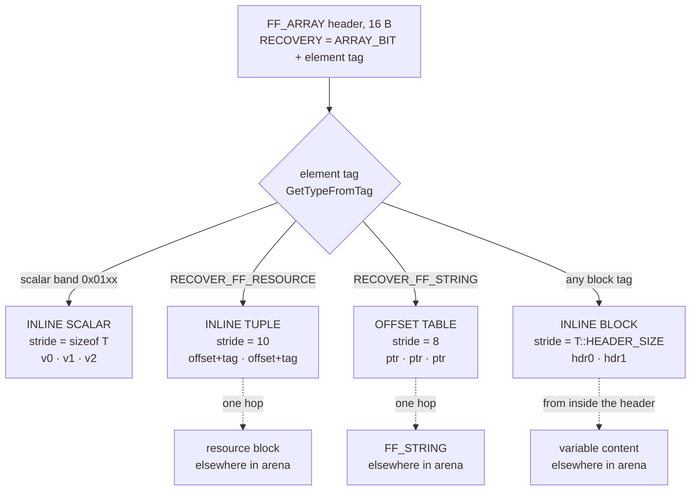
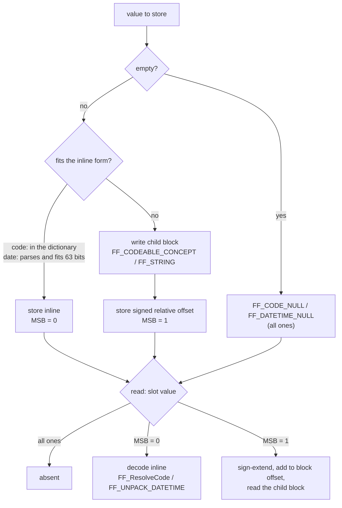

# FastFHIR — Architecture Reference

> **Scope.** This document is the authoritative architectural reference for the
> FastFHIR engine. It is the document against which code revisions must be
> measured: any change that violates the invariants laid out here is, by
> definition, a regression. The descriptions below are synthesised directly
> from the canonical headers (`include/FF_Primitives.hpp`,
> `include/FF_Memory.hpp`, `include/FF_Builder.hpp`, `include/FF_Parser.hpp`)
> and the generator (`generator/`).
>
> **Audience.** Engine maintainers, code-generator authors, and reviewers.
> Application-level usage examples belong in the README; this document is
> mechanical.

---

## Table of Contents

1. [System Philosophy & Design Invariants](#1-system-philosophy--design-invariants)
2. [Memory Architecture: The Virtual Memory Arena (VMA)](#2-memory-architecture-the-virtual-memory-arena-vma)
3. [The Dual-Layer Type System](#3-the-dual-layer-type-system)
4. [Binary Wire Format: `DATA_BLOCK` Anatomy](#4-binary-wire-format-data_block-anatomy)
5. [The Array Subsystem: Inline Entries and the One Indirection](#5-the-array-subsystem-inline-entries-and-the-one-indirection)
6. [High-Performance Primitives](#6-high-performance-primitives)
7. [Concurrent Builder Mechanics](#7-concurrent-builder-mechanics)
8. [Zero-Copy Read Path (`Reflective::Node`)](#8-zero-copy-read-path-reflectivenode)
9. [Code Generation Pipeline (`generator/`)](#9-code-generation-pipeline-generator)

---

## 1. System Philosophy & Design Invariants

FastFHIR is a binary container format and execution engine for HL7 FHIR
resources. It is engineered around four hard, non-negotiable invariants. Every
data structure, allocator, generator, and accessor in the codebase exists in
service of these invariants; any proposed change that contradicts one must be
rejected at review time.

### 1.1 Zero-Copy Random Access — O(1) field navigation

A field on any FHIR object must be reachable by **pure pointer arithmetic** on
the underlying byte arena, never by parsing, scanning, or dictionary lookup at
read time. Concretely:

- Every block has a fixed-stride V-Table immediately after its 10-byte
  universal header (see §4). A field's byte offset within that V-Table is a
  compile-time constant baked into a generated `FF_FieldKey` (see
  `FF_Primitives.hpp::FF_FieldKey`).
- An array element's address is `entries() + index * stride`; stride is a
  compile-time invariant of the element class (see §5).
- A scalar field is read in-place from the V-Table slot. A block-typed field
  stores an 8-byte arena offset; one indirection reaches the child.

**Why.** FHIR documents are fan-in: a single FHIR Bundle is read by many
consumers, often concurrently, often in latency-bound paths (FHIR routers,
CDS hooks, real-time analytics). Read costs dominate. Encoding the document
once with O(1) navigation amortises to a multiplicative speed-up over JSON-
or XML-derived shapes that recompute structure per read.

**Consequence.** The format never compresses field offsets out of header
slots, never re-orders fields by frequency, and never relies on hashing for
the hot-path. It pays the price of fixed slots — including null sentinels for
absent fields — to preserve the invariant.

### 1.2 Lock-Free Concurrency — Atomic space reservation

Multiple writer threads must be able to ingest into a single arena
simultaneously without mutexes, condition variables, or producer/consumer
queues on the hot path.

- Space is reserved by a single `fetch_add` on a `std::atomic<uint64_t>`
  write-head (`Memory::claim_space`, `FF_Memory.hpp:74`). The returned offset
  is the writer's exclusive slice for the call's duration; no other writer
  can ever observe that range as available.
- Once written, the slice is published to readers via the release-semantics
  load on `Memory::size()` (`FF_Memory.hpp:307–309`).

**Why.** FHIR ingestion is naturally embarrassingly parallel — Bundle entries,
batched messages, and parallel decoders all need to land in the same
addressable arena to preserve cross-resource references (`ResourceReference`,
§6). A mutex-guarded heap allocator would serialise that fan-in and erase the
benefit of multi-core decode.

**Consequence.** All append paths are forbidden from holding any lock other
than the implicit hardware fence on `fetch_add`. Block layouts are forbidden
from requiring back-references to siblings written by other threads;
back-patching is restricted to the parent the current writer owns
(`Builder::amend_*`, §7).

### 1.3 Memory-Mapped Substrate — Sparse, high-capacity VMA

The arena is **virtual memory**, not heap memory. By default it is a 4 GiB
sparse mapping (`FF_Memory.hpp:52, 60`); only the touched pages are committed
by the OS, so the cost is paid as data is actually written.

- Three flavours coexist: anonymous RAM, POSIX SHM (cross-process), and
  file-backed (`Memory::create`, `Memory::createFromFile`).
- Sparse-by-default means the high-capacity reservation is essentially free
  and means that the lock-free `fetch_add` allocator never has to grow,
  rebase, or invalidate pointers.

**Why.** Two distinct properties fall out of one decision:

1. **Pointer stability.** Because the mapping never moves, raw arena offsets
   recorded in V-Tables and arrays remain valid forever — no fix-up pass is
   needed before reads, and the `Reflective::Node` lens (§8) can hold raw
   pointers safely.
2. **Process boundary erasure.** SHM-backed arenas are addressable from
   sibling processes (compactor, exporter, language bindings) and file-backed
   arenas are addressable from a future process — i.e. the live in-memory
   format and the on-disk archive format are the same bytes. There is no
   serialise/deserialise step.

**Consequence.** All offsets are 64-bit (`Offset = uint64_t`,
`FF_Primitives.hpp:41`) even though current arenas are 4 GiB; future growth
will not require schema changes.

### 1.4 Version Awareness — Forward and backward compatibility

FastFHIR encodes both the engine layout version and the FHIR schema revision
(R4/R5/…) into `FF_HEADER`. V-Tables are **dynamically sized** per FHIR
revision: each generated block exposes a `get_header_size()` accessor that
returns the field-area length appropriate to the stream's revision. A reader
compiled against R5 can read an R4 stream by clamping access to the smaller
header; a reader compiled against R4 can ignore R5-only fields by treating
them as out-of-bounds null sentinels.

- `FF_HEADER::FHIR_REV` (bytes 6–7) — the FHIR revision tag (`FHIR_VERSION_R4
  = 0x0400`, `FHIR_VERSION_R5 = 0x0500`).
- `FF_HEADER::VERSION` (bytes 50–53) — a 32-bit word with two packed
  sub-fields:
  - **Bits 31–30 — stream-layout flags** (`FF_STREAM_LAYOUT_BITS = 2`).
    Currently `FF_STREAM_LAYOUT_STANDARD` or `FF_STREAM_LAYOUT_COMPACT`.
  - **Bits 29–0 — engine version**, encoded as
    `((FASTFHIR_VERSION_MAJOR & 0x3FFF) << 16) | (FASTFHIR_VERSION_MINOR & 0xFFFF)`
    (`src/FF_Primitives.cpp`). `FASTFHIR_VERSION_MAJOR` is explicitly masked
    to 14 bits before shifting into bits 29–16, ensuring it can never reach
    bits 31–30 and corrupt the stream-layout flags. `FASTFHIR_VERSION_MINOR`
    occupies bits 15–0, masked to 16 bits. A `static_assert` at the encoding
    site enforces the MAJOR bound at compile time. Both values are injected
    from the CI release tag via `FastFHIR.hpp:84–88`; `#ifndef` guards keep
    offline builds functional. `FF_ENCODE_HEADER_VERSION` additionally applies
    `FF_ENGINE_VERSION_MASK` as a second line of defence. Encoding/decoding
    helpers: `FF_ENCODE_HEADER_VERSION` / `FF_HEADER_ENGINE_VERSION` /
    `FF_HEADER_STREAM_LAYOUT` (`FF_Primitives.hpp:80–91`).

**Why.** FHIR is a moving target, but so is the FastFHIR engine itself. The
same bidirectional compatibility contract that governs FHIR revision drift
applies to engine version drift:

- **Newer reader, older stream.** Optional header fields added in later engine
  versions (e.g. `URL_DIR_OFFSET`, `MODULE_REG_OFFSET`) are initialised to
  `FF_NULL_OFFSET` in older streams. A newer reader checks the engine MAJOR
  version and treats any field beyond the writer's schema as absent — the same
  null-sentinel contract used for FHIR R4/R5 V-Table fields.
- **Older reader, newer stream.** A reader whose compiled MAJOR is less than
  the stream's MAJOR can detect the mismatch via
  `FF_HEADER_ENGINE_VERSION()` and reject or degrade gracefully. MINOR-only
  increments signal additive-only changes (new optional fields, new block
  types) that an older reader can safely ignore.

The version-aware `FF_HEADER` and V-Table are therefore the unified
mechanism for both FHIR revision compatibility and engine version
compatibility.

---

## 2. Memory Architecture: The Virtual Memory Arena (VMA)

`include/FF_Memory.hpp`. Namespace `FastFHIR`. Two types: `Memory` (Handle)
and `FF_Memory_t` (Body). This is a textbook Handle/Body pattern lifted into
shared ownership semantics.

### 2.1 `Memory` & `FF_Memory_t` — Handle / Body

- **`FF_Memory_t`** holds the OS-level resources: the base pointer
  (`m_base`), the capacity, the file descriptor / OS handle, the SHM/file
  name, and crucially `m_head_ptr` — a raw pointer into the first eight bytes
  of the mapping that holds the atomic write-head. Constructed only via the
  private constructor; lifetime is `std::shared_ptr<FF_Memory_t>`.
- **`Memory`** is a thin wrapper around `std::shared_ptr<FF_Memory_t>`. It is
  copyable, movable, and trivially passable across threads. All public API
  forwards inline to the body (`FF_Memory.hpp:300–309`).

**Why the pattern.** Multiple subsystems (`Builder`, `Parser`,
`Memory::View`, language bindings, network sinks) need long-lived references
to the *same* mapping without any one of them dictating its lifetime.
`shared_ptr` makes "the mapping is alive iff any consumer still cares" a
first-class invariant; the destructor of the last surviving handle unmaps the
arena. Handle/Body keeps the user-facing surface (`Memory`) cheap while
isolating the resource (`FF_Memory_t`) behind a non-constructible private
type.

### 2.2 Lock-Free Claiming — `claim_space()`

The atomic write-head is a `uint64_t` co-located inside the `FF_HEADER`
region of the arena, accessed via `std::atomic_ref<uint64_t>` against
`*m_head_ptr`. Specifically, it occupies the eight bytes at
`STREAM_CURSOR_OFFSET = 8` — the same byte range that `FF_HEADER::STREAM_SIZE`
occupies in the sealed file. During building, those bytes carry the live
cursor; on `finalize()`, the cursor is replaced by the canonical
`STREAM_SIZE` value. The remainder of the header (bytes 0–7 carrying
`MAGIC + RECOVERY + FHIR_REV`, and bytes 16 onwards carrying
`ROOT_OFFSET`, `ROOT_RECOVERY`, etc.) is staged separately during raw
ingest — see `STREAM_PAYLOAD_OFFSET = 16` and the `StreamHead` discussion in
§2.4. `Memory::base()` returns `m_base` directly; arena offsets stored in
V-Tables are relative to `m_base` (offset 0 = start of `FF_HEADER`).

`claim_space(bytes)` performs a single `fetch_add(bytes,
memory_order_acq_rel)` on the write-head, returning the offset the caller now
exclusively owns. Capacity overflow throws `std::runtime_error`; the addition
itself is uncontended in the success path because every concurrent caller
gets a distinct offset by construction.

#### The `STREAM_LOCK_BIT` (bit 63)

```
constexpr uint64_t STREAM_LOCK_BIT = 1ULL << 63;
constexpr uint64_t OFFSET_MASK     = ~STREAM_LOCK_BIT;
```

The high bit of the 64-bit write-head doubles as an exclusion lock for raw
network ingestion. `try_acquire_stream()` attempts to set this bit via CAS;
if it succeeds, the caller receives a `StreamHead` RAII guard, which is the
*only* writer permitted to advance the head until released. Concurrent
`claim_space` calls observe a head with the lock bit set and refuse (or wait,
depending on policy) — `OFFSET_MASK` is applied on every read so that the
*observed offset* is always the lower 63 bits and is never polluted by the
lock bit.

**Why bit 63 specifically.** It is unreachable in practice — exhausting the
lower 63 bits requires an 8-EiB arena — and it allows acquisition,
publication, and the data-offset payload to coexist in a single 64-bit word.
There is no separate mutex to mis-order against the cursor, and there is no
double-word atomic to require special platform support.

### 2.3 Lifetime Safety — `Memory::View`

`Memory::View` is a non-owning lens over the *committed* portion of the
arena, exposed as `data()`, `size()`, and an implicit conversion to
`std::string_view`. Its critical property: it holds a *copy* of the
`std::shared_ptr<FF_Memory_t>` (`FF_Memory.hpp:170`).

```
const std::shared_ptr<FF_Memory_t> m_vma_ref;
```

That single `shared_ptr` is the difference between safe and undefined.
`Memory::View` is the canonical type used to hand the sealed FastFHIR byte
stream to asynchronous sinks: ASIO socket writes, OS background flushes,
SHA-256 hashing on a worker pool. Any of those can outlive the originating
`Builder`/`Parser`. Because the View holds shared ownership, the mapping
cannot be unmapped until the async operation drops the View — eliminating
use-after-free as an architectural class of bug.

**Implicit conversion to `std::string_view`** is provided for ergonomics, but
is documented to drop the lifetime guarantee (`FF_Memory.hpp:144–146`). The
caller is responsible for keeping the parent View alive.

### 2.4 RAII Stream Management — `StreamHead`

`StreamHead` is the exclusive ingestion token returned by
`try_acquire_stream()`.

- **Non-copyable, move-only.** Models exclusive ownership.
- `write_ptr()` returns the live write edge — a mutable pointer into the
  arena where the next byte should land. Exposed as a destination for raw
  socket reads (zero-copy NIC → arena DMA path).
- `available_space()` returns the contiguous bytes remaining before
  `m_capacity`.
- `commit(bytes_written)` advances the atomic head with release semantics
  (publishing the freshly-written bytes to readers) and **keeps the lock
  held**. A single `StreamHead` therefore serves contiguous multi-chunk TCP
  streams without re-acquiring the lock between chunks.
- The destructor (`~StreamHead`) calls `release()`, which clears
  `STREAM_LOCK_BIT` via `release_stream_lock()`.

#### The staged-header trick

The first `STREAM_HEADER_SIZE` bytes of an incoming raw stream contain the
`FF_HEADER`. The bytes at offsets 8–15 of that header (`STREAM_SIZE` in the
sealed-file layout) cannot be written directly to the arena because those
same bytes hold the live atomic write-head during building — overwriting them
would corrupt in-progress concurrent allocations. `StreamHead` therefore
stages the header in a private `m_staged_header[STREAM_HEADER_SIZE]` buffer,
and on `release()` copies the staged bytes back into the arena *around* the
cursor word (`FF_Memory.hpp:362–373`):

```
memcpy(m_base, m_staged_header, STREAM_CURSOR_OFFSET);                     // bytes 0..7  → MAGIC + RECOVERY + FHIR_REV (FF_HEADER's own layout)
memcpy(m_base + STREAM_PAYLOAD_OFFSET,
       m_staged_header + STREAM_PAYLOAD_OFFSET,
       STREAM_HEADER_SIZE - STREAM_PAYLOAD_OFFSET);                        // bytes 16..  → ROOT_OFFSET, …
```

Bytes 8–15 (the cursor itself) are deliberately *not* copied; the live
atomic head value already occupies those bytes and is the source of truth.

> **Note.** `FF_HEADER` is a special block: it inherits from `DATA_BLOCK`
> for the C++ runtime descriptor (`__offset`, `__size`, `__version`) but
> deliberately **shadows** `DATA_BLOCK`'s `vtable_offsets`. Its first eight
> bytes are *not* the universal `VALIDATION` field of §4.1 — they are
> `MAGIC (4) + RECOVERY (2) + FHIR_REV (2)`. The universal 10-byte
> `[VALIDATION | RECOVERY]` header applies to every other block in the
> arena; `FF_HEADER` is the sole, intentional exception, because it must be
> identifiable by file-magic alone before any structural assumptions can be
> made.

---

## 3. The Dual-Layer Type System

FastFHIR distinguishes two orthogonal type questions:

- **Physical**: How do I parse the bytes at this V-Table slot? — answered by
  `FF_FieldKind`.
- **Semantic**: What FHIR concept is in those bytes? — answered by
  `RECOVERY_TAG`.

The two layers compose: a 10-byte slot of kind `FF_FIELD_RESOURCE` may carry
*any* recovery tag identifying the actual referenced resource type. A reader
uses kind to decode and recovery to dispatch.

### 3.1 `FF_FieldKind` — Physical Discriminant

`FF_Primitives.hpp:547–565`.

```
enum FF_FieldKind : uint16_t {
    FF_FIELD_UNKNOWN = 0,
    FF_FIELD_STRING,    FF_FIELD_ARRAY,    FF_FIELD_BLOCK,
    FF_FIELD_CODE,      FF_FIELD_BOOL,
    FF_FIELD_INT32,     FF_FIELD_UINT32,
    FF_FIELD_INT64,     FF_FIELD_UINT64,
    FF_FIELD_FLOAT64,
    FF_FIELD_RESOURCE,  FF_FIELD_CHOICE,
    FF_FIELD_DATETIME,                      // 13 — one kind, four tags (§6.3)
};
```

Members **append and never renumber**: the enum is part of the ABI — `FF_FieldInfo`
and `FF_FieldKey` both carry it — even though it is not a wire constant (nothing
serialises a kind; it is derived from the recovery tag by `Recovery_to_Kind`).

Kind tells the parser the **storage class** of a slot, not its meaning:

| Kind                         | Slot width     | Interpretation                                   |
|------------------------------|----------------|--------------------------------------------------|
| `FF_FIELD_BOOL`              | 1 B            | 0/1 byte                                         |
| `FF_FIELD_INT32` / `_UINT32` | 4 B            | LE integer                                       |
| `FF_FIELD_INT64` / `_UINT64` | 8 B            | LE integer                                       |
| `FF_FIELD_FLOAT64`           | 9 B            | LE IEEE-754 double, then 1 B of source sigfigs   |
| `FF_FIELD_CODE`              | 4 B            | Code dictionary index (top bit = custom string)  |
| `FF_FIELD_DATETIME`          | 8 B            | Packed civil date/time (top bit = original text) |
| `FF_FIELD_STRING`            | 8 B            | `Offset` to `FF_STRING` block                    |
| `FF_FIELD_BLOCK`             | 8 B            | `Offset` to nested block                         |
| `FF_FIELD_ARRAY`             | 8 B            | `Offset` to `FF_ARRAY` block                     |
| `FF_FIELD_RESOURCE`          | 10 B           | `ResourceReference` (offset + recovery tag)      |
| `FF_FIELD_CHOICE`            | 10 B           | `ChoiceEntry` raw 8 B + 2 B recovery tag         |

Slot widths are exactly the values in `TYPE_SIZE`
(`FF_Primitives.hpp:515–528`). Note in particular that resource and choice
slots are **10 bytes**, not 8 — they carry an inline recovery tag because
their concrete type is not statically determinable from the parent V-Table.

`FF_FIELD_CODE` and `FF_FIELD_DATETIME` are the two kinds above whose
interpretation depends on the *value* rather than the kind: the top bit selects
between an inline value and a pointer. They are one mechanism at two widths and
are described together in §6.3.

`FF_FIELD_DATETIME` is deliberately **one kind for four recovery tags**
(`RECOVER_FF_DATE`/`DATETIME`/`TIME`/`INSTANT`). The kind answers "how is this
slot stored", which is identical for all four; the tag answers "which FHIR type
is this", which the exporter needs and the kind cannot express. That asymmetry is
why `Recovery_to_Kind` maps four tags onto one kind while `Kind_to_Recovery` has
**no** entry for it — a single answer there would be wrong three times in four.

### 3.2 `RECOVERY_TAG` — Semantic Identifier

A 16-bit (`uint16_t`) ID embedded at bytes 8–9 of every block (immediately
after the 8-byte `VALIDATION` word). Emitted into `generated_src/FF_Recovery.hpp` by
`generator/emit/recovery_tags.py` from the committed tag ledger
`dictionaries/master_tags.json`. The header is generated **and** committed —
it is a permanent wire artifact reviewed in diffs, and must never be
hand-edited; append to the ledger instead. The ledger covers the whole
R4 ∪ R5 spec, so the emitted header is byte-identical for every
`FASTFHIR_PRODUCTION_PROFILE`. The inclusion is at `FF_Primitives.hpp`, which
includes it as `"FF_Recovery.hpp"`.

The tag space is partitioned into five **bands**, and the boundaries are
themselves wire constants — a tag's band is part of its identity:

| Band | Range | Holds |
|---|---|---|
| Core Primitives | `0x0000 – 0x00FF` | FastFHIR's own structural blocks — `FF_HEADER`, `FF_STRING`, `FF_RESOURCE`, `FF_CHECKSUM`, the directories and registries |
| Inline Scalars | `0x0100 – 0x01FF` | values that live *in* the V-Table slot — `FF_BOOL`, `FF_INT32` … `FF_FLOAT64`, `FF_CODE`, and the packed date/time family |
| Data Types | `0x0200 – 0x0FFF` | FHIR complex datatypes |
| Resources | `0x1000 – 0x1FFF` | concrete FHIR resource types |
| Sub-elements | `0x2000 – 0x7FFF` | BackboneElements (bit 15 is `RECOVER_ARRAY_BIT`, so `0x7FFF` is the ceiling) |

**Bands are not documentation — they are dispatch.** `Recovery_to_Kind`
(`FF_Primitives.hpp`, `Recovery_to_Kind`) tests
`(base & 0xFF00) == RECOVER_FF_SCALAR_BLOCK` to decide whether a tag denotes an
inline scalar, and `FF_IsScalarBlockTag` / `FF_IsResourceTag` /
`FF_IsBackboneTag` (`FF_Utilities.hpp`) classify the same way. A tag placed in
the wrong band is therefore *silently misclassified at runtime* rather than
failing to compile.

That is not hypothetical. `RECOVER_FF_CODE` sat in the Core Primitives band
until 2026-08-19 while being an inline scalar, which put it outside the band
test — so a `case RECOVER_FF_CODE:` written inside the scalar-band switch was
unreachable, and the same misbanding silently disabled the code path in the
Compactor's `write_choice_slot` for the 11 FHIR choice fields that carry a
`code` variant. It now lives at `0x010B` with the other inline scalars. See
TASKS.md DT-0.1; the band map with live occupancy counts is emitted at the top
of `generated_src/FF_Recovery.hpp`.

Within the block family, the check `base >= RECOVER_FF_DATA_TYPE_BLOCK` groups
data types and concrete resources together as the `FF_FIELD_BLOCK` family.

#### The `0x8000` Array Bit

```
constexpr uint16_t RECOVER_ARRAY_BIT  = 0x8000;
constexpr uint16_t RECOVER_TYPE_MASK  = 0x7FFF;
inline constexpr bool         IsArrayTag    (RECOVERY_TAG t) { return (t & RECOVER_ARRAY_BIT) != 0; }
inline constexpr RECOVERY_TAG GetTypeFromTag(RECOVERY_TAG t) { return RECOVERY_TAG(t & RECOVER_TYPE_MASK); }
inline constexpr RECOVERY_TAG ToArrayTag    (RECOVERY_TAG b) { return RECOVERY_TAG(b | RECOVER_ARRAY_BIT); }
```

(Emitted into `FF_Recovery.hpp` by `generator/emit/recovery_tags.py`.)

The array bit is an **orthogonal modifier**, not a separate enumerator. The
recovery tag stamped into an `FF_ARRAY` header for an array of `Observation`
is `ToArrayTag(RECOVER_FF_OBSERVATION)`. A reader inspects the bit with
`IsArrayTag()` to decide whether to descend into element-by-element decode;
it strips the bit with `GetTypeFromTag()` to recover the element type for
type-checking against `TypeTraits<T>::recovery`.

**Why a single bit instead of paired enumerators.** Doubling the tag space
(one entry per type, one per array-of-type) doubles the generated enum, halves
its dispatch density, and forces the generator to keep two tags in sync per
type. A single bit gives O(1) "is this an array of X?" with zero generator
duplication. The `0x8000` choice is mechanically convenient: the resulting
masked value is still a valid 15-bit type tag, so existing dispatch tables
do not need a special case beyond `GetTypeFromTag()`.

The validator (`src/FF_Primitives.cpp:213–214`) enforces the invariant: an
`FF_ARRAY` block whose recovery does *not* have the array bit set is
rejected.

### 3.3 `TypeTraits<T>` — Compile-Time Bridge

`TypeTraits<T>` is the explicit point of contact between strongly-typed C++
data structures and the binary wire format. For each generated FHIR type
(e.g. `PatientData`, `BundleData`), the generator emits a specialisation
exposing:

- `static constexpr RECOVERY_TAG recovery` — the canonical recovery tag for
  `T`; checked at every read/write boundary.
- `static Size size(const T& v, FHIR_VERSION rev)` — total bytes required to
  encode `v` for the given revision (used by `Builder::append` to size the
  `claim_space` reservation).
- `static void store(BYTE* base, Offset off, const T& v, FHIR_VERSION rev)` —
  serialise `v` into the arena at `off`. Must respect kind-and-stride for any
  array fields and back-patch any nested block offsets.
- `static T read(const BYTE* base, Offset off, Size size, uint32_t version)`
  — materialise `T` from arena bytes (used by the `Node::as<T>()` and
  `Entry::operator T()` paths).

The `HasTypeTraits<T>` concept (`FF_Parser.hpp:32–35`) requires `read` only;
the trait is therefore valid for read-only consumer types if `store`/`size`
are not generated.

**Why TypeTraits and not virtuals/RTTI.** Every overhead paid here is paid
on the hot path. A virtual call per field would defeat O(1) navigation; RTTI
would defeat the recovery-tag scheme. Compile-time specialisation collapses
the entire bridge to inlined memcpys on the call site.

---

## 4. Binary Wire Format: `DATA_BLOCK` Anatomy

Every block in the arena — `FF_HEADER`, `FF_CHECKSUM`, `FF_ARRAY`,
`FF_STRING`, `FF_URL_DIRECTORY`, every generated FHIR resource block —
inherits from `DATA_BLOCK` and shares a universal 10-byte header.

### 4.1 The Universal Header (10 bytes)

`FF_Primitives.hpp:321–355`.

```
enum vtable_offsets {
    VALIDATION  = 0,             // 8 bytes (0..7)
    RECOVERY    = VALIDATION + 8, // 2 bytes (8..9)
    HEADER_SIZE = RECOVERY + 2,   // 10 bytes total
};
```

- **Bytes 0–7 — `VALIDATION`.** A 64-bit value carrying the *absolute arena
  offset of the block itself* — i.e. the byte position of this block relative
  to the arena base. This serves two purposes simultaneously:
  1. **Recovery from corruption.** A scanner can locate a block by searching
     for a 64-bit word whose value equals the current scan position,
     re-synchronising after a damaged region.
  2. **Cheap structural validation.** `validate_offset` (declared at
     `FF_Primitives.hpp:350`) verifies that the stored offset matches the
     expected `__offset` and that the bytes at `RECOVERY` match the expected
     tag (`src/FF_Primitives.cpp:33`).

- **Bytes 8–9 — `RECOVERY`.** The block's `RECOVERY_TAG` (§3.2). This is the
  semantic discriminant on which polymorphic dispatch hangs.

#### `DATA_BLOCK`'s in-memory shadow

`DATA_BLOCK` is *both* a description of bytes in the arena *and* a small
runtime descriptor:

```
Offset   __offset  = FF_NULL_OFFSET;   // arena offset of the block (mirrored in VALIDATION)
Size     __size    = 0;                // total byte size of the block (not stored in VALIDATION)
uint32_t __version = 0;                // engine version (for V-Table sizing)
```

These are **not** stored in the arena; they are populated by the parser when
materialising a `Node`. They are what makes O(1) navigation feasible
without re-reading the validation word on every call.

> **`__remote` / `__response` (Emscripten only).** Under
> `__EMSCRIPTEN__`, two extra fields are present (`FF_Primitives.hpp:336–
> 337`) carrying a remote URL handle and an asynchronous response slot.
> These exist solely to support partial fetches of remote arenas from a
> browser; on native targets they are absent and add zero overhead.

### 4.2 The V-Table Architecture

A FastFHIR block's bytes are laid out as:

```
[ VALIDATION (8) | RECOVERY (2) | <V-TABLE: fixed-size field slots> | <trailing payload> ]
```

Field slots come in **fixed sizes** drawn from `TYPE_SIZE` (§3.1).
**Crucially, slots are ordered and statically allocated even for absent
fields.** A field that is absent in a particular instance is encoded as the
canonical null sentinel (`FF_NULL_OFFSET = 0xFFFFFFFFFFFFFFFF` for offset
fields; `FF_NULL_UINT32` for codes; `FF_CODE_NULL` for code-typed primitives;
etc., enumerated in `FF_Primitives.hpp:59–88`).

**The sentinel is a bit pattern, not a value.** Every null in that family is
all-ones *bytes*, and `FF_IsFieldEmpty` tests a slot by loading its raw width
and comparing against all-ones — one rule, every fixed-width kind. Float slots
are where the distinction bites: `FF_NULL_F64` must be `std::bit_cast` from
`FF_NULL_UINT64`, never assigned from it. The numeric conversion yields the
double `1.8446744073709552e19`, encoded `0x43F0000000000000`, which never
equals all-ones — so a decimal slot spelled that way is never empty, and every
absent `Quantity.value` exports as a literal `1.84467e+19`. The all-ones double
is a quiet NaN and therefore unordered under `==`; absence is tested on the
bytes (`FF_IsFieldEmpty`), never by comparing against the constant.

**Decimals carry their source precision in a 9th byte.** `decimal` is the only
FHIR type that reaches an `FF_FIELD_FLOAT64` slot, and the slot is
`[ double (8) | sigfigs (1) ]`. The kind keeps the `FLOAT64` name deliberately:
it is named for the slot's *primary view*, not for the FHIR type. Reading the
first eight bytes as a plain IEEE-754 double and ignoring the ninth is a
supported, complete way to consume the slot — a column store, an index, or any
floating-point arithmetic that does not care how the value was typed gets what
it needs with no decode. Precision is the addendum, wanted by exactly one
consumer: the JSON exporter. Nothing may be encoded into the value bytes.

A consequence worth stating: `100.0` and `100` produce **identical** first eight
bytes and differ only at `+8`. Equal as numbers, distinguishable as text — which
is what lets one slot serve both audiences. The byte at `+8` records how many digits followed the `.`
in the source document, because FHIR counts trailing zeros as significant
(`62.00` asserts hundredths, `62` does not) and no bit pattern of a binary64 is
free to say so. It is the decimal *scale* — what `%.*f` consumes — not a count
of significant figures; `62.00` stores 2 and has four sig figs.
`FF_DECIMAL_SIGFIGS_UNSPECIFIED` (all ones) means the source form was not
recorded — exponent notation, or more fractional digits than a double
distinguishes — and the exporter then emits the shortest representation that
round-trips to the stored bits. The ingest reads the count off simdjson's
`raw_json_token()`, which reports the token without advancing the cursor.

This is the same split DT-2 made for date/time, where an explicit precision
field is what keeps `"2024"` from round-tripping as `"2024-01-01T00:00:00Z"`.
Choice (`[x]`) variants are the one gap: their 10-byte slot spends `+8` on the
`RECOVERY_TAG`, so a `valueDecimal` has nowhere to put a count and exports
shortest-round-trip.

**Why fixed-stride slots.** Two reasons, both in service of §1.1:

1. The byte offset of every field is then a compile-time constant, baked
   into a generated `FF_FieldKey` (`FF_Primitives.hpp:234–310`) — a struct
   that carries *both* the C-string field name and the precomputed
   `field_offset`, so name-based lookups (e.g. from JSON or Python bindings)
   collapse to a single switch in the reflection table without traversing
   the block at all.
2. It makes the V-Table self-describing: knowing the type (via `RECOVERY`)
   and the version is sufficient to compute every field's location.

#### Version-Aware Offsets (`get_header_size()`)

Each generated FHIR struct exposes `inline Size get_header_size() const`
(emitted by `generator/library.py`). The function consults the block's recorded
`__version` and returns the V-Table size appropriate to that revision.

For example, an R4 `Patient` block has fewer fields than its R5
counterpart; the generator emits the R4 fields with the same byte offsets in
both revisions, and the R5-only fields appended after. `get_header_size()`
returns the R4 value when `__version` reports R4. Reads against R5-only
slots in an R4 block detect the slot is past `get_header_size()` and yield
the null sentinel rather than reading into adjacent payload.

**Why this is correct under both forward and backward reads.**

- **R5 reader, R4 stream.** The R5-only fields are absent in the stream's
  V-Table; the bounded read returns null; consumer treats them as
  "unspecified", matching FHIR semantics.
- **R4 reader, R5 stream.** R4 reader knows nothing of R5-only fields and
  never asks for them; the additional bytes are skipped via
  `get_header_size()` when computing the start of the trailing payload (such
  as inline blocks for arrays). The R4 reader cannot misinterpret R5 fields
  as part of its known schema because field lookup is by compile-time
  offset, not by name.

### 4.3 Back-Patching — `Builder::amend_pointer`

A parent block is allocated *before* its children; the child offsets are not
known at allocation time. The Builder's solution is **back-patching**: write
the parent with `FF_NULL_OFFSET` placeholders, then once the child is
appended, overwrite the parent's V-Table slot with the child's offset.

`Builder::amend_pointer(parent_off, vtable_off, child_off)`
(`FF_Builder.hpp:174`) is the canonical API; specialisations exist for
polymorphic resource fields (`amend_resource`, includes a recovery tag) and
choice variants (`amend_variant`, includes raw bits + recovery), and a
template `amend_scalar<T>` (`FF_Builder.hpp:489–518`) handles fixed-width
scalars with size dispatch on `sizeof(T)`.

The patch is a `STORE_U64` (or smaller for scalars) at
`m_base + parent_off + vtable_off`. It is *not* atomic: a partially-written
patch may be observed by a concurrent reader. This is acceptable because:

- Concurrent reads are scoped to the `Memory::View` returned by
  `Builder::finalize` (§7.4) — i.e. by contract a reader does not observe
  the arena until the writer has finalised. The `m_finalizing` /
  `m_active_mutators` interplay enforces this.
- Mid-build queries are explicitly opt-in via `Builder::query()`, which
  returns a fresh `Parser` but is documented as a snapshot of "the current
  state" — readers must accept that fields may transiently report
  `FF_NULL_OFFSET`.

---

## 5. The Array Subsystem: Inline Entries and the One Indirection

`FF_ARRAY` is the workhorse for every list-typed field in FHIR. The design
rule is simple and near-absolute: **an array holds its entries.** Exactly one
element class cannot honour it.

### 5.1 Fixed stride is the constraint; variable length is the only thing that breaks it

Random access — `array[i]` in O(1) — requires `address(i) = base + i * stride`
for some *constant* `stride`. So the question for every element type is not
"is it simple or complex?" but "**is it fixed-width?**"

Three element classes are fixed-width and are therefore held inline. One is
not, and pays for one pointer hop:

| Element class | Held as | Stride | Example fields | Sites |
|---|---|---|---|---|
| **Inline scalar** | the raw value | `sizeof(T)` | `Claim.item.diagnosisSequence` (`uint32`) | 26 |
| **Inline block** | the element's block header, packed | `T::HEADER_SIZE` | `Extension`, `Reference`, `CodeableConcept`, backbones | 845 |
| **Inline polymorphic tuple** | 10-byte `{ offset(8), tag(2) }` | `TYPE_SIZE_RESOURCE` = 10 | `contained`, resource lists | 32 |
| **Offset table** | 8-byte arena offsets | `TYPE_SIZE_OFFSET` = 8 | every `FF_STRING`-backed field | 31 |

903 of 934 array sites hold their entries directly.

Two consequences are easy to get backwards, so they are stated explicitly:

- **A block element is fixed-width.** A `CodeableConcept` header is a constant
  size; its variable content (strings, codings) lives elsewhere in the arena
  and is reached *from* the header. Complexity of the type says nothing about
  the width of its header.
- **Polymorphism does not force an offset table.** A resource array is
  fixed-stride because the 10-byte tuple is fixed-width — the polymorphism
  lives in the tag *inside* the inline entry, and the tuple's offset field
  reaches the variable-size resource. This is indirection held inline, not an
  offset array.

That leaves **variable length** as the sole reason to abandon inline storage,
and `FF_STRING` as the only element type in the system that has it (its
`LENGTH` is part of its own header, so the width is not knowable from the
schema). Every `OFFSET` array in the tree is a string array.



The cost of the one indirection is unavoidable; the alternative is to lose
O(1). Random access dominates iteration in FHIR consumer workloads, and the
hop is one cache line at most when the arena is sequentially allocated.

### 5.2 `FF_ARRAY` Layout

`include/FF_Primitives.hpp:1295–1346`.

```
HEADER (16 bytes):
  VALIDATION    (8)   bytes 0..7
  RECOVERY      (2)   bytes 8..9   — array recovery tag (bit 15 / `RECOVER_ARRAY_BIT` always set; low 15 bits = element type)
  KIND_AND_STEP (2)   bytes 10..11 — packed: bits 15..14 = EntryKind, bits 13..0 = stride bytes
  ENTRY_COUNT   (4)   bytes 12..15
ENTRIES:
  ENTRY_COUNT × stride bytes, immediately following the header.
```

The **packed `KIND_AND_STEP` field** is the layout's most distinctive
detail. Two top bits encode the `EntryKind`; the remaining 14 bits hold the
stride. 14 bits supports strides up to 16 KiB per element, which exceeds any
realistic FHIR block size.

```
KIND_MASK = 0xC000   // bits 15..14
STEP_MASK = 0x3FFF   // bits 13..0
```

**Why pack them.** The header would otherwise need a separate 16-bit kind
slot, growing it to 18 bytes and breaking 8-byte alignment of `ENTRY_COUNT`.
Packing keeps the header at exactly 16 bytes — a power-of-two header size
and one cache line — and exposes both fields in a single 16-bit load.

### 5.3 The element type is the header's `RECOVERY` tag — and nothing else

The two bytes at `FF_ARRAY::RECOVERY` are the array's **single source of
truth** for what its entries are:

```cpp
// generated_src/FF_Recovery.hpp:1094–1096
constexpr uint16_t RECOVER_ARRAY_BIT  = 0x8000;
constexpr uint16_t RECOVER_TYPE_MASK  = 0x7FFF;
IsArrayTag(t)     -> (t & RECOVER_ARRAY_BIT) != 0
GetTypeFromTag(t) -> t & RECOVER_TYPE_MASK      // the element type
ToArrayTag(base)  -> base | RECOVER_ARRAY_BIT
```

`ToArrayTag(RECOVER_FF_STRING)` on an array of `code` says, on the wire,
"array of string" — which is exactly what was written, because `code` values
are serialised to `FF_STRING` blocks. Every layout decision in §5.1 follows
from this tag: which of the four classes applies, what the stride is, and
whether the entry is a value or a pointer. **Readers derive from the tag.**

This matters because the element type is declared in three places, and they do
not all agree:

| Source | Authority |
|---|---|
| the array header's `RECOVERY` tag | **ground truth** — written by the same call that laid out the bytes, so it cannot drift from the layout |
| `reflected_fields_view()` tables (`generated_src/FF_*.cpp`) | agrees with the wire |
| `generated_src/FF_FieldKeys.hpp` constants | **wrong for 6 array fields** — see below |

Six `code`-typed array fields carry `RECOVER_FF_CODE` in `FF_FieldKeys.hpp`
where the wire and the reflection tables both say `RECOVER_FF_STRING`:
`AllergyIntolerance.category`, `daysOfWeek` on `Availability.availableTime` /
`Location.hoursOfOperation` / `PractitionerRole.availableTime`, and
`Timing.repeat.{dayOfWeek,when}`. The FieldKeys emitter records the
pre-serialisation FHIR type; the other two record what is actually stored. A
consumer navigating by the `FF_FieldKey` constant would walk those arrays as
codes and mis-read them. **Never derive array layout from a schema-side copy
of the element type — read the header.**

### 5.4 `EntryKind` — a coarser echo of the tag

Defined as `FF_ARRAY::EntryKind` (`include/FF_Primitives.hpp:1304`):

| Value | Meaning | Written by the generator |
|---|---|---|
| `SCALAR = 0x0000` | packed primitives, stride `sizeof(T)` | **never** |
| `OFFSET = 0x4000` | 8-byte arena offsets | 31 sites (all string arrays) |
| `INLINE_BLOCK = 0x8000` | entries held inline at `stride` | 903 sites |

`INLINE_BLOCK` is emitted for **all three inline classes** — raw scalars, block
headers, and 10-byte resource tuples — with `stride` distinguishing them. Read
it as "entries are inline," not as "entries are blocks."

`SCALAR` is **dead**: no emitter in the tree writes it, and the only mention of
`FF_ARRAY::SCALAR` outside the enum is a `case` label in the reader. Scalar
arrays are written as `INLINE_BLOCK` with `stride = sizeof(T)`, and the header
tag (`ToArrayTag(RECOVER_FF_UINT32)`) is what identifies them.

**The header answers two separate questions, and neither field substitutes for
the other:**

| Question | Field |
|---|---|
| *What* is the element? | the `RECOVERY` tag — always |
| *Is the entry the value, or a pointer to it?* | `entries_are_pointers()` (kind bits) |

The kind bits would be derivable from the tag if the tag were always honest
about storage — scalar band means values, `FF_STRING` means a table. It is not,
yet: date/time arrays declare `RECOVER_FF_DATETIME` and store `FF_STRING`
blocks behind offsets (DT-2.4), so the tag says "packed 8-byte value" while the
entry is an 8-byte pointer. Until that closes, indirection must be read from
the kind bits.

What the kind bits must **never** be asked is *element shape*. `INLINE_BLOCK`
is stamped on scalars, block headers and resource tuples alike, so reading it
as "these are blocks" is what made every scalar array export as `[]`, and what
made the validator reject valid streams (§5.5).

The generator emits:

```cpp
STORE_FF_ARRAY_HEADER(__base, child_off, FF_ARRAY::INLINE_BLOCK, T::HEADER_SIZE,      n, ToArrayTag(T::recovery));          // blocks
STORE_FF_ARRAY_HEADER(__base, child_off, FF_ARRAY::INLINE_BLOCK, TYPE_SIZE_UINT32,    n, ToArrayTag(RECOVER_FF_UINT32));    // scalars
STORE_FF_ARRAY_HEADER(__base, child_off, FF_ARRAY::INLINE_BLOCK, TYPE_SIZE_RESOURCE,  n, ToArrayTag(RECOVER_FF_RESOURCE));  // tuples
STORE_FF_ARRAY_HEADER(__base, child_off, FF_ARRAY::OFFSET,       TYPE_SIZE_OFFSET,    n, ToArrayTag(RECOVER_FF_STRING));    // strings
```

### 5.5 Reading Arrays

`FF_ARRAY::entries(base)` returns a `const BYTE*` to byte 16 (the start of
the entry region). `entry_step` and `entry_kind` decode the packed
`KIND_AND_STEP` field; `entries_are_pointers` is a convenience for
`entry_kind == OFFSET`. The validator
(`FF_ARRAY::validate_full`) checks that `HEADER_SIZE + entry_count *
entry_step == VALIDATION` and that `RECOVERY` has the array bit set.

**Three** readers walk arrays, and all three must agree:

- `ParserOps::array_element` (`src/FF_Parser.cpp`) — the single decision point
  for "what is element *i*". Both `standard_node_entries` (which materialises
  every entry, used by `print_json` and the Python bindings) and
  `standard_node_lookup_index` (the O(1) `node[i]` path) route through it, so
  they cannot disagree. `compact_node_entries` / `compact_node_lookup_index`
  delegate to the standard pair, giving one implementation for both layouts.
- `DeepValidator::walk_array` (`src/FF_Parser.cpp`) — the structural pass behind
  `validate_FFHR_stream()`. It is a separate walker with its own dispatch, so it
  needs the same rule stated separately.

`array_element` decides in three branches, in this order: pointer table
(`entries_are_pointers`, element tag re-read from the pointed-to block),
polymorphic tuple (`RECOVER_FF_RESOURCE`), then inline entry, whose kind is
`Recovery_to_Kind(elem)` — that one call resolves the scalar band to a concrete
scalar kind and every block band to `FF_FIELD_BLOCK`.

Three failure modes follow from getting this wrong. All three were live, and all
three were silent:

- **Labelling a scalar element a block.** `Node::is_empty()` takes its
  `FF_FIELD_BLOCK` branch, calls `fields()`, and gets `{}` back — a scalar tag
  has no entry in `reflected_fields_view`. An empty field list reads as "no
  members present," so the element reports itself absent and `print_json`'s
  array loop skips it. Every scalar array exported as `[]`, with no warning on
  either path.
- **Reading a per-element recovery tag that isn't there.** The old
  `INLINE_BLOCK` branch of `node[i]` loaded `LOAD_U16(base + item_off +
  DATA_BLOCK::RECOVERY)` — 8 bytes into an element that, for a scalar array, is
  4 bytes wide, reading into the next element or past the entry region.
- **Validating a non-block as a block.** `walk_array` walked every inline entry
  through `walk()`, which requires a self-offset at +0. A `uint32` has none, and
  a resource tuple's +0 is the *target's* offset — so `validate_FFHR_stream()`
  reported "the offset chain is broken" and **rejected every valid stream
  containing a populated scalar or resource array.** Nothing caught it because
  `ff_roundtrip` does not validate and no test fed the validator a `Claim`.

All three are one root cause: inferring element structure from the kind bits
instead of the tag. §5.3's rule is the fix.

A resource tuple deserves its own note, because it looks like a block and is
not. Its 10 bytes are `{ offset(8), concrete tag(2) }` — the same field
positions as a `DATA_BLOCK` header, which is why walking it type-checks and then
fails at runtime. The offset at +0 is the **target's**, not its own, so a tuple
must be *followed* (`walk(LOAD_U64(slot), tag_beside_it)`), exactly as
`walk_fields` treats an `FF_FIELD_RESOURCE` slot — never walked in place.

---

## 6. High-Performance Primitives

### 6.1 `FF_STRING` — 14-byte header, zero-copy view

`FF_Primitives.hpp:518–546`.

```
HEADER (14 bytes):
  VALIDATION (8)   bytes 0..7
  RECOVERY   (2)   bytes 8..9   — RECOVER_FF_STRING
  LENGTH     (4)   bytes 10..13 — payload byte count
PAYLOAD:
  LENGTH bytes of UTF-8, immediately after the header. NO null terminator.
```

`read_view(base)` returns a `std::string_view` constructed directly over the
arena bytes — no copy, no allocation. `read(base)` is the fallback for code
paths that need owned storage (dictionary parsing, language bindings).

**Why no null terminator.** UTF-8 may legally contain embedded `0x00`
bytes; null-termination would be ambiguous. More importantly, the absence of
a terminator means an `FF_STRING` block is exactly 14 + LENGTH bytes — no
padding, no special-case end byte — preserving exact `VALIDATION`-driven
bounds.

#### 6.1a `RECOVER_FF_OPAQUE_JSON` — the same block, different meaning

One other tag uses this exact layout: `RECOVER_FF_OPAQUE_JSON` (`0x0007`). Byte
for byte it is an `FF_STRING` — 14-byte header, `LENGTH` payload bytes — and the
only difference is what the payload *is*. An `FF_STRING` holds a JSON string
*value*; an opaque block holds an already-serialized JSON *document fragment*,
which `Node::print_json` splices into the output **unquoted and unescaped**.

This is the dual type system doing exactly what §3 describes. The **kind** names
the bytes, so both tags map to `FF_FIELD_STRING` and every reader that walks,
bounds-checks or decodes them shares one code path — the predicate is
`FF_IsStringLayoutTag(tag)`. The **tag** names the meaning, so only the two
render sites (`print_json`, `to_debug_json`) ever compare against
`RECOVER_FF_OPAQUE_JSON` itself.

Two producers write it:

| Producer | Why |
|---|---|
| Passive extensions (Path B, §10.1) | The extension has no compiled codec and no WASM module. |
| A resource outside `FASTFHIR_PRODUCTION_PROFILE` | The generated `dispatch_resource` has no `_from_json` for its type. |

The second is the one that matters for correctness: an untyped resource used to
be **discarded**, leaving a `Bundle.entry` with `fullUrl` and `request` but no
`resource` — not valid FHIR in a transaction bundle, and silent clinical data
loss (TASKS.md A26). It is now retained verbatim, so the document round-trips
byte-exactly. What a profile decides is what this build can **index**, never what
it may **carry**.

What is genuinely given up is *typed access*: an opaque block has no V-Table, so
there is no `Node` navigation into its fields, no query, and no interior
compaction — the compactor copies the block whole, tag included. `Ingestor`
reports the count and the resource types on the returned `FF_Result` so a caller
never discovers the limitation by diffing documents.

> ⚠ **A resource slot's kind follows its tag.** The four places that build a
> `Node` from a 10-byte resource tuple — `standard_entry_as_node`,
> `compact_entry_as_node`, `ParserOps::array_element`, and `walk_fields`'s
> validator case — must derive the kind from the tag beside the offset, not
> hardcode `FF_FIELD_BLOCK`. Three of them did hardcode it, which was correct
> only while every resource slot held a generated resource block. Calling an
> opaque block a block asks `fields()` for a V-Table it does not have,
> `reflected_fields_view` returns `{}`, an empty field list reads as "no members
> present", and the resource is dropped from the export — the same silent shape
> as AR-1, `Node::is_empty()`, and `FF_IsFieldEmpty`.
>
> The rule is wider than the resource tuple. **Any branch that ends in a pointer
> hop must re-derive the kind from the block's own tag**, because a schema kind is
> a claim and the tag is the fact. `Attachment.data` declares kind
> `FF_FIELD_BLOCK` with `child_recovery RECOVER_FF_STRING` (the complex-block
> mapping for `base64Binary`) and stores an `FF_STRING`; the standard path
> re-derives (A23.3, "Bug C") and the compact path did not, so every attachment
> vanished from a compacted document. Two branches, one rule, fixed eight months
> apart because nothing compacted a real file until COV-1.5.

### 6.2 Polymorphic 10-Byte Wrappers

Two structures occupy V-Table slots of size 10 (= `TYPE_SIZE_RESOURCE` =
`TYPE_SIZE_CHOICE`).

#### `ResourceReference` — typed pointer

`FF_Primitives.hpp:614–620`.

```
struct ResourceReference {
    Offset       offset   = FF_NULL_OFFSET;   // 8 bytes
    RECOVERY_TAG recovery = FF_RECOVER_UNDEFINED; // 2 bytes
};
```

The 8-byte offset locates the target block in the arena; the 2-byte recovery
tag identifies its concrete FHIR type (`RECOVER_FF_OBSERVATION`,
`RECOVER_FF_PATIENT`, …). This is the on-the-wire shape of fields like
`Bundle.entry.resource` — i.e. anywhere FHIR allows "any resource".

**Why inline the recovery tag** rather than relying on the target block's
own `RECOVERY` field. Reading the target's recovery requires the
indirection. Inlining it in the reference allows the reader to dispatch
without the fetch — important in tight loops over heterogeneous arrays
(e.g. iterating Bundle.entry).

#### `ChoiceEntry` — FHIR `[x]` field

`FF_Primitives.hpp:623–637`. The build-time staging form is:

```
struct ChoiceEntry {
    RECOVERY_TAG tag;                        // 2 bytes — chosen variant
    std::variant<monostate, bool, i32, u32, i64, u64, double, string_view> value;
};
```

On the wire, the 10 bytes are laid out as **8 raw bytes** + **2-byte
recovery**. The 8 raw bytes are interpreted by the recovery tag:

- For scalar variants (`RECOVER_FF_BOOL`, `_INT32`, …, `_FLOAT64`), the raw
  bits *are* the value, padded to 8 bytes.
- For string and block variants, the raw bits are an `Offset` into the
  arena.

The Builder side is `amend_variant(parent_off, vtable_off, raw_bits, tag)`
(`FF_Builder.hpp:184`); the read side resolves with `Node::resolve_choice`
(`FF_Parser.hpp:305`).

**Why 8 raw bits + 2 tag bytes.** It is the smallest representation that
fits both inline scalars (which avoid the indirection of an offset slot) and
heap-resident polymorphic targets in the same fixed-stride 10-byte slot,
preserving the array invariant of §5.

### 6.3 MSB-discriminated value slots — `FF_CODE` and `FF_DATETIME`

Two slot kinds hold a value inline *most* of the time and degrade to a pointer
when the value will not fit. They are the same mechanism at two widths, and
this section describes them together because a reader who has understood one
has understood the other — that is the entire design intent, and it is why the
constants sit adjacent in `FF_Primitives.hpp` rather than in separate blocks.

|  | `FF_CODE` (4 bytes) | `FF_DATETIME` (8 bytes) |
|---|---|---|
| Discriminator | bit 31 (`FF_CODEABLE_CONCEPT_FLAG`) | bit 63 (`FF_DATETIME_FALLBACK_FLAG`) |
| Flag **clear** | 31-bit dictionary ID | 63-bit packed civil date/time |
| Flag **set** | 31-bit **signed relative** offset to an `FF_CODEABLE_CONCEPT` | 63-bit **signed relative** offset to an `FF_STRING` |
| Offset is relative to | the containing block | the containing block (identical rule) |
| Sign-extension helper | `FF_ResolveCodeableConceptOffset` | `FF_ResolveDateTimeOffset` |
| Null sentinel | `FF_CODE_NULL` = `0xFFFF'FFFF` | `FF_DATETIME_NULL` = `0xFFFF'FFFF'FFFF'FFFF` |
| Emitters | `SIZE_`/`STORE_`/`ENCODE_FF_CODE` | `SIZE_`/`STORE_`/`ENCODE_FF_DATETIME` |

**Resolve the offset where the containing block is still known.** Both fallback
offsets are relative to the block, so the arithmetic has two operands — and a
`Reflective::Node` carries only its own offset, never its parent's. Anything
that defers the resolution past node construction has therefore already lost an
operand and can only guess. `ParserOps::code_node()` is the single place the
code slot's arithmetic happens; every producer of a code node calls it, and the
node it returns already points at the `FF_CODEABLE_CONCEPT`. The alternative was
tried and was wrong: `Node::as<string_view>()` used to resolve against the
node's own offset, which for a choice (`[x]`) variant is the *slot*, so it
decoded one V-Table width away from the block and returned an empty label —
silent data loss. DT-3 owes the date/time slot the same treatment.

Two properties make the parity exact rather than approximate:

1. **Relative, not absolute.** Both fallback offsets are signed and relative to
   the containing block. Absolute offsets would have worked and would have been
   wrong: a second convention for the same job is something a reader must
   memorise instead of transfer.
2. **The null sentinel is reserved out of the flag-set space.** All-ones has the
   flag set, so it would otherwise decode as a relative offset of `0x7FFF…`.
   That offset is unreachable — the smallest block is larger than one byte — so
   the pattern is free to mean "absent". Both paths therefore test the null
   **before** the flag, and `_pack_datetime_offset` additionally refuses to emit
   the one relative offset (`-1`) that would collide with it.



**A flagged slot is an edge, and the validator follows it.**
`validate_FFHR_stream()` skips inline scalars because they cannot aim the reader
at memory it does not own — but when the MSB is set the slot is not inline data,
and it is walked like any other offset. Both halves are wired: `FF_FIELD_CODE`
against `RECOVER_FF_CODEABLE_CONCEPT`, and `FF_FIELD_DATETIME` against
`RECOVER_FF_STRING`. A slot kind that can point somewhere and is absent from
`slot_carries_offset` is a hole in the validator.

**Each of these types is reachable through two slot shapes**, and both must
apply the rule: the type's own V-Table slot, and a choice (`[x]`) slot whose
active variant happens to be that type. The second is easy to miss — a choice
slot's 8 raw bytes are usually the value outright, so the validator once decided
inertness from the variant's recovery band alone. That is wrong for exactly
these two types: `RECOVER_FF_CODE` sits in the scalar band and still carries the
MSB discriminator, so a flagged code inside a choice slot went unwalked while
the export path dereferenced it. The checks therefore live in one place
(`DeepValidator::check_code_value` / `check_datetime_value`) and both shapes
call them; duplicating them is what let the two drift apart.

**The tag check is per edge, not per block.** The visited set memoises "this
block's subtree is structurally sound", which is a property of the *block*;
"the referring slot said this would be a CodeableConcept" is a property of the
*edge*, and a block can be reached by many edges. The two must not be conflated:
until DT-1.5 the memo short-circuited ahead of the tag check, so only the first
edge to a block was type-checked and every later one was waved through — a
crafted stream could aim a code slot at any already-visited block and have the
reader decode an `Identifier` as an `FF_CODEABLE_CONCEPT`. Bounds were never at
risk; the type was. Checking the tag before consulting the memo costs nothing
measurable: A/B on the 50.8 MiB Synthea fixture at `-O3`, min of 7, gave
10.30 ms before and 10.24–10.51 ms across five runs after — the before figure
sits inside the after build's own spread.

#### The packed date/time payload

63 bits, assigned low field first as symbolic sums (`FF_DateTimeBits`); there are
no literal shifts anywhere, and `static_assert(FF_DT_FLAG == 63)` pins the total.

```
bit  63      discriminator  0 = packed inline, 1 = offset to FF_STRING fallback
bits 62..41  civil days from 0001-01-01, UNSIGNED (22) — years 0001..9999
bits 40..36  hour   (5)
bits 35..30  minute (6)
bits 29..24  second (6)   — 60 is representable, so leap seconds survive
bits 23..14  millisecond (10)
bits 13..3   UTC offset, signed minutes (11)
bits  2..0   precision (3)
```

**It is packed civil time, not an instant**, and that is forced by FHIR itself:
`dateTime` is a union of gYear/gYearMonth/date/dateTime, so `"2024"` must not
round-trip as `"2024-01-01T00:00:00Z"`; `date` never carries a timezone, so an
epoch-UTC encoding would invent one; `time` has no date to anchor an instant to;
and seconds may legally be `60`, which `std::chrono` would silently normalise.

Three consequences worth stating because they are not obvious:

- **The epoch is 0001-01-01 and the day field is unsigned.** Not a free choice: a
  signed count from 1970 needs 2,932,896 days for 1970→9999, and signed 22 bits
  reach 2,097,151 — capping the format at year 7711 while FHIR permits 9999.
  From 0001-01-01 the whole span is 3,652,058 days against an unsigned capacity
  of 4,194,303. The conversion helpers count from 1970 (Hinnant's
  `days_from_civil`), so the **epoch shift crosses zero** for every pre-1970
  date; computing it in unsigned arithmetic wraps, which is what
  `tests/cpp/test_datetime.cpp` [CivilEpoch] exists to catch.
- **`Z` and `+00:00` are one instant and two texts.** The offset field needs 1,681
  codes of its 2,048, so one spare code spells `Z` and numeric zero spells
  `+00:00`. No extra bit.
- **Precision expresses within-type variation only** — `YEAR, YEAR_MONTH, DATE,
  SECOND, FRAC1, FRAC2, FRAC3`, seven values in three bits. *Which* of
  date/dateTime/time/instant a slot holds is the recovery tag's job, which is
  why all four tags share one layout, one encoder and one decoder while still
  validating against their own FHIR rules. Folding the four tags into one is not
  available: in a choice (`[x]`) slot the tag is the only thing naming the active
  variant, and 20 choice fields mix two or more date/time variants.

Anything that does not fit — more than three fractional digits, a value illegal
for its tag — sets bit 63 and keeps its **original text** in an `FF_STRING`, so
the round trip is byte-exact either way. A parse failure is deliberately *not* an
exception: it takes the same fallback a non-dictionary code takes, because
preserving the bytes that arrived is always defensible and judging FHIR legality
belongs to ingest.

**How the kind and the tag divide the work.** `FF_FIELD_DATETIME` is one kind for
all four tags, and every place that asks *what a slot is* now answers
consistently: `ff_slot_width` gives 8 bytes (so the compact tables and the
generated V-Table asserts, which are emitted as calls to it, follow for free);
`Recovery_to_Kind` and its compile-time twin `RecoveryTraits<>` map all four tags
to the single kind, pinned equal by `static_assert`; `FF_IsFieldEmpty` treats the
slot as 8 inline bytes with an all-ones null; and `ff_kind_is_inline_scalar` —
the single list `Node::is_scalar()` and the `print_json` field dispatch both
project from — reports it as a scalar, because a packed date/time is an inline
value exactly as a code is — that a flagged one can point at an `FF_STRING` no
more makes it a string than a fallback CodeableConcept makes a code a block.

That predicate carries a second obligation on the export path: an inline scalar
always renders exactly one JSON token, whereas a slot that resolves to a
`DATA_BLOCK` may reach a block whose every field is absent and render *nothing*.
`Node::print_json` therefore resolves the child and tests it **before** writing
the key — a key committed ahead of its value produces `"dose":}` and kills the
parse for the whole document.

`Kind_to_Recovery` is the one mapping that stays silent: it returns
`FF_RECOVER_UNDEFINED`, because one kind naming four tags is not a function. Its
three callers use it only as a fallback when `FF_FieldKey::child_recovery` is
`UNDEFINED`, and a generated date/time key always carries its specific tag, so
the fallback must never fire for one.

> **Status (2026-08-22). Live for scalar slots; arrays are the remaining gap.**
> `date`/`dateTime`/`instant`/`time` are out of `STRING_TYPES` and into
> `DATETIME_TYPES` (`generator/model/type_map.py`), and every **scalar** slot
> now emits the packed form — `Patient.birthDate` is
> `{FF_FIELD_DATETIME, RECOVER_FF_DATE}` in the reflection table and
> `ENCODE_FF_DATETIME` in the store pass. Choice (`[x]`) variants carry their own
> four tags and resolve their fallback offset through `resolve_choice`. DT-1.5's
> validator support (`slot_carries_offset`, `walk_fields`) landed first, as
> required.
>
> **Array-typed date/time fields are still written as `FF_STRING` blocks.**
> Three emitters route `DATETIME_TYPES` back into the string-array branch —
> `emit/store.py` (SIZE pass and STORE pass) and `emit/deserialize.py`. When
> DT-2.1 removed the four types from `STRING_TYPES`, those branches were kept
> compiling by appending `or f["fhir_type"] in DATETIME_TYPES` rather than being
> ported, so they reproduce the pre-DT-2 layout. Two fields in the whole spec are
> affected — `Timing.event` and `Timing.repeat.timeOfDay` — and they are 2 of the
> 31 `OFFSET` arrays in §5.1's table. Tracked as TASKS.md **DT-2.4**.
>
> Closing that gap makes the 8-byte packed slot an **inline array element**,
> which activates a path that is dormant today: a slot with bit 63 set holds an
> offset relative to its containing block, and inside an array the containing
> block is the array itself. The array reader must resolve it against the
> array's own offset while it still holds it — the same treatment
> `ParserOps::code_node` gives code slots (§5.5, and the invariant in CLAUDE.md).

---

## 7. Concurrent Builder Mechanics

`include/FF_Builder.hpp`. The Builder owns an arena (via `Memory`) and
exposes a thread-safe append/amend API.

### 7.1 Mutation Safety — `try_begin_mutation()` / `m_finalizing`

Two atomics gate the mutation path (`FF_Builder.hpp:49–54`):

```
std::atomic<bool>     m_finalizing;
std::atomic<uint64_t> m_active_mutators;
```

The protocol (implemented in `try_begin_mutation` /  `end_mutation` —
declared at `FF_Builder.hpp:53–54`, defined in `src/FF_Builder.cpp`) is the
classic reader-writer phase split:

- `try_begin_mutation()` checks `m_finalizing`; if set, returns false. If
  unset, increments `m_active_mutators` and returns true.
- `end_mutation()` decrements `m_active_mutators`.
- `finalize()` sets `m_finalizing` first, then **spins on
  `m_active_mutators` until zero** before computing the checksum. New
  mutations are rejected; in-flight mutations are allowed to complete.

`MutationGuard` (a stack-local scope guard, `FF_Builder.hpp:105–108,
137–141, 494–497`) ensures `end_mutation()` is called even on exceptions.

**Why a counter rather than a single bool.** Multiple writer threads must
make progress simultaneously. A single bool would force sequential
ingestion. The counter allows N parallel mutators to coexist; the finaliser
pays the cost of waiting only at sealing time, which is a single event.

**Why fail-fast on `m_finalizing` rather than block.** Finalisation is a
terminal state — once started, the arena will be sealed and further appends
would invalidate the checksum. Throwing `std::runtime_error` immediately
("FastFHIR: Builder is finalizing; append is no longer allowed.",
`FF_Builder.hpp:102, 135, 491`) is the correct behaviour: a writer that
arrives after finalisation has begun has a logical bug to fix, not a wait
to perform.

### 7.2 `ObjectHandle` & `MutableEntry` — Thin Coordinate Handles

`FF_Builder.hpp:264–381`. Both types live in `namespace
FastFHIR::Reflective`.

- **`ObjectHandle`** (~24 bytes: `Builder*`, `Offset`, `RECOVERY_TAG`).
  Identifies *one* parent object in the build. Returned by `append_obj`. The
  user-facing API is `handle[FF_FieldKey] = value;` for V-Table assignments
  and `handle.as_node()` for read-back.
- **`MutableEntry`** (~48 bytes: `Builder*`, base pointer, parent offset,
  vtable offset, recovery tag, kind). The proxy returned by
  `ObjectHandle::operator[]`. Crucially, `MutableEntry` is **ephemeral** —
  it carries the coordinates of one slot but holds no resources — and
  supports the full assignment vocabulary: scalars, structs (via
  `TypeTraits<T>::store`), other `ObjectHandle`s, and `std::vector<Offset>`
  for arrays.

#### Lazy materialisation — `as_node()`

Neither handle eagerly constructs a `Reflective::Node`. The lens is built
only when the user asks for read access:

```
Node ObjectHandle::as_node() const;                     // FF_Builder.hpp:363
Node MutableEntry::as_node() const { return as_handle().as_node(); }  // FF_Builder.hpp:389
```

The point is that during pure write traffic — `handle[Patient::active] =
true; handle[Patient::name] = name_arr;` — no Node is ever materialised. The
chain is `ObjectHandle::operator[]` → `MutableEntry::operator=` →
`Builder::amend_*`, with no intermediate lens construction. Lens
construction is reserved for read paths and pays its (small) cost only
there.

**Why the proxy pattern at all.** A naive API would have `Builder` itself
expose `operator[]`, making cross-thread sharing of a Builder unsafe (two
threads writing to the same field race). The thread-local `ObjectHandle`
binds the operation to a specific parent, so concurrent writers must each
hold their own handle and concurrent writes hit different V-Tables by
construction.

### 7.3 Append Path — `Builder::append<T>`

`FF_Builder.hpp:99–121`.

```
template<typename T_Data>
Offset append(const T_Data& data) {
    if (!try_begin_mutation()) throw …;
    MutationGuard guard{this};

    Size   data_size = TypeTraits<T_Data>::size (data, m_fhir_rev);
    Offset offset    = m_memory.claim_space(data_size);
    TypeTraits<T_Data>::store(m_base, offset, data, m_fhir_rev);
    return offset;
}
```

Three steps, each lock-free:

1. **Size** computed from the typed value via `TypeTraits<T>::size`
   (compile-time inlined, no virtual dispatch).
2. **Reserve** via the `claim_space` `fetch_add` — N threads issuing
   simultaneously each receive a distinct, non-overlapping slice.
3. **Write** via `TypeTraits<T>::store` — into the writer's exclusive slice.
   Because the slice is exclusive, no atomicity is needed within the write.

The published bytes become visible to readers when the next acquire-load
of the head observes the new value (which happens implicitly on the next
`fetch_add` or on `Memory::size()`).

The variant overload `append(const std::vector<Offset>&, RECOVERY_TAG)`
(`FF_Builder.hpp:133–159`) is the strongly-typed path for offset arrays;
it bypasses TypeTraits and writes the array header inline.

### 7.4 Finalisation & Sealing — `Builder::finalize`

`FF_Builder.hpp:207–214`.

```
Memory::View finalize(FF_Checksum_Algorithm algo = FF_CHECKSUM_NONE,
                      const HashCallback& hasher = nullptr);
```

The sealing sequence:

1. Set `m_finalizing = true`. New `append`/`amend_*` calls now throw.
2. Spin on `m_active_mutators` until 0. All in-flight mutations complete.
3. **Bake `FF_HEADER`.** Call `STORE_FF_HEADER(...)` at arena offset 0
   (`FF_Primitives.hpp:424–429`), patching in `STREAM_SIZE`,
   `ROOT_OFFSET`, `ROOT_RECOVERY`, `CHECKSUM_OFFSET`, `URL_DIR_OFFSET`,
   `MODULE_REG_OFFSET`, and the encoded `VERSION`.
4. **Allocate `FF_CHECKSUM` block.** `STORE_FF_CHECKSUM_METADATA` writes the
   `VALIDATION`, `RECOVERY`, and `ALGORITHM` fields and returns a writable
   pointer to the 32-byte hash buffer (`FF_Primitives.hpp:463`).
5. **Compute the digest.** Invoke the user-supplied `HashCallback` over the
   payload range (everything from the header through to immediately before
   the checksum block) and copy the result into the hash buffer. The
   default `algo == FF_CHECKSUM_NONE` skips this step.
6. Return a `Memory::View` over the sealed bytes — exactly the bytes that a
   future `Parser` will validate.

**Why the hash is computed via callback rather than in-engine.** FastFHIR
deliberately does not embed a cryptographic library. Algorithm choice is a
deployment decision (FIPS, BoringSSL, OpenSSL, an in-tree
implementation…); accepting `std::function<std::vector<BYTE>(…)>` keeps the
engine free of crypto dependencies and lets the integrator pick.

---

## 8. Zero-Copy Read Path (`Reflective::Node`)

`include/FF_Parser.hpp`. The read path is *exclusively* via lightweight
value types: `Parser`, `Node`, `Entry`. None of them own memory; all of them
hold raw pointers into the VMA, which is kept alive by the `Memory` handle
embedded in the `Parser`.

### 8.1 The Lens Pattern — `Reflective::Node`

`FF_Parser.hpp:268–440`.

A `Node` is a coordinate plus enough metadata to interpret it:

```
const BYTE*      m_base;                       // arena base
Offset           m_node_offset;                // block offset
Size             m_size;                       // arena size (bounds check)
uint32_t         m_version;                    // engine version
RECOVERY_TAG     m_recovery;                   // semantic tag
RECOVERY_TAG     m_child_recovery;             // for arrays: element type
FF_FieldKind     m_kind;                       // physical kind
bool             m_array_entries_are_offsets;
const ParserOps* m_ops;                        // narrowed-offset dispatch table
```

That's everything. There is no allocation, no virtual table, no vector of
children. The Node is constructed in CPU registers; reads against it are
inlined pointer arithmetic. `Parser::query()` (the Builder's mid-stream
inspection hook, `FF_Builder.hpp:90–92`) advertises this property as "nearly
zero-cost as it only populates CPU registers".

### 8.2 Field Lookup

#### Compile-time — `FF_FieldKey`

For every field of every generated struct, the generator emits a
`constexpr FF_FieldKey` carrying:

- `owner_recovery` — the parent block's recovery tag
- `kind`, `child_recovery`, `array_entries_are_offsets`
- `field_offset` — the V-Table byte offset
- `name`, `name_len` — the field's wire name

`Node::operator[](FF_FieldKey)` is therefore O(1): it constructs an `Entry`
at `(m_node_offset, key.field_offset, key.child_recovery, key.kind)` and
returns it. No string compare, no hash, no dispatch.

#### Runtime — Reflection tables

For dynamic clients (Python bindings, JSON exporter), generated reflection
tables map runtime string keys to the same `FF_FieldKey` values. Lookup is a
single switch over `RECOVERY_TAG` (the parent's type), then a small
switch over field name within that block — both generated by
`generator/library.py` and `generator/emit/views.py`.

The tables are exposed **zero-copy**: `reflected_fields_view()` returns
`std::span<const FF_FieldInfo>` over each block's static `FIELDS` array, and
`Node::fields()` returns that span. The old by-value `reflected_fields()`
(`std::vector` copy per call) was removed 2026-08-19; nothing on the read path
allocates for reflection.

### 8.3 Entry → Node delegation

`Reflective::Entry` (`FF_Parser.hpp:260–334`) is the V-Table-slot coordinate
returned by `Node::operator[]`. It holds:

```
const BYTE*      base;
Offset           parent_offset;
uint32_t         vtable_offset;
RECOVERY_TAG     target_recovery;
FF_FieldKind     kind;
Size             m_size, m_version;
const ParserOps* m_ops;
```

`Entry`'s implicit conversions are split for performance:

- **Inline scalars** (`int32_t`, `uint32_t`, `int64_t`, `uint64_t`,
  `double`) convert directly via `as_scalar<T>` — *no* `as_node()` call,
  *no* pointer hop. The bytes are read in place from the parent's V-Table.
- **`std::string_view`** — for `FF_FIELD_CODE`, the 4-byte code is
  in-place; for true strings (`RECOVER_FF_STRING`), one indirection through
  `as_node()` is required to find the `FF_STRING` block.
- **`HasTypeTraits<T>` structs** — go through `as_node()` and dispatch to
  `TypeTraits<T>::read`.

Implementations are at `FF_Parser.hpp:575–612`. The split is the
optimisation phase commonly referenced as "narrowed offsets and unified
delegation chains": scalar reads short-circuit; structural reads delegate
once and only once to `as_node()`. Per-instance overhead is therefore
*exactly* the size of the type being read, with no Node-construction tax for
the scalar fast paths.

**What `Entry` keeps that `Node` does not: the parent.** `Entry` is a *slot*
coordinate and holds `parent_offset` alongside `vtable_offset`; a `Node` is a
*block* coordinate and holds one offset — its own. That asymmetry is invisible
until a slot's value is a **block-relative** quantity, which is exactly what a
flagged `FF_CODE` (and, after DT-2, a flagged `FF_DATETIME`) is. Resolving such
a value needs both operands, so it must happen while the `Entry` still exists.

`ParserOps::code_node()` is where it happens, and every producer of a code node
routes through it: both `entry_as_node` implementations and `resolve_choice`.
The node it hands back already points at the `FF_CODEABLE_CONCEPT`, tagged
`RECOVER_FF_CODEABLE_CONCEPT` with kind `FF_FIELD_CODE`, so the read path still
treats it as a coded leaf and `Node::as<std::string_view>()` has no arithmetic
left to do.

Doing it later does not work, and was the bug: `Node::as<std::string_view>()`
used to resolve against the node's own offset. For an ordinary code field that
happens to equal the slot's parent plus zero, so nothing showed; for a choice
(`[x]`) variant the node's offset *is* the slot, so the read landed one V-Table
width past the real block and returned an empty label — a silently dropped code
rather than a failure. `resolve_choice`'s `parent_offset` parameter is
load-bearing for the same reason and must be handed the containing block; both
call sites used to pass the slot.

### 8.4 The `ParserOps` table

`Reflective::ParserOps` (forward-declared at `FF_Parser.hpp:38`) is a small
function-pointer table — one per FHIR resource — used to dispatch
operations whose implementation depends on the concrete resource type
(`fields()`, `keys()`, `print_json()`). It is a compile-time substitute for
virtual dispatch: the generator emits one ops table per resource and the
parser threads the pointer through every Node/Entry created from that
resource. This avoids a global lookup-by-recovery on every reflective call
while still preserving the no-virtuals invariant on `Node` itself.

---

## 9. Code Generation Pipeline (`pipeline.py`)

`generator/pipeline.py`. The generator is the single source of truth
for the engine's type universe; the C++ runtime is intentionally *empty* of
hand-written FHIR resource code.

### 9.1 Pipeline Stages

`generator.pipeline.run()` emits into two places with very different contracts:

| Output | Contract |
|---|---|
| `dictionaries/` | **Permanent numbering**, committed to git. A code ID is a wire constant that decodes every archive ever written. Append-only. See `dictionaries/README.md`. |
| `generated_src/` | **Freely regenerable**, gitignored, rebuilt at every configure. Its *V-Table layout* is permanent even though the files are not — that is what `tests/generator/test_wire_format.py` guards. |

The stages:

1. **`specs.fetch_fhir_specs()`** — download the HL7 `r4.core` / `r5.core` NPM
   packages into `fhir_packages/<version>/package/`. Cached; network is needed
   only on the first run.
   - **Stage 1b — `emit.recovery_tags.generate_recovery_tags(...)`** —
     reconcile the permanent tag ledger (`dictionaries/master_tags.json`)
     against the packages and emit `generated_src/FF_Recovery.hpp`. Runs before
     anything that references a tag. **Append-only**, per band. Discovery is
     profile-independent, so the emitted header does not vary with
     `FASTFHIR_PRODUCTION_PROFILE`.
2. **`emit.code_ids.generate_master_codes(...)`** — scan the packages for
   FHIR-native codes and reconcile them against the committed ID ledger
   (`dictionaries/master_codes.json`). **Append-only**: an existing code keeps its
   ID forever, a new code is appended at `_next_id`, and a code HL7 retires
   keeps its ID because stored archives still cite it.
3. **`emit.code_names.generate()` + `emit.code_ids.generate_dictionary_tables(...)`**
   — project the ledger into `generated_src/`: `FF_Codes.hpp` (named constants,
   scoped by terminology source then CodeSystem), `FF_Dictionary_Strings.cpp`
   (the ID → string table, where the array index *is* the ID), and the three
   per-revision lookup tables.
4. **`model.structure.resolve_production_resources(...)`** — resolve the closed
   set of resources for the configured profile (`us` / `uk` / `all`).
5. **`emit.codesystems.generate_code_systems(...)`** — emit per-CodeSystem
   `enum class` definitions (`FF_CodeSystems.hpp`) for required bindings.
6. **`library.compile_fhir_library(...)`** — the main pass. Per resource it
   emits `FF_<Resource>.{hpp,cpp}` and `_internal.hpp`, plus the shared
   `FF_DataTypes.*`, `FF_FieldKeys.*`, `FF_Reflection.*`, `FF_ResourceTypes.hpp`,
   the `TypeTraits<T>` specialisations that bridge each POD type to the wire
   format (§3.3), and the per-resource `get_header_size()` accessors that select
   the R4 vs R5 V-Table size (§4.2).
7. **`emit.extensions_known.generate_known_extensions(...)`** — the
   known-extension filter table.

One thing this pipeline does **not** do, contrary to older documentation: it
does not delete the spec tree. `fhir_packages/` is a cache and is reused.

It *does* generate `generated_src/FF_Recovery.hpp` — stage 1b, before anything that
references a tag. `emit.recovery_tags.reconcile_tag_ledger` appends any tag the
committed ledger lacks (append-only, per band), `assert_no_drift` fails if an
existing value moved or vanished, and the header is then emitted from the
ledger. `utilities.validate_recovery_tags` remains as a backstop against an
emitter building a tag *name* that no longer exists.

Output is deterministic: two runs of the generator produce byte-identical
trees, so any diff between runs is a real change rather than set-iteration
noise.

### 9.2 Why the generator is the architecture

Three design properties depend on the generator and would be impossible to
maintain by hand:

- **Field-offset stability across revisions.** The generator places R4
  fields at the same byte offsets in R5 V-Tables, appending only the
  R5-novel fields. Hand-written code would inevitably drift.
- **Type-tag uniqueness.** `RECOVERY_TAG` values are dense, mutually
  exclusive, and partitioned by category (scalar / datatype / resource /
  array). The generator owns the allocation of new tags as new FHIR
  resources arrive.
- **Reflection / TypeTraits parity.** Every generated struct gets a matching
  `FF_FieldKey` table, a matching `ParserOps` instance, and a matching
  `TypeTraits<T>` specialisation in lockstep. There is no mechanism for
  these to disagree because they all derive from the same StructureDefinition
  pass.

The runtime (`include/FF_*.hpp`, `src/FF_*.cpp`) therefore contains *only*
the engine — allocator, primitives, reader, builder, reflection plumbing —
and *no* FHIR-specific code at all. Bumping FHIR revisions is a
generator-only change.

---

## 10. Extension Subsystem: Compiled, WASM, and Passive Routing

> **Status: design, not implemented.** This section specifies the intended
> extension subsystem. The compiled-extension pass, the WASM registry, and the
> KIND-discriminated `FF_MODULE_REGISTRY` described below do not exist in the
> code yet — they are TASKS.md Block D. Read it as a specification to build
> against, not as a description of current behaviour.

Extensions are the most dynamic part of FHIR — a resource may carry metadata in fields not defined by the base specification. FastFHIR handles three categories of extensions, determined at **predigestion time** and baked into each `FF_EXTENSION` instance via a 4-byte routing word (`EXT_REF`). The routing decision is made once, during `FF_PredigestExtensionURLs()` (Phase 7 of ingest), and the outcome is stored; at read time, there is no re-lookup, no re-dispatch — the path is fixed per instance.

### 10.1 Five-Tier Extension Routing

FastFHIR routes extensions through one of five outcomes, each with distinct storage and access characteristics:

| EXT_REF value | Registry KIND | Payload storage | Access path | Performance | Use case |
|---|---|---|---|---|---|
| `0xFFFFFFFF` | — | None (suppressed) | None | Zero bytes, zero allocation | Known safe/built-in extensions in filter list |
| MSB=1, KIND=STATIC | — | Typed arena block (C++ struct from IG SD) | Native-speed zero-copy `TypeTraits<CompiledExtensionData>::read()` | Same as built-in resources | Official HL7 extensions (us-core-race, au-core-* …) |
| MSB=0 | — | Raw opaque JSON blob | Passive verbatim export via `FF_URL_DIRECTORY` | String-copy on export | Vendor, experimental, or user-defined extensions |
| MSB=1, KIND=DYNAMIC | — | WASM-encoded bytes | WAMR runtime decode via `ext_decode()` triplet | ~native speed + staging overhead | Third-party/community modules with codec contract |
| (inline scalar tag) | — | Primitive value (inline) | Direct load from V-Table | O(1) in-place | Simple scalar-valued extensions |

Four of these (suppressed, STATIC, raw-JSON, DYNAMIC) are discriminated by `EXT_REF` (Path B vs A, plus a 4-byte null sentinel); the fifth (inline scalar) is identified by the RECOVERY_TAG on the `VALUE` ChoiceEntry and requires no registry lookup. The routing contract is deterministic: given an extension URL and the stream's compiled filter/registry tables, the outcome is unique and fixed for all time.

### 10.2 STATIC Extension Payload Binary Layout

Compiled (STATIC) extensions are generated from official FHIR StructureDefinitions (e.g. those in HL7's US Core or UK Core Implementation Guides) and emit the same binary blocks as built-in FHIR resources: a V-Table with fixed-stride slots, followed by optional payload (arrays, strings, nested blocks).

**Payload storage:** The encoded extension struct is stored as an offset-addressed arena block (like `Bundle.entry.resource`). Its byte offset is placed in the `VALUE` field of the `FF_EXTENSION` ChoiceEntry:

```
FF_EXTENSION::VALUE ChoiceEntry {
    raw_bits(8) = <Offset to compiled extension arena block>
    recovery(2) = RECOVER_FF_<COMPILED_EXTENSION_NAME>
}
```

**Generator responsibility:** The generator emits:
- A typed C++ struct (e.g. `FF_USCoreRaceExtensionData`) matching the IG's StructureDefinition.
- A recovery tag (e.g. `RECOVER_FF_USCORERACE_EXTENSION`), allocated from the reserved extension tag range (0x7000–0x7FFF).
- A `TypeTraits<FF_USCoreRaceExtensionData>` specialisation with `size()`, `store()`, `read()`, and `recovery` constant.
- An entry in `FF_MODULE_REGISTRY` with KIND=STATIC, pointing to the compiled extension's recovery tag.

**Read-time access:** The parser uses `Node::resolve_choice()` on the VALUE field, reads the recovery tag, and dispatches to the generated `TypeTraits<>::read()` — identical to the path for built-in resources. No WAMR staging, no callbacks; execution is native-speed zero-copy.

### 10.3 FF_MODULE_REGISTRY Entry Expansion — KIND Field Discrimination

The current 56-byte registry entry layout is expanded to 88 bytes (Phase 2) to include a `KIND` field that discriminates STATIC (compiled) from DYNAMIC (WASM) modules:

```
URL_IDX(4) | KIND(2) | PAD(2) | WASM_BLOB_OFFSET(8) | WASM_BLOB_SIZE(4) | PAD2(4)
         | MODULE_HASH(32) | SCHEMA_HASH(32)
```

**KIND values:**
- `KIND = 0` (DYNAMIC): WASM codec path. `WASM_BLOB_OFFSET` and `WASM_BLOB_SIZE` are valid; payload bytes are WASM-encoded and decoded by WAMR.
- `KIND = 1` (STATIC): Compiled extension path. `WASM_BLOB_OFFSET` is `FF_NULL_OFFSET`; the recovery tag stored in the entry (or looked up separately) identifies the C++ struct.
- `KIND = 2` (reserved for future extensions).

**Backward compatibility:** Streams encoded by an older engine that lacks the KIND field store entries as 56 bytes; readers must detect this via `FF_HEADER::ENGINE_VERSION` and implicitly treat all entries as KIND=DYNAMIC (WASM path).

**Accessors in `FF_Primitives.hpp`:**
```cpp
constexpr uint16_t REG_ENTRY_KIND              = 4;   // offset within entry
constexpr uint16_t REG_ENTRY_KIND_DYNAMIC      = 0u;
constexpr uint16_t REG_ENTRY_KIND_STATIC       = 1u;
constexpr uint16_t REG_ENTRY_SIZE              = 88;  // expanded from 56

inline uint16_t ff_registry_entry_kind(const BYTE* reg_base, uint32_t idx) {
    const BYTE* entry = reg_base + 16 + idx * REG_ENTRY_SIZE;
    return *reinterpret_cast<const uint16_t*>(entry + REG_ENTRY_KIND);
}
```

### 10.4 Generator Path — `compile_extension_library()` Pass

**Proposed:** a `compile_extension_library(spec_bundles, ig_specs)` stage in `generator/library.py`, run late in `pipeline.run()` (before extension-URL predigest setup). It would:

1. **Scan IG StructureDefinitions** — iterate all Extension SDs in US Core, UK Core, and other official IG bundles (under `fhir_packages/R4/package/` and `fhir_packages/R5/package/`).
2. **Filters for compilation:** Only extensions matching a curated list (e.g. `COMPILED_EXTENSIONS = { 'http://hl7.org/fhir/us/core/StructureDefinition/us-core-race', … }`) are compiled to C++. Others fall back to WASM or passive JSON.
3. **Emits typed C++ structs:** For each selected extension, generates a struct matching its IG definition (e.g., `FF_USCoreRaceExtensionData`).
4. **Allocates recovery tags:** Assigns a unique tag from the range `RECOVER_FF_EXTENSION_COMPILED_MIN (0x7000)` to `RECOVER_FF_EXTENSION_COMPILED_MAX (0x7FFF)`.
5. **Emits `TypeTraits<>`:** Generates `size()`, `store()`, `read()` for each.
6. **Emits registry entries:** Creates `FF_MODULE_REGISTRY` rows with KIND=STATIC, recovery tag, and zero WASM blob.
7. **Outputs `FF_CompiledExtensions.hpp`:** A header containing:
   - The struct definitions.
   - Recovery tag constants.
   - TypeTraits specialisations.
   - A sorted array of extension URLs: `constexpr const char* FF_CompiledExtensionURLs[]`.
   - A lookup function: `RECOVERY_TAG FF_FindCompiledExtension(std::string_view url)`.

**Integration in `generator/pipeline.py`:**
```python
# Phase 3 (after resolve_production_resources, before predigest setup)
compiled_exts = compile_extension_library(fhir_packages_dir, ig_specs)
if compiled_exts:
    with open(f'{generated_src}/FF_CompiledExtensions.hpp', 'w') as f:
        f.write(compiled_exts.header_content)
    with open(f'{generated_src}/FF_CompiledExtensions.cpp', 'w') as f:
        f.write(compiled_exts.source_content)
```

### 10.5 Predigest Routing — Phase 7 Extended

`FF_PredigestExtensionURLs()` (Phase 7 in `src/FF_Ingestor.cpp`) is extended to probe compiled extensions after the WASM registry but before falling back to passive JSON:

**Modified Phase 7 logic:**
1. Parse extension URL from the raw input.
2. Query the existing WASM `FF_MODULE_REGISTRY` (KIND=DYNAMIC entries).
3. **[NEW]** Query `FF_CompiledExtensionURLs` and `FF_FindCompiledExtension(url_sv)` for KIND=STATIC matches.
4. Probe `FF_URL_DIRECTORY` for passive storage.
5. Apply filter rules (FILTER_ALL_KNOWN, FILTER_NONE).

Matches are in priority order: suppressed > STATIC > raw-JSON > DYNAMIC. The first successful match writes an `EXT_REF` and returns.

### 10.6 Parser Read Path — KIND-Aware Dispatch

The parser (§8) is extended to handle STATIC extensions transparently:

**Read-time contract:** When a `Node` resolves an `FF_EXTENSION` field:
1. Load `EXT_REF` (4 bytes).
2. Check MSB: if `0`, it's Path B (passive JSON) — existing behaviour unchanged.
3. If `1`, look up `MODULE_IDX` in `FF_MODULE_REGISTRY` and check `KIND` field.
4. If KIND=STATIC, recover the recovery tag and dispatch to `TypeTraits<>::read()` (native C++ path).
5. If KIND=DYNAMIC, proceed with WAMR dispatch (existing WASM path).

No changes to public API; KIND discrimination is internal to the parser's field-resolution machinery.

### 10.7 Invariants — Extension Subsystem

**E1: Unique URL → outcome mapping.** For any extension URL, the predigest phase computes exactly one outcome (suppressed / STATIC / raw-JSON / DYNAMIC / inline scalar). That outcome is recorded in the stream; re-lookup is forbidden.

**E2: KIND field is discriminant only within registry.** The `EXT_REF` MSB alone determines Path A vs B; KIND is read *only* after a Path A (DYNAMIC) lookup has been decided, to refine the dispatch within Path A.

**E3: STATIC recovery tags are disjoint from filter list.** If an extension URL is in the `FF_KnownExtensions` filter table (causing it to be suppressed), it cannot simultaneously have a STATIC compiled extension. The compiler rejects this configuration.

**E4: Backward compatibility — implicit KIND.** Streams written by an older engine (before KIND field existed, 56-byte entries) are read by a newer parser with implicit KIND=DYNAMIC, preserving WASM-module semantics for old streams.

**E5: Extension recovery tags live in disjoint range.** STATIC extension recovery tags (0x7000–0x7FFF) are reserved and never allocated to built-in types. This allows `Recovery_to_Kind` to unambiguously discriminate built-in resources from compiled extensions without a registry lookup.

---

## Appendix A — Invariant Cheatsheet

The following invariants are mandatory; any patch that violates one without
explicit, documented architectural review is a regression.

| # | Invariant                                                                                                   | Enforced by                                              |
|---|-------------------------------------------------------------------------------------------------------------|----------------------------------------------------------|
| 1 | Field reads are O(1) pointer arithmetic; no parsing, no scanning.                                            | Fixed-stride V-Tables (§4.2), generator (§9)             |
| 2 | Append paths take no mutex; only `fetch_add` on the write-head.                                              | `Memory::claim_space` (§2.2)                             |
| 3 | Mappings are sparse virtual memory; no realloc / no rebase.                                                  | `FF_Memory_t` / `Memory::create*` (§2.1)                 |
| 4 | Every block starts with `VALIDATION (8) | RECOVERY (2)` — no exceptions.                                     | `DATA_BLOCK::vtable_offsets` (§4.1)                      |
| 5 | Array recovery tags carry `RECOVER_ARRAY_BIT (0x8000)`; element type recovered with `GetTypeFromTag()`.      | `FF_ARRAY::validate_full`; generator (§3.2)              |
| 6 | Variable-stride elements are always `OFFSET`-kind arrays. Fixed-stride elements are `SCALAR` or `INLINE_BLOCK`.| `FF_ARRAY::EntryKind` (§5.3)                             |
| 7 | `Memory::View` participates in the `shared_ptr` ownership of the arena; raw `string_view` does not.          | `Memory::View::m_vma_ref` (§2.3)                         |
| 8 | `Builder::finalize` waits for `m_active_mutators == 0` before sealing.                                       | `try_begin_mutation` / `m_finalizing` (§7.1)             |
| 9 | FHIR resource code lives only in generated headers; the runtime is FHIR-agnostic.                            | `generator/pipeline.py` (§9)                             |


